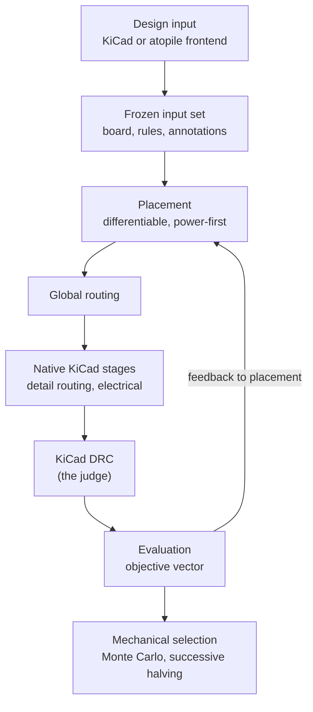

# Architecture

Status: **placeholder**. This page sketches the layout the migration is heading for; the full
architecture pages are written in PR7 once the engine has landed (see the
[migration plan](migration-plan.md), sections 1 and 6).

## Pipeline

The controller runs in a hermetic Python 3.11 environment (numpy, torch). Everything that touches
the board runs in **KiCad's own Python** as time-bounded worker processes that import only the
standard library and the KiCad-side part of the package. Candidate selection is mechanical: seeds
and branches are never picked by hand.

## Planned package layout

| Path                             | Contents                                                     |
| -------------------------------- | ------------------------------------------------------------ |
| `yapnr/core`                     | board graph, constraints, electrical contracts, fab profiles |
| `yapnr/place`                    | differentiable placement, legalization, power-first          |
| `yapnr/route`                    | global routing, detail routers (maze, keyhole, pairs)        |
| `yapnr/native`                   | KiCad-side native loop and electrical stages (stdlib only)   |
| `yapnr/kicad`                    | KiCad I/O, toolchain discovery, worker staging and entries   |
| `yapnr/{shove,hier,mc,feedback}` | shove, hierarchy, Monte Carlo/halving, routing feedback      |
| `yapnr/runtime`                  | telemetry, runtime controls, process timeouts                |
| `yapnr/frontends`                | design-input plugins: KiCad-native and atopile               |
| `yapnr/project`                  | manifest and store: inputs, engine snapshots, runs, bundles  |
| `yapnr/viewer`                   | live viewer (served locally; agent features off by default)  |
| `native/search`                  | Rust search backend (heading-aware A\*)                      |
| `bazel/`                         | headless ruleset for downstream repositories (Splanc)        |

Today the package holds only `yapnr/__init__.py` and the command line (`yapnr/cli.py`).

## Test tiers

| Tier        | Location           | Interpreter                    | Bazel tags            |
| ----------- | ------------------ | ------------------------------ | --------------------- |
| unit        | `tests/unit`       | hermetic 3.11 (`@yapnr_pypi`)  | none, or `slow`       |
| kicad       | `tests/kicad`      | KiCad's Python and `kicad-cli` | `kicad`               |
| regression  | `tests/regression` | both                           | `kicad`, `slow`       |
| e2e viewer  | `tests/e2e`        | hermetic plus a browser        | `manual`              |
| repo checks | `tests/unit/repo`  | hermetic                       | `external` (uncached) |

`bazel test //...` runs the unit tier and the repo checks; the KiCad lane (`--config=kicad`)
arrives in PR6a. Every `test_*.py` under `tests/` must be wired to a Bazel target; the
`yapnr_py_tests()` macro (`tools/bazel/py_tests.bzl`) does that from a glob, and
`//tests/unit/repo:test_wiring` fails on stragglers. Until PR3 moves it, the imported engine keeps
its Splanc layout under `hardware/`: its own Bazel targets run in `bazel test //...`, and the wiring
check does not cover it yet ([decisions](decisions.md)).
