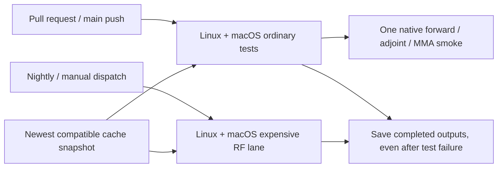

# CI lanes and Bazel caches

Ordinary Linux and macOS CI retain inexpensive RF unit coverage and one native inverse-design
smoke. Solver sweeps, gradient checks, multi-iteration optimizations and coupon fitting run in
`RF nightly`, at 03:17 UTC daily on `ubuntu-24.04-arm` and `macos-latest`, or through **Run workflow**.
Scheduled runs use `main`; manual dispatch can select a branch. This workflow does not trigger
on pull requests or pushes. Both matrix jobs report failures independently.



## Running the lanes

```sh
bazel test //... --config=ci
bazel test //tests/unit/rf/... //tests/unit/rf_coupons/... //tests/e2e/rf/... --config=ci --config=rf-nightly
```

On a shared workstation, use `nice -n 10` and `--config=lowmem` as described in
[DEVELOPERS.md](../DEVELOPERS.md#bazel). Default and quick configurations exclude `rf-nightly`;
`--config=all` includes it, while Bazel's existing `manual` gate still applies. Explicit manual
labels remain runnable. Native requirements, CPU reservations, sharding and per-test timeouts
are preserved. No solver or production behavior changes.

The ordinary `test_inverse_smoke` makes a real native forward/adjoint evaluation and an accepted
MMA update on the tiny two-port problem. It asserts finite results, a changed design and exact
repeatability across two fresh calibrations. Missing native code fails the Bazel target.
Longer convergence, resume, export, gradient and multi-backend checks remain in nightly coverage.

## Complete inventory of affected packages

The source of truth is `tools/bazel/rf_lanes.bzl`. Each new globbed RF test must be classified;
each CI test job also compares Bazel's expanded rules with this inventory, including manual
variants. A missing target, an unclassified addition or an incorrect gate fails that check.
Cheap RF order-0 and Palace unit packages outside this inventory retain their existing selection.

### `//tests/unit/rf`

| Lane     | Targets                                                                                                                                                                                                                                                                                                                                                                                     |
| -------- | ------------------------------------------------------------------------------------------------------------------------------------------------------------------------------------------------------------------------------------------------------------------------------------------------------------------------------------------------------------------------------------------- |
| ordinary | `test_adjoint_sources`, `test_animate`, `test_cpml`, `test_edges`, `test_export`, `test_farfield`, `test_filters`, `test_inverse_smoke`, `test_lengthscale`, `test_lumped_ports`, `test_material_grid`, `test_mesh`, `test_mma`, `test_multistart`, `test_pattern_spec`, `test_repair`, `test_seeds`, `test_sheet`, `test_spec`, `test_stability`, `test_torch_convention`, `test_validate` |
| nightly  | `test_adjoint_gradients`, `test_backends`, `test_balance`, `test_board`, `test_dtft`, `test_microstrip`, `test_modal_ports`, `test_modes`, `test_native_identity`, `test_native_kernel`, `test_pattern_gradients`, `test_pipeline_gradient`, `test_pipeline_gradient_options`, `test_ports`, `test_power_balance`, `test_tiny_design`, `test_tiny_design_options`                           |
| manual   | `test_adjoint_gradients_numpy`, `test_microstrip_slow`, `test_pattern_gradients_numpy`, `test_pipeline_gradient_numpy`, `test_pipeline_gradient_options_numpy`                                                                                                                                                                                                                              |
| kicad    | `test_kicad_cli`                                                                                                                                                                                                                                                                                                                                                                            |

### `//tests/unit/rf_coupons`

| Lane     | Targets                                                                                           |
| -------- | ------------------------------------------------------------------------------------------------- |
| ordinary | `test_calibrate`, `test_catalog`, `test_equivalent`, `test_launch`, `test_models`, `test_session` |
| nightly  | `test_cli`, `test_fit`, `test_order0`                                                             |
| manual   | `test_xsec`                                                                                       |
| kicad    | `test_kicad`                                                                                      |

### `//tests/e2e/rf`

| Lane    | Targets                                                                                   |
| ------- | ----------------------------------------------------------------------------------------- |
| nightly | `test_antenna_smoke`, `test_diplexer_smoke`, `test_divider_smoke`, `test_wilkinson_smoke` |
| manual  | `test_antenna`, `test_diplexer`, `test_divider`, `test_filterbank3`, `test_wilkinson`     |

The five full RF e2e cases, four NumPy gradient references, double-resolution microstrip and
coupon cross-section test were already manual; they stay explicitly manual because they need
larger budgets or additional tooling. KiCad tests keep their dedicated gate. Nothing is removed.

## Evidence and limits

The observed pre-split macOS run at commit `84b459979fbf6d7804f5db03b1aedd34b4e6743a`
reported 44m17s in its ordinary Test step, versus 8m48s on Linux. Mac executed 291 tests and
reused two cached test results; Linux executed six and reused 287. Several RF targets reported
one to three minutes; coupon `test_fit` reported 340.9s and coupon `test_order0` 176.0s.
These are individual durations from a shared CI run, not additive wall-time savings or a
controlled benchmark. Fresh hosted runs must establish the new lane's runtime and cache hits.

The old macOS fallback cache came from September 30. Compiler/image drift was not established:
the old producer and observed consumer reported the same hosted image version and Bazel 7.7.1.
Source, BUILD and dependency changes can legitimately invalidate actions. Cache restoration
also does not eliminate Bazel analysis or runfiles reconstruction.

## Cache lifecycle and trust

The ordinary test jobs and RF lane use explicit `actions/cache/restore@v6` and
`actions/cache/save@v6` composite actions. Download caches keep a stable key; a missing exact
key is saved after a completed test invocation, including a failure. Download restore also
accepts the previous per-platform namespace. Build snapshots include
OS, architecture, hosted image version, compiler/SDK fingerprint and hashes of Bazel/configuration/lock
inputs. Each save adds the run ID and attempt, avoiding an immutable key freezing the first
snapshot. Restore selects the newest matching compatibility prefix. Bazel still checks each
action digest; no full output base, sandbox or runfiles tree is cached. Hosted image updates
start a new build-cache partition while keeping repository downloads reusable.

A completed failed test still fails its job. Only cache uploads tolerate upload errors, and
cancelled jobs or tests that never started do not save. Bazel's default `--cache_test_results=auto`
reruns failed tests. No timeout is raised and no test uses `continue-on-error`.

Fork pull requests restore only. Same-repository pull requests may save under GitHub's isolated
PR merge-ref scope; trusted `main` push, scheduled and manual runs populate caches available to
future PRs. No `pull_request_target`, credentials or wider permissions are introduced. Unique
build snapshots use normal GitHub cache retention/eviction; concurrent producers may save
partial snapshots, and no cache hit or runtime improvement is guaranteed.

See [GitHub cache scope](https://docs.github.com/en/actions/reference/workflows-and-actions/dependency-caching)
and [Bazel test cache behavior](https://bazel.build/versions/7.7.0/docs/user-manual#cache-test-results).
