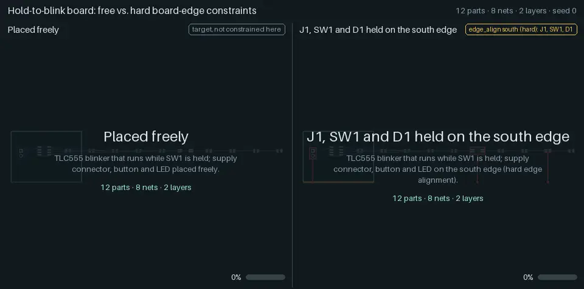
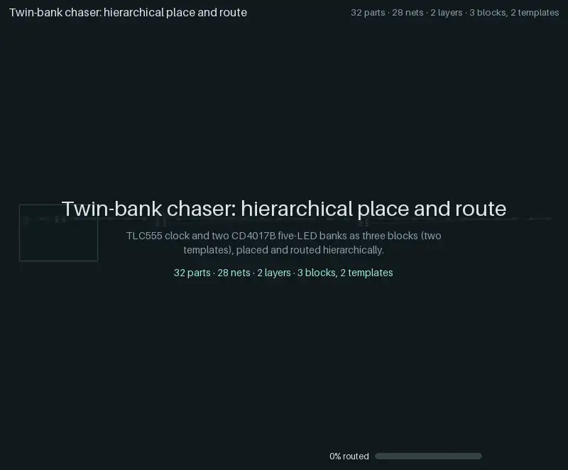

# Constraints and hierarchy

Three showcases of how yapnr handles what a human would ask of a layout: a row of LEDs that
reads as a row, connectors and buttons on the board edge, and a board built from reusable
blocks. Each animation is recorded engine state, like the [regression ladder](regression-ladder.md)'s:
global placement snapshots, the legalizer's order, every net the router commits, the saved KiCad
boards and KiCad's verdict.

The showcase cases (`designs.showcases()` in
[`hardware/pnr/regression/designs.py`][designs]) run through the ladder's runner and its gate, but
they are not ladder cases: they sit outside the ladder's gate and its pull-request lane (the
nightly lane runs them for information). All five cases below come from one traced run: seed 0,
the initial placement pool (8 starts, 3 routed finalists), a placement snapshot every 5
iterations, the legacy fabrication profile, KiCad 10.0.6 on the development Mac (darwin-arm64).
Every case passes the gate: 100 % routed, no open connections and no findings in KiCad's DRC.

## Line groups

<p></p>

The five-stage chaser (`07-chaser-20`: a TLC555 clocking a CD4017B that drives five LEDs) twice,
on the same board, with the same seed and budgets. On the left the LEDs are free; on the right,
`line-chaser-20` holds D1 to D5 in one line group, the only difference:

```yaml
line_group:
  - name: chaser_leds
    members: [D1, D2, D3, D4, D5] # in order along the line
    pitch_mm: 3.0 # centre to centre
    rot: 90 # each LED's rotation in the line's frame
    reason: Chaser LEDs in one row, so the sequence reads as a line
```

A line group is a hard constraint. The placer sees it as one rigid part (a macro: the members'
courtyards and pads in the line's frame), so global placement moves and turns the whole line and
the legalizer places it in one step; afterwards the members are posed from the line's pose.

What to watch:

- **Global placement:** the dashed rectangle is the rigid line. It slides and turns as one body
  while the other parts spread around it; the placer's four-way rotation settles on one
  direction.
- **Legalization:** the line is placed in one step, not five (15 steps instead of 19).
- **The pool's shortlist:** the eight starts put the line in different places and directions
  (vertical in seven starts, horizontal in one, both ways round).
- **The caption strips:** HPWL (the half-perimeter wirelength of every net, from the frame's
  poses) and the "LED line error", the largest distance of D1 to D5 from their best-fit line. On
  the left the dashed path through D1 to D5 shows where the sequence goes; its error ends at
  6.85 mm. On the right it is 0.00 mm throughout.

| Case             | Parts | Routed | Opens | Findings | Vias | Copper (mm) | HPWL (mm) | Time (s) |
| ---------------- | ----: | :----: | ----: | -------: | ---: | ----------: | --------: | -------: |
| `07-chaser-20`   |    20 | 100 %  |     0 |        0 |   19 |      310.75 |       271 |    123.4 |
| `line-chaser-20` |    20 | 100 %  |     0 |        0 |   20 |      322.49 |       272 |    127.8 |

The line costs one via, 12 mm of copper and 1 mm of HPWL here. Caveats: a line turned by 180°
reverses the sequence on the board, which a human would accept either way, so the placer may
choose either direction (near the end of global placement its choice can flip between the two).
Only the LEDs are grouped; their resistors stay free (a rigid LED-and-resistor row is a follow-up).

## Board edges

<p></p>

A "hold to blink" board (a TLC555 astable that runs while pushbutton SW1 is held), twice. On the
right, `edge-io-12` holds the supply connector J1, the button SW1 and the LED D1 on the south
edge, each turned so that its long axis runs along the edge; the order along the edge is left to
the placer. On the left, `edge-io-12-free` drops those constraints. Nothing else is fixed.

```yaml
edge_align:
  J1: { edge: south, hard: true, tolerance_mm: 1.0 }
  SW1: { edge: south, hard: true, tolerance_mm: 1.0 }
  D1: { edge: south, hard: true, tolerance_mm: 1.0 }
orientation: # the facing is set by the orientation constraint
  J1: 90
  SW1: 0
  D1: 0
```

`edge_align` pulls a part towards its edge during global placement. With `hard: true` the
legalizer also keeps it within `tolerance_mm` of the edge, and the legality checks and feedback
moves respect it.

What to watch:

- **Tethers:** a line from each held part to the edge, red while it is farther than its
  tolerance, mint once it is within it. During global placement the pull is soft, so parts
  approach the edge; the legalizer's band then holds them there.
- **The order along the edge:** the caption strip reads it live ("south: D1 · J1 · SW1"). Within
  one start the parts slide along the edge past the others; across starts the order changes: the
  shortlist's tiles name each start's order, and the eight starts give four different orders.
- **The free board:** the dashed edge is the other board's target, drawn for reference; "on edge
  0 of 3" counts its parts within 1 mm of it.

| Case              | Parts | Routed | Opens | Findings | Vias | Copper (mm) | HPWL (mm) | Time (s) |
| ----------------- | ----: | :----: | ----: | -------: | ---: | ----------: | --------: | -------: |
| `edge-io-12-free` |    12 | 100 %  |     0 |        0 |    9 |      176.87 |       139 |     64.7 |
| `edge-io-12`      |    12 | 100 %  |     0 |        0 |    8 |      198.47 |       169 |     35.2 |

Holding the three parts on the edge costs 30 mm of HPWL and 22 mm of copper, and saves a via.

## Hierarchical place and route

<p></p>

`hier-twin-bank-32`: a TLC555 clock driving two identical CD4017B banks of five LEDs, 32 parts on
a 56 × 40 mm board. Each part carries an atopile-style address (`top.clock.u`,
`top.bank_a.r0`, ...), from which the engine derives three blocks and two templates: the two
banks share one template. Only VCC, GND and CLOCK cross block boundaries.

What to watch:

1. **Blocks.** Each template is placed and routed on its own board, in eight trials (two seeds on
   each of four outlines); the tiles replay each template's chosen trial side by side, at one
   scale. The bank template's trials follow with their rank (opens, port debt, area, vias,
   copper), and both banks reuse the chosen layout: one layout, two instances.
2. **Top level.** The blocks become rigid macros (their outline is dashed) and move onto the
   board; the top-level placer places them like parts, turning a whole block with its copper,
   and legalizes one macro per step.
3. **Knitting.** The block copper is kept as it is (drawn dimmed): the progress bar starts at the
   50 of 60 connections the blocks already make. The router adds the nets between blocks, the
   connector and the bulk capacitor (full colour). Four top-level seeds were knitted; their
   montage follows, then KiCad's writeback, planes, zone refill and verdict.

| Case                | Parts | Routed | Opens | Findings | Vias | Copper (mm) | HPWL (mm) | Time (s) |
| ------------------- | ----: | :----: | ----: | -------: | ---: | ----------: | --------: | -------: |
| `hier-twin-bank-32` |    32 | 100 %  |     0 |        0 |   38 |      598.02 |       437 |    179.2 |

## What is interpolated

Every frame is either recorded engine state or a labelled transition between two recorded
states:

- **Placement snapshots.** Positions between two recorded global placement snapshots are
  interpolated linearly, as in the ladder's animations.
- **Rigid bodies.** A line group or a block macro moves as one: its centre is interpolated
  linearly and its angle along the shorter arc between two snapshots, and its members are posed
  from that pose (never one by one, which would shrink a line mid-turn).
- **The lift ("Blocks become macros", 0.8 s).** The blocks move from their display layout to
  their first recorded macro poses; the connector and the bulk capacitor fly in from the unplaced
  row. The display layout before it (the blocks side by side, without the board) is a
  presentation, not a placement.
- **Comparisons.** The two halves are synchronized scene by scene; the shorter half holds its last
  frame of a scene until the other catches up.

Nothing else is invented: no easing of the engine's order, no reordering, no copper the engine
did not commit. The caption metrics (HPWL, LED line error, parts on their edge and their order)
are computed from the poses on screen.

## Regenerating

The showcase run needs what the ladder needs (a numerical Python, KiCad 10 with its Python module
and footprint library; see [Regression ladder](regression-ladder.md#regenerating)). The
hierarchical case takes about three minutes on the development Mac.

```sh
# 1. The showcase run (07-chaser-20 and the four showcase cases); the output must not exist.
"$NUMERIC_PYTHON" hardware/pnr/regression/run.py --repo . --out .yapnr/ladder/SHOWCASES \
  --seed 0 --trace --trace-placement-every 5 --initial-pool --initial-starts 8 \
  --initial-finalists 3 --timeout 1200 --showcases \
  --case 07-chaser-20 --case line-chaser-20 --case edge-io-12-free --case edge-io-12 \
  --case hier-twin-bank-32 \
  --python "$NUMERIC_PYTHON" --kicad-python "$PNR_KICAD_PYTHON" \
  --kicad-cli "$PNR_KICAD_CLI" --library "$PNR_KICAD_FOOTPRINTS"

# 2. Render the four files into docs/animations/ and their manifest and results entries.
bazel run //hardware/pnr:showcase_animations -- --render-only "$PWD/.yapnr/ladder/SHOWCASES"
```

One comparison of any two traced runs renders with
`bazel run //hardware/pnr:animate -- --compare LEFT RIGHT --out FILE.webp --labels A B` (a trace,
a case directory or `RUN_DIR:CASE` each); a hierarchical case directory renders like any other
case (`--pacing showcase` gives placement and routing more time). Budgets: 2.5 MB per WebP (the
hierarchical one 3.5 MB), 5 MB per GIF, 30 MB for `docs/animations/` in all
(`tests/unit/repo/test_animations.py`). The provenance of each file (the run's engine commit,
`sources_sha256`, trace and content hashes) is in the `showcases` entries of
<a href="animations/manifest.json"><code>animations/manifest.json</code></a>, and the cases'
results in the `showcases` array of
<a href="animations/ladder-results.json"><code>animations/ladder-results.json</code></a>. The
design is [Design: line groups, board edges and hierarchical PnR, animated][design].

[designs]: https://github.com/Studio-Fug/yapnr/blob/main/hardware/pnr/regression/designs.py
[design]: design/constraint-and-hier-animations.md
