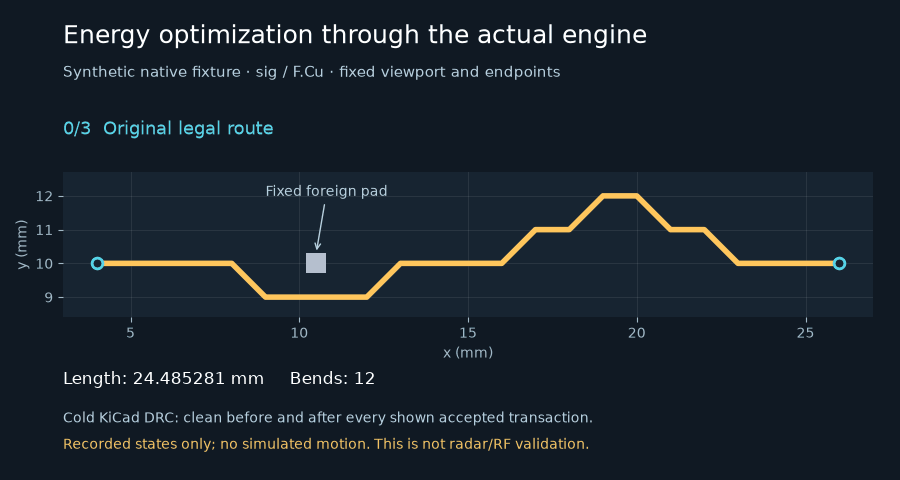

# Opt-in energy-track integration

`PNR_GLOSS=1 PNR_GLOSS_ENERGY=1` enables the energy proposal generator inside the
existing native gloss pass. Both defaults remain off. `PNR_GLOSS_ENERGY` replaces
only the `gloss` pull-tight proposal step; normalize, dekink, corridor and the
outer loop's native gate retain their existing behavior.



The animation is a synthetic native fixture, not the radar board. It shows four
recorded states with no interpolated geometry: 24.485281 → 22.438324 mm and
12 → 2 bends across three accepted transactions. Every shown transaction passed
cold KiCad DRC, and the phase-end six-component objective stayed `[0,0,0,0,0,0]`.

## Engine path

- `pnr.gloss.Settings.energy` and `--energy` worker flag are default-off. An
  unset/false energy flag preserves the pre-feature settings digest exactly.
  The default path never imports Shapely or the new geometry modules.
- `pnr.energy_track.propose` adapts an already eligible native chain to
  `pnr.energy_track_geometry.Planner`. Native item-grid lookup, the optional
  local layer grid and exact native segment/contact predicates constrain the
  proposal. No candidate, net or branch is selected by hand.
- The search grows a corridor around the existing legal polyline, samples
  relevant clearance-offset contours, and finds an endpoint-to-endpoint span
  on a finite witness-progress roadmap. Reverse remaining-length costs guide
  incoming-edge-state energy search. It is not a literal Steiner solver or a
  guarantee of a global geometric optimum.
- Energy is length in mm plus 0.15 mm per bend by default. Curvature weight is
  explicit (default zero). Length, endpoints, width, layer, net, vias, native
  contact, clearance, turn, homotopy, guard and group-cap rules remain hard.
- The existing transactional controller applies proposals to disposable
  checkpoints, checks native geometry and facts, runs cold KiCad DRC, and then
  accepts, splits or rejects. Its phase-end bisection/rollback and native-loop
  outer gate are still required. Worker output remains provisional until the
  controller has completed the cold-DRC and electrical acceptance gates.
- Accepted moves invalidate quiet chains through a dynamic layer grid. Plane
  refill symmetric-difference boxes also invalidate affected chains. The
  energy gloss step re-inventories until no improvement or an existing
  transaction/time budget stops it. Global inventory serialization, board
  reconstruction and native validation remain global work; this is not an
  end-to-end sublinear-complexity claim.

## Exact eligibility and refusal boundaries

Ordinary native signal-chain eligibility is inherited from the glosser. Power,
paired and length-matched routes remain excluded. SI chains and group-owned
copper are additionally refused by the energy proposer, even if the older SI
option is enabled. Locked copper, vias, pads, footprints, group membership,
board outline and zone definitions cannot silently change.

An unlocked, ungrouped foreign plane is provisional only when its exact net
has an explicit IR contract. The candidate oracle excludes only the validated
zone IDs, not all copper on their net. An uncontracted or protected plane stays
an obstacle. Any spec that claims such a plane as a dependency is refused
before application (`energy:protected_or_uncontracted_plane`).

With energy enabled, joint refill occurs before native shape recheck. The full
post-refill oracle checks clearance again. Homotopy excludes only the validated
regenerated zones; fixed copper still cannot switch side. Protected zone fills
are included in the immutable checksum. Full configured IR reports, native
connectivity, pad entry, skew and reference facts accompany every checkpoint.

Local edits that do not change plane copper retain existing no-regression gate
semantics; unchanged unrelated pre-existing unknown pair or failed-rail facts
do not become a new claim of success. If any plane fill changes, stricter gates
apply:

- Every actually changed plane net needs measured, passing IR within its
  original budget. New opens, unknown values or missing contracts refuse it.
- Existing passing rails cannot become failing. Unrelated existing failed
  rails must remain exactly unchanged; they are never relabeled as passing.
- Pairs must be qualified, with finite measured skew before and after. Missing
  or null skew is a refusal, not zero skew.
- A board with declared RF/SI contracts or an RF macro requires external
  verification for a changed plane. This integration has no full-wave verifier
  callback, so such joint-refill edits are refused with
  `energy:rf_si_verification_required`. Existing reference-shape checks alone
  are not presented as RF certification.

The historical radar single-chain experiment remains useful geometric evidence
but is not production-promotable under these stricter missing-evidence gates.
There is no paired shove/serpentine proposal solver in this change.

## Dependencies and runtime ABI

Shapely 2.1.2 is pinned in Bazel/controller/runtime locks. The image's KiCad
workers use Python 3.12, while the controller uses 3.11. A separate, hash-locked
NumPy/Shapely set is installed under `/opt/energy-kicad`, never into system
Python. Only enabled workers add `PNR_ENERGY_SITE_PACKAGES` to their import
path, after checking its Python-version marker. Wrong ABI fails closed.

An existing headless KiCad environment may instead supply matching Shapely and
NumPy normally. Missing geometry dependencies produce an explicit
`energy_dependency_unavailable` inventory result and preserve the input;
they do not trigger a fallback that skips native/electrical gates.

## Reproduce and validate

Focused hermetic targets:

```sh
bazel test --config=lowmem \
  //hardware/pnr:energy_track_geometry_test \
  //hardware/pnr:energy_track_spatial_test \
  //hardware/pnr:energy_track_integration_test
```

With a supported headless KiCad Python/CLI configured, the native test also
covers actual accepted improvements, disabled no-op byte identity, and an
uncontracted-plane dependency refused before application:

```sh
bazel test --config=lowmem //hardware/pnr:energy_track_native_test
```

To regenerate the truthful animation from an actual saved clean fixture run:

```sh
python tools/animate_energy_track.py --run-dir ENERGY_RUN \
  --out docs/feature-animations/energy-track-native.gif
```

The renderer requires optional Matplotlib/Pillow and consumes only recorded
accepted transactions. It refuses a non-clean or phase-end-failed run. It uses
`gloss_fixture`'s known fixed foreign pad and labels the synthetic scope.
