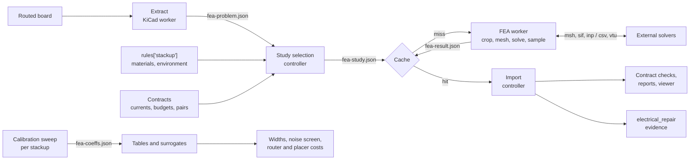

# Design: thermal and electromagnetic field solvers (FEA) in yapnr

Status: **proposal** for [issue #27](https://github.com/Studio-Fug/yapnr/issues/27). The tool
survey and a feasibility spike were done on 2026-09-30, followed by an adversarial review on
2026-10-01 that corrected several claims and added one sensitivity run (FR-4 in-plane conductivity,
§5.2); nothing is implemented yet. Section 10 lists the follow-up issues. Numbers marked "est." are
estimates, not measurements.

## 1. Goals

yapnr routes boards against electrical contracts, but every physical model behind those contracts
is a closed-form screen: IPC-2221 widths for current, a resistive screen for short necks, an
assumed current split for parallel branches and via arrays, closed-form mutual C and M for the
noise budget (#26), and closed-form line impedance for pairs and SI v1. This design adds field
solvers that back those screens with a round trip:

1. **Export** the routed copper (tracks, arcs, pads, vias, zone fills) with its identity (uuid,
   net, layer) and the dielectric stackup (thicknesses, εr, copper weights, thermal properties).
2. **Run** a simulation chosen per question, as a cached, time-bounded job.
3. **Import** the results as data keyed by copper item, and use them to drive validation (contract
   checks, reports, viewer overlays) and PnR (calibrated screening models and costs, repair
   evidence).

### 1.1 The four questions

| #   | Question                                                                                       | What it backs in yapnr                                                                     | Outputs                                                                                 |
| --- | ---------------------------------------------------------------------------------------------- | ------------------------------------------------------------------------------------------ | --------------------------------------------------------------------------------------- |
| 1   | DC current density, IR drop and Joule heating: temperature rise of tracks, necks, vias, planes | current contracts (`current_width`), `neck_budget`, via arrays, the current-sharing report | per item: current, J_max, power, ΔT mean and max; per net: R and drop; per via: current |
| 2   | Quasi-static RLC: mutual C and L between nets and to planes                                    | noise-budget screening model (#26), pair impedance rules, SI v1 segment values             | C and L per mm per layer relation; kC, kL; Z0, Zodd, Zeven, εeff; C/L of 3D windows     |
| 3   | Full-wave crosstalk, S-parameters and impedance of critical nets                               | SI v1 (replacing lumped segments), future fast interfaces                                  | Touchstone files; rational macromodels as SPICE subcircuits                             |
| 4   | Board-level thermal with component dissipation (optional)                                      | placement (spacing of heat sources), ΔT of copper next to hot parts                        | temperature map; ΔT per component and per copper item                                   |

Priority is the order of the table. The typical target board is 4-layer 1.6 mm FR-4 (JLCPCB
JLC04161H-7628: 35 µm outer, 15 µm inner copper), about 60×50 mm, a few hundred nets, switching
converters at 0.4–2 MHz with ns edges, USB 2.0 full speed, I2C, I2S and WS2812 data.

### 1.2 Requirements

- **Free and open source first.** Research codes are in scope if they have published validation and
  can be brought up to these requirements.
- **Licence boundary.** yapnr is AGPL-3.0-or-later. Code imported into a yapnr process must have an
  AGPL-compatible licence (permissive, LGPL, MPL-2.0, GPL-3.0, GPL-2.0-or-later, AGPL-3.0). Any OSI
  licence is fine for a solver run as a separate program (GPL-2.0-only included). See §3.2.
- **Platforms.** macOS arm64 for development; linux aarch64 and x86_64 in the Ubuntu 24.04 CI
  containers. Installs are per-user or per-image; nothing system-wide is needed on a developer Mac.
- **Budgets.** Solves run under `nice`, with at most 4 threads and a timeout per study (§7.7).
- **Reproducible.** Inputs are canonical and hashed, environments are locked, results are cached by
  content (§7.9, §7.10).
- **Qualified.** Every number states the model that produced it (`screening`, `fea-calibrated`,
  `fea-2.5d`, `fea-3d`) and its provenance. An FEA result never silently replaces a contract.
- **Validated.** Every model that feeds a decision has validation cases in CI against exact
  solutions, published formulas or a second code (§5, §7.11).

### 1.3 Non-goals

- EMC compliance (radiated emissions) prediction.
- Full-wave simulation of a whole board.
- Transient thermal (steady state first; transient only if pulsed loads need it).
- Replacing KiCad DRC, which stays the judge of geometry.
- A GUI. Results are files, reports and viewer overlays.

## 2. Summary

| Q   | Primary (runs in yapnr)                                                                   | Reference and cross-check                                                                                                 | Fallbacks                                                                                             | When it runs                                         |
| --- | ----------------------------------------------------------------------------------------- | ------------------------------------------------------------------------------------------------------------------------- | ----------------------------------------------------------------------------------------------------- | ---------------------------------------------------- |
| 1   | in-house **layered electro-thermal solver** (scikit-fem, scipy, pyamg)                    | **Elmer** StatCurrent + Heat in 3D, as an external program; Elmer WhitneyAV harmonic for the AC part of switched currents | FEniCSx (in-process 3D), GetDP; padne for the DC part                                                 | per-stackup calibration; stage boundaries; finalists |
| 2   | in-house **2D cross-section solver** (scikit-fem) producing per-stackup tables            | Elmer StatElec (2D and 3D windows); Elmer WhitneyAV harmonic and FastHenry2 for 3D L and R(f)                             | FasterCap (2D and 3D), Palace BoundaryMode (2D), femwell, TNT-MMTL; Palace electro- and magnetostatic | calibration per stackup; 3D windows nightly          |
| 3   | deferred: quasi-static RLGC tables cover the typical board (§6.3); then **Palace** driven | openEMS (FDTD); Elmer VectorHelmholtz (already built, ports)                                                              | OpenParEM3D (x86 only), EMerge                                                                        | manual, per coupon                                   |
| 4   | the layered solver with component heat sources                                            | Elmer Heat with component blocks                                                                                          | none                                                                                                  | per placement finalist                               |

What the spike showed (§5):

- The export works without kicad-cli's 3D exports: pcbnew polygons keep uuid, net and layer, and
  one conformal layered mesh (an in-plane triangulation extruded slab by slab) feeds both the
  in-house solver and Elmer.
- **Q1:** the in-house layered solver and Elmer 3D agree within 1.2 % on ΔT, and both are within
  0.6 % of exact solutions. This is solver verification on a shared mesh and problem definition,
  not validation of the board model. IPC-2221, today's current screen, reads 1.9–3.6 times the FEA
  ΔT when inner planes are present. Without planes the ratio depends on material data: 0.48–1.14
  with isotropic FR-4 (k = 0.3 W/mK), but 1.1–1.9 on the three cases re-run with an in-plane
  conductivity of 0.8 W/mK. So IPC-2221 is not a consistent screen, but the spike does not show
  that it is unconservative. The FEA supports the short-neck contract: a 0.5 mm long neck raises
  the peak ΔT by 1.5–4.6 K, where IPC-2221 applied to the neck width predicts 124 K.
- **Q1:** the absolute ΔT on boards without planes depends on two poorly known inputs. h = 5–20
  W/m²K moves it by −22 % to +28 %. FR-4 in-plane conductivity of 0.8 instead of 0.3 W/mK lowers it
  by about 40 %. With planes the two effects are −12 % to +21 % and −5 %.
- **Q2:** the 2D solver matches Hammerstad–Jensen within 0.11 % and Kirschning–Jansen within that
  formula's own accuracy. The Johnson–Graham rule under-estimates inductive coupling kL by 7–10 %,
  and same-layer capacitive coupling kC is 1.6–3 times smaller than kL.
- **Runtime** on an Apple-silicon Mac, single-threaded solves: 2D cases 0.4–2.3 s, layered Q1
  coupons 11–36 s, Elmer 3D windows 8–185 s. These were single-trace coupons. Real nets, the
  whole-board solve and the sub-second repair solve are not measured (§7.7).
- **Not yet covered by the design or the spike, found in review:** where the per-pad load currents
  and return paths come from (§7.3), the AC part of switched currents, which splits between
  parallel paths by inductance rather than resistance (§6.1), and FR-4 anisotropy and solder mask,
  which the spike left out but which change headline numbers (§5.2, §6.2).

## 3. Tool survey

### 3.1 Method and limits

Desk survey of primary sources (project repositories, manuals, release notes, package indexes,
papers with validation), plus the local `kicad-cli` 10.0.6. Versions are those current on
2026-09-30. The web-search quota ran out partway through, so later facts come from fetching
project pages directly, and coverage of academic papers on PCB heating codes is incomplete
(open question 7, §12). Ranks weigh fit to the questions, validation, licence and packaging.
The review on 2026-10-01 re-checked licences against the projects' licence files, versions
against GitHub releases, and wheel and package availability against the PyPI, conda-forge and
Ubuntu 24.04 indexes. It corrected the entries for Elmer's licence, openEMS's version, pyamg's
wheels and Elmer's CI platforms, and it added Elmer's electromagnetic modules, Palace's 2D mode
solver, FasterCap 2D, FreeFEM and FEMM.

### 3.2 Licence boundary

| Integration                                       | Allowed licences                                                      | Examples                                                              |
| ------------------------------------------------- | --------------------------------------------------------------------- | --------------------------------------------------------------------- |
| imported by yapnr code (controller or FEA worker) | AGPL-compatible: permissive, LGPL, MPL-2.0, GPL-3.0, GPL-2.0-or-later | scikit-fem, scipy, pyamg, shapely, meshio, gmsh, scikit-rf            |
| external program (subprocess, files in and out)   | any OSI licence                                                       | Elmer (GPL-2.0-or-later), openEMS (GPL-3.0), Palace (Apache-2.0)      |
| code copied in (seeding the in-house solvers)     | AGPL-compatible, with attribution in `THIRD_PARTY.md`                 | padne (GPL-3.0-or-later), Ki-PIDA (AGPL-3.0), KiCad_Thermal_Sim (MIT) |
| shipped as a binary in a published image          | any OSI licence, plus the source obligations of the GPL               | Elmer and gmsh in `yapnr-fea` with a `-src` companion (§7.11)         |

Excluded: Kratos (its core licence is BSD with the advertising clause) for in-process use;
anything GPL-2.0-only in-process; FEMM (Aladdin Free Public License, which is not OSI-approved,
and Windows-only) everywhere. Copying "-only" code (GPL-3.0-only, AGPL-3.0-only) into yapnr is
allowed, but those files then cannot follow yapnr's "or later" grant. Record the exact SPDX
identifier per copied file.

### 3.3 Thermal and DC current (Q1, Q4), ranked

| #   | Tool (version)                | Method and physics                                                                                                                                                                | Licence, use                                                       | Validation evidence                                                                                                                                              | Platforms (mac arm64 / lin arm64 / lin x64)                                                             | Verdict                                                                               |
| --- | ----------------------------- | --------------------------------------------------------------------------------------------------------------------------------------------------------------------------------- | ------------------------------------------------------------------ | ---------------------------------------------------------------------------------------------------------------------------------------------------------------- | ------------------------------------------------------------------------------------------------------- | ------------------------------------------------------------------------------------- |
| 1   | in-house layered solver       | 2.5D sheet conduction per layer; layered 3D heat through the stack; ρ(T); convection                                                                                              | AGPL, in-process (FEA worker)                                      | ours: spike vs exact solutions, IPC-2152 and Elmer (§5.2)                                                                                                        | pure Python on scipy, scikit-fem, pyamg: all three                                                      | **primary for Q1 and Q4**                                                             |
| 2   | Elmer FEM 26.2.1              | 3D FEM: StatCurrent with Joule heating, Heat, ρ(T); resistance and capacitance matrices; also MagnetoDynamics (WhitneyAV, harmonic, with circuits) and VectorHelmholtz with ports | GPL-2.0-or-later (ElmerSolver library LGPL-2.1-or-later), external | 30 years of use; about 970 regression test cases (838/840 non-slow pass in our build); upstream CI builds on macos-14 (arm64), ubuntu-24.04 and ubuntu-24.04-arm | source build (done in the spike) / source build (upstream CI) / source build (upstream CI)              | **reference for Q1, Q2**                                                              |
| 3   | padne 0.3                     | 2.5D FEM Laplace on KiCad copper with vias, DC only; schematic directives for sources, current loads, resistors and regulators                                                    | GPL-3.0-or-later, can be combined                                  | NLnet-funded; CI tests against exact sheet and annulus solutions; about 40 KiCad fixture boards (vias, via-in-pad, castellations, floating copper)               | all-in-one linux-x64 binary (bundles KiCad); pipx or source build (CGAL, boost, KiCad Python) elsewhere | cross-check for Q1 DC; its load-directive model and fixtures are worth reusing (§7.3) |
| 4   | scikit-fem 12                 | FEM library: any weak form, P1/P2, 2D/3D                                                                                                                                          | BSD-3, in-process                                                  | examples checked against exact solutions (incl. Joule heating of a wire)                                                                                         | pure Python: all three                                                                                  | **the in-house solvers' FEM core**                                                    |
| 5   | FEniCSx (DOLFINx 0.11)        | FEM framework, PETSc solvers                                                                                                                                                      | LGPL-3.0, in-process                                               | verified by manufactured solutions                                                                                                                               | conda-forge on all three (heavy PETSc/MPI stack)                                                        | fallback if in-process 3D is needed                                                   |
| 6   | NGSolve 6.2.2607              | FEM framework; OCC kernel reads STEP                                                                                                                                              | LGPL-2.1, in-process                                               | mature                                                                                                                                                           | PyPI / none (no aarch64 wheel, not on conda-forge) / PyPI                                               | not chosen: no linux aarch64 build                                                    |
| 7   | KiCad_Thermal_Sim             | 2D finite volume per layer with vertical coupling; Joule; transient                                                                                                               | MIT, can vendor                                                    | tests, no validation                                                                                                                                             | pure Python                                                                                             | code to mine                                                                          |
| 8   | GetDP 3.5 + Gmsh              | FEM with user-written formulations                                                                                                                                                | GPL-2.0-or-later, external                                         | mature (ONELAB model library)                                                                                                                                    | binary / Ubuntu `getdp` 3.2 / binary                                                                    | fallback reference                                                                    |
| 9   | Ki-PIDA                       | 2.5D resistor grid for IR drop with ρ(T)                                                                                                                                          | AGPL-3.0                                                           | alpha, no validation; GUI plugin                                                                                                                                 | KiCad plugin                                                                                            | ideas only                                                                            |
| 10  | SfePy 2026.3                  | FEM; thermo-electric example                                                                                                                                                      | BSD-3                                                              | mature                                                                                                                                                           | conda-forge osx-arm64 and linux-64, no linux-aarch64; PyPI source only                                  | not chosen                                                                            |
| 11  | MFEM 4.8 / PyMFEM 4.10        | FEM library; `joule` miniapp                                                                                                                                                      | BSD-3                                                              | mature                                                                                                                                                           | MFEM on conda-forge on all three; PyMFEM wheels for macOS arm64 and linux x86_64 only                   | not chosen (C++ effort)                                                               |
| 12  | Sparselizard                  | nonlinear electro-thermal hp-FEM                                                                                                                                                  | GPL-2.0-or-later                                                   | one maintainer; last release 2022 (repository still active)                                                                                                      | source build                                                                                            | not chosen                                                                            |
| 12b | FreeFEM 4.13                  | FEM language; any weak form, 2D and 3D                                                                                                                                            | LGPL-3.0, external                                                 | mature, widely used                                                                                                                                              | conda-forge linux-64 and osx-64 only; upstream installers for x86_64                                    | not chosen: no arm64 packages                                                         |
| 13  | CalculiX                      | structural and thermal FEM; Joule only through induction                                                                                                                          | GPL-2.0-or-later, external                                         | mature                                                                                                                                                           | conda-forge on all three                                                                                | Q4 only, not needed                                                                   |
| 14  | MOOSE                         | multiphysics; `JouleHeatingSource`                                                                                                                                                | LGPL-2.1                                                           | formal QA                                                                                                                                                        | INL conda osx-arm64 and linux-64 only; multi-GB                                                         | too heavy                                                                             |
| 15  | SPIKE 0.3.1                   | PEEC DC, plate thermal, openEMS hooks                                                                                                                                             | Apache-2.0                                                         | preview; Windows-first                                                                                                                                           | experimental                                                                                            | watch (not re-verified in review)                                                     |
| 16  | OpenFOAM `chtMultiRegionFoam` | CFD conjugate heat transfer, no electrics                                                                                                                                         | GPL-3.0, external                                                  | mature                                                                                                                                                           | source / source / conda-forge linux-64                                                                  | only if forced airflow ever matters (Q4)                                              |

Research codes worth mining for formulations, not for direct use: **3D-ICE** (EPFL, GPL-3.0; a
validated compact finite-volume model of layered stacks), **HotSpot 7** (UVA, permissive; a
validated grid thermal model) and **OpenROAD PDNSim** (BSD-3; resistor-network IR drop). All three
are chip-scale but layered in the same way as a PCB.

No free PCB-specific heating code with published validation against IPC-2152 or measurements was
found. The general solvers are verified as solvers; validating the PCB model (geometry, materials,
boundary conditions) is ours to do (§5, §7.11). The cheapest validation backed by measurement is to
model the IPC-2152 test-board configuration (board size, thickness, plane presence and mounting as
described in IPC-2152 and by Brooks and Adam) and compare with the charts. That tests the
environment and material model as well as the solver. The spike's comparison of a 60×50 mm board
with the charts does not.

Component heat sources (Q4) should use the JEDEC compact-model conventions (JESD51 θJA/θJB/ΨJT
data, or the JESD15-3 two-resistor model when θJC and θJB are both known) rather than an ad-hoc
junction-to-board resistance.

### 3.4 Electromagnetic (Q2, Q3), ranked

| #     | Tool (version)                                                 | Method                                                                                                                                | Answers                                                                                                                   | Licence, use                                     | Validation evidence                                                                                                                                                                       | Platforms                                                                                       | Scale                                                                                                                                                              |
| ----- | -------------------------------------------------------------- | ------------------------------------------------------------------------------------------------------------------------------------- | ------------------------------------------------------------------------------------------------------------------------- | ------------------------------------------------ | ----------------------------------------------------------------------------------------------------------------------------------------------------------------------------------------- | ----------------------------------------------------------------------------------------------- | ------------------------------------------------------------------------------------------------------------------------------------------------------------------ |
| 1     | Elmer FEM 26.2.1                                               | FEM: StatElec, StatCurrent, MagnetoDynamics (WhitneyAV harmonic, circuit coupling), VectorHelmholtz                                   | Q2: Maxwell C matrix; L and R(f) with finite σ through A-V; Q1; Q3 with port boundaries (impedance-matrix tests upstream) | GPL-2.0-or-later, external                       | as above; our 2D results match scikit-fem within 1e-9 (P2) (§5.3); EM port and waveguide regression tests upstream                                                                        | source build on all three (upstream CI covers all three)                                        | 3D window: seconds to minutes                                                                                                                                      |
| 2     | AWS Palace 0.18.1                                              | high-order FEM (MFEM), adaptive refinement; problem types Driven, Transient, Eigenmode, Electrostatic, Magnetostatic, 2D BoundaryMode | Q2: terminal C and M matrices, 2D Z0/γ with losses; Q3: S-parameters with adaptive sweep, circuit synthesis               | Apache-2.0, external                             | C and eigenmodes agree with COMSOL/Ansys, and resonators within 0.3 % of measurement, both for **superconducting qubit chips** (arXiv 2511.01220, 2511.09041), not lossy PCB interconnect | no binaries, no conda-forge package; Spack, `spack containerize` or CMake superbuild; needs MPI | window: minutes to hours (est.); driven needs f > 0; the `Conductivity` boundary assumes thickness ≫ skin depth (not true for 15–35 µm copper below about 100 MHz) |
| 3     | openEMS v0.0.36 (2023; v0.37.0 at rc3 in 2026-09) + gerber2ems | EC-FDTD                                                                                                                               | Q3: S-parameters, Z(f), fields                                                                                            | GPL-3.0 (CSXCAD LGPL-3.0; gerber2ems Apache-2.0) | community use; gerber2ems ships a PCB example with VNA data (`stub_short`); no PCB benchmark suite                                                                                        | Windows binaries only; not in Ubuntu 24.04 or conda-forge; source builds elsewhere              | coupons; MHz content needs long runs                                                                                                                               |
| 4     | TNT-MMTL                                                       | 2D BEM                                                                                                                                | Q2: RLGC matrices for N conductors with planes; Z0, Zodd, Zeven                                                           | GPL-2.0 (or-later grant not verified), external  | decades of use; last SourceForge update 2013; no recent public benchmark                                                                                                                  | C++/Fortran with a Tcl/Tk front end; arm64 builds unverified                                    | ms to s per cross-section                                                                                                                                          |
| 5     | FastHenry2 / FasterCap                                         | multipole-accelerated PEEC / BEM (FasterCap: 2D and 3D)                                                                               | Q2: R + jωL matrix with planes and skin effect; C matrix                                                                  | MIT-style / LGPL-2.1, external                   | reference results in Kamon 1994 and Nabors 1991                                                                                                                                           | plain C/C++ builds; last code changes 2015 (FastHenry2) and 2018 (FasterCap)                    | seconds to minutes per window; FastHenry ground planes are rectangular meshes with point, rectangle or circle holes, so pours need conversion                      |
| 6     | scikit-fem / NGSolve / DOLFINx                                 | FEM frameworks                                                                                                                        | Q1, Q2 (we write the forms)                                                                                               | BSD-3 / LGPL-2.1 / LGPL-3.0, in-process          | ours to validate                                                                                                                                                                          | see §3.3                                                                                        | 2D: seconds                                                                                                                                                        |
| 7     | femwell 0.1.12                                                 | 2D FEM mode solver on scikit-fem                                                                                                      | Q2: Z0, εeff, C and L of coupled lines                                                                                    | GPL-3.0                                          | CPW tutorial checked against published data; last release 2025-01                                                                                                                         | pure Python                                                                                     | seconds                                                                                                                                                            |
| 8     | PyPEEC 5.8                                                     | FFT-accelerated voxel PEEC                                                                                                            | Q1: DC/AC J and R; Q2: L, no C                                                                                            | MPL-2.0                                          | JOSS-reviewed; few PCB benchmarks                                                                                                                                                         | PyPI and conda-forge                                                                            | net windows (uniform voxels)                                                                                                                                       |
| 9     | GetDP 3.5 + Gmsh                                               | FEM with user formulations                                                                                                            | Q1–Q4                                                                                                                     | GPL-2.0-or-later, external                       | ONELAB model library                                                                                                                                                                      | see §3.3                                                                                        | like Elmer                                                                                                                                                         |
| 10    | EMerge 2.8.9                                                   | Python time-harmonic FEM                                                                                                              | Q3: Touchstone; PCB layouter                                                                                              | GPL-2.0-or-later                                 | none published; one maintainer                                                                                                                                                            | pure-Python wheel, but needs gmsh (no PyPI linux aarch64 wheel)                                 | coupons                                                                                                                                                            |
| 11    | OpenParEM2D/3D 2.1                                             | high-order full-wave FEM                                                                                                              | Q3: S-parameters; 2D γ and Z0                                                                                             | GPL-3.0-or-later, external                       | accuracy manual: ~1e-9 against analytic waveguides; coupled microstrip matches literature; > 1 % error near 1 MHz                                                                         | x86 Linux binaries only                                                                         | coupons                                                                                                                                                            |
| 12–14 | atlc; Sparselizard; MEEP 1.34                                  | 2D finite differences; hp-FEM; photonic FDTD                                                                                          | atlc: Q2 for ≤ 2 conductors; MEEP: Q3 but a poor fit                                                                      | GPL-2.0 / GPL-2.0-or-later                       | little PCB evidence                                                                                                                                                                       | atlc dormant but packaged in Ubuntu 24.04 (amd64, arm64); MEEP on conda-forge                   | MEEP: uniform grid, infeasible at 15 µm over 60 mm                                                                                                                 |
| —     | FEMM 4.2                                                       | 2D FEM: magnetics, electrostatics, heat, current flow                                                                                 | 2D Q1/Q2 hand checks                                                                                                      | Aladdin Free Public License (not OSI)            | widely used in industry and teaching                                                                                                                                                      | Windows only                                                                                    | excluded (licence, platform)                                                                                                                                       |

### 3.5 Glue

| Tool           | Role                                                                 | Licence          | Packaging notes                                                                                                                                       |
| -------------- | -------------------------------------------------------------------- | ---------------- | ----------------------------------------------------------------------------------------------------------------------------------------------------- |
| gmsh 4.15      | meshing; physical groups; msh 2.2 and 4.1 output                     | GPL-2.0-or-later | PyPI wheels for macOS arm64 and linux x86_64, **none for linux aarch64**: use conda-forge there (Ubuntu 24.04 ships 4.12.1, too old to match the pin) |
| meshio         | reading and writing msh, VTU, XDMF                                   | MIT              | pure Python                                                                                                                                           |
| pyamg 5.3      | algebraic multigrid for the in-house solvers                         | MIT              | PyPI wheels for macOS arm64 and linux x86_64, **none for linux aarch64** (source only); conda-forge on all three                                      |
| scipy, shapely | sparse algebra; polygon operations                                   | BSD-3            | wheels or conda-forge on all three                                                                                                                    |
| scikit-rf 2.1  | Touchstone I/O, mixed-mode, TDR, vector fitting to SPICE subcircuits | BSD-3            | pip and conda-forge                                                                                                                                   |
| micromamba     | user-space conda-forge environments                                  | BSD-3            | single static binary                                                                                                                                  |

### 3.6 Front ends looked at

- **kicad-cli 10.0.6 `pcb export step|brep|xao`** with `--include-tracks`, `--include-pads`,
  `--include-zones`, `--include-inner-copper`, `--net-filter` and `--fuse-shapes`: produces 3D
  copper, but without identity (§4). Useful for visual checks and for component bodies in Q4.
- **gerber2ems** (Antmicro, Apache-2.0) and **kicad-si-simulation-wrapper** (Apache-2.0): Gerbers
  rasterised through gerbv, then an openEMS model. Net identity and resolution are lost; their
  openEMS grid and port rules are worth reusing for Q3, and gerber2ems's `stub_short` example
  with its VNA measurement is a ready Q3 validation case.
- **pcbmodelgen** (GPL-3.0; KiCad board to openEMS model; last release 2017) is an older
  KiCad-native route to openEMS. Its mesh-line rules are worth a look; the code is not.
- **padne** reads KiCad projects directly, with nets, vias and schematic load directives
  (§3.3). It is the closest existing front end to the Q1 round trip.
- **IPC-2581** export is the hand-off for cross-checks in commercial tools, outside CI.

## 4. Export probes

Run with KiCad 10.0.6 on a 4-layer board of the typical size (about 4,000 tracks, 300 vias and 30
zones):

1. **pcbnew polygons are fast and keep identity.** `TransformShapeToPolygon` with `ERROR_INSIDE`
   at 1 µm arc error converted every track, arc, via layer, pad layer and zone fill (about 5,800
   items, 188k vertices) in 0.27 s, each with uuid, net and layer. Merged copper per layer took
   14 ms.
2. **kicad-cli 3D exports have no identity.** A full-board `pcb export xao` took 2.1 s and wrote
   12.8 MB with 1,944 solids. Only pad faces are named (`Pad_F_<ref>_<pad>_<net>`); track and zone
   solids carry no net, layer or uuid. Tagging by net would need one export per net.
3. **The KiCad stackup can be stale.** Boards can keep KiCad's default 2-layer stackup while four
   copper layers are enabled; the XAO export then had no copper between z = 0 and 1.51 mm. The
   `BOARD_STACKUP` object is also not exposed to KiCad's Python. The stackup therefore comes from
   yapnr's own `rules['stackup']` (the #26 fab JSON, read through `pnr.si.physics.stackup()`), and
   the KiCad stackup is only a cross-check.
4. **Rasterised Gerbers lose nets** (gerber2ems), so they are not a primary path.

Conclusion: the exporter is a KiCad-side worker that dumps pcbnew polygons, and yapnr builds the
3D model itself from those polygons and its own stackup.

## 5. Feasibility spike

### 5.1 Setup

- **Tools:** Elmer FEM 26.2.1 (external), scikit-fem 12.0.2 (in-process), gmsh 4.15.2, with pyamg
  5.3, scipy, shapely and meshio on Python 3.12. Not tried: Palace, TNT-MMTL, FastHenry2, openEMS
  (the spike was limited to three tools).
- **Install:** user space only. micromamba and a conda-forge environment (20 s), then pip for gmsh
  and pyamg; Elmer built from the release tarball with conda-forge compilers and OpenBLAS (155 s at
  4 jobs, serial build without MPI or GUI). About 460 MB downloaded; 1.6 GB environment including
  compilers. Elmer's own suite: 838 of 840 non-slow tests pass (the two failures are radiation
  view-factor tests, not used here).
- **Export path:** coupon generators write the same neutral `fea-problem` JSON that a board export
  would (copper polygons per layer with net and id, ports, outline, stackup in the
  `pnr.si.physics` form). A layered mesher overlays all layers into one triangulation that follows
  every copper edge, extrudes it slab by slab into prisms, and names every body and boundary (net,
  layer, port, convection face). The mesh is conformal; no 3D boolean operations on 15–35 µm copper
  are needed. 0.3–2 M prisms take 1–8 s; Elmer's mesh conversion (ElmerGrid) 0.4–2.5 s.
- **In-house solvers:** (a) a layered electro-thermal solver: sheet conduction
  `div((t/ρ(T)) grad V) = 0` on each layer's copper (P2 triangles), heat on the same triangulation
  times a few linear elements per slab, convection on the top and bottom faces only (board edges
  adiabatic), Joule power from the sheet solve, Picard iteration on ρ(T). Ports in the spike are
  fixed potentials on the trace-end edges, with the total current set by scaling; the floating
  equipotential ports of §7.3 are not yet implemented. (b) A 2D cross-section solver: Maxwell C by
  the energy method
  (P2), L from the capacitance with all εr = 1 (exact for quasi-TEM lines with ideal conductors).

### 5.2 Q1: current and heating

Coupon: one 20 mm trace on F.Cu of a 60×50 mm board, JLC04161H-7628 (1.59 mm); FR-4 k = 0.30
W/mK isotropic; copper 385 W/mK, ρ20 = 1.724e-8 Ω·m, α = 0.393 %/K coupled to temperature;
h = 10 W/m²K on both faces (convection plus linearised radiation, still air; Elmer also applied
it on the board edges, the in-house solver kept the edges adiabatic, which the review found;
the effect is within the 1.2 % agreement here but must be made consistent); ambient 20 °C; the
trace ends are ideal electrical contacts with no heat sinking. "Planes" means solid floating copper
on In1 and In2.

Validation against exact answers:

| Case                                                                                                      | In-house layered                                 | Elmer 3D          |
| --------------------------------------------------------------------------------------------------------- | ------------------------------------------------ | ----------------- |
| uniform heat flux, copper conduction off, vs flux-channel series (Muzychka et al. 2003), w = 0.5 / 1.5 mm | −0.55 % / −0.25 %                                | −0.35 % / −0.20 % |
| neck resistance vs series squares plus Schwarz–Christoffel step correction (6.9971 mΩ)                    | −0.008 % (−0.044 → −0.008 % as the mesh refines) | −0.027 %          |
| straight trace resistance                                                                                 | exact                                            | exact             |

Mean temperature rise (K), the four cases checked in both codes:

| w (mm) / I (A) | No planes: in-house / Elmer | IPC-2221 external | IPC-2152 fit | Planes: in-house / Elmer | IPC-2152 fit with plane |
| -------------- | --------------------------- | ----------------- | ------------ | ------------------------ | ----------------------- |
| 0.2 / 1        | 17.1 / 17.2                 | 19.5              | 14.2         | 6.05 / 6.12              | 5.1                     |
| 0.5 / 2        | 24.1 / 24.1                 | 20.9              | 20.5         | 6.82 / 6.82              | 7.7                     |
| 1.0 / 3        | 23.6 / 23.6                 | 16.7              | 20.8         | 5.79 / 5.76              | 8.0                     |
| 1.5 / 5        | 42.5 / 42.4                 | 27.4              | 36.0         | 9.37 / 9.29              | 13.9                    |

The IPC-2152 fit is a digitised fit of the IPC-2152 charts (as used by an open online calculator),
corrected for board thickness, FR-4 conductivity and a plane 0.21 mm away; it is itself good to
about ±10–20 %. The full grid has 26 cases (widths 0.2–1.5 mm, 1–5 A), 8 of them run in both codes;
in-house and Elmer agree within 1.2 % on ΔT and 0.05 % on hot resistance.

Findings:

- **IPC-2221 is not a consistent screen on this class of board.** Over the 26-case grid it reads
  1.9–3.6 times the FEA ΔT with inner planes (very conservative). Without planes it reads 0.48–1.14
  times the FEA with isotropic FR-4: for 1–1.5 mm traces at ΔT ≥ 10 K it under-predicts by 29–38 %.
  The 60×50 mm board is much smaller than the IPC-2152 test boards, and the coupon has no heat
  sinking at the pads, so the no-plane numbers are pessimistic.
- **The no-plane comparison depends on the laminate model (review sensitivity run).** The spike
  used k = 0.30 W/mK in all directions, which is a through-plane value. Glass-reinforced FR-4
  conducts better in-plane (commonly quoted at 2–3 times the through-plane value); the
  JLC04161H-7628 value is not published and must be sourced or measured. Re-running three no-plane
  cases and one plane case with 0.8 W/mK in-plane and 0.3 through-plane lowers the no-plane ΔT by
  about 40 %, and IPC-2221 then reads 1.1–1.9 times the FEA (spike solver, dielectric in-plane
  conductivity changed, all else equal):

  | w (mm) / I (A)  | ΔT, k = 0.3 isotropic | ΔT, k_xy = 0.8, k_z = 0.3 | IPC-2221 / FEA, isotropic → anisotropic |
  | --------------- | --------------------- | ------------------------- | --------------------------------------- |
  | 0.2 / 1         | 17.1                  | 10.2                      | 1.14 → 1.91                             |
  | 1.0 / 3         | 23.6                  | 14.2                      | 0.71 → 1.18                             |
  | 1.5 / 5         | 42.5                  | 25.0                      | 0.64 → 1.10                             |
  | 1.5 / 5, planes | 9.37                  | 8.91                      | 2.92 → 3.08                             |

  So the spike does not show that IPC-2221 is unconservative. It shows that ΔT without planes is
  uncertain by tens of percent until the laminate's in-plane conductivity and the environment are
  known. With planes the result is robust (−5 %).

- **The IPC-2152 fit** lands within 0.74–0.97 times the isotropic FEA without planes and 0.84–1.67
  times with planes: closer, but still a chart, not the board.
- **Environment and laminate together dominate the absolute uncertainty.** For 0.5 mm at 2 A,
  h = 5 / 10 / 15 / 20 W/m²K gives 30.8 / 24.1 / 20.9 / 18.9 K without planes (−22 % to +28 %
  around h = 10) and 8.3 / 6.8 / 6.3 / 6.0 K with planes (−12 % to +21 %). A single h for both
  faces is itself a simplification. A downward-facing heated surface convects less than an upward
  one, and the radiation part depends on the surface emissivity (solder mask high, bare copper low)
  and rises with temperature.
- **Short necks are benign, as the contract assumes.** A 0.6 mm wide, 0.5 mm long neck in a 1.5 mm
  trace at 5 A carries 238 A/mm² on average, yet raises the peak ΔT only from 43.5 to 48.1 K
  without planes and from 9.7 to 11.1 K with planes; resistance rises 6.5 %. IPC-2221 applied to a
  0.6 mm trace predicts 124 K. This holds for necks short compared with the copper's thermal
  spreading length (millimetres here). Longer necks approach the IPC behaviour, so the neck
  calibration must sweep the length. Local current density at the neck's re-entrant corners is
  singular in theory and mesh-dependent in practice, so J is reported as a cross-section or
  small-area average, never as a pointwise maximum (§7.3).

Runtime: in-house 11–36 s for about 137–165 k unknowns (pyamg, one thread; scipy's direct solver
took 175–400 s above about 150 k unknowns); Elmer 30–64 s for 0.40–0.47 M elements and 113–185 s
for the 1.1 M-element neck, 6–10 temperature-coupled iterations, serial.

### 5.3 Q2: capacitance and inductance

Coupon: 0.2 mm traces over a plane 0.2104 mm away, εr 4.4, no solder mask.

Validation (zero-thickness copper):

| Case                                                                             | Result                                                                                                        |
| -------------------------------------------------------------------------------- | ------------------------------------------------------------------------------------------------------------- |
| single line vs Hammerstad–Jensen                                                 | C +0.11 %, L −0.06 %; Elmer P2 equals scikit-fem within 1e-9; Elmer P1 +0.31 % / −0.26 %                      |
| coupled pair vs Kirschning–Jansen (claimed ~1 %), gaps 0.13 / 0.3 / 0.5 mm       | self C +0.01 / +0.16 / +0.12 %; mutual C −1.4 / −3.6 / −0.6 %; self L ≤ 0.08 %; mutual L −0.2 / −1.1 / −1.4 % |
| broadside pair in a uniform dielectric (exact by symmetry and Hammerstad–Jensen) | +0.056 % (a published closed form for broadside strips is −10.6 % off)                                        |

Mutual C is a small difference of large terms, so the formula reference is itself uncertain by a
few percent there.

With real copper (35 / 15.2 µm), a single 0.2 mm F.Cu line gives 67.9 Ω and εeff 3.00, matching
yapnr's `pnr.si.physics` anchor (67.9 Ω, 2.99). Per mm, 0.2 mm lines:

| Layer relation                                        | C11 (pF)              | Cm (pF)               | L11 (nH) | Lm (nH)            | kC                 | kL                 |
| ----------------------------------------------------- | --------------------- | --------------------- | -------- | ------------------ | ------------------ | ------------------ |
| same layer, gap 0.13                                  | 0.0896                | 0.0172                | 0.384    | 0.119              | 0.19               | 0.31               |
| same layer, gap 0.3                                   | 0.0857                | 0.0063                | 0.391    | 0.064              | 0.074              | 0.16               |
| same layer, gap 0.5                                   | 0.0852                | 0.0026                | 0.392    | 0.036              | 0.030              | 0.092              |
| F.Cu over In1 (plane on In2), offset 0 / 0.2 / 0.5 mm | 0.077 / 0.067 / 0.052 | 0.058 / 0.046 / 0.025 | 0.73     | 0.44 / 0.40 / 0.29 | 0.65 / 0.59 / 0.40 | 0.61 / 0.56 / 0.41 |

For the #26 screening model:

- The Johnson–Graham rule `1/(1+(D/H)²)` is a fair stand-in for kL but low by 7–10 %.
- On one layer, kC is 1.6–3 times smaller than kL, so a shared coefficient over-states capacitive
  coupling.
- A broadside pair with no plane between couples 4–9 times the mutual capacitance of a 0.3 mm edge
  gap: the relation classes in #26 are the right first split.

3D check through the layered export (Elmer, pair at 0.3 mm gap, per-mm values from the difference
of two trace lengths): at 0.55 / 0.91 / 2.05 M prisms (8 / 19 / 75 s) self C is +2.5 / +1.4 / +1.0 %
and mutual C +5.6 / +3.1 / +2.3 % from 2D. The gap shrinks with refinement but not clearly to
zero. The first point used different trace lengths (5/10 mm against 3/6 mm), and a Richardson
estimate from the last two allows a residual of about 1 % (self) and 2 % (mutual). Its cause (end
fields that do not cancel between the two lengths, air-box size, slab discretisation) is open, and
the 3D windows should not be called converged to 2D until it is found. 2D cases take 0.4–2.3 s
(scikit-fem) and 0.9–2 s (Elmer) at 17–35 k triangles.

Solder mask was left out. On outer layers it sits exactly where same-layer mutual capacitance
lives (between the traces), so kC, Zodd and the 67.9 Ω anchor all move by a few percent. The
tables need it from the first release, not in Phase 4.

### 5.4 Import side

The spike wrote the two result shapes this design adopts: per copper id (hot and cold R, power,
mean and max ΔT, J, the Elmer cross-check and a qualification), and per layer relation (C and L
per mm, kC, kL, the inputs' hash).

### 5.5 Not covered, and quirks

Not covered: export of a real routed board end to end, vias and via arrays, solder mask,
anisotropic FR-4 (beyond the review's three-case sensitivity run), finite plane conductivity at
ripple frequencies (§6.2), AC current sharing (§6.1), multi-terminal floating ports and return
nets (§7.3), Q3 and Q4, and the Linux CI build (no container runtime was available; upstream Elmer
CI builds on ubuntu-24.04 and ubuntu-24.04-arm, which lowers but does not remove that risk).

Quirks to encode in the backends:

- ElmerGrid cuts its output directory name at the first dot.
- Elmer's heat solve diverges with CG; BiCGStab with ILU0 works.
- Elmer's capacitance matrix file holds capacitance to ground on the diagonal and positive mutuals;
  convert to the Maxwell form.
- Second-order elements need the `StatElecSolveVec` variant.
- Elmer's version banner reports the revision of an enclosing git repository; record the tarball
  digest instead.
- The PyPI gmsh wheel crashed at the end of 3D meshing with 4 threads; single-threaded meshing is
  fast enough (< 5 s) and deterministic anyway.

## 6. Recommended toolchain per question

### 6.1 Q1: current density, IR drop and heating

**Primary: the in-house layered solver**, in the FEA worker (§7.2).

- Copper is 15–35 µm thick against features of 0.1 mm and more, and conducts heat 1000 times
  better than FR-4. In-plane sheet conduction is accurate for the current to order t/w, except where
  current turns vertical (vias, pads, contacts), which the lumped via and port models must carry. A
  few elements per slab resolve the heat; the spike shows ≤ 1.2 % against Elmer 3D.
- It is AGPL-compatible end to end (scikit-fem, scipy, pyamg, shapely, gmsh), runs on every
  platform from wheels or conda-forge, and is fast enough for stage boundaries.
- It maps results back per uuid without a 3D model.
- Vias become lumped elements: electrical barrel conductance between layers
  (`R = ρ·h / (π·d·t_plating)`), thermal barrel and fill conductance; calibrated against Elmer 3D
  via coupons (step 17 in §10).
- Board scale: the probe board has 188k copper vertices, so a triangulation conforming to all copper
  would reach millions of unknowns. Only the study nets' copper is resolved exactly; all other
  copper becomes an effective in-plane conductivity per cell (copper fill fraction times k·t) on
  a coarse grid. The error of this homogenisation is measured against the exact mesh on fixtures.
- Switching ripple: skin depth is 104 µm at 0.4 MHz and 47 µm at 2 MHz, at least the copper
  thickness, so a single trace's AC resistance stays close to its DC value. For DC-dominated
  currents (inductor-side paths with triangular ripple), the DC solve at I_rms is adequate.
- **AC current distribution is not resistive.** The plane's sheet resistance (about 1.1 mΩ/sq at
  15 µm) equals ωμ0h at roughly 0.1–0.7 MHz for the plane spacings of this stackup. At 1 MHz, a
  1 mm outer trace over its plane has ωL of about 1.2 mΩ/mm against 0.5 mΩ/mm of resistance, and
  a through via about 6 mΩ against about 1.6 mΩ (est.). At the switching frequency, the AC part
  of a pulsed current
  (input capacitors, switch node, hot loop) therefore returns in the planes under its own path,
  and divides between parallel branches and among the vias of an array by inductance, not
  resistance. The outer vias of an array carry more current. The DC solve gets the DC component
  right and the AC component wrong. Load cases therefore split each current into DC and RMS-AC
  parts. The DC part uses the sheet solve. The AC part at the fundamental (and a few harmonics
  with R_ac(f)) uses either a 2.5D magneto-quasi-static solve (sheet A-V, the same mesh) or Elmer
  WhitneyAV harmonic / FastHenry2 windows, and the losses are summed into the thermal solve. Until
  that exists, the sharing report labels its AC split as unqualified.
- Return paths are part of the problem. The load current flows back through GND (or the
  converter's return), and necks in ground pours heat and drop voltage as well. A `dc-thermal`
  study solves the supply net and its return net(s) for each load case (§7.5).

**Reference: Elmer** StatCurrent (Joule heating) coupled to HeatSolver on the same layered mesh,
extruded with copper as volume. Used in nightly cross-checks, for via and neck coupons, and on
demand for a contract that fails narrowly.

**Fallbacks:** FEniCSx in-process if a 3D solve inside yapnr ever becomes necessary; GetDP as a
second external code; padne as an independent check of the DC part. padne is GPL-3.0-or-later and
already does KiCad-native 2.5D DC with vias. The decision to write our own DC sheet solver rather
than adopt padne's rests on needing the thermal coupling, uuid-level mapping, the yapnr stackup
and the FEA environment without KiCad inside it. That decision should be revisited after step 6:
if padne's solver can be called as a library, adopting it removes a validation burden.

### 6.2 Q2: quasi-static C and L

**Tier A, tables: the in-house 2D cross-section solver.** One sweep per stackup over layer
relation (same layer, broadside without a plane between, plane-shielded), width, gap or offset and
plane distance gives C and L per mm, kC, kL, Z0, Zodd, Zeven and εeff. These tables calibrate the
closed forms of issue #26 and the pair impedance model (§9.2). 2D is right for the long parallel
runs that dominate coupling, and it is cheap (seconds per case).

**Finite plane conductivity.** The spike's L assumes ideal conductors, which holds for the ns edge
content (skin depth 6.6 µm at 100 MHz, well under the copper). At the 0.4–2 MHz ripple
fundamental, 15 µm inner planes are thinner than the skin depth (47–104 µm): return current spreads
and magnetic shielding is weaker. The #26 model has a reduced shielding factor for this; the tables
need a 2D magneto-quasi-static (eddy current) solve with finite σ at the ripple frequencies
(scikit-fem, complex A-formulation), cross-checked by FastHenry2 and Elmer MagnetoDynamics2D
harmonic. Palace cannot fill this role: its magnetostatic solver has no finite conductivity, and
its `Conductivity` boundary is valid only for copper much thicker than the skin depth.

**Solder mask** is in the tables from the first release (§5.3), since it shifts same-layer kC and
Zodd on the outer layers.

**Tier B, 3D windows:** necks, via transitions, plane splits, pair breakouts and converter hot
loops (the power-loop inductance that sets switch-node ringing), where 2D does not hold. Elmer
StatElec (C) on the layered mesh. For the R + jωL matrix with planes, Elmer WhitneyAV harmonic
on the same mesh, which already exists in the built Elmer and takes arbitrary pour outlines.
FastHenry2 is the independent check. Track centrelines map one to one onto its segments, but its
ground planes are rectangular meshes with point, rectangle or circle holes, so pours need a
conversion step, and the code has not changed since 2015. Palace electrostatic and magnetostatic
are the fallback once Palace is built for Q3.

**Independent 2D cross-check:** FasterCap in 2D mode (BEM, LGPL-2.1) for C, and through C with
εr = 1 for L, on a handful of table entries, run nightly. Palace's 2D BoundaryMode solver is a
second option once Palace is built. TNT-MMTL was proposed here, but it has had no release since
2013 and its arm64 build is unverified, so it is optional.

### 6.3 Q3: full-wave

**Deferred, because quasi-static models cover the typical board.** A 1 ns edge has a 3 dB
bandwidth of about 350 MHz (0.35/t_r) and a knee frequency of about 500 MHz (0.5/t_r, Johnson and
Graham). In FR-4 (εeff ≈ 3), a tenth of the wavelength at 500 MHz is about 35 mm, and the usual
lumped limit of t_r/6 of delay is about 30 mm. Traces longer than that are therefore electrically
long at the edge rate, and they need distributed models, though not full-wave ones. The first
cavity resonance of a 60 mm plane pair is near 1.2 GHz, above the knee. For the current
interfaces, SI v1 gets per-segment RLGC from the Q2 tables (ngspice transmission-line elements in
place of lumped segments), which captures the distributed behaviour without a full-wave solver.

**When full-wave is needed** (faster interfaces, plane resonances, validating the quasi-static
assumption): **Palace** in driven mode, for lumped and wave ports with an adaptive frequency
sweep. It is Apache-2.0, FEM (no time-step limit, unlike FDTD at MHz), and reads gmsh meshes, so it
reuses the layered mesher. Its published validation (agreement with commercial solvers, and with
measurement within 0.3 % on resonator frequencies) is on superconducting qubit chips, not on lossy
FR-4 interconnect, so PCB validation is ours to do. Packaging is the risk: no binaries and no
conda-forge package, an MPI build through Spack or a CMake superbuild. **Elmer VectorHelmholtz**
(time-harmonic Maxwell with port boundaries, already in the built Elmer, with impedance-matrix
regression tests upstream) is a no-new-packaging alternative to try first on the Q3 coupons.
**openEMS** is the independent cross-check, with gerber2ems's grid and port rules ported onto
yapnr's own geometry, and gerber2ems's `stub_short` VNA data as a measured case. Post-processing in
scikit-rf: Touchstone, mixed mode, and vector fitting with passivity checking and enforcement
before export to an ngspice subcircuit for SI v1. Palace's own circuit synthesis from its adaptive
sweep is an alternative. Macromodels need a DC point, which neither Palace driven nor FDTD
provides; take it from the Q1 and Q2 solves.

Neither Palace driven mode (f > 0 only; Palace also has a time-domain `Transient` mode, but its
mesh-bound time step makes µs-scale runs impractical) nor FDTD (very long runs) suits content below
about 10 MHz; that stays with Q1 and Q2.

### 6.4 Q4: board thermal with components

The layered solver with component heat sources: dissipation spread over the pad or body area,
optionally through a compact component model (JEDEC JESD15-3 two-resistor θJC/θJB, or a θJB/ΨJT
resistance from JESD51 data). The thermal solve takes every heat source at once: the Joule losses
of all contract nets (each solved electrically on its own) plus component dissipation. A hot net
next to a hot part is then not underestimated. This merges Q1's thermal step with Q4. Elmer Heat
with component blocks (kicad-cli STEP bodies are an option there) is the reference. Thermal
problems are linear when ρ(T) is frozen and radiation is linearised, so for placement a matrix of
thermal influence between heat sources (one solve per source) gives superposition at a cost of
seconds per source.

## 7. Architecture

### 7.1 Processes and data flow

Four kinds of process, each with its own dependencies, like the existing KiCad worker pattern:

- **Controller** (yapnr runtime: numpy, torch, pyyaml): chooses studies, owns the cache, reads
  results and tables, applies them to contracts and costs. It gains no new dependency.
- **KiCad worker** (KiCad's Python, stdlib only): extracts copper.
- **FEA worker** (a locked FEA environment: scipy, scikit-fem, pyamg, shapely, meshio, gmsh): crops,
  meshes, runs the in-house solvers, writes inputs for external solvers, maps results back. Its
  numpy and scipy pins are independent of the controller's. Starting a worker (importing scipy,
  scikit-fem and gmsh) takes on the order of a second, so the sub-second repair solve of §9.1 needs
  a long-lived worker that serves requests over a pipe, with the same files as the record of each
  call.
- **External solvers** (Elmer, later FastHenry2, FasterCap, Palace, openEMS): files in, files out.



### 7.2 Module layout

Paths follow the planned package layout in [architecture](../architecture.md); during the engine
migration the same modules live as `pnr.fea`.

| Path                               | Process    | Contents                                                                                       |
| ---------------------------------- | ---------- | ---------------------------------------------------------------------------------------------- |
| `yapnr/fea/schema.py`              | controller | problem, study, result and coeffs schemas; validation; canonical JSON; cache keys              |
| `yapnr/fea/materials.py`           | controller | stackup, materials and environment view over `rules['stackup']`; KiCad stackup cross-check     |
| `yapnr/fea/studies.py`             | controller | which studies to run: contract nets and load cases, top-k #26 pairs, windows                   |
| `yapnr/fea/run.py`                 | controller | launches the FEA worker: `nice`, thread caps, timeouts, budgets; parses its log                |
| `yapnr/fea/cache.py`               | controller | content-addressed result store and provenance                                                  |
| `yapnr/fea/results.py`             | controller | reads results; maps them onto contract, sharing, neck, via and noise records                   |
| `yapnr/fea/tables.py`              | controller | loads coeff tables; monotone interpolation; range checks; screening fallback                   |
| `yapnr/fea/qualify.py`             | controller | qualification ladder, model uncertainty and guard bands                                        |
| `yapnr/fea/data/`                  | data       | shipped tables for standard stackups (JLC04161H-7628 first)                                    |
| `yapnr/kicad/fea_extract.py`       | KiCad      | polygons per item, track centrelines, vias, zone fills, pad faces                              |
| `yapnr/fea/worker/__main__.py`     | FEA worker | `python -m yapnr.fea.worker <study.json> <out-dir>`                                            |
| `yapnr/fea/worker/crop.py`         | FEA worker | windows; homogenisation of non-study copper                                                    |
| `yapnr/fea/worker/mesh_layered.py` | FEA worker | conformal in-plane triangulation, slab extrusion, physical groups                              |
| `yapnr/fea/worker/mesh_xsec.py`    | FEA worker | 2D cross-section meshes                                                                        |
| `yapnr/fea/worker/layered.py`      | FEA worker | the layered electro-thermal solver (Q1, Q4)                                                    |
| `yapnr/fea/worker/xsec.py`         | FEA worker | 2D quasi-static C and L; eddy-current R(f) and L(f) (Q2)                                       |
| `yapnr/fea/worker/sample.py`       | FEA worker | fields to per-uuid aggregates                                                                  |
| `yapnr/fea/worker/backends/`       | FEA worker | `elmer.py`, later `fasthenry.py`, `palace.py`, `openems.py`: writer, runner, reader per solver |
| `yapnr/fea/worker/refs.py`         | FEA worker | exact and published references for the validation suite                                        |
| `yapnr/cli.py` (`yapnr fea ...`)   | controller | `doctor`, `extract`, `calibrate`, `check`, `report`                                            |
| `tools/fea/`                       | tooling    | `install.sh` (user-space environment and Elmer build), explicit locks per platform             |
| `docker/yapnr-fea/`                | tooling    | the FEA image (§7.11)                                                                          |
| `tests/fea/`                       | tests      | tier 0 (no FEA environment) and `validation/` (tier 1, in the FEA image)                       |

If the FEA environment is missing, `yapnr doctor` says so, FEA features are off, and every
qualification stays `screening`.

### 7.3 Data formats

All files are JSON with a versioned `schema` field, lengths in integer nanometres (as in KiCad),
and keys sorted when hashed.

**`yapnr-fea-problem/1`**, written by the extractor once per board snapshot:

```json
{
  "schema": "yapnr-fea-problem/1",
  "board": {"source_sha256": "...", "fill_sha256": "...", "outline": [[0, 0], [60000000, 0], "..."]},
  "stackup": {"id": "JLC04161H-7628", "sha256": "...", "layers": ["... see 7.4 ..."]},
  "environment": {"ambient_c": 25, "h_top_w_m2k": 10, "h_bottom_w_m2k": 10, "h_edge_w_m2k": 10},
  "copper": [
    {"id": "<uuid>", "kind": "track", "net": "VBUS", "layer": "F.Cu",
     "polygons": [[[x, y], "..."]], "centerline": [[x0, y0], [x1, y1]], "width": 500000}
  ],
  "vias": [{"id": "<uuid>", "net": "GND", "at": [x, y], "drill": 300000, "plating": 18000,
            "span": ["F.Cu", "B.Cu"], "filled": false, "pads": {"F.Cu": 600000}}],
  "pads": [{"id": "<uuid>", "ref": "U1", "pad": "3", "net": "VBUS", "layers": ["F.Cu"]}]
}
```

Polygons use `ERROR_INSIDE` (conservative for R and ΔT) at 1 µm arc error for windows and 5 µm for
whole boards; slivers under 10 µm are dropped. Items are sorted by (layer, net, uuid).

**`yapnr-fea-study/1`**, one per study, built by the controller and cropped by the worker: the
subset of copper, vias and pads, the ports and load cases, materials, mesh parameters, solver and
tolerances. Kinds: `dc-thermal` (Q1), `xsec` (Q2 tables), `window-rlc` (Q2 3D), `sparam` (Q3),
`board-thermal` (Q4). Its canonical hash is the cache key (§7.9). Ports: a source pad is an
equipotential at 0 V; each sink pad is an equipotential with a prescribed current (one unknown
potential per pad), so multi-terminal nets need no assumed split of the copper. They do need the
per-pad load currents, which the spike never had to supply (it drove single traces).

**Load cases, the missing input.** Today's current contract carries a current envelope per net,
not per pad. The study therefore needs a `loads` block per load case, keyed by pad: source pads,
sink pads with their DC and RMS-AC currents and the AC fundamental, and the matching return pads
on the return net. Where the project gives no per-pad split, the default is a stated worst case,
for example the whole current to each sink in turn, recorded as an assumption in the report.
padne's schematic directives (`VOLTAGE`, `CURRENT`, `RESISTANCE`, `REGULATOR`, multi-pad lists)
are a working precedent for this annotation.

**`yapnr-fea-result/1`**, one per study:

```json
{
  "schema": "yapnr-fea-result/1",
  "study": { "kind": "dc-thermal", "key": "sha256:...", "load_case": "nominal" },
  "solver": { "name": "yapnr-layered", "version": "...", "env_lock_sha256": "..." },
  "qualification": "fea-2.5d",
  "items": {
    "<uuid>": {
      "net": "VBUS",
      "layer": "F.Cu",
      "i_a": 2.0,
      "j_xsec_max_a_mm2": 114,
      "p_w": 0.081,
      "dt_mean_c": 6.8,
      "dt_max_c": 7.0,
      "r_ohm": 0.0202
    }
  },
  "vias": { "<uuid>": { "i_a": 0.41, "dt_max_c": 5.2 } },
  "nets": { "VBUS": { "drop_v": 0.041, "r_ohm": 0.0205 } },
  "mesh": { "triangles": 41210, "prisms": 452000, "sha256": "..." },
  "convergence": { "iterations": 8, "residual": 1e-9, "dt_change_c": 0.004 },
  "timing_s": { "mesh": 1.2, "solve": 14.0 }
}
```

Values are rounded to four significant figures, well below the validated error, so reruns produce
the same bytes on one platform. Current density is reported as the largest cross-section average
along the item (`j_xsec_max`) and, for necks, as an average over a fixed small area at the
narrowest section, because the pointwise maximum at re-entrant corners does not converge with
mesh refinement.

**`yapnr-fea-coeffs/1`**, one per stackup hash: entries keyed by relation (kind, layers, plane),
width, gap or offset, and frequency for eddy-current entries, holding C and L per mm, kC, kL, Z0,
Zodd, Zeven, εeff, R(f), plus the validation residuals and the sweep's provenance.

**Mesh and field files** stay inside the worker's output directory: gmsh msh 4.1 internally, msh 2.2
for ElmerGrid (and OpenParEM if ever used), VTU fields (optional, for debugging and the viewer),
CSV matrices, Touchstone for Q3.

### 7.4 Stackup, materials and environment

The single source is `rules['stackup']`, the #26 stackup block, extended with:

- copper: ρ20 and its temperature coefficient α, thermal conductivity, thickness per layer after
  plating;
- dielectrics: εr, tanδ, thermal conductivity in-plane and through-plane;
- solder mask: thickness, εr, thermal conductivity;
- vias: plating thickness and fill material;
- environment: ambient temperature, h per face and edge, with a conservative default and a note of
  where the value came from. Better still, a natural-convection correlation for horizontal plates
  (top and bottom faces differ) plus a separate, nonlinear radiation term with emissivity per
  surface (mask, bare copper), iterated with the existing ρ(T) loop.

Defaults ship for JLC04161H-7628 with each value's source recorded. The fab publishes εr and
thicknesses but no thermal conductivity, and in-plane conductivity moves ΔT without planes by
about 40 % (§5.2). Until a sourced or measured value exists, the default must be the conservative
(lower) in-plane value, and the material uncertainty must be part of u in the guard band
(§7.10). The KiCad stackup is compared with it: a mismatch warns, and fails in strict mode.

### 7.5 Study selection and cropping

| Study           | Domain                                                                                                                                                                                                                                                                                                                                                                   |
| --------------- | ------------------------------------------------------------------------------------------------------------------------------------------------------------------------------------------------------------------------------------------------------------------------------------------------------------------------------------------------------------------------ |
| `dc-thermal`    | Electrical: the copper of the contract net and its return net(s), solved per net (DC part; AC part per §6.1 when present). Thermal: the whole board, with other copper homogenised (§6.1) and the losses of all contract nets (and components, Q4) applied together. Load cases: nominal, plus one per parallel branch or via-array member open, for the sharing report. |
| `xsec`          | Synthetic cross-sections from the stackup, swept for tables; or a cut along a routed pair or bus.                                                                                                                                                                                                                                                                        |
| `window-rlc`    | The top-k aggressor and victim pairs from the #26 screen, in a window of their overlap plus max(3·s, 5·h); planes clipped to it; other nets in it become terminals. The margin is verified by doubling it on fixtures.                                                                                                                                                   |
| `sparam`        | Critical nets with their reference planes; ports on named pad faces.                                                                                                                                                                                                                                                                                                     |
| `board-thermal` | The whole board with component heat sources.                                                                                                                                                                                                                                                                                                                             |

Cropping is per study, so an edit elsewhere on the board leaves a window's cache entry valid.

### 7.6 Meshing

The spike's mesher is the model: one in-plane triangulation that follows every edge of the study's
copper (and the outline), extruded through the stackup with 1–2 element layers per copper slab and
2–4 per dielectric (graded towards copper), plus air slabs for field problems. Every prism keeps
its identity (slab, in-plane face) and therefore its material and net; physical groups are named
`cu/<layer>/<net>`, `diel/<name>`, `port/<ref>.<pad>`, `via/<uuid>` and `conv/<face>`. A size field
gives about min(w, s)/3 at copper edges and about 1 mm in the far field. Vias are lumped in the
layered solver and meshed as 12-sided barrels in 3D windows. Meshing is single-threaded with fixed
options and seed.

### 7.7 Solving, runtime controls and budgets

The worker and every external solver run under `nice -n 10`, with `OMP_NUM_THREADS`,
`OPENBLAS_NUM_THREADS` and MPI ranks capped (default 1, at most 4), and a timeout of twice the
budget below. Logs are kept; convergence is parsed and recorded; a non-converged solve is a failed
study, never a result.

| Study                                                          | Spike measurement                          | Budget                   | Where it runs                       |
| -------------------------------------------------------------- | ------------------------------------------ | ------------------------ | ----------------------------------- |
| `xsec`, one case                                               | 0.4–2.3 s (17–35 k triangles)              | ≤ 5 s                    | calibration                         |
| Q2 calibration sweep, one stackup (a few hundred `xsec` cases) | not measured (0.4–2.3 s per case)          | ≤ 15 min (est.)          | once per stackup                    |
| Q1 calibration sweep, one stackup (geometry only, §9.2)        | not measured (11–36 s per case)            | 1–4 h (est., one thread) | once per stackup, offline           |
| DC-only sheet solve, one net, long-lived worker                | not measured                               | ≤ 1 s (est.)             | `electrical_repair` decisions       |
| `dc-thermal`, layered, one net window                          | 11–36 s (137–165 k unknowns, single trace) | ≤ 60 s                   | stage boundary                      |
| `dc-thermal`, layered, whole board (homogenised)               | not measured                               | ≤ 3 min (est.)           | stage boundary, finalists, sign-off |
| Elmer 3D, Q1 window                                            | 30–185 s (0.47–1.1 M prisms)               | ≤ 5 min                  | nightly, on demand                  |
| Elmer 3D, C window                                             | 8–75 s (0.55–2.05 M prisms)                | ≤ 5 min                  | nightly, on demand                  |
| Palace, full-wave coupon                                       | not measured                               | ≤ 1 h                    | manual                              |

### 7.8 Import and mapping back

Each in-plane triangle records which items cover it, so results aggregate per uuid without
geometric guessing: ΔT max and mean, J max and power over the item's triangles; the current of a
track as the flux through its mid cross-section; via currents from the lumped via elements; net
resistance and drop between ports. Where a track lies on a same-net pour, the flux through the
track's cross-section includes pour current and the track's ΔT is the pour's. Such items are
reported as a merged copper region with all their uuids, and checks apply to the region.
External solver fields (VTU) are sampled at the same triangles.
Matrices (Elmer capacitance, FastHenry `Zc.mat`, Palace `terminal-*.csv`) are converted to the
Maxwell form and mapped to net names by terminal. Touchstone goes through scikit-rf.

### 7.9 Caching

The cache key is the sha256 of the canonical study JSON (geometry, ports, load cases, materials,
environment, mesh parameters, tolerances), the solver name, version and build digest, the FEA
environment's lock hash, and the schema version. Entries live in the project store under `fea/`
(study, result, provenance, log; meshes and fields only on request) with a size cap and LRU
eviction. Coeff tables are keyed by the stackup hash; shipped tables are data files in the
repository, regenerated by `yapnr fea calibrate` and checked by tests.

### 7.10 Determinism

- Extraction sorts items and uses integer nanometres; zone fills are refilled and hashed.
- Meshing is single-threaded with fixed options and seed; the mesh hash is recorded.
- Solvers run with fixed thread counts and tolerances; the AMG setup is deterministic.
- Results are rounded (§7.3). On one platform, a rerun gives the same bytes; across platforms
  (macOS arm64, linux arm64, linux x86_64) tests compare with relative tolerances (1e-3 for
  results, looser for meshes), never bitwise. This matches yapnr's existing position that runs are
  compared on one platform.
- Decisions use guard bands: a contract fails when `ΔT_fea·(1 + u) > limit`, where u combines the
  model's validated numerical uncertainty with the input uncertainty: environment (h), laminate
  conductivity and plating thickness, which dominate (§5.2). Values within a further 2 % band of
  the limit are reported as marginal
  rather than flipping repair actions on rounding noise.
- Tables used by PnR are quantised (three significant figures) so cost values do not drift with
  the platform's floating point.

### 7.11 Packaging, CI and containers

**Developer Mac:** `tools/fea/install.sh` creates a user-space micromamba environment from an
explicit conda-forge lock, installs pinned wheels with hashes, and builds Elmer from the pinned
release tarball (sha256-checked; about 3 minutes at 4 jobs). Nothing system-wide.

**Image:** `ghcr.io/studio-fug/yapnr-fea`, built natively for linux/amd64 and linux/arm64 on top of
`ghcr.io/studio-fug/yapnr`, like the existing images. It adds `/opt/yapnr-fea` (conda-forge
explicit lock per architecture; conda-forge gmsh and pyamg, because PyPI has no linux aarch64
wheel for either) and Elmer built from the same pinned tarball in a builder stage (serial, no GUI,
no MPI; upstream Elmer CI already builds on ubuntu-24.04 and ubuntu-24.04-arm). Conda-forge gmsh
pulls in OpenCASCADE and VTK (about 290 MB more than the PyPI wheel). Compilers stay
in the builder, so the added size should stay under 1 GB (est.). A `-src` companion carries the
sources of the GPL binaries (Elmer, gmsh), as the KiCad base image does, with an SBOM and
attestation. Palace, if adopted, goes into a separate optional `yapnr-fea-em` image because of its
build weight.

**CI tiers:**

| Tier | Trigger                                                  | Environment     | Content                                                                                                                                                                                    | Budget          |
| ---- | -------------------------------------------------------- | --------------- | ------------------------------------------------------------------------------------------------------------------------------------------------------------------------------------------ | --------------- |
| 0    | every PR                                                 | Bazel, hermetic | schemas, cache keys, table interpolation, result mapping, guard bands on synthetic results; extractor golden tests in `yapnr-kicad`                                                        | seconds         |
| 1    | PRs touching `yapnr/fea/**`, `tools/fea/**` or the image | `yapnr-fea`     | validation suite: exact and published references (§5), layered vs stored Elmer results, determinism                                                                                        | ≤ 10 min (est.) |
| 2    | nightly                                                  | `yapnr-fea`     | live Elmer cross-checks, mesh and crop-margin convergence, `dc-thermal` on regression-ladder boards, Elmer's quick test subset, FasterCap 2D spot checks, IPC-2152 test-board reproduction | ≤ 1 h           |
| 3    | manual                                                   | `yapnr-fea-em`  | full-wave coupons                                                                                                                                                                          | hours           |

The FEA worker is not imported by the controller, so the hermetic Bazel requirements do not grow;
tier 1 and 2 tests run inside the image.

## 8. Driving validation

### 8.1 Qualification ladder

| Qualification    | Meaning                                                               |
| ---------------- | --------------------------------------------------------------------- |
| `screening`      | closed form with default coefficients (today)                         |
| `fea-calibrated` | closed form or table with coefficients fitted to FEA for this stackup |
| `fea-2.5d`       | the layered solver on this board's routed copper                      |
| `fea-3d`         | a 3D solve (Elmer) of this window, cross-checking `fea-2.5d`          |

A check uses the highest qualification whose cache key matches the current board; a stale result
falls back to the next level, with a note in the report. All FEA-backed checks start report-only
behind `PNR_FEA=1`, the same pattern as `PNR_NOISE=1` in #26.

### 8.2 Current contracts

- `current_width` (IPC-2221) stays as the fast pre-route proposal and lower bound: widths remain
  lower bounds, as the contract says.
- The contract check becomes `ΔT_max(item)·(1 + u) ≤ delta_t_c` for every track, arc, neck and via
  of the net, in every load case. The model label "IPC-2221 screening; explicit current envelope;
  thermal qualification separate" becomes the qualification of the result.
- An FEA failure overrides an IPC-2221 pass only when it survives the guard band with the
  material and environment uncertainty included in u. The spike's apparent IPC-2221
  under-prediction without planes disappears with a plausible in-plane FR-4 conductivity (§5.2), so
  an override built on the isotropic default would produce spurious failures. An FEA pass never
  narrows a width by default; relaxing over-conservative IPC widths on boards with planes is an
  opt-in policy (open question 2).
- IR drop is reported per net; an optional drop limit on the current annotation is a proposed
  contract change (open question 3).

### 8.3 Necks, sharing and via arrays

- **`neck_budget`:** resistance, loss and drop come from the solved field (spreading at the width
  steps included) and the basis "thermal qualification separate" is replaced by the neck's ΔT_max
  and its qualification.
- **Current-sharing report:** the actual split under nominal load replaces the assumed one; the
  worst case (one branch or via open) is solved, not assumed. Branches carrying more than their
  assumed share are flagged with the item uuids. The split is reported separately for the DC
  component (resistive) and the AC component at the switching frequency (inductive, §6.1). The AC
  split stays `screening` until the AC solve exists.
- **Via arrays:** current and ΔT per via, DC and AC; arrays whose most-loaded via exceeds its share
  by a configured factor are flagged.

### 8.4 Noise budget and pair impedance

- The #26 screen reads C_m and M per mm from the coeff tables for each aggressor-victim segment
  pair (edge terms from the quasi-static tables, ripple terms from the eddy-current tables when
  present). Its results move from `screening` to `fea-calibrated`; table entries outside their
  range fall back to the closed form with a warning.
- The top-k pairs get `window-rlc` studies (nightly or on demand) to check the 2D assumption at
  ends, bends and vias.
- Pair rules read Zodd, Zeven and Zdiff for the routed width, gap and layer from the tables instead
  of the closed forms in `pnr.si.physics`.
- SI v1 takes per-segment RLGC from the tables; later, S-parameter macromodels for critical nets.

### 8.5 Reports and viewer

- `fea-result.json` per study, and an FEA section in the electrical audit report: failures and
  marginal items with uuid, net, layer, value, limit, qualification and the cache key.
- Viewer overlays keyed by uuid: ΔT colour along tracks and vias, J at necks and via arrays, branch
  currents, noise contributors per victim; a temperature raster for board thermal. VTU fields are
  offered as downloads, not rendered.

## 9. Driving PnR

### 9.1 What is affordable where

Full FEA never runs in the router's or placer's inner loop. Each place in the engine gets the
cheapest form that is accurate enough:

| Where                                   | Budget per call | FEA form                                                                                                 |
| --------------------------------------- | --------------- | -------------------------------------------------------------------------------------------------------- |
| router cost per edge expansion          | microseconds    | table lookups: width for current at ΔT, keepaway per layer relation, Z for width and gap                 |
| placer gradient step                    | milliseconds    | differentiable surrogates with FEA-fitted coefficients (coupling vs distance; thermal spreading kernels) |
| `electrical_repair` decision on one net | ≤ 1 s           | DC-only sheet solve of that net in a long-lived worker (branch and via splits, IR drop); unmeasured      |
| stage boundary, Monte Carlo finalist    | minutes         | layered `dc-thermal` on the contract nets; noise check with tables                                       |
| nightly, sign-off                       | tens of minutes | Elmer 3D windows, convergence checks; full-wave if adopted                                               |

### 9.2 Calibration of the screening models

Per stackup hash, `yapnr fea calibrate` sweeps:

- Q1: width, layer and plane context (planes present or not, plane distance), and neck length and
  width, giving thermal resistance (K/W) and resistance tables. Current is not a sweep axis. With
  ρ frozen the thermal problem is linear in power, so ΔT(I) follows from one solve per geometry
  plus the scalar ρ(T) fixed point, which cuts the sweep by the number of current values. Board
  context matters as much as geometry: without planes, ΔT depends on board size, nearby copper and
  the laminate's in-plane conductivity. The tables therefore either carry axes for board area and
  local copper fill, or stay advisory, with the per-board `dc-thermal` check as the authority.
  These feed an FEA-calibrated `current_width` (still monotone in current and ΔT), neck costs and
  via-array sizing.
- Q2: relation, width, gap or offset and plane distance (and frequency for ripple), giving
  coupling and impedance tables. These feed the #26 keepaways and overlap allowances, the router's
  coupling cost, the placer's aggressor term, and pair width and gap selection for a target Z.

Surrogates are monotone interpolants of the tables, or small closed forms with fitted coefficients
(for example a fitted correction to Johnson–Graham), clamped to the table range. Monotonicity keeps
the costs well-behaved for the router. Tables for standard stackups ship with yapnr; a new
stackup triggers a sweep (est. ≤ 15 minutes for Q2; Q1 tables take hours and run offline, with
screening values in the meantime) and is cached.

### 9.3 Verification at stage boundaries

After the native electrical stage, and for each Monte Carlo finalist, `dc-thermal` runs on the
contract nets. Failures become evidence for `electrical_repair` (widen at a uuid, add a via to an
array, add a parallel path), followed by a bounded number of re-checks. An objective field
`thermal_failures` (contract items over their limit) starts report-only, then takes a configurable
position in the objective vector (proposal: next to `subwidth`), mirroring `noise_failures` in #26.
Candidate selection stays mechanical.

### 9.4 Rollout

FEA-driven costs are flagged and A/B-tested on the regression ladder before becoming defaults, as
for the #26 costs. A flag off reproduces today's behaviour exactly.

## 10. Roadmap

Each step is sized for one issue and one pull request. Steps 1–7 can start now; Phase 2 depends on
Phase 1; Phases 4 and 5 are independent of Phase 3.

### Phase 0 (done)

Survey, export probes, spike (this document).

### Phase 1: foundations

- **Step 1.** `yapnr/fea` skeleton: schemas (problem, study, result, coeffs), canonical JSON and
  keys, cache, tier 0 tests. Done when keys are stable across platforms and schema validation
  rejects bad inputs.
- **Step 2.** Stackup materials and environment: extend the #26 stackup block (§7.4); JLC04161H-7628
  defaults with sources, including anisotropic FR-4 (in-plane and through-plane) and solder mask;
  KiCad stackup cross-check. Also the load-case annotation: per-pad DC and RMS-AC currents, the AC
  fundamental and return pads (§7.3), with a stated worst-case default when the project gives no
  split. Depends on #26's stackup block.
- **Step 3.** KiCad extractor worker: polygons per item, centrelines, vias, fills, pad faces; golden
  tests on the regression-ladder fixtures; extraction ≤ 2 s on a typical board.
- **Step 4.** FEA environment: `tools/fea/install.sh`, explicit locks for the three platforms, Elmer
  build, `yapnr doctor` check.
- **Step 5.** Layered mesher from the spike, with item coverage per triangle; determinism and
  conformity tests.
- **Step 6.** Layered electro-thermal solver from the spike, with ports as floating equipotentials
  (new, not in the spike), return nets, anisotropic dielectrics, edge convection consistent with
  Elmer, and pyamg; validation suite (flux-channel series, neck step correction, a multi-terminal
  case against an exact or Elmer answer, stored Elmer results, the IPC-2152 test-board
  reproduction). Done at ≤ 1 % against the exact cases and ≤ 3 % against Elmer. Revisit adopting
  padne's DC solver here (§6.1).
- **Step 7.** Elmer backend: writer, runner, readers, Maxwell-form conversion, quirks of §5.5;
  nightly cross-check.

### Phase 2: validation

- **Step 8.** `dc-thermal` studies on routed boards: contract nets, load cases, homogenisation of
  other copper with its error measured; report-only behind `PNR_FEA=1`.
- **Step 9.** Contract integration: current contracts, `neck_budget`, the sharing report and via
  arrays read FEA results with qualifications and guard bands.
- **Step 10.** 2D cross-section solver and `yapnr fea calibrate` for Q2, with solder mask; shipped
  JLC04161H-7628 tables; #26 reads them (`fea-calibrated`); pair impedance from the tables;
  FasterCap 2D spot checks.
- **Step 11.** Viewer overlays and the FEA report section.
- **Step 12.** `yapnr-fea` image (amd64, arm64) with its `-src` companion; CI tiers 1 and 2.

### Phase 3: PnR

- **Step 13.** FEA-calibrated `current_width` and neck and via sizing tables in the router (flagged,
  A/B on the ladder).
- **Step 14.** Stage-boundary verification feeding `electrical_repair`; `thermal_failures` objective
  field.
- **Step 15.** Noise keepaways, overlap allowances and placer terms from the Q2 tables (with #26's
  costs).
- **Step 16.** DC-only sheet solve inside `electrical_repair` for via-array and branch decisions, if
  step 8 measures it under 1 s.

### Phase 4: 3D windows and missing physics

- **Step 17.** Via barrels and via arrays: lumped via model calibrated against Elmer 3D coupons.
- **Step 18.** AC current distribution for switched currents: a 2.5D magneto-quasi-static sheet
  solve, or Elmer WhitneyAV harmonic windows, for the AC part of load cases; AC sharing in the
  report (§6.1). This is the largest Q1 physics gap for converter boards, and it can move ahead of
  Phase 3.
- **Step 19.** Eddy-current 2D tables for ripple (finite plane conductivity); Elmer WhitneyAV
  harmonic and FastHenry2 backends for 3D windows and hot-loop inductance.
- **Step 20.** Component heat sources (JEDEC compact models) and the thermal influence matrix for
  placement (Q4).

### Phase 5: full-wave (Q3)

- **Step 21.** Q3 coupons first with Elmer VectorHelmholtz (no new packaging), then the Palace build
  recipe in `yapnr-fea-em` and backend. Validate on a microstrip and a coupled pair against the 2D
  tables and analytic results, and on gerber2ems's `stub_short` VNA data; openEMS cross-check.
- **Step 22.** scikit-rf vector fitting with passivity enforcement to ngspice subcircuits in SI v1
  for designated critical nets, with the DC point from Q1 and Q2.

## 11. Risks

| Risk                                                                                                                                                                      | Impact                                                                     | Mitigation                                                                                                                                                                  |
| ------------------------------------------------------------------------------------------------------------------------------------------------------------------------- | -------------------------------------------------------------------------- | --------------------------------------------------------------------------------------------------------------------------------------------------------------------------- |
| Convection coefficient and enclosure are unknown                                                                                                                          | absolute ΔT off by −22 % to +28 % or more                                  | explicit environment parameters with a conservative default; report the sensitivity; guard bands; open question 1                                                           |
| FR-4 in-plane conductivity unknown (spike used an isotropic through-plane value)                                                                                          | ΔT without planes off by about 40 %; spurious FEA failures                 | anisotropic material model in step 2; conservative default; sourced or measured value (open question 8); u includes it                                                      |
| AC part of switched currents solved as DC                                                                                                                                 | wrong branch, via-array and plane current split at the switching frequency | DC/AC split load cases; AC solve (step 18); AC split labelled `screening` until then                                                                                        |
| Load currents per pad and return paths not specified by today's contracts                                                                                                 | the FEA answers a different question from the board's                      | load-case annotation (step 2), stated worst-case default, return nets in every `dc-thermal` study                                                                           |
| Model-form error at vias, pads and component leads (heat sinking into parts ignored)                                                                                      | ΔT biased, mostly conservative                                             | lumped via elements calibrated in 3D; optional pad sinks per footprint class; Elmer 3D windows nightly                                                                      |
| No measured validation: IPC-2152 is itself ±10–20 %, no FOSS PCB code has published measurements; code-to-code agreement on a shared mesher does not test the board model | systematic error goes unnoticed                                            | layered references (exact, published formulas, a second code); the IPC-2152 test-board reproduction; gerber2ems VNA case for Q3; optional physical coupon (open question 5) |
| Board-scale meshes get large (188k copper vertices on a typical board)                                                                                                    | runtime over budget                                                        | resolve only study nets; homogenise the rest with measured error; crop windows; pyamg                                                                                       |
| Real planes are perforated and split; the spike used solid planes                                                                                                         | spreading and shielding over-estimated                                     | use the routed fills; homogenisation from the real fill fraction                                                                                                            |
| Thin inner planes at ripple frequencies                                                                                                                                   | inductive coupling under-estimated by ideal-conductor tables               | eddy-current tables (step 19); keep #26's reduced shielding factor until then                                                                                               |
| Packaging: Elmer has no binaries; Palace is a heavy MPI superbuild; no PyPI gmsh or pyamg wheels for linux aarch64; the PyPI gmsh wheel crashed with 4 threads            | broken or slow CI images                                                   | pinned source builds in builder stages; conda-forge gmsh and pyamg on Linux; single-threaded meshing; Palace in an optional image                                           |
| Linux build of Elmer untested by us (no container runtime during the spike)                                                                                               | step 4 or 12 slips                                                         | upstream CI builds on ubuntu-24.04 x64 and arm64; still do step 4 on both Linux architectures first                                                                         |
| Research and one-maintainer codes go dormant (FastHenry2 code unchanged since 2015, FasterCap since 2018, TNT-MMTL since 2013, Sparselizard, femwell, EMerge)             | lost cross-checks                                                          | in-house primary solvers; Elmer modules preferred as references; external codes only as cross-checks that can be dropped                                                    |
| Licence mistakes when copying solver code or shipping binaries                                                                                                            | AGPL violation                                                             | §3.2 rules; `THIRD_PARTY.md`; GPL tools only as subprocesses; `-src` image                                                                                                  |
| Cross-platform float differences flip decisions                                                                                                                           | non-reproducible boards                                                    | rounding, quantised tables, guard bands (§7.10)                                                                                                                             |
| Stale KiCad stackup used by mistake                                                                                                                                       | wrong geometry                                                             | `rules['stackup']` only; cross-check warns or fails                                                                                                                         |
| CPU contention on shared machines                                                                                                                                         | slow or starved runs                                                       | `nice`, thread caps, timeouts, cache                                                                                                                                        |
| Survey gaps (search quota ran out)                                                                                                                                        | a better tool missed                                                       | open question 7; revisit before Phase 5                                                                                                                                     |

## 12. Open questions for the owner

1. **Environment defaults.** What ambient temperature and convection coefficient should a contract
   assume when the project gives none (enclosed, still air)?
2. **Relaxing widths.** May FEA results narrow IPC-2221 widths on boards with planes (opt-in), or
   do widths stay IPC lower bounds and FEA only add failures?
3. **IR-drop contracts.** Add an optional drop limit to the current annotation?
4. **Published image.** Ship Elmer (GPL-2.0-or-later) and gmsh binaries in `yapnr-fea` with a
   `-src` companion?
5. **Measurement.** Is a physical validation coupon (thermocouples or an IR camera) in scope?
6. **Q3 priority.** Keep full-wave deferred until a faster interface needs it?
7. **Literature pass.** Fund a second survey pass on academic PCB heating and extraction codes
   before Phase 5?
8. **Laminate thermal data.** Which in-plane FR-4 conductivity should the default assume until a
   sourced or measured value exists? The choice moves ΔT without planes by about 40 % and decides
   whether FEA failures can override IPC-2221 passes.
9. **Load annotation.** Should per-pad load currents, the AC content and return pads be a contract
   annotation (in the style of padne's directives), and what worst-case split applies when they
   are missing?
10. **padne.** Build our own DC sheet solver (the plan), or adopt padne's solver for the DC part
    and keep only the thermal coupling in-house?

## References

- IPC-2221B, _Generic Standard on Printed Board Design_; IPC-2152, _Standard for Determining
  Current-Carrying Capacity in Printed Board Design_.
- D. Brooks and J. Adam, _PCB Design Guide to Via and Trace Currents and Temperatures_, Artech
  House, 2021.
- Y. Muzychka, J. Culham and M. Yovanovich, "Thermal spreading resistance of eccentric heat sources
  on rectangular flux channels", _J. Electron. Packag._ 125 (2003).
- N. Marcuvitz, _Waveguide Handbook_ (static limit of the E-plane step), used for the neck
  correction.
- E. Hammerstad and Ø. Jensen, "Accurate models for microstrip computer-aided design", IEEE MTT-S 1980.
- M. Kirschning and R. Jansen, "Accurate wide-range design equations for the frequency-dependent
  characteristic of parallel coupled microstrip lines", IEEE Trans. MTT 32 (1984).
- H. Johnson and M. Graham, _High-Speed Digital Design_, Prentice Hall, 1993.
- M. Kamon, M. Tsuk and J. White, "FASTHENRY", IEEE Trans. MTT 42 (1994); K. Nabors and J. White,
  "FastCap", IEEE Trans. CAD 10 (1991).
- Palace validation (superconducting circuits): D. Sommers et al., "Open-source highly parallel
  electromagnetic simulations for superconducting circuits", arXiv 2511.01220; J. Ye, J. Wang and
  Y. Liu, "Electromagnetic feature extraction in superconducting quantum circuits: an open-source
  finite-element workflow using Palace", arXiv 2511.09041.
- JEDEC JESD51 series (thermal test methods and board environments) and JESD15-3 (two-resistor
  compact thermal model).
- Project sources: ElmerCSC/elmerfem, awslabs/palace, thliebig/openEMS-Project, antmicro/gerber2ems,
  scikit-fem, gmsh, ediloren/FastHenry2 and FasterCap, TNT-MMTL (SourceForge `mmtl`), atx/padne,
  kbralten/KiPIDA, PoeAlex/KiCad_Thermal_Sim, esl-epfl/3d-ice, uvahotspot/HotSpot, OpenParEM,
  scikit-rf, jcyrax/pcbmodelgen, halbux/sparselizard, FennisRobert/EMerge, femm.info.
