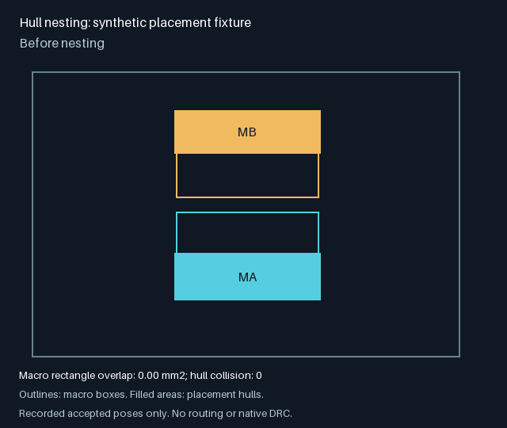

# Hull nesting: validation status

`PNR_HULL_NEST` remains off by default. The integration of PR #91 with main
`c57077df` changes no nesting algorithm or flag default.

## Campaign receipts

The following existing GCP summaries were fetched and checked on 2026-10-07.
They ran source `f990b165`, before the integration with #88, #90 and #93.
No new campaign was submitted for this integration.

| Campaign                 | Coverage                                  | Verified result                                                                                  |
| ------------------------ | ----------------------------------------- | ------------------------------------------------------------------------------------------------ |
| `20261007-ladder-ff64b7` | Eight ladder cases, seeds 0–1, base/nest  | 16/16 pass in each arm; matching verdicts, opens, vias and copper hashes                         |
| `20261007-ladder-49f247` | 35 flat hard cases, seeds 0–1, base/nest  | 61/70 pass in each arm; the same nine failures, matching verdicts, opens, vias and copper hashes |
| `20261007-ladder-b5f559` | Twin-bank, seeds 0–3, base/nest/hp/hpnest | 4/4 pass in every arm; zero final hull collision area                                            |
| `20261007-ladder-b4292b` | Dovetail, seeds 0–3, four arms            | Still queued, zero run time; missing C4D Spot instance template in `northamerica-northeast1`     |
| `20261007-ladder-9c11aa` | Quad-bank, seeds 0–3, four arms           | Still queued, zero run time; the same missing instance template                                  |

Twin-bank totals over four seeds:

| Arm    | Bounding box area (mm²) | Copper (mm) | Vias |
| ------ | ----------------------: | ----------: | ---: |
| base   |                5214.236 |    2130.173 |  164 |
| nest   |                4083.859 |    2083.441 |  162 |
| hp     |                5006.464 |    2264.873 |  152 |
| hpnest |                4409.349 |    2208.681 |  155 |

The missing dovetail and quad-bank comparisons remain an acceptance gap. The
completed cells do not establish that every hierarchical rung is no worse.
The queued jobs were inspected only; they were not changed or resubmitted.

## Animation evidence



The committed animation runs the existing half-macro placement fixture
through `hull.nest` and draws only its recorded accepted poses, with a fixed
viewport. It performs no interpolation, routing or native DRC. It demonstrates
legal macro-box overlap; this simple half-macro fixture is not evidence of
true L-shaped hull interlock. Reproduce it with the engine dependencies and
Pillow 10 or newer:

```sh
PYTHONPATH=hardware/pnr:hardware/pnr/tests python tools/animate_hull_nest_fixture.py \
  --out docs/feature-animations/hull-nest-fixture.gif
```

The original local `13-dovetail-blocks-23`, seed 1 storyboard was also inspected.
It comes from the recorded run at `03c26c013e3303ce21e1342450deafe098ffe568`
with `--hull-nest 1 --maze-kernel packed`. It is native board evidence, not a
completed GCP A/B.

The recorded final result passed: zero opens, zero native DRC violations,
31 vias, 421.012 mm copper. Final macro rectangle overlap is 8.5625 mm², but
**hull interlock is 0 mm²** (and hull collision is 0 mm²). Therefore this
animation does not demonstrate the intended true dovetailing acceptance
criterion. It is deliberately not presented as evidence that the missing
campaign passed.

## Integration checks

The focused Bazel targets `hull_nest_test`, `macro_hull_test`,
`gp_polish_test`, `hard_rungs_test` and `tests/unit/exp:test_kinds` passed
against the integrated tree. Full CI still needs to pass on the pushed head.
