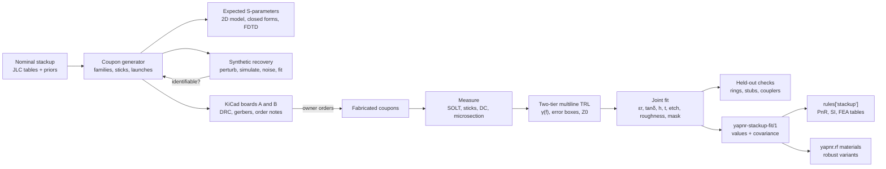

# Design: fab-model test coupons

Status: **implemented in part** (2026-10-02) for the fab-model coupon item of
[issue #32](https://github.com/Studio-Fug/yapnr/issues/32): the generator, boards A and B, the
expected S-parameters, the extraction and the synthetic recovery are in `yapnr/rf/coupons`; the
user guide [docs/rf-fab-coupons.md](../rf-fab-coupons.md) lists what differs from this design.
Nothing is ordered. The numbers come from 2D quasi-static cross-section solves (scikit-fem P2, the
FEA spike's solver, [FEA design §5.3](fea-integration.md#53-q2-capacitance-and-inductance)) and
from closed forms, as stated at each table; "est." marks planning estimates and "unverified" marks
vendor data that could not be checked against a datasheet. The implementation's tests reproduce
the line table of §4.3 and the conditioning table of §5.1 (§11.3).

## 1. Goals

The owner plans to fabricate a 5.8 GHz ISM transceiver (a separate design study under #32) and to
validate it with a vector network analyzer (VNA). The models that yapnr's RF design uses (the
inverse-design solver of #29, the line formulas of PnR and SI) start from the fab's nominal
stackup, which is not accurate enough for 5.8 GHz: §3 shows that the solder mask alone moves a
surface resonator by more than the width of the ISM band. This design adds **test coupons**: boards
of stripline, microstrip and coplanar structures that are ordered from the same fab and stackup as
the product, measured with a VNA, and fitted to give the as-built fab parameters with their
uncertainties. The product design then starts from measured values, and its margins come from
measured spreads.

### 1.1 What the coupons determine

| Parameter                                | Why it matters at 5.8 GHz                                       |
| ---------------------------------------- | --------------------------------------------------------------- |
| εr(f) of each dielectric (prepreg, core) | resonator and filter centre frequencies, line delay             |
| tan δ(f) of each dielectric              | insertion loss, resonator Q, filter passband loss               |
| dielectric thicknesses                   | line impedance, coupling, the size of every distributed element |
| copper thickness per layer               | impedance, conductor loss, DC resistance                        |
| etch (trace width lost per edge)         | impedance (the largest single term, §3), coupler gaps           |
| copper roughness                         | conductor loss and, through internal inductance, apparent εr    |
| solder mask (thickness × εr, loss)       | the largest phase unknown on outer layers (§3)                  |
| connector, launch and via transitions    | de-embedding of product measurements, launch design             |
| switch connector and u.FL test points    | de-embedding of the VNA access points on the product            |

### 1.2 Requirements

- **Frequency.** The coupons are designed for 0.1–18 GHz and specified for 1–12 GHz: the 5.8 GHz
  band (5.725–5.875 GHz) with margin, and its second harmonic (11.6 GHz) when a lab VNA is
  available. A 6 GHz hobby VNA must still be able to use every structure up to 6 GHz.
- **Stackups.** JLCPCB JLC04161H-7628 (4-layer, the typical yapnr target) and one 6-layer JLCPCB
  stackup that gives true stripline between two planes (§4.2). The generator is parametric in the
  stackup, so a later product stackup gets its own coupon board from the same code.
- **Same process as the product.** Coupons are ordered with the product's options (stackup id,
  impedance control, copper weights, finish, mask). Otherwise they measure a different process.
- **Hobby-lab measurable.** A 2-port VNA, an SMA calibration kit, a torque wrench, a multimeter
  and a current source, optionally a microscope. No 4-port VNA, probe station or material fixture.
- **Open tools.** scikit-rf (BSD-3) for calibration, scikit-fem (BSD-3) for the 2D model, the
  headless KiCad for the boards. AGPL-3.0-or-later code in yapnr; no vendor data beyond published
  facts.
- **Quantified.** Every fitted value carries a standard uncertainty and its correlations, and the
  fit is shown to recover known parameters from synthetic data before anything is ordered (§10).
- **Feeds yapnr.** The result updates the stackup model that PnR, SI, the FEA tables and the RF
  solver read (§8.9).

### 1.3 Non-goals

- Material-only test methods: clamped stripline (IPC-TM-650 2.5.5.5C), split cylinder (2.5.5.13)
  and SPDR (2.5.5.15) need laminate samples and resonator fixtures, not finished boards.
- Calibration-lab metrology. The aim is a fab model good enough for a first-pass product, with
  honest uncertainties, not traceable permittivity values.
- Through-thickness versus in-plane anisotropy beyond one weave check (§5.2), and EMC.
- Ordering. Agents never order boards or parts or contact vendors; the owner orders.

## 2. Summary



| Topic         | Choice                                                                                                       | Reason                                                                                                      |
| ------------- | ------------------------------------------------------------------------------------------------------------ | ----------------------------------------------------------------------------------------------------------- |
| Boards        | A: 4L JLC04161H-7628; B: 6L JLC06161H-7628 (JLC06161H-2116C as the alternative)                              | the 4L target, and a 6L with stripline that shares A's L1 cross-section, so one board ties the other (§4.2) |
| Format        | "sticks": every structure on its own break-out strip with an edge SMA at each end                            | every port needs a board edge with room for the connector and wrench; sticks are measured independently     |
| Calibration   | two tiers: SOLT at the cable ends, then multiline TRL on the board                                           | Jargon and Marks' two-tier scheme for low-cost VNAs; removes connectors and launches from every structure   |
| Line lengths  | thru 20 mm (2 × 10 mm) plus lines ΔL = 2.5, 6.5, 16, 40 and 100 mm                                           | conditioning ≥ 0.95 over 1–12 GHz for every family; the 100 mm line doubles as the loss line (§5.1)         |
| Separation    | width set, mask-off copies, a second line type, DC meanders, microsection                                    | each breaks one degeneracy of the line data (§8.8)                                                          |
| Forward model | 2D quasi-static RLGC per family; Djordjevic–Sarkar dielectric; causal roughness; closed-form discontinuities | fast, accurate for uniform lines; held-out resonators test the model form                                   |
| Connector     | Cinch 142-0701-851 edge SMA (18 GHz) by default; optionally one reusable clamp-on pair for the TRL sets      | soldered connectors differ between sticks, which TRL assumes away (§6.1)                                    |
| Output        | `yapnr-stackup-fit/1`: values, covariance, provenance                                                        | one record that `rules['stackup']` and the RF solver both read                                              |

## 3. Why the fab model needs measuring

At 5.8 GHz a guided wavelength on the L1 lines is about 29 mm, the ISM band is 2.6 % wide, and a
resonator's frequency moves by half the relative change of its εeff. A 1 % error in εeff moves a
5.8 GHz resonator by 29 MHz. The table gives the effect of each fab parameter on the 50 Ω lines
of §4.3 (2D quasi-static, from the 50 Ω design point; the mask is conformal, 30 µm over substrate
and 15 µm over copper, εr 3.8, JLC's calculator values).

| Change                                              | P (L1 GCPW, masked): ΔZ0, Δεeff | S (L3 stripline): ΔZ0, Δεeff    | Shift of a P resonator at 5.8 GHz |
| --------------------------------------------------- | ------------------------------- | ------------------------------- | --------------------------------- |
| εr +0.2 (JLC gives no frequency for its εr)         | −0.85 Ω, +0.111                 | −1.1 Ω, +0.200                  | −99 MHz                           |
| etch 0.025 mm per edge (trace narrower, gaps wider) | +6.1 Ω, ±0.000                  | +6.2 Ω, ±0.001                  | 0                                 |
| dielectric height +10 %                             | +1.9 Ω, −0.037                  | +1.7 Ω (prepreg), +0.7 Ω (core) | +34 MHz                           |
| copper 35 → 50 µm (L1), 15 → 30 µm (L3)             | −1.3 Ω, −0.071                  | −1.9 Ω, −0.003                  | +66 MHz                           |
| mask removed                                        | +2.6 Ω, −0.312                  | n/a                             | +307 MHz                          |

Three conclusions follow:

1. **The mask is the largest unknown on outer layers.** It moves L1 resonators by about 5 %,
   twice the width of the 150 MHz ISM band, and from phase alone it looks the same as a higher
   εr. Masked and unmasked copies of the same line separate the two.
2. **Stripline phase depends only on εr.** Width, etch and copper thickness move εeff by less than
   0.003, so the stripline's delay measures the inner dielectrics directly, and its impedance
   then pins width and heights. On masked GCPW the etch does not move the phase either (the
   narrower trace and the wider, mask-filled gaps cancel).
3. **Impedance is dominated by etch and height**, which only a set of widths, a second line type
   and the DC resistance can separate (§8.8).

JLCPCB's published data leave most of this open [JLC impedance and capabilities pages]: εr values
without a frequency (7628 prepreg 4.4, 3313 4.1, 2116 4.16, 1080 3.91, core 4.6), no loss
tangent, no etch or trapezoid model, no roughness, impedance tolerance ±10 % (±5 % on request),
track width ±20 %, board thickness ±10 %, and laminates from several suppliers (Nan Ya, KB,
Shengyi and others), so the material can change between orders.

## 4. Stackups, boards and line families

### 4.1 Board A: JLC04161H-7628 (4 layers, 1.6 mm)

| Layer | Material, thickness (mm)     | Use on the coupon                                     |
| ----- | ---------------------------- | ----------------------------------------------------- |
| L1    | copper 0.035 (1 oz finished) | every RF structure; launches                          |
| –     | 7628 prepreg 0.2104, εr 4.4  | the L1 dielectric                                     |
| L2    | copper 0.0152 (0.5 oz)       | solid ground; cut out under the SMA pin pads (§6.2)   |
| –     | core 1.065, εr 4.6           |                                                       |
| L3    | copper 0.0152                | solid ground; the reference under the launch cut-outs |
| –     | 7628 prepreg 0.2104, εr 4.4  |                                                       |
| L4    | copper 0.035                 | solid ground; connector ground tabs                   |

The inner planes are only removed on the DC stick, where L2 and L3 carry meanders (§5.2).

### 4.2 Board B: JLC06161H-7628 (6 layers, 1.6 mm)

| Layer | Material, thickness (mm)    | Use on the coupon                    |
| ----- | --------------------------- | ------------------------------------ |
| L1    | copper 0.035                | launches; the L1 tie set (§5.3)      |
| –     | 7628 prepreg 0.2104, εr 4.4 | the same L1 cross-section as board A |
| L2    | copper 0.0152               | ground (upper stripline plane)       |
| –     | core 0.40, εr 4.6           | above the stripline                  |
| L3    | copper 0.0152               | **stripline**                        |
| –     | 7628 prepreg 0.2028, εr 4.4 | below the stripline                  |
| L4    | copper 0.0152               | ground (lower stripline plane)       |
| –     | core 0.40, εr 4.6           |                                      |
| L5    | copper 0.0152               | ground; meanders on the DC stick     |
| –     | 7628 prepreg 0.2104, εr 4.4 |                                      |
| L6    | copper 0.035                | ground; meanders on the DC stick     |

JLCPCB lists 16 six-layer stackups. In several the L3 layer sits close to one plane only (a thin
core with a 0.55–0.7 mm dielectric on the other side), which is not a balanced stripline. Two give
a true stripline on L3:

- **JLC06161H-7628 (default):** 0.40 mm core above, 0.2028 mm 7628 below (2:1). Its L1–L2
  dielectric is the same 7628 0.2104 mm as board A, so board B's L1 sticks are geometrically
  identical to board A's and measure the same prepreg type on a second lamination. They also tie
  the 7628 εr, which the stripline alone cannot separate from the core's (§8.8; in practice
  together with board A's fit, see there).
- **JLC06161H-2116C (alternative):** 0.30 mm core above, 3 × 2116 (0.366 mm, εr 4.16) below, the
  most symmetric stripline. Its L1 dielectric is 2116 (0.2464 mm), so nothing is shared with
  board A. Choose it if the product will use it; the generator then builds a board B' from it.

The 6-layer service fills and caps vias and has no HASL finish (ENIG only).

### 4.3 Line families and their dimensions

A **family** is one cross-section: layer, type, drawn width, gap, mask. The **primary family P**
is the product's RF line, by default L1 grounded coplanar waveguide (GCPW) under mask with 0.20 mm
gaps; if the transceiver study picks microstrip or mask-free RF lines, P becomes that family and
the others shift roles. Values are 2D quasi-static (rectangular copper, ideal side-ground vias,
conformal mask 30/15 µm, εr 3.8); εeff at 5.8 GHz adds Kirschning–Jansen dispersion [KJ82] (for
GCPW only as an estimate).

| Id      | Board | Layer, type                 | w (mm) | gap (mm) | Mask | Z0 (Ω) | εeff  | εeff, 5.8 GHz |
| ------- | ----- | --------------------------- | ------ | -------- | ---- | ------ | ----- | ------------- |
| P       | A, B  | L1 GCPW                     | 0.291  | 0.200    | yes  | 50.0   | 3.180 | 3.188         |
| P-MO    | A     | P with the mask opened      | 0.291  | 0.200    | no   | 52.6   | 2.868 |               |
| P0.7    | A     | P at 0.7 w                  | 0.204  | 0.200    | yes  | 58.2   | 3.124 |               |
| P1.4    | A     | P at 1.4 w                  | 0.407  | 0.200    | yes  | 42.4   | 3.251 |               |
| P65     | A     | P, staircase high step      | 0.150  | 0.200    | yes  | 65.0   | 3.091 |               |
| P35     | A     | P, staircase low step       | 0.574  | 0.200    | yes  | 35.0   | 3.343 |               |
| M       | A     | L1 microstrip               | 0.348  | –        | yes  | 50.0   | 3.403 | 3.413         |
| M-MO    | A     | M with the mask opened      | 0.348  | –        | no   | 51.8   | 3.165 |               |
| S       | B     | L3 stripline                | 0.214  | –        | –    | 50.0   | 4.479 | 4.479         |
| S0.7    | B     | S at 0.7 w                  | 0.150  | –        | –    | 58.4   | 4.480 |               |
| S1.4    | B     | S at 1.4 w                  | 0.300  | –        | –    | 42.2   | 4.478 |               |
| (ref)   | –     | 50 Ω L1 GCPW without mask   | 0.323  | 0.200    | no   | 50.0   | 2.903 | 2.911         |
| (ref)   | –     | 50 Ω L1 microstrip, no mask | 0.371  | –        | no   | 50.0   | 3.187 | 3.196         |
| (2116C) | B'    | L3 stripline                | 0.279  | –        | –    | 50.0   | 4.383 |               |
| (2116C) | B'    | L1 GCPW                     | 0.350  | 0.200    | yes  | 50.0   | 3.019 |               |

Coupled lines (2D quasi-static, modal values):

| Id        | Board | Geometry                                    | Zeven / Zodd (Ω) | εeven / εodd  | Zdiff (Ω) | Coupling | λ/4 at 5.8 GHz |
| --------- | ----- | ------------------------------------------- | ---------------- | ------------- | --------- | -------- | -------------- |
| CPL-0.15  | A     | two M lines (0.348, masked), gap 0.15       | 59.1 / 38.5      | 3.617 / 3.077 | 77.0      | −13.5 dB | 7.07 mm        |
| CPL-0.20  | A     | gap 0.20                                    | 57.6 / 41.0      | 3.621 / 3.093 | 82.0      | −15.5 dB | 7.06 mm        |
| CPL-0.30  | A     | gap 0.30                                    | 55.3 / 44.1      | 3.616 / 3.134 | 88.1      | −18.9 dB | 7.04 mm        |
| DIFF100-M | A     | L1 microstrip pair, masked, w 0.216, g 0.20 | 73.7 / 50.0      | 3.521 / 3.026 | 100.0     |          |                |
| DIFF90-M  | A     | w 0.281, g 0.20                             | 64.6 / 45.0      | 3.574 / 3.058 | 90.0      |          |                |
| DIFF100-S | B     | L3 stripline pair, w 0.176, g 0.30          | 59.2 / 50.0      | 4.476 / 4.484 | 100.0     |          |                |
| DIFF90-S  | B     | w 0.190, g 0.20                             | 59.9 / 45.0      | 4.475 / 4.485 | 90.0      |          |                |

A 100 Ω stripline pair at a 0.20 mm gap would need 0.144 mm traces, close to the fab minimum; the
0.30 mm gap keeps the width at 0.176 mm. The coupled sections are quasi-static; the generator adds
the modal dispersion of coupled microstrip [KJ84] when it sets their lengths.

## 5. Coupon structures

### 5.1 The stick format

Every structure is a **stick**: a strip of board, 15 mm wide (est.: the connector flange width plus
about 2.5 mm a side, to be checked against the 142-0701-851 drawing), with an edge-launch SMA at
each end. Sticks sit in a frame, held by mouse-bite tabs on their long sides only, and are broken
out before connectors are fitted. The connector ends are milled edges. Each port therefore has a
clean edge, room for the wrench, and no neighbour; sticks can be measured, repaired or
microsectioned one at a time, and connectors are fitted only to sticks that will be measured.

```text
 milled edge                                                               milled edge
 |<-- 10 mm: launch -->|<--------------- ΔL --------------->|<-- 10 mm: launch -->|
 [SMA]=pad=taper=======|================ line ================|=======taper=pad=[SMA]
                      RP1                                     RP2
```

The launch section (edge to reference plane, 10 mm) is identical on every stick of a board, and
the reference planes RP1 and RP2 are where multiline TRL puts them. A **thru** is a 20 mm stick
(RP1 = RP2), a **line** is 20 mm + ΔL, and a **reflect** stick ends each 10 mm launch in a short
(three vias across the line end into the side grounds), with 10 mm of grounded copper between the
two shorts. **Variant** sticks (other widths, mask-off, other families) are 60 mm long: the P
launch, a 40 mm test section, the P launch; the multiline calibration of their board removes the
launches, and the fit models the two junctions (§8.5).

Line lengths. Multiline TRL needs, at every frequency, a line pair whose phase difference is far
from 0° and 180°; the usual figure of merit is the best pair's |sin(βΔL)| [Marks91, DeGroot02,
Hatab26]. For the set ΔL = {0, 2.5, 6.5, 16, 40, 100} mm:

| εeff (family)     | worst, 1–6 GHz | worst, 1–12 GHz | worst, 1–18 GHz | above sin 20° from |
| ----------------- | -------------- | --------------- | --------------- | ------------------ |
| 2.90 (P-MO class) | 0.975          | 0.951           | 0.951           | 0.10 GHz           |
| 3.19 (P)          | 0.975          | 0.951           | 0.951           | 0.10 GHz           |
| 3.41 (M)          | 0.975          | 0.951           | 0.951           | 0.10 GHz           |
| 4.48 (S)          | 0.975          | 0.951           | 0.924           | 0.10 GHz           |

The 100 mm line also serves as the loss line (§8.8). A three-standard set such as {0, 6.5, 26} mm
falls to zero near 10.9 GHz on stripline and is not used.

### 5.2 Board A catalogue (JLC04161H-7628)

"Core" sticks are needed for the fit; "extended" sticks add checks and are dropped first if the
panel is too large. Lengths are edge to edge.

| Stick    | Structure                                                                         | Size (mm)  | Tier     | Determines                                                 |
| -------- | --------------------------------------------------------------------------------- | ---------- | -------- | ---------------------------------------------------------- |
| A01–A06  | P thru and lines ΔL = 2.5, 6.5, 16, 40, 100                                       | 20–120     | core     | calibration; γ(f) of P: εeff(f), α(f)                      |
| A07      | P reflect (via shorts at both reference planes)                                   | 30         | core     | calibration                                                |
| A08      | P verification line, ΔL = 28                                                      | 48         | core     | residual calibration error, connector repeatability        |
| A09      | P-MO: the mask opened over the 40 mm test section                                 | 60         | core     | mask Dk × thickness; ENIG loss on exposed copper           |
| A10, A11 | P0.7, P1.4 over 40 mm                                                             | 60         | core     | Z0(w) and α(w): etch versus height; tan δ versus roughness |
| A12, A13 | M and M-MO over 40 mm (side grounds tapered away over 2 mm)                       | 60         | core     | a second L1 field shape: εr versus height                  |
| A14      | ring, M, mean radius 8.906 mm, coupling gaps 0.20, M feeds                        | 60 × 30    | core     | held out: εeff at 2.90, 5.80, 8.69, 11.57 GHz; Q           |
| A15      | P through line with a shunt open λ/4 stub (7.24 mm less the end correction)       | 60 × 25    | core     | held out: open-end model; notch at 5.80 GHz                |
| A16      | P through line with a shunt shorted λ/2 stub (14.47 mm less the via correction)   | 60 × 32    | core     | held out: via inductance; notches at 5.80, 11.58 GHz       |
| A17      | CPL-0.20: λ/4 coupled section, ports at opposite ends, other ends open            | 40         | core     | Zeven, Zodd, εodd: gap etch, mask in the gap               |
| A18      | switch connector (SWF) in its through state between two P lines                   | 40         | core     | the switch connector's insertion in the product path       |
| A19      | two SWF connectors 10 mm apart, measured through the probe (2x-thru)              | 30         | core     | probe and pad model for de-embedding                       |
| A20      | two u.FL receptacles 10 mm apart (2x-thru), measured through u.FL cables          | 30         | core     | u.FL test-point model; mating repeatability                |
| A21      | DC: 4-wire meanders on L1–L4 at 0.2 mm × 200 mm and 0.5 mm × 250 mm; 50-via chain | 60 × 30    | core     | w·t per layer; etch from the width ratio; plating          |
| A22      | microsection stick: P, P0.7, P1.4, M, P-MO and a via side by side, cut line       | 30         | core     | h, t, trapezoid, mask thickness (ground truth)             |
| A23      | staircase: P, 20 mm P65, 20 mm P, 20 mm P35, P                                    | 80         | extended | TDR check of Z0(w) over a wider range                      |
| A24, A25 | P ΔL = 40 rotated 10°, and along the other panel axis                             | 60         | extended | glass-weave and warp/fill differences [Loyer07]            |
| A26, A27 | CPL-0.15, CPL-0.30                                                                | 40         | extended | gap-etch trend                                             |
| A28      | DIFF100-M as a λ/4 coupled section                                                | 40         | extended | the 100 Ω pair's modes                                     |
| A29      | 3-pole edge-coupled band-pass filter at 5.8 GHz, M, synthesized at generation     | 60 × 20    | extended | held out: a product-like filter [MYJ64, Pozar12]           |
| A30      | via transition L1 → L4 → L1 (GCPW), 2x-thru                                       | 40         | extended | 4-layer via model                                          |
| A31      | an inverse-designed 5.8 GHz component (#29, #32) re-optimized on this stackup     | per design | extended | end-to-end check of the inverse-design flow                |

The meander pair per layer (0.2 mm and 0.5 mm wide) gives the etch directly: R ∝ ρL/((w − 2e)·t),
so the ratio of the two resistances depends on e alone, and either one then gives t. At 100 mA the
L1 0.2 mm meander reads about 49 mV (0.49 Ω) and dissipates 5 mW.

Multi-port structures (A29, A31) carry an SMA on every port; unused ports are terminated with SMA
loads and the full S-matrix is assembled from 2-port measurements.

### 5.3 Board B catalogue (JLC06161H-7628)

| Stick    | Structure                                                            | Size (mm) | Tier     | Determines                                                                 |
| -------- | -------------------------------------------------------------------- | --------- | -------- | -------------------------------------------------------------------------- |
| B01–B06  | S thru and lines ΔL = 2.5, 6.5, 16, 40, 100, launched L1 → L3 by via | 20–120    | core     | calibration; γ(f) of S: the inner εr mix, α(f)                             |
| B07      | S reflect (L3 shorted to L2 and L4 by vias at the reference planes)  | 30        | core     | calibration                                                                |
| B08      | S verification line, ΔL = 28                                         | 48        | core     | residual calibration error                                                 |
| B09, B10 | S0.7, S1.4 over 40 mm                                                | 60        | core     | etch and heights on L3; tan δ versus roughness                             |
| B11      | stripline ring, S, mean radius 7.774 mm, coupling gaps 0.15          | 60 × 30   | core     | held out: εeff at 2.9, 5.8, 8.7, 11.6 GHz                                  |
| B12–B15  | L1 tie set: P thru and lines ΔL = 6.5, 16, 40                        | 20–60     | core     | 7628 εr (ties εr of the core and the prepreg); lot comparison with board A |
| B16      | P reflect                                                            | 30        | core     | calibration of the tie set                                                 |
| B17      | via transition L1 → L3 → L1, 2x-thru                                 | 40        | core     | held out: the via model                                                    |
| B18      | DC meanders on L1–L6 (two widths each), via chain                    | 60 × 30   | core     | w·t and etch per layer                                                     |
| B19      | microsection stick                                                   | 30        | core     | ground truth for h_core, h_pp, t_L3                                        |
| B20, B21 | DIFF100-S, DIFF90-S as λ/4 coupled sections                          | 40        | extended | inner-layer pair modes                                                     |
| B22      | S through line with a shunt open λ/4 stub                            | 60 × 25   | extended | held out: stripline open end                                               |
| B23      | S ΔL = 40 rotated 10°                                                | 60        | extended | weave on the inner layer                                                   |

The tie set uses ΔL = {0, 6.5, 16, 40} mm: worst-case conditioning 0.93 over 1–6 GHz and 0.56 over
1–12 GHz, enough for a cross-check.

### 5.4 Product rail coupon

Every product order carries a break-away rail, 15 mm wide, from the same panel: the product's P
family as a thru and lines ΔL = 6.5 mm and 36.2 mm (five quarter wavelengths at 5.8 GHz, so the
pair is in quadrature in the band: conditioning ≥ 0.97 over 5.5–6.1 GHz), plus DC meanders on L1
and the RF inner layer. Measured with the two-line method (no reflect needed for γ), the rail
tracks lot-to-lot drift of εeff, loss and w·t at the product's frequency, and a fit with board A's
or B's posterior as the prior updates the model for that lot.

### 5.5 Panel, outline and labels

- **Panel.** Sticks are packed in rows into a frame with 5 mm rails, 2 mm milled slots and
  mouse-bite tabs on the long sides: 5 mm wide (JLC's minimum for a tab with mouse bites), six
  0.5 mm holes at 0.8 mm pitch. Estimated outlines: board A core about 175 × 160 mm, with the
  extended set about 175 × 215 mm; board B core about 175 × 130 mm (est.; the generator packs
  automatically and reports the size).
- **Orientation.** All sticks run along one panel axis except A24, A25 and B23, so every line
  sees the same glass-weave direction.
- **Copper at the edge.** The launch copper stops 0.25 mm from the milled edge (est.; checked
  against JLC's routed-edge clearance at generation). Ground pours and stitching cover every
  stick; no copper crosses a slot.
- **Labels (silkscreen).** On the frame: "yapnr RF coupon", board letter and revision, stackup id,
  a blank lot box and a serial box for a marker. On each stick, at one end and at least 1.5 mm from
  any RF copper: the stick id, family and ΔL (for example `A05 P L40`), and edge ticks marking the
  reference planes. The microsection stick carries a cut line. Silkscreen never covers lines, gaps
  or ground edges next to gaps, since ink changes εeff.
- **Order number.** JLC's order number is placed on the frame (the "specify a location" option).

### 5.6 Fab notes

The coupons are ordered exactly as the product will be:

| Option              | Board A                                   | Board B                                 |
| ------------------- | ----------------------------------------- | --------------------------------------- |
| Layers, thickness   | 4, 1.6 mm                                 | 6, 1.6 mm                               |
| Impedance control   | yes, JLC04161H-7628                       | yes, JLC06161H-7628                     |
| Impedance tolerance | the product's (±10 % standard)            | the product's                           |
| Copper              | 1 oz outer, 0.5 oz inner                  | 1 oz outer, 0.5 oz inner                |
| Finish              | ENIG (recommended for the product too)    | ENIG (the only option)                  |
| Mask, silkscreen    | the product's colours                     | the product's colours                   |
| Vias                | 0.3 mm drill, 0.5 mm pad; tented          | 0.3/0.5 mm; filled and capped (default) |
| Panel               | customer panel, milled slots, mouse bites | as board A                              |
| Quantity            | 5 (measure at least 3)                    | 5 (measure at least 3)                  |

The fab drawing (a text file in the order) lists the controlled-impedance traces (P: 0.291 mm with
0.20 mm gaps on L1, 50 Ω; S: 0.214 mm on L3, 50 Ω) and asks that widths not be changed; any
engineering query that changes a width is recorded, since it is an input of the fit. HASL is
avoided on RF boards because its tin thickness varies over exposed copper; whether JLC charges
extra for a panel of break-out sticks is unverified and checked at order time.

## 6. Launches and connectors

### 6.1 Connectors

| Part                                                | Rating                                            | Use                                                                                      |
| --------------------------------------------------- | ------------------------------------------------- | ---------------------------------------------------------------------------------------- |
| Cinch/Johnson 142-0701-851, edge SMA jack           | 18 GHz, 500 cycles, 50 Ω [Bel/Cinch product page] | **default** on every measured stick; board-thickness variant and pin size unverified     |
| Southwest Microwave SuperSMA end launch (292-04A-x) | 27 GHz, clamp-on, reusable [SWM product page]     | optional: one pair moved between the TRL sticks, so the error boxes are nearly identical |
| Hirose U.FL receptacle and plug cable               | about 6 GHz, about 30 mating cycles [Wikipedia]   | product test point only; A20 characterizes it                                            |
| Murata SWF switch connector (MM8130-2600) and probe | about 6 GHz per Murata; unverified                | product test access in the RF path; A18 and A19 characterize it                          |

Multiline TRL assumes the same error box at every port of every standard. Soldered connectors
break that assumption a little on every stick, and the error goes straight into γ. The plan
quantifies it rather than ignoring it: the verification line (A08, B08) shows the residual, the
synthetic recovery (§10) includes a connector spread, and the fit's noise model takes the
measured repeatability. A clamp-on pair removes most of it; the owner decides whether to buy one
(§14).

### 6.2 Edge launch

The launch is GCPW at the board edge with ground-via rows on both sides, a pin pad, and a taper to
the family's line [Rosas07, Simons01]:

- **Pin pad.** Width wp = pin diameter + about 0.1 mm (0.8–1.2 mm, from the connector drawing),
  length per the drawing, then a 1.0 mm linear taper to P (0.291 mm, 0.20 mm gaps).
- **Cut-out under the pad.** With L2 only 0.21 mm below, a 0.8–1.2 mm pad with 0.2 mm gaps is
  29–22 Ω (2D). Board A removes L2 under the pad, its gaps and the taper, so the pad references L3
  1.29 mm below; the coplanar gap that makes the pad 50 Ω is then 0.211, 0.268 and 0.335 mm for
  wp = 0.8, 1.0 and 1.2 mm (2D, εeff 2.73–2.82). On board B, L3 (0.63 mm below L1) is poured
  with ground under the launch and becomes the reference: the 50 Ω gap is 0.298 mm for
  wp = 0.8 mm and 0.570 mm for wp = 1.0 mm (a wider pad would cut L3 too and reference L4). The
  two boards' launches therefore differ, which is fine: TRL needs identical launches within a
  board, not across boards.
- **Via fence.** 0.3 mm drill, 0.5 mm pad, centres 0.5 mm from the gap edge, pitch 0.8 mm (a tenth
  of the wavelength in the 7628 at 18 GHz), first pair as close to the edge as the fab allows.
  The L1 grounds, L2, L3 and L4 are all stitched.
- **Tuning.** The geometry is tuned once per board by 3D simulation (§9) to |S11| ≤ −20 dB up to
  6 GHz and ≤ −15 dB up to 12 GHz (est. targets), then frozen and copied to every stick.

### 6.3 Via transition (board B)

The L3 sticks are launched L1 GCPW → signal via → L3 stripline inside the 10 mm launch section, so
the calibration removes the transition and the L3 lines are measured alone. Starting geometry
(tuned in 3D like the launch): a 0.3 mm signal via with pads on L1 and L3 only (unused pads
removed), antipads of 1.0 mm diameter on L2, L4, L5 and L6, and four to six ground vias on a
0.9 mm radius, which makes the via a coaxial line of about 50 Ω in εr 4.5. The via runs through
the board, leaving a stub from L3 to L6 of about 0.9 mm whose quarter-wave resonance is near
40 GHz, so no back-drilling is needed. B17 measures the transition itself as a 2x-thru.

### 6.4 u.FL and switch connectors

The product's VNA access points are u.FL receptacles or switch connectors (a coaxial switch that
passes the RF path until a probe is inserted). Three sticks characterize them:

- **A18:** the switch connector in its through state, between two P lines, measured with the
  board's TRL calibration. This is the connector as it sits in the product's RF path.
- **A19:** two switch connectors with 10 mm of P between, measured through the probes after SOLT
  at the probe cables' SMA ends. IEEE 370 2x-thru de-embedding (scikit-rf
  `IEEEP370_SE_ZC_2xThru`) splits it into two halves, each the model of probe + mating + pad that
  is later removed from product measurements.
- **A20:** the same for u.FL receptacles and their cables, re-mated five times to measure the
  spread.

## 7. Measurement procedure

### 7.1 Equipment

- A 2-port VNA. A 6 GHz instrument (for example LibreVNA, 100 kHz–6 GHz) covers the band; the
  harmonic and the 12–18 GHz checks need a lab VNA.
- An SMA calibration kit with its definitions (open, short, load, thru), phase-stable cables, an
  SMA torque wrench at the connector's rated torque (5 in-lb for 142-0701-851 per the product
  page), and two SMA 50 Ω loads.
- A current source (or a bench supply in constant-current mode), two multimeters (current and
  millivolts) or a 4-wire ohmmeter, a thermometer and a hygrometer.
- For the microsection: epoxy, abrasive paper to P2000, a polishing cloth, and a microscope with
  a stage micrometer.

### 7.2 Preparation

1. Break out the sticks of three boards per stackup; deburr the long edges (not the milled ends).
2. Fit connectors with a jig so that every pin sits the same way on its pad; one operator, one
   solder alloy, flux removed (flux residue on a mask-free line changes its εeff).
3. Inspect every joint and record anomalies in the session manifest.
4. Condition the boards at lab ambient for at least 24 h and record temperature and humidity,
   since FR-4 absorbs water and its loss rises with it.

### 7.3 VNA settings and calibration

- **Grid:** linear, starting at the step so that time-domain transforms work: 10 MHz to 6.000 GHz
  in 10 MHz steps (600 points) on a 6 GHz VNA, 10 MHz to 18.000 GHz (1800 points) on a lab VNA.
- **IF bandwidth** 1 kHz (100 Hz for the 100 mm lines above 10 GHz); source power −10 dBm; 30 min
  warm-up; cables taped down so they bend the same way for every stick.
- **Tier 1:** SOLT at the cable ends with the kit's definitions; check it on a load and a short
  re-measured as devices. If the VNA can save uncorrected data, save it too.
- **Tier 2:** multiline TRL computed afterwards from the TRL sticks (§8.3); nothing is done on the
  instrument [Jargon95].

### 7.4 Sequence per board

1. Thru, then the lines in increasing length, then the reflect, then the verification line.
2. Every other stick of the board.
3. Thru again (drift), and the thru and the 40 mm line re-mated twice more (repeatability).
4. Recheck the SOLT on the load; repeat the whole sequence if it moved by more than 0.1 dB or 1°.
5. DC: 4-wire resistance of every meander at 100 mA, with the board temperature (copper changes by
   0.39 %/K, so the temperature is needed to ±0.25 K for 0.1 %).

### 7.5 Microsection

After all RF measurements, cut one microsection stick per board across its marked line, pot it in
epoxy, grind and polish to 1 µm, and photograph it with the stage micrometer in the same frame.
Measure the dielectric heights, copper thicknesses, top and bottom trace widths and the mask
thickness over copper, over substrate and in a gap. Microsections are a strong but imperfect prior
(polish rounding, measurement by eye), entered with the uncertainties of §8.8.

### 7.6 Files and manifest

```text
<session>/
  session.yaml                      # yapnr-coupon-session/1
  A-03_A05-P-L40_r1.s2p             # <board>-<serial>_<stick>-<family>-<what>_r<repeat>
  A-03_A05-P-L40_r2.s2p
  raw/A-03_A05-P-L40_r1.s2p         # uncorrected, when the VNA can save it
  dc.csv                            # stick, layer, width, current, voltage, temperature
  microsection/A-03_A22_1.jpg       # with the micrometer scale in frame
```

`session.yaml` (schema `yapnr-coupon-session/1`) records: the coupon revision and the generator's
git revision, the stackup id, a lot alias (not the vendor's order number), board serials, the
date, the VNA model and firmware, the calibration kit and its definitions file, calibration type,
grid, IF bandwidth and power, temperature and humidity at start and end, connector type and
torque, and per-file notes (re-mate count, suspect joints). The tools check that every stick of
the catalogue has a file and that file names parse.

## 8. Extraction pipeline

### 8.1 Parameters and priors

| Parameter                                  | Board | Nominal (source)                     | Prior σ         |
| ------------------------------------------ | ----- | ------------------------------------ | --------------- |
| Dk at 1 GHz, 7628 prepreg                  | A, B  | 4.4 (JLC, frequency unstated)        | 0.3             |
| Dk at 1 GHz, core                          | B     | 4.6 (JLC)                            | 0.3             |
| Df at 1 GHz, per dielectric                | A, B  | 0.018 (est.; JLC publishes none)     | 0.008           |
| L1–L2 height                               | A, B  | 0.2104 mm                            | 0.021 mm (10 %) |
| L2–L3 core, L3–L4 prepreg heights          | B     | 0.40, 0.2028 mm                      | 10 %            |
| etch per edge at the trace foot, per layer | A, B  | 0                                    | 0.025 mm        |
| copper thickness per layer                 | A, B  | 0.035 (outer), 0.0152 (inner) mm     | 20 %            |
| roughness per layer (Huray ratio or Rq)    | A, B  | est. for standard ED foil            | wide            |
| mask thickness scale (30/15 µm nominal)    | A, B  | 1.0 (JLC calculator)                 | 0.5             |
| mask Dk, Df                                | A, B  | 3.8 (JLC calculator), 0.025 (est.)   | 0.3, 0.015      |
| surface-resistance factor of exposed ENIG  | A, B  | Shlepnev and McMorrow's nickel model | wide            |

The dielectric model is the causal wideband Debye model of Djordjevic and Sarkar [Djordjevic01,
Svensson01]: two parameters per dielectric (Dk and Df at 1 GHz) with the corner frequencies fixed
(10³ and 10¹² Hz). The trace is a trapezoid whose foot loses e per edge and whose side angle comes
from the microsection (one etch parameter is identifiable from RF data, not two). The copper
resistivity is fixed at 1.72 × 10⁻⁸ Ω·m, so DC data fit w·t, not ρ.

### 8.2 Stage 1: quality checks

Every file is checked for passivity, reciprocity and causality with the IEEE 370 quality metrics
(scikit-rf `IEEEP370_FD_QM`, `IEEEP370_TD_QM`) [IEEE370]; repeats are compared, and a stick whose
repeats differ by more than the session's repeatability is flagged rather than averaged.

### 8.3 Stage 2: multiline TRL

The SOLT-corrected thru, line and reflect sticks of each family go through multiline TRL (scikit-rf
`TUGMultilineTRL`, Hatab's eigenvalue formulation [Hatab22], with `NISTMultilineTRL` [Marks91] as a
cross-check). The outputs are the propagation constant γ(f) = α + jβ of the family with the
launches removed, hence εeff(f) and α(f); the two error boxes; and the conditioning metric per
frequency. Linear uncertainty propagation through the calibration [Hatab23] gives γ's
uncertainty from the measured repeatability. Every other stick of the board is then corrected with
the calibration, so its S-parameters start and end at the reference planes.

### 8.4 Stage 3: reference impedance

Multiline TRL references the corrected data to the line's own Z0, which is not measured by the
calibration itself. Z0 of P (and S) comes from two independent routes:

- **TDR plateau:** the time-domain reflection of the 100 mm line against the SOLT's 50 Ω, gated to
  the middle of the line (IPC-TM-650 2.5.5.7A). A 6 GHz VNA resolves about 5 mm, and the line has
  a 100 mm plateau.
- **Capacitance route** [MarksWilliams91, WilliamsMarks91]: Z0 = γ/(G + jωC) with C from the
  2D model at the fitted geometry and εr.

Their difference is a check of the model. The corrected data are renormalized to 50 Ω for
reports.

### 8.5 Stage 4: joint fit

All corrected sticks, the DC resistances and the microsection readings are fitted together by
weighted least squares over the parameter vector of §8.1, with the priors as extra residuals and a
soft-L1 loss so that one bad joint does not pull the fit. Weights come from the measured
repeatability. The forward model per structure:

| Structure                                                     | Forward model                                                                                                                                                                                                                                                                                   |
| ------------------------------------------------------------- | ----------------------------------------------------------------------------------------------------------------------------------------------------------------------------------------------------------------------------------------------------------------------------------------------- |
| uniform line section                                          | RLGC from the 2D model: C and the vacuum C give L and the dielectric filling factors; G(f), C(f) from the per-region Djordjevic–Sarkar εr(f); R(f) by Wheeler's incremental inductance [Wheeler42] times the roughness factor                                                                   |
| roughness                                                     | Huray's sphere model [Huray07] in Simonovich's cannonball form [Simonovich16], or Groiss [Groiss96], applied to the complex surface impedance so that roughness adds internal inductance as well as resistance [Shlepnev11, Gold17]; the choice of model is a systematic uncertainty (fit both) |
| exposed copper (mask-off, pads)                               | the same with a nickel surface layer [ShlepnevMcMorrow11]                                                                                                                                                                                                                                       |
| junction of two families (width step, mask edge, P → M taper) | ideal junction plus a step capacitance [Gupta96]; tapers as a cascade of 2D sections                                                                                                                                                                                                            |
| open end, via short                                           | Kirschning–Jansen–Koster open end [KJK81] for M, a 3D-calibrated end correction for P; Goldfarb–Pucel via inductance [Goldfarb91]                                                                                                                                                               |
| coupled section                                               | 4-port from the 2D 2 × 2 C and L matrices (modal decomposition), with the end corrections                                                                                                                                                                                                       |
| ring                                                          | two line paths, gap coupling capacitances calibrated in 3D, curvature correction [Wolff71, Chang04]                                                                                                                                                                                             |
| switch connector, u.FL                                        | black-box 2-ports from §6.4; not fitted                                                                                                                                                                                                                                                         |

The 2D solves cost 1–3 s each. The fit uses a local quadratic surrogate of each family's C, vacuum
C and conductor-loss factor around the current estimate, built from 2·n + 1 solves and rebuilt at
the solution (two or three rebuilds), cached by the hash of the cross-section.

### 8.6 Stage 5: uncertainty

The reported covariance is the inverse of the Gauss–Newton information at the solution, scaled by
the reduced χ² when it exceeds 1, plus:

- a bootstrap over boards and repeats (lot spread versus measurement noise);
- systematic terms, each evaluated by refitting: the SOLT load (±0.5 Ω), the roughness model (Huray
  versus Groiss), the mask conformality (conformal versus slab), the end-correction model.

### 8.7 Stage 6: held-out checks

Structures that the fit never sees are predicted from the fitted model and then compared: the
rings (f1–f4 and Q), the stubs (notch frequency and depth), the coupled section, and the extended
filter and inverse-designed part. Proposed acceptance: resonances within 0.5 %, notches within
0.5 %, coupled-section peak within 1 % and its level within 0.3 dB. A failure means the model form
is wrong somewhere, and the report says which structure failed.

### 8.8 Identifiability before ordering

A linearized (Fisher) check with the 2D model shows which structures pin which parameters. The
observables are Z0 (σ 0.75 Ω) and εeff (σ 0.005) per family, one meander's DC resistance
(σ 1 %), and microsection readings (h ±5 µm, t ±3 µm, mask thickness ±20 %). Posterior σ per
parameter as structures are added:

Board A (prior σ: εr 0.3, h 0.021 mm, etch 0.025 mm, t 7 µm, mask scale 0.5, mask εr 0.3):

| Data                        | εr     | h (µm) | etch (µm) | t (µm) | mask scale | mask εr |
| --------------------------- | ------ | ------ | --------- | ------ | ---------- | ------- |
| P only (the TRL set)        | 0.19   | 20     | 8.2       | 6.8    | 0.42       | 0.30    |
| + width set (P0.7, P1.4)    | 0.074  | 14     | 5.6       | 6.7    | 0.18       | 0.29    |
| + mask-off (P-MO)           | 0.070  | 13     | 4.1       | 3.8    | 0.12       | 0.29    |
| + microstrip pair (M, M-MO) | 0.015  | 3.5    | 2.6       | 2.6    | 0.12       | 0.29    |
| + DC meander                | 0.0096 | 3.3    | 2.0       | 0.9    | 0.12       | 0.29    |
| + microsection              | 0.0092 | 2.7    | 1.8       | 0.8    | 0.10       | 0.25    |

Board B (prior σ: εr 0.3 each, h_core 0.04 mm, h_pp 0.02 mm, etch 0.025 mm, t 4 µm):

| Data                      | εr core | εr prepreg | h_core (µm) | h_pp (µm) | etch (µm) | t (µm) |
| ------------------------- | ------- | ---------- | ----------- | --------- | --------- | ------ |
| S only (the TRL set)      | 0.25    | 0.16       | 40          | 19        | 8.9       | 4.0    |
| + width set (S0.7, S1.4)  | 0.21    | 0.13       | 38          | 14        | 5.7       | 4.0    |
| + L1 tie (same 7628 type) | 0.016   | 0.008      | 38          | 14        | 5.7       | 4.0    |
| + DC meander              | 0.016   | 0.008      | 38          | 14        | 5.7       | 1.0    |
| + microsection            | 0.016   | 0.008      | 15          | 14        | 4.6       | 0.8    |

What this shows:

- Every core structure earns its place. The microstrip pair matters most on board A: a field
  shape without side grounds weighs height and εr differently from GCPW and cuts the εr and h
  uncertainty by four. The mask-off copy separates the mask, and the DC meander pins t.
- **Only the mask's Dk × thickness is identifiable** from RF data (their correlation stays near
  0.98); the microsection gives the thickness. The fit reports the product and flags the split as
  prior-dominated.
- **The stripline alone cannot separate the core's εr from the prepreg's** (correlation 0.998).
  The L1 tie does, assuming the L1–L2 and L3–L4 7628 plies have the same εr (same glass style,
  possibly different resin content: an assumption the report states). The individual heights
  stay loose without the microsection, but the product quantities (Z0, εeff) are measured
  directly and do not need them. _Implementation (2026-10-02):_ the full fit of board B alone
  does not reproduce the tie (correlation −0.97 to −1.00), because board B's L1 sticks are all
  masked and the mask is free there; with board A's fit as the prior (CLI `--prior`) it does
  (user guide §1). A mask-off P stick on board B would make board B self-sufficient.
- **What the product sees.** With all core structures, the predicted σ of the primary family is
  0.3 Ω in Z0 and 0.0027 in εeff on board A (0.4 Ω and 0.003 for S on board B): about ±2.5 MHz
  (1σ) on a 5.8 GHz resonator from the fab model, before lot-to-lot drift.

The check is linear at the nominal point. Board B's L1 tie holds the L1 line's own geometry at
nominal (optimistic), its microsection reading was the total height only (pessimistic), and it used
one meander width, which leaves etch and t correlated at 0.98; the second meander width of §5.2
separates them.

Loss: tan δ against roughness. The same check on attenuation (scikit-rf `MLine` with
Hammerstad–Bekkadal roughness as a proxy, tan δ 0.018 and Rq 1 µm nominal; σ is the repeatability
of a line pair's insertion loss):

| Data                       | ≤ 6 GHz, σ 0.05 dB       | ≤ 6 GHz, σ 0.1 dB | ≤ 12 GHz, σ 0.05 dB |
| -------------------------- | ------------------------ | ----------------- | ------------------- |
| P, ΔL 40 mm only           | tan δ ±15 %, Rq ±0.51 µm | ±26 %, ±0.86 µm   | ±4.4 %, ±0.27 µm    |
| P, ΔL 100 mm               | ±6.5 %, ±0.22 µm         | ±13 %, ±0.42 µm   | ±1.8 %, ±0.11 µm    |
| + P0.7 and P1.4 (ΔL 40 mm) | ±5.4 %, ±0.18 µm         | ±11 %, ±0.35 µm   | ±1.5 %, ±0.09 µm    |

The two stay strongly anti-correlated (−0.9 to −0.97). The frequency shape separates them only as
far as the roughness model is right; the width set separates them without that assumption, since
conductor loss scales with width at a fixed frequency and dielectric loss does not. A 6 GHz VNA
gets tan δ to about ±6–13 %, a 12 GHz VNA to about ±2–4 %.

### 8.9 Outputs and how they update yapnr

**`yapnr-stackup-fit/1`**, one per stackup and lot:

```json
{
  "schema": "yapnr-stackup-fit/1",
  "stackup": { "id": "JLC04161H-7628", "nominal_sha256": "..." },
  "lot": { "alias": "2026-11-a", "boards": ["A-01", "A-02", "A-03"], "measured": "2026-11-20" },
  "models": {
    "dielectric": "djordjevic-sarkar(f1=1e3,f2=1e12,fref=1e9)",
    "roughness": "huray-cannonball",
    "etch": "trapezoid(foot offset, side angle from microsection)",
    "mask": "conformal(30/15 um nominal)"
  },
  "parameters": {
    "dielectric.L1-L2.dk": { "value": 4.31, "sigma": 0.01, "prior": [4.4, 0.3] },
    "dielectric.L1-L2.df": { "value": 0.017, "sigma": 0.001 },
    "copper.L1.etch_mm": { "value": 0.012, "sigma": 0.002 },
    "...": {}
  },
  "covariance": { "order": ["..."], "matrix": [["..."]] },
  "derived": { "P.z0_ohm": [50.8, 0.6], "P.eps_eff_5g8": [3.12, 0.004] },
  "checks": { "chi2_reduced": 1.1, "held_out": { "ring_f2_rel_err": 0.002 } },
  "provenance": { "yapnr": "...", "scikit-rf": "...", "data_sha256": { "...": "..." } }
}
```

(The values are illustrative.) The record updates yapnr in four places:

1. **`rules['stackup']`**, the single stackup source of the FEA design (§7.4 there), gets a
   `measured` overlay with `source: coupon-fit` and the covariance. The nominal stackup stays what
   the fab is asked for; the overlay changes what yapnr's models assume, never the order.
2. **PnR and SI** read widths for impedance targets (pair rules, controlled-impedance nets) and the
   2D tables of FEA Tier A from the overlay, so a 50 Ω rule produces the width that is 50 Ω on
   this fab.
3. **The RF solver.** Today's `yapnr.rf` stackup is one uniform substrate with air above
   (`Stackup(er, tan_delta, h, f_ref, sigma_cu)`). An adapter gives it Dk and Df at the design
   frequency, the fitted height, and an effective conductivity σ/K(f_ref)² that carries the
   roughness factor K into the sheet resistance. Until the solver has a mask layer (§12), a masked
   board is represented by an equivalent substrate εr that reproduces the measured εeff of P; that
   is adequate for lines and resonators but not for coupled structures, whose odd mode the mask
   moves more, so the adapter warns.
4. **Robust design.** The posterior spread becomes the robust variants of the inverse design: the
   etch σ sets the erosion and dilation of `eta_variants`, and the εr σ a proposed pair of
   material variants (±2σ), so an optimized part keeps its mask over the fab's measured spread. A
   Monte Carlo over the posterior gives the predicted spread of product metrics (filter centre,
   coupler balance, match at 5.8 GHz) and a first-pass yield estimate in the report.

## 9. Expected S-parameters

Every stick gets a predicted Touchstone file before ordering, published with the board (§11.2), so
a measurement can be compared at once. Solver per structure:

| Structure                           | Solver                                                                                          | Cost            |
| ----------------------------------- | ----------------------------------------------------------------------------------------------- | --------------- |
| TRL lines, variants, staircase      | the fit's own forward model at nominal values (2D RLGC cascade)                                 | seconds         |
| coupled sections, filter            | 2D coupled-line 4-ports, closed-form ends                                                       | seconds         |
| ring, stubs (unmasked variants)     | `yapnr.rf` FDTD where it already fits: one copper layer over a ground at h = 0.2104 mm, no vias | minutes         |
| launch, via transition, masked ring | openEMS run as an external program (GPL, FEA design §6.3), or `yapnr.rf` after §12              | tens of minutes |
| switch connector, u.FL              | not predicted (vendor data unverified)                                                          | –               |

Predicted values at nominal parameters:

| Quantity                                       | Value                                                                |
| ---------------------------------------------- | -------------------------------------------------------------------- |
| P loss, smooth copper, tan δ 0.018 (est.)      | 0.96 / 2.05 / 3.34 / 3.82 dB per 100 mm at 2.4 / 5.8 / 10 / 11.6 GHz |
| of which conductor loss at 5.8 GHz             | 0.48 dB per 100 mm (×1.3–2 with roughness, est.)                     |
| M loss                                         | 0.90 / 1.99 / 3.28 / 3.77 dB per 100 mm                              |
| S loss                                         | 1.23 / 2.63 / 4.28 / 4.89 dB per 100 mm                              |
| A06 (120 mm of P) insertion loss at 5.8 GHz    | about 2.5–3.0 dB with roughness, plus the connectors                 |
| P0.7, P1.4 sticks: worst-case reflection       | −16.5 dB and −15.7 dB, ripple period 2.1 GHz                         |
| S0.7, S1.4                                     | −16.2 dB and −15.5 dB                                                |
| ring A14 resonances (before gap and curvature) | 2.903, 5.800, 8.690, 11.573 GHz                                      |
| ring B11 resonances                            | 2.90, 5.80, 8.70, 11.60 GHz                                          |
| stub A15 notches                               | 5.80 GHz (and 17.3 GHz)                                              |
| stub A16 notches                               | 5.80 and 11.58 GHz                                                   |

Loss is Wheeler's incremental inductance on the 2D model (conductor) plus the tan δ weighted by
the filling factors (dielectric, mask tan δ 0.025 est.). scikit-rf's `MLine` gives 2.0–3.0 dB per
100 mm at 6 GHz for tan δ 0.015–0.02 and Rq 0.15–1.5 µm on the unmasked microstrip, consistent
with these.

## 10. Synthetic-recovery validation

Before ordering, the whole pipeline must recover known parameters from data that look like a real
session:

1. **Truth.** Draw a parameter vector from the priors of §8.1 (and a set of ±2σ corner cases).
2. **Simulate** every stick at the truth: the forward model of §8.5 on a finer 2D mesh than the fit
   uses (so mesh error is not shared), and for the held-out ring and stubs the FDTD where it
   applies, so that physics the fit omits (radiation, discontinuity detail) is present.
3. **Embed** each stick between random connector error boxes: a series inductance, shunt
   capacitance and short coaxial delay per connector, varied between sticks by the spread of
   soldered SMAs (est. ±10 % in L and C, ±0.05 mm in delay), or nearly fixed for a clamp-on pair.
   Add a residual SOLT error (directivity −40 dB, source match −35 dB, est.).
4. **Add noise:** complex trace noise at −60 dB, a cable-flex term of 0.02 dB and 0.2° per
   connection, and a linear phase drift of 0.5° at 10 GHz over the session.
5. **Run** the pipeline unchanged: quality checks, two-tier multiline TRL, reference impedance,
   joint fit, held-out checks.
6. **Pass** when, over 50 draws: the 2σ intervals contain the truth for at least 90 % of
   parameters and draws; the mean bias is below 0.5σ; the reported σ is within a factor 1.5 of the
   empirical spread over noise realizations; and the held-out predictions pass §8.7.

Two negative tests check that the pipeline fails loudly: without the mask-off stick the mask and
εr must come out with a correlation above 0.9 and a warning; with the connector spread doubled the
verification line must exceed its threshold. The identifiability results of §8.8 are the linear
version of this test and set its expectations.

## 11. Layout of the code, data and docs

The package sits under `yapnr/rf/` and lands after the #29 branch (which creates `yapnr.rf`)
merges.

### 11.1 Modules

| Path                            | Contents                                                                                               |
| ------------------------------- | ------------------------------------------------------------------------------------------------------ |
| `yapnr/rf/coupons/stackups.py`  | layered stackups (JLC04161H-7628, JLC06161H-7628, JLC06161H-2116C) with sources, tolerances and priors |
| `yapnr/rf/coupons/families.py`  | line families: cross-sections, 2D results, local surrogates, cache                                     |
| `yapnr/rf/coupons/xsec.py`      | adapter to the 2D cross-section solver (the FEA worker's `xsec`, FEA design §7.2), or shipped tables   |
| `yapnr/rf/coupons/catalog.py`   | sticks per board: structures, dimensions, tiers, line-length conditioning                              |
| `yapnr/rf/coupons/launch.py`    | edge launch and via transition geometry                                                                |
| `yapnr/rf/coupons/layout.py`    | the KiCad board writer (headless pcbnew in a time-bounded worker), panel packing, labels, fab notes    |
| `yapnr/rf/coupons/models.py`    | forward models: RLGC lines, Djordjevic–Sarkar, roughness, discontinuities, cascades, coupled 4-ports   |
| `yapnr/rf/coupons/expected.py`  | expected S-parameters → Touchstone                                                                     |
| `yapnr/rf/coupons/session.py`   | `yapnr-coupon-session/1`, file names, quality checks                                                   |
| `yapnr/rf/coupons/calibrate.py` | two-tier multiline TRL, TDR Z0, error-box export                                                       |
| `yapnr/rf/coupons/fit.py`       | joint fit, priors, uncertainty, systematic refits, held-out checks                                     |
| `yapnr/rf/coupons/export.py`    | `yapnr-stackup-fit/1`, the `rules['stackup']` overlay, the `yapnr.rf` stackup adapter                  |
| `yapnr/rf/coupons/synthetic.py` | synthetic sessions for §10                                                                             |
| `yapnr/rf/coupons/data/`        | per-stackup 2D surrogate tables (JSON), regenerated by a tool, not by hand                             |

### 11.2 Examples and docs

```text
examples/rf-coupons/
  JLC04161H-7628/            board-A.kicad_pro, board-A.kicad_pcb, catalog.json, expected/*.s2p,
                             fab/ (gerbers via kicad-cli, drill, fab notes, order options)
  JLC06161H-7628/            board-B.* (same layout)
  measurements/README.md     the session layout of §7.6
docs/rf-fab-coupons.md       user guide: order, assemble, measure, run the fit, read the report
docs/design/rf-fab-coupons.md  this design
```

The boards are generated, never hand-edited, and checked with `kicad-cli pcb drc` from the
headless KiCad. Whether measured sessions are published under `examples/rf-coupons/measurements/`
is the owner's call (§14); they contain no private data if lot aliases are used.

### 11.3 Tests

- **Unit (CI, no FEA environment):** stackup data (layer sums, sources); catalogue geometry
  (lengths, the conditioning table of §5.1, sticks inside the panel, no overlaps); Djordjevic–Sarkar
  causality (Kramers–Kronig) and agreement with scikit-rf's implementation; roughness factor
  limits; the cascade model of a uniform line against scikit-rf; multiline TRL recovering γ exactly
  from noise-free synthetic data; a small fit with a linear surrogate; manifest and file-name
  parsing.
- **Tier 1 (FEA environment):** the 2D tables of §4.3 and §8.8 reproduced within 0.1 Ω and 0.002
  in εeff.
- **Slow (manual):** the full synthetic recovery of §10; FDTD of the unmasked ring and stubs; board
  generation with DRC and gerber export.

### 11.4 Command line

`yapnr rf coupons generate | expected | check-session | calibrate | fit | report`, each a
time-bounded step writing files, as in the rest of `yapnr.rf`.

### 11.5 Dependencies

The calibration needs scikit-rf (BSD-3), which brings scipy and pandas. None of the three is in the
lock today. They go into an optional `rf-lab` extra with its own lock, which the calibration and
the fit (scipy's `least_squares`) run with, so the core install keeps numpy and torch only. The
generator and the expected S-parameters need only numpy. The 2D solver (scikit-fem, BSD-3; gmsh,
GPL-2.0-or-later) stays in the FEA worker environment, and measurement-side users only need the
shipped surrogate tables. Hatab's multiline TRL code (BSD-3) is a reference and a cross-check, not
a dependency.

## 12. Prerequisites in `yapnr.rf` and the FEA work

1. **Layered stackups.** `yapnr.rf.stackup` covers one substrate; the coupons need several
   dielectrics, inner copper layers and a mask (`stackups.py` above, shared with the FEA
   `rules['stackup']` view).
2. **A 2D cross-section solver in yapnr.** The FEA design's Tier A solver
   (`yapnr/fea/worker/xsec.py`) with conformal mask regions, trapezoidal traces and the Wheeler
   loss factor; whichever lands first serves both.
3. **FDTD extensions** for the launch and via work: εr per z-cell (the mask slab), more than one
   copper layer, and vias as PEC edges in z (the solver already has PEC edges). Until then the 3D
   launch and via checks run in openEMS as an external program.
4. **Frequency-dependent materials** in the RF solver (Djordjevic–Sarkar, roughness), or at least
   the adapter of §8.9 at the design frequency.

## 13. Risks

| Risk                                                                 | Mitigation                                                                                             |
| -------------------------------------------------------------------- | ------------------------------------------------------------------------------------------------------ |
| Soldered connectors differ, breaking TRL's identical error boxes     | verification lines, repeat connections, connector spread in the synthetic test, optional clamp-on pair |
| A 6 GHz VNA cannot reach 11.6 GHz or check the launch above 6 GHz    | design to 18 GHz; borrow a lab VNA for one session; loss separation degrades as in §8.8                |
| Laminate supplier and lot vary                                       | rail coupons on every product order; per-lot refits with the board fit as prior                        |
| The fab changes widths during impedance-control review               | the fab notes ask it not to; any change is recorded and modelled                                       |
| Model-form error (roughness model, 2D quasi-static, GCPW dispersion) | held-out structures; systematic refits; FDTD spot checks                                               |
| 7628 glass weave and anisotropy                                      | all lines on one axis; the rotated and cross-axis sticks bound the effect                              |
| Mask varies in narrow gaps                                           | the coupled sections and the microsection; the fit reports Dk × thickness, not each                    |
| ENIG nickel adds loss on exposed copper                              | a separate surface-resistance factor, fitted on the mask-off stick                                     |
| Moisture changes loss                                                | conditioning and logged humidity; a repeat after baking bounds it                                      |
| Vendor ratings unverified (switch connector, u.FL, SMA variant)      | checked against datasheets before layout; their sticks measure them anyway                             |
| DIY microsection is imprecise                                        | entered as a prior with stated σ; the fit does not depend on it for Z0 and εeff                        |
| Panel fee or rejection of break-out sticks                           | fallback: one board per family set with a stepped outline                                              |

## 14. Open questions for the owner

1. **Product line type:** L1 GCPW under mask (the default P), microstrip, or mask-free RF lines?
   It sets the primary family.
2. **Board B stackup:** JLC06161H-7628 (default, shares L1 with board A) or JLC06161H-2116C?
3. **Connectors:** soldered 142-0701-851 on every measured stick, or one reusable clamp-on pair for
   the TRL sets as well?
4. **VNA:** which instrument, and is a lab VNA to at least 13.5 GHz available for one session?
5. **Finish** for the 4-layer product: ENIG (recommended) or HASL?
6. **Scope:** core sticks only, or the extended set too (panel area, §5.5)?
7. **Data:** publish measured sessions in the repository?
8. **Dependencies:** scikit-rf as an optional `rf-lab` extra?

## 15. Implementation order

1. Stackups, families and the 2D adapter; reproduce §4.3 and §5.1 in tests.
2. Forward models, expected S-parameters, and the synthetic recovery of §10 (must pass before any
   order).
3. Launch and via tuning in 3D; freeze the geometry.
4. The KiCad generator, DRC, gerbers and fab notes for boards A and B; owner review. **The owner
   orders.**
5. Session tooling, quality checks and two-tier multiline TRL.
6. Joint fit, uncertainty, held-out checks, export and the adapters of §8.9.
7. Measurement campaign (at least three boards per stackup), report, the product design update,
   and the rail coupon added to the product panel.

The decisions of §14 go into `docs/decisions.md` once taken.

## References

Standards and vendor pages (read on 2026-10-02 unless marked):

- IPC-TM-650 test methods 2.5.5.7A (characteristic impedance by TDR), 2.5.5.11 (propagation delay
  by TDR), 2.5.5.14 (high-frequency loss and propagation by frequency-domain methods), 2.5.5.5C,
  2.5.5.13, 2.5.5.15 (material methods, out of scope), from the IPC test-method index; 2.1.1
  (microsectioning, not re-checked). IPC-2141A, _Design Guide for High-Speed Controlled Impedance
  Circuit Boards_ (2004, not re-checked).
- [IEEE370] IEEE Std 370-2020, _IEEE Standard for Electrical Characterization of Printed Circuit
  Board and Related Interconnects at Frequencies up to 50 GHz_, doi:10.1109/IEEESTD.2021.9316329;
  open code at gitlab.com/IEEE-SA/ElecChar/P370.
- JLCPCB impedance-control stackups (jlcpcb.com/impedance) and PCB capabilities.
- [Rosas07] B. Rosas, "Optimizing Test Boards for 50 GHz End Launch Connectors", Southwest
  Microwave application note, 2007; Southwest Microwave end-launch product page.
- Bel/Cinch product page for 142-0701-851; Hirose U.FL (via Wikipedia; the vendor page refused);
  LibreVNA (github.com/jankae/LibreVNA).

Calibration and measurement:

- [Engen79] G. F. Engen, C. A. Hoer, "Thru-Reflect-Line: an improved technique for calibrating the
  dual six-port automatic network analyzer", IEEE T-MTT 27(12), 987–993, 1979.
- [Marks91] R. B. Marks, "A multiline method of network analyzer calibration", IEEE T-MTT 39(7),
  1205–1215, 1991.
- [MarksWilliams91] R. B. Marks, D. F. Williams, "Characteristic impedance determination using
  propagation constant measurement", IEEE MGWL 1(6), 141–143, 1991.
- [WilliamsMarks91] D. F. Williams, R. B. Marks, "Transmission line capacitance measurement", IEEE
  MGWL 1(9), 243–245, 1991.
- [Jargon95] J. A. Jargon, R. B. Marks, "Two-tier multiline TRL for calibration of low-cost
  network analyzers", 46th ARFTG Conference Digest, 1–8, 1995.
- [Janezic99] M. D. Janezic, J. A. Jargon, "Complex permittivity determination from propagation
  constant measurements", IEEE MGWL 9(2), 76–78, 1999.
- [DeGroot02] D. C. DeGroot, J. A. Jargon, R. B. Marks, "Multiline TRL revealed", 60th ARFTG
  Conference Digest, 131–155, 2002.
- [Hatab22] Z. Hatab, M. Gadringer, W. Bösch, "Improving the reliability of the multiline TRL
  calibration algorithm", 98th ARFTG Conference, 2022.
- [Hatab23] Z. Hatab, M. Gadringer, W. Bösch, "Propagation of linear uncertainties through
  multiline thru-reflect-line calibration", IEEE TIM 72, 2023.
- [Hatab26] Z. Hatab, M. Gadringer, W. Bösch, "The choice of line lengths in multiline
  thru-reflect-line calibration", IEEE TIM 75, 8005423, 2026; code at
  github.com/ZiadHatab/multiline-trl-calibration (BSD-3).
- [Wolff71] I. Wolff, N. Knoppik, "Microstrip ring resonator and dispersion measurement on
  microstrip lines", Electronics Letters 7(26), 779–781, 1971.
- [Chang04] K. Chang, L.-H. Hsieh, _Microwave Ring Circuits and Related Structures_, 2nd ed.,
  Wiley, 2004.
- [Loyer07] J. Loyer, R. Kunze, X. Ye, "Fiber weave effect: practical impact analysis and
  mitigation strategies", DesignCon 2007 (not indexed by Crossref; not re-checked).

Materials and conductors:

- [Djordjevic01] A. R. Djordjević, R. M. Biljić, V. D. Likar-Smiljanić, T. K. Sarkar, "Wideband
  frequency-domain characterization of FR-4 and time-domain causality", IEEE T-EMC 43(4),
  662–667, 2001.
- [Svensson01] C. Svensson, G. E. Dermer, "Time domain modeling of lossy interconnects", IEEE
  T-AdvP 24(2), 191–196, 2001.
- [Wheeler42] H. A. Wheeler, "Formulas for the skin effect", Proc. IRE 30(9), 412–424, 1942.
- Hammerstad and Bekkadal, _Microstrip Handbook_, ELAB report, University of Trondheim, 1975 (the
  roughness correction in scikit-rf's `MLine`; not re-checked).
- [Groiss96] S. Groiss, I. Bardi, O. Biro, K. Preis, K. R. Richter, "Parameters of lossy cavity
  resonators calculated by the finite element method", IEEE T-Magn 32(3), 894–897, 1996.
- [Huray07] P. G. Huray et al., "Fundamentals of a 3-D 'snowball' model for surface roughness
  power losses", IEEE Workshop on Signal Propagation on Interconnects, 121–124, 2007.
- [Simonovich16] B. Simonovich, "Practical method for modeling conductor roughness using cubic
  close-packing of equal spheres", IEEE EMC Symposium, 917–920, 2016.
- [Shlepnev11] Y. Shlepnev, C. Nwachukwu, "Roughness characterization for interconnect analysis",
  IEEE EMC Symposium, 518–523, 2011.
- [ShlepnevMcMorrow11] Y. Shlepnev, S. McMorrow, "Nickel characterization for interconnect
  analysis", IEEE EMC Symposium, 524–529, 2011.
- [Koledintseva12] M. Y. Koledintseva et al., "PCB conductor surface roughness as a layer with
  effective material parameters", IEEE EMC Symposium, 138–143, 2012.
- [Gold17] G. Gold, K. Helmreich, "A physical surface roughness model and its applications", IEEE
  T-MTT 65(10), 3720–3732, 2017.

Lines and discontinuities:

- [HJ80] E. Hammerstad, Ø. Jensen, "Accurate models for microstrip computer-aided design", IEEE
  MTT-S Digest, 407–409, 1980.
- [KJK81] M. Kirschning, R. H. Jansen, N. H. L. Koster, "Accurate model for open end effect of
  microstrip lines", Electronics Letters 17(3), 123–125, 1981.
- [KJ82] M. Kirschning, R. H. Jansen, "Accurate model for effective dielectric constant of
  microstrip with validity up to millimetre-wave frequencies", Electronics Letters 18(6),
  272–273, 1982.
- [KJ84] M. Kirschning, R. H. Jansen, "Accurate wide-range design equations for the
  frequency-dependent characteristic of parallel coupled microstrip lines", IEEE T-MTT 32(1),
  83–90, 1984.
- [Goldfarb91] M. E. Goldfarb, R. A. Pucel, "Modeling via hole grounds in microstrip", IEEE MGWL
  1(6), 135–137, 1991.
- [Gupta96] K. C. Gupta, R. Garg, I. Bahl, P. Bhartia, _Microstrip Lines and Slotlines_, 2nd ed.,
  Artech House, 1996.
- [Simons01] R. N. Simons, _Coplanar Waveguide Circuits, Components, and Systems_, Wiley, 2001.
- [MYJ64] G. L. Matthaei, L. Young, E. M. T. Jones, _Microwave Filters, Impedance-Matching
  Networks, and Coupling Structures_, McGraw-Hill, 1964.
- [Pozar12] D. M. Pozar, _Microwave Engineering_, 4th ed., Wiley, 2012.
- E. Bogatin, _Signal and Power Integrity — Simplified_, 3rd ed., Prentice Hall, 2018 (general
  background on TDR and loss).

Journal and conference entries above were checked against Crossref on 2026-10-02 unless marked.
