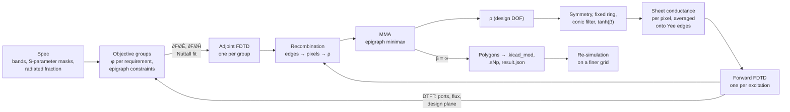

# Design: RF microstrip inverse design by topology optimization

Status: **proposal** for [issue #29](https://github.com/Studio-Fug/yapnr/issues/29), 2026-10-01.
Nothing is implemented yet. Numbers marked "est." are planning estimates; the implementation
replaces them with measurements and records them in `docs/rf-inverse-design.md`.

## 1. Goals

The owner asked for microstrip copper geometry that realizes specified transfer functions,
generated in full by the method of Hammond et al. [1] (density-based topology optimization driven
by a hybrid time/frequency-domain adjoint method, the method of Meep's adjoint package), adapted
from photonics to RF microstrip, with test cases for power combiners, antennas and filter banks.
The request says "finite element method"; the paper's solver is FDTD with frequency-domain adjoint
gradients, and this design follows the paper.

What we build:

1. **`yapnr.rf`**, a pure-Python package (numpy reference backend, optional torch backend):
   - a 3D Yee FDTD solver for microstrip: graded axes, CPML, a PEC ground plane, a dielectric
     substrate, a zero-thickness copper sheet whose conductance is the design variable, line ports
     and lumped resistors, S-parameters, Poynting flux and DTFT field monitors;
   - the adjoint: filter-designed broadband adjoint sources and the gradient recombination onto
     the design grid;
   - the design parameterization: material grid, fixed regions, mirror symmetry, conic filter,
     tanh projection with β continuation, minimum width and space constraints;
   - an epigraph minimax optimizer (MMA);
   - specs written as transfer-function targets (|S_ij| masks per band, phases, radiated
     fraction);
   - export: polygons, a KiCad footprint, Touchstone, a result JSON with provenance, an animation.
2. **Tests:** fast unit tests in CI (`tests/unit/rf/`) and slow end-to-end design cases
   (`tests/e2e/rf/`, manual): a power divider, a patch-class antenna and a diplexer, each
   re-validated on a finer grid from the exported footprint.

Requirements:

- No new runtime dependency: numpy and torch are in the lock; PyYAML reads spec files; Pillow
  (tooling only) renders animations.
- Deterministic for the same inputs, backend, dtype and thread count.
- Every run is time-bounded, uses at most 4 threads and runs niced on shared machines.
- AGPL-3.0-or-later. No third-party code is copied: Meep (GPL-2.0-or-later) and Svanberg's MMA
  codes (GPL) are references for method only.

Non-goals for v1: more than one copper layer, vias and grounded stubs; finite ground planes and
board-edge effects (the ground and substrate are infinite); far-field patterns (the near-to-far
transform of [1] §4.2 is future work); frequency-dependent skin effect and roughness; active or
nonlinear parts; connectivity constraints; MPI or GPU.

## 2. Summary



| Topic                  | Choice                                                                                                                                   | Reason                                                                                                                                                                                                                                                                                                                                                                                                                                                            |
| ---------------------- | ---------------------------------------------------------------------------------------------------------------------------------------- | ----------------------------------------------------------------------------------------------------------------------------------------------------------------------------------------------------------------------------------------------------------------------------------------------------------------------------------------------------------------------------------------------------------------------------------------------------------------- |
| Solver                 | own 3D Yee FDTD; numpy reference, torch fast path                                                                                        | Meep has no lumped ports, its MPB eigenmode ports do not model metal microstrip, and it is conda-only; openEMS is an external GPL program without an adjoint. We need the exact discrete adjoint of the solver we step.                                                                                                                                                                                                                                           |
| Conductivity update    | Crank–Nicolson (semi-implicit) on every lossy edge                                                                                       | unconditionally stable for any σ ≥ 0; its DTFT is exactly σ·cos(ωΔt/2), which makes the discrete adjoint exact (§4.6)                                                                                                                                                                                                                                                                                                                                             |
| Ports                  | **line port**: the feed runs into the CPML, a soft source launches it, V/I wave separation, reference plane shifted to the design region | **Deviation from the lead's resistive lumped port.** A resistive termination has its own mismatch (est. −25 dB at 10 GHz for these lines) whose de-embedding needs N excitations per iteration. A CPML-terminated feed is matched (est. −40 dB) and de-embeds by a reference-plane shift with one excitation per objective group. It is the RF analogue of the paper's eigenmode ports. Resistive lumped ports stay, as an option and for lumped elements (§5.5). |
| Copper                 | zero-thickness sheet on the tangential E edges of the plane z = h; sheet conductance per pixel, log-interpolated, averaged onto edges    | log G spreads the transparent-lossy-metallic transition over ρ̄ ∈ [0, 1]; averaging conductance (not density) onto edges is the parallel-conduction rule and leaves no lossy rim around binary metal (§7.4)                                                                                                                                                                                                                                                        |
| Damping (paper Eq. 11) | implemented as ρ̄(1−ρ̄)·G_d, default off                                                                                                   | only conductance is interpolated (no ε), so there are no permittivity zero crossings; gray copper is already lossy                                                                                                                                                                                                                                                                                                                                                |
| Gradient               | exact adjoint of the DTFT of the discrete scheme                                                                                         | finite-difference checks to 1e-5 instead of the paper's mixed scheme (its App. A)                                                                                                                                                                                                                                                                                                                                                                                 |
| Adjoint sources        | Nuttall-basis fit (paper §5.2), solved exactly for a real-valued source                                                                  | short, band-limited adjoint runs; gradients at every frequency from one run                                                                                                                                                                                                                                                                                                                                                                                       |
| Parameterization       | 2D material grid at the Yee pitch; fixed exterior ring; mirror symmetry on the DOF; conic filter; tanh projection, β 8 → 128             | as in the paper; symmetry on the DOF keeps the design binary                                                                                                                                                                                                                                                                                                                                                                                                      |
| Min width and space    | Zhou indicator constraints in the last β epoch, plus a raster check of the exported polygons                                             | as in the paper (§3.1, [16], [23])                                                                                                                                                                                                                                                                                                                                                                                                                                |
| Optimizer              | own MMA [19, 21] in its native min-max form                                                                                              | the reference codes are GPL and NLopt is not in the lock; MMA is about 300 lines                                                                                                                                                                                                                                                                                                                                                                                  |
| Specs                  | normalized violations per requirement; a smooth max per excitation group and frequency; epigraph                                         | one forward and one adjoint run per group per iteration                                                                                                                                                                                                                                                                                                                                                                                                           |
| Export                 | pixel boundaries of the binary copper → keyholed polygons → a net-tie `.kicad_mod`; Touchstone; JSON                                     | KiCad net ties let one copper shape connect differently named port nets                                                                                                                                                                                                                                                                                                                                                                                           |

Cost per iteration: one forward run per excitation and one adjoint run per objective group. The
three cases need two FDTD runs per iteration (the Wilkinson variant four), est. 12–45 s per
iteration on 4 threads (§11.1).

## 3. From the paper to microstrip

| Paper [1]                                                                    | Here                                                                                                  |
| ---------------------------------------------------------------------------- | ----------------------------------------------------------------------------------------------------- |
| Meep FDTD, uniform grid, subpixel smoothing                                  | own FDTD, graded axes, conductance averaging onto edges                                               |
| eigenmode sources and mode-overlap coefficients (Eq. 14–16)                  | line port: soft current sheet; modal V and I; a, b = (V ± Z_c I)/(2√R_c)                              |
| ε(ρ̄) linear (Eq. 5); conductivity interpolation (Eq. 9); damping (Eq. 11–12) | sheet conductance log-interpolated per pixel (§7.4); optional damping ρ̄(1−ρ̄)G_d                       |
| material grid interpolated onto the Yee grid, restriction (§3)               | 2D material grid on the copper plane; edge averaging and its transpose                                |
| conic filter, tanh projection (Eq. 3–4), β continuation                      | same                                                                                                  |
| length-scale constraints in the last epoch (§3.1)                            | same, plus a raster check on export                                                                   |
| epigraph minimax (Eq. 2) with NLopt's CCSA/MMA                               | MMA's own z variable as the epigraph variable                                                         |
| DMs: mode coefficients, Poynting flux, near-to-far, DFT fields (§4)          | port waves (S-parameters), Poynting flux through a box, design-plane DFT fields; near-to-far deferred |
| Nuttall filter-design adjoint sources (§5.2, Eq. 20–24)                      | same, with the half-step time phase and an exact real-valued fit                                      |
| App. A: ω̂ correction, differentiate-then-discretize                          | exact discrete operator: Ω = (2/Δt)·sin(ωΔt/2), σ·cos(ωΔt/2); adjoint-source scale 1/(iΩV)            |
| DTFT decimation, single-precision DFTs (§5.1)                                | decimation from the source bands; float32 fields in large runs, complex128 accumulators               |
| MPI spatial and simulation parallelism (§5.1, §5.3)                          | none; torch intra-op threads (at most 4); frequency parallelism as in §5.2                            |
| JAX automatic differentiation of objectives and filters                      | torch autograd (CPU, float64)                                                                         |

## 4. Physical model and discretization

### 4.1 Geometry and units

SI units inside the package; spec files use mm and GHz. x and y lie in the board plane, z points up.
A PEC ground plane covers z = 0 over the whole domain, including the CPML. The substrate fills
0 < z < h with uniform εr and tanδ and extends through the lateral CPML. The copper is a
zero-thickness sheet in the plane z = h, with air above. The domain is truncated in x, y and at
the top by CPML backed by PEC.

Stackups for the cases (RO4003C-like, design Dk):

| Id  | εr   | tanδ   | h (mm) | Used by           |
| --- | ---- | ------ | ------ | ----------------- |
| S1  | 3.55 | 0.0027 | 0.813  | divider, diplexer |
| S2  | 3.55 | 0.0027 | 1.524  | antenna           |

### 4.2 Yee grid on graded axes

Each axis is a strictly increasing node list, for example `x_0 < … < x_Nx`. Primary lengths are
`Δx_{i+½} = x_{i+1} − x_i`; dual lengths are `Δx_i = (Δx_{i−½} + Δx_{i+½})/2` (a half length at
the ends). Fields sit at the usual places:

| Component | Location              | Component | Location                  |
| --------- | --------------------- | --------- | ------------------------- |
| Ex        | `(x_{i+½}, y_j, z_k)` | Hx        | `(x_i, y_{j+½}, z_{k+½})` |
| Ey        | `(x_i, y_{j+½}, z_k)` | Hy        | `(x_{i+½}, y_j, z_{k+½})` |
| Ez        | `(x_i, y_j, z_{k+½})` | Hz        | `(x_{i+½}, y_{j+½}, z_k)` |

Meshing rules:

- In-plane pitch Δ is uniform over the design region, the feeds and the port monitors. Outside
  them the axes may grade outward with a ratio of at most 1.25 between neighbours, up to
  Δ_max ≤ λ_min/15 in air.
- z: `n_sub` uniform cells in the substrate; the copper plane is the node plane `k_c` with
  `z_{k_c} = h`; the first air cell equals the substrate cell, then grows by at most 1.25 per
  cell up to `Δz_max`.
- CPML cells are uniform and equal to the last interior cell on that side.

The curls use primary lengths for E → H and dual lengths for H → E, for example:

```text
(∂Hz/∂y)|Ex(i+½,j,k) = [Hz(i+½,j+½,k) − Hz(i+½,j−½,k)] / Δy_j          (dual length)
(∂Ex/∂y)|Hz(i+½,j+½,k) = [Ex(i+½,j+1,k) − Ex(i+½,j,k)] / Δy_{j+½}      (primary length)
```

In matrix form, with D the face-edge incidence matrix of the primary grid, L_p and A_p the primary
edge lengths and face areas, and L_d and A_d the dual ones (diagonal):

```text
C_E = A_p⁻¹ D L_p        (E → H)          C_H = A_d⁻¹ Dᵀ L_d        (H → E)
V_e = A_d,e L_p,e        (dual volume of E edge e)
V_h = A_p,h L_d,h        (dual volume of H edge h)
```

The scheme is second-order on smoothly graded axes and first-order where the grading changes
abruptly; the 1.25 limit keeps the error well below the geometric errors of §11.

### 4.3 Materials per edge

- **Ez edges** lie inside one layer (the interface is a node plane): ε_sub below h, ε0 above.
- **Ex, Ey edges** below h: the substrate permittivity; above: ε0; on the plane `k_c`
  (tangential to the interface):
  `ε = (ε_sub Δz_{k_c−½} + ε0 Δz_{k_c+½}) / (Δz_{k_c−½} + Δz_{k_c+½})`, and the
  substrate conductivity is weighted the same way.
- **Dielectric loss:** a constant σ_sub = 2π f_c ε0 εr tanδ matched at the band centre f_c
  (5.3e-3 S/m for S1 at 10 GHz). Away from f_c the loss tangent scales as f_c/f; this is
  negligible for these laminates.
- **Ground:** Ex and Ey at k = 0 are held at zero.
- **Copper sheet:** Ex and Ey edges on k_c get σ_e = G_e / Δz_d(k_c), where G_e is the sheet
  conductance of the edge in siemens and Δz_d(k_c) the dual height. The sheet current is G_e·E.
  Fixed copper (feeds, pads): G_e = G_max. No copper outside the design region: G_e = 0. Design
  region: §7.4.
- **G_max = 1/R_s(f_c)** with R_s = √(π f_c μ0 / σ_Cu) and σ_Cu = 5.8e7 S/m: R_s(10 GHz) = 26.1 mΩ,
  G_max = 38.3 S, G_max·η0 = 1.44e4. This models the conductor loss of smooth copper at the band
  centre; the 35 µm thickness and the 0.66 µm skin depth are not resolved. The ground is lossless.
- **Lumped resistor** R across a gap of n edges in series and m in parallel (edge length L_e, dual
  area A_e): σ_e = n L_e / (m R A_e).

### 4.4 Update equations

Leapfrog Yee steps with a Crank–Nicolson conductivity term on every edge (σ = 0 on most of them):

```text
H^{n+½} = H^{n−½} − (Δt/μ) (C_E E^n + K^n)
ε (E^{n+1} − E^n)/Δt + σ (E^{n+1} + E^n)/2 = C_H H^{n+½} − J^{n+½}

E^{n+1} = Ca E^n + Cb (C_H H^{n+½} − J^{n+½})
Ca = (1 − a)/(1 + a),   Cb = (Δt/ε)/(1 + a),   a = σΔt/(2ε)
```

The explicit form (σE^n) is unstable for σΔt/ε > 2, which every copper edge exceeds (a ≈ 2e3 at
G_max on S1); the semi-implicit form is stable for any σ ≥ 0. Its slow (−1)^n mode on copper edges
(Ca ≈ −0.999) sits at the Nyquist frequency, outside every band, and the stop rule ignores it.
The exponential update (Ca = e^{−σΔt/ε}) is the fallback if that mode ever matters; its discrete
adjoint is equally exact, with a different ∂A/∂σ.

**CPML** (Roden and Gedney [3]): in a PML slab normal to u, ∂_u → (1/κ_u) ∂_u + ψ_u with

```text
ψ_u^n = b_u ψ_u^{n−1} + c_u (∂_u F)^n
b_u = exp(−(σ_u/κ_u + α_u) Δt/ε0),   c_u = σ_u (b_u − 1) / (κ_u (σ_u + κ_u α_u))
σ_u(s) = σ_max (s/d)³,   κ_u(s) = 1 + (κ_max − 1)(s/d)³,   α_u(s) = α_max (1 − s/d)
σ_max = 0.8·4/(η0 Δ_u),   κ_max = 5,   α_max = 2π ε0 (f_lo/2)
```

s is the depth into a PML of thickness d: 10 cells laterally, 8 on top. ψ arrays exist only in
the slabs. The ground, the substrate and the feed strips continue through the PML.

### 4.5 Sources

- **Forward:** a soft electric current on the source edges of the excited port (§5.1),
  `J(t) = sin(ω_c (t − t0)) · exp(−((t − t0)/τ)²)`, with τ = 3.03/Δω_h so that the spectrum is
  −20 dB at ω_c ± Δω_h, and t0 = 5τ. The band covered is the union of the requirement bands plus
  15 % on each side, and at least ±20 % of ω_c. DC content is below −150 dB for the cases, so no
  static charge is left behind.
- **Adjoint:** electric currents J and magnetic currents K on the monitor edges (§6.5).

### 4.6 DTFT conventions and the exact discrete frequency-domain system

E, K are sampled at integer steps and H, J at half steps, so their DTFTs carry the matching phase
(time dependence e^{−iωt}, as in [1]):

```text
Ê(ω) = Δt Σ_n E^n e^{iωnΔt}             K̂ likewise
Ĥ(ω) = Δt Σ_n H^{n+½} e^{iω(n+½)Δt}     Ĵ likewise
```

If the run starts from zero and has decayed, the DTFT of the update equations is exactly

```text
(−iΩ ε + c_ω σ) Ê = C_H Ĥ − Ĵ
−iΩ μ Ĥ = −C_E Ê − K̂
Ω = (2/Δt) sin(ωΔt/2),   c_ω = cos(ωΔt/2)
```

that is, Maxwell's equations at the numerical frequency Ω with conductivity σ·c_ω. This replaces
the one-sided ω̂ of [1] App. A (Eq. 30) and is what makes the gradient exact (§6). The CPML
recursion also has an exact DTFT: a stretch 1/s_u(ω) on each derivative that depends only on the
position along u.

**Decimation** ([1] §5.1): accumulators update every d steps with
d = max(1, ⌊1/(2.5 f_top Δt)⌋), where f_top is the highest frequency at which any source spectrum
exceeds −100 dB of its peak. Gradient and convention tests use d = 1; a unit test bounds the
difference between d > 1 and d = 1.

### 4.7 Stability and precision

- **Time step on the graded grid:** Δt = 0.95 · min(Δt_pi, Δt_cfl), where
  Δt_pi = 2/√(1.01 λ_est) and λ_est is the power-iteration estimate (converged to 1e-6, at most
  500 iterations, deterministic start) of the largest eigenvalue of ε⁻¹ C_H μ⁻¹ C_E, and
  Δt_cfl = 1/(c √(1/Δx_min² + 1/Δy_min² + 1/Δz_min²)). The power-iteration value approaches
  λ_max from below, hence the 1.01 factor and the minimum with the closed-form bound. Lossy
  edges (Crank–Nicolson) and the CPML (κ ≥ 1) do not lower the limit.
- **Precision:** fields are float32 in the optimization runs and float64 in the unit tests. DTFT
  accumulators and adjoint source weights are complex128 in both.

### 4.8 Run length and stopping

After the last source has ended (the forward pulse at 2t0, an adjoint source after N steps),
every K = ⌈1/(f_lo Δt)⌉ steps the run compares every monitored
DTFT value (port V and I, flux faces) with its value K steps earlier and stops after two
consecutive checks with max |ΔX| / max |X| < tol. tol is 1e-3 in optimization runs, 1e-4 in
validation runs and 1e-11 in float64 gradient tests. A hard cap (twice the case estimate) ends a
run that does not converge, records it in the result, and fails the e2e test.

## 5. Ports and S-parameters

### 5.1 Line port

A port is a feed strip of width w along the inward normal n̂ from the domain edge, through the
CPML, to the boundary of the design region, which is the port's reference plane. Along −n̂ from the
reference plane:

| Item                  | Distance from the reference plane | S1 at Δ = 0.3 mm  |
| --------------------- | --------------------------------- | ----------------- |
| V/I measurement plane | d_m ≥ 3h                          | 9 cells (2.7 mm)  |
| source plane          | d_s ≥ d_m + 3h                    | 17 cells (5.1 mm) |
| CPML inner face       | ≥ d_s + 3 cells                   | 20 cells (6.0 mm) |

The source is a uniform soft J_z on every Ez edge of the source plane under the strip (all nodes
y_a ≤ y_j ≤ y_b of the strip, all substrate layers). The backward wave it launches is absorbed by
the CPML; waves reflected by the design pass through the soft source and are absorbed too. Inside
the design region, a fixed pad (the feed width, 2 pixels deep) keeps the connection.

### 5.2 V and I with the Yee staggering

For a feed along +x with strip nodes j_a … j_b on the copper plane k_c:

```text
V̂(x_i) = − Σ_{k<k_c} Êz(i, j_c, k+½) Δz_{k+½}                (j_c: centre node; mean of the
                                                                two central nodes if none)
Î(x_{i+½}) = Σ_{j=j_a..j_b} [Ĥy(i+½, j, k_c−½) − Ĥy(i+½, j, k_c+½)] Δy_j
           + [Ĥz(i+½, j_b+½, k_c) − Ĥz(i+½, j_a−½, k_c)] Δz_{k_c}
V̂_m = ½ [V̂(x_i) + V̂(x_{i+1})]                                 (co-located with Î)
```

The loop is the dual-cell ring around the strip at `x_{i+½}`; by the discrete Ampère law it equals
the total current on the strip's Ex edges there. V is the strip potential over ground and I flows
along +n̂, into the design; a unit test pins both signs. Ports may sit on any domain edge; the
formulas permute the axes. The half-step time offset between V and I is absorbed by the DTFT
phases of §4.6.

### 5.3 Calibration: Z_c, k and the feed width

Per (stackup, Δ, n_sub, w), one run of a straight feed through the domain with CPML at both ends,
the source near one end and two V/I planes L_c ≈ λ_g/8 apart, gives

```text
Z_c(ω) = V̂_m / Î                      (a pure forward wave at plane 1)
k(ω)  = ln(V̂_2 / V̂_1) / (i L_c)        (complex wavenumber, unwrapped from the quasi-static k)
```

k carries the forward propagation factor e^{ikx}. The feed width is the integer number of cells
whose Z_c(f_c) is closest to 50 Ω (est. within ±3 %). Results are cached as JSON keyed by the
sha256 of the inputs. The same runs are the Z0 and ε_eff unit tests (§12).

### 5.4 Waves, S-parameters and de-embedding

```text
a = (V̂_m + Z_c Î)/(2√R_c),   b = (V̂_m − Z_c Î)/(2√R_c),   R_c = Re Z_c
a_ref = a e^{+ik d_m},       b_ref = b e^{−ik d_m}
S_ij = b_ref,i / a_ref,j     (only port j excited)
P_inc = |a_ref|²/2
```

For real Z_c, ½(|a|² − |b|²) = ½ Re(V̂ conj(Î)) is the net power; Im Z_c is under 1 % here (est.). The
shift removes the feed between the measurement plane and the design region, so the reported
S-parameters are those of the footprint between its pads; the source and its near field are
behind the measurement plane. Internally the time convention is e^{−iωt} (as in [1] and Meep);
everything reported (Touchstone, JSON, phase targets in specs) uses the engineering e^{+jωt}
convention, which is the complex conjugate. Each port's S-parameters are referenced to its own Z_c
(pseudo-waves [7]). The optimization uses them as they are: |Z_c − 50|/(Z_c + 50) ≤ 0.015 keeps
the reference error below −36 dB. Validation, which runs every excitation, renormalizes to 50 Ω
through the impedance matrix, Z = √Z_c (I + S)(I − S)⁻¹ √Z_c and S' = (Z − 50)(Z + 50)⁻¹, and
checks this against a line terminated in known loads.

### 5.5 Lumped resistive ports and elements

Kept for elements and as a fallback port: a resistive voltage source (Luebbers [5], Piket-May
[6]) on a column of edges with internal resistance R, using the edge conductance of §4.3 plus a
source term. Then a = V̂_s/(2√R), b = (2V̂ − V̂_s)/(2√R), with V̂ the port voltage and the reference
plane at the port. A source-free resistor is the isolation resistor of the Wilkinson variant
(§11.2). Lumped ports are not used by the case ports (§2).

### 5.6 Radiated power

A box surface B in air encloses the design region: the top face and the four side faces from
z = h upward. On the face crossed by the feed, a window |y − y_p| ≤ w/2 + 2h, z ≤ 3h is left out,
so the guided power of the feed is not counted; a unit test bounds what it still sees (§12). On
each face the tangential E samples pair with the tangential H averaged over the two H planes on
either side of the face (normal averaging), for example on a z face:

```text
P_B = ½ Re Σ_face [ Êx·conj(avg_z Ĥy) − Êy·conj(avg_z Ĥx) ] dA      (outward normal +z)
η_rad = P_B / P_inc
```

Power carried by surface waves in the substrate does not reach B and counts as lost, which is
conservative for a finite board. A near-to-far transform for pattern targets is future work.

**Superseded (§25):** the window and the open bottom made this box drop 3–7 % of the input
power and count part of the guided wave; on S2 the TM0 surface wave carries 95 % of its power in
the air, so the box counts it as radiation rather than as lost. The box is now closed by the
ground, without windows, and the feeds' guided waves are separated modally (§25.2); pattern
targets need a finite board (§26).

### 5.7 Dissipation and power balance

```text
P_diss = ½ Σ_e c_ω σ_e |Ê_e|² V_e
```

The discrete Poynting theorem then holds face by face. For a closed box (side faces down to the
ground, including the substrate), P_out + P_diss(inside) equals the power entering through the
feed; this, and the equality of port-wave power and the Poynting flux through the feed
cross-section, are unit tests (§12).

## 6. Adjoint method

### 6.1 The discrete operator and its transpose

Eliminating Ĥ from §4.6:

```text
A(ρ) Ê = b,     A = C_H μ⁻¹ C_E − Ω² ε − iΩ c_ω σ(ρ),     b = iΩ Ĵ − C_H μ⁻¹ K̂
```

With W = diag(V_e), W·A is complex symmetric: W C_H μ⁻¹ C_E = L_p Dᵀ (L_d μ⁻¹ A_p⁻¹) D L_p, and ε,
σ are diagonal. The CPML's coordinate stretch makes P·A symmetric for a diagonal P that equals W
outside the PML (Shin and Fan [11]). Sources, monitors and design edges are all outside the PML,
so solving Aᵀλ = g needs only an ordinary FDTD run: λ = P A⁻¹ P⁻¹ g equals W·A⁻¹(W⁻¹g) on those
edges. If the gradient test shows an error that grows with the PML strength, the fallback is a
transposed CPML recursion in the adjoint stepper (§14).

### 6.2 Gradient

Let F be a real function of DMs (complex linear functionals of Ê and Ĥ at the objective
frequencies ω_m). With Wirtinger derivatives g_E = ∂F/∂Ê and g_H = ∂F/∂Ĥ (holding the conjugates
fixed, so dF = 2 Re(g_E dÊ + g_H dĤ)):

```text
adjoint sources:  Ĵ^adj_e(ω_m) =  g_E,e(ω_m) / (iΩ_m V_e)
                  K̂^adj_h(ω_m) = −g_H,h(ω_m) / (iΩ_m V_h)
gradient:         ∂F/∂σ_e = Σ_m 2 Re[ iΩ_m c_m V_e Ê^adj_e(ω_m) Ê_e(ω_m) ]
in conductance:   ∂F/∂G_e = Σ_m 2 Re[ iΩ_m c_m ℓ_e b_e Ê^adj_e(ω_m) Ê_e(ω_m) ]
```

`Ê^adj` is the DTFT of the adjoint run's E field, `ℓ_e` the edge length, `b_e` its dual width
(`V_e/Δz_d = ℓ_e b_e`, independent of resolution), and `c_m = cos(ω_m Δt/2)`. Derivation:

```text
dF/dp = −2 Re[λᵀ (∂A/∂p) Ê],   Aᵀλ = (g_E + g_H μ⁻¹ C_E/(iΩ))ᵀ,   ∂A/∂σ_e = −iΩ c_ω (diagonal)
λ = W Ê^adj;   W⁻¹ C_Eᵀ = A_d⁻¹ Dᵀ A_p⁻¹ turns the H-dependence into the magnetic current K̂^adj
one-edge check: (−iΩε + c_ω σ) E = −J, F = |E|²  →  ∂F/∂σ = 2 Re[iΩ c_ω |E|²/A], as derived directly
```

**Automatic differentiation:** the DMs → F layer is written in torch (complex128). For a real F,
torch returns grad = 2·conj(∂F/∂q), so ∂F/∂q = conj(grad)/2. A unit test pins this with F = |q|².

### 6.3 DMs and their adjoint sources

| DM                      | Functional                            | Adjoint source                                                                                                                     |
| ----------------------- | ------------------------------------- | ---------------------------------------------------------------------------------------------------------------------------------- |
| port voltage V̂_m        | weights −½Δz on two Ez columns (§5.2) | J on those Ez edges                                                                                                                |
| port current Î          | ±Δy, ±Δz on the H ring                | K on the ring edges                                                                                                                |
| port waves, S_ij, phase | functions of V̂, Î, Z_c, k (§5.4)      | J + K with ratio set by Z_c: a directional source launching into the design, the analogue of the paper's reversed eigenmode source |
| flux P_B                | sesquilinear in tangential Ê, Ĥ on B  | J and K on B (equivalent surface currents)                                                                                         |
| design-plane field      | Ê on design edges                     | J on those edges                                                                                                                   |

Example, F = |S21|² at ω_m with port 1 excited: ∂F/∂S21 = conj(S21); ∂S21/∂b2 = 1/a1 and
∂S21/∂a1 = −S21/a1; ∂b2/∂V̂_2 = e^{−ikd}/(2√R_c) and ∂b2/∂Î_2 = −Z_c e^{−ikd}/(2√R_c), and for
a1 the same with e^{+ikd} and +Z_c. A phase target uses F = 1 − Re(S21 e^{−iθ0})/|S21|. The
radiated fraction is η = P_B/P_inc, with P_inc from a_ref,1. Normalizing by the measured a from
the same run makes every ratio independent of the source amplitude; the chain rule through a is
kept, because a depends weakly on the design through residual CPML reflection.

### 6.4 Frequency parallelism and objective groups

DTFTs at different frequencies do not mix, so one adjoint run whose source carries the spectral
values `g(ω_m)/(iΩ_m V)` for every m yields `Ê^adj(ω_m)` for each m, and with it the gradient of
each per-frequency function `F(ω_m)` separately ([1] §5.2). Different functions at the same
frequency superpose, so each needs its own adjoint run. An **objective group** is therefore a set
of requirements sharing one excitation, aggregated per frequency into one function `f_{g,m}`
(§9); each iteration costs one forward run per excitation and one adjoint run per group, and
yields all `f_{g,m}` with their gradients.

### 6.5 Time-domain adjoint sources (Nuttall fit)

Per [1] Eq. 20–24, with the window length N = ⌈2π/(Δω_min Δt)⌉, Δω_min being the smallest spacing
between objective frequencies:

```text
w[n] = Σ_{q=0..3} a_q (−1)^q cos(2π q n / N),  0 ≤ n ≤ N
a = (0.355768, 0.487396, 0.144232, 0.012604)
W_m[n] = w[n] · e^{−iω_m t_n}     t_n = (n+½)Δt for J (half steps), nΔt for K
s[n] = 2 Re Σ_m β_m W_m[n]         (the real source sequence at one edge)
```

The DTFT of s at ω_k is `Σ_m (β_m Ŵ_km + conj(β_m) Ŵ'_km)`, where `Ŵ_km` is the DTFT of `W_m`
at ω_k and `Ŵ'_km` that of `conj(W_m)` (the negative-frequency image). Both M×M matrices are
computed numerically with the same phase convention as the monitor (half-step or integer).
Setting the DTFT equal to the requested values at all ω_k is a real-linear 2M×2M system in
(Re β, Im β), solved once per group and applied to every source edge. The fit is exact at the
ω_m, so no approximation is made for the image term. If the condition number exceeds 1e6, N
doubles. Out-of-band content follows the Nuttall sidelobes (−93 dB). The adjoint run lasts N steps
plus decay (§4.8).

### 6.6 Recombination onto the design

```text
∂F/∂σ_e (§6.2) → ∂F/∂G_e = ∂F/∂σ_e / Δz_d
→ ∂F/∂ρ̄_p = G'(ρ̄_p) Σ_e w_ep ∂F/∂G_e        (restriction: transpose of the edge averaging)
→ projection, filter, symmetry, fixed ring    (torch vector-Jacobian products)
→ ∂f_{g,m}/∂ρ for every group g and frequency m
G'(ρ̄) = ln(G_max/G_min) G_min (G_max/G_min)^ρ̄ + G_d (1 − 2ρ̄)
```

The forward and adjoint runs store Ê of every design edge at every ω_m (Ex and Ey on k_c,
complex128; est. 2 MB for the diplexer).

### 6.7 Verification hooks

- The discrete frequency-domain residual of §4.6, evaluated with run DTFTs, is below 1e-10
  (float64): this pins every phase and staggering convention.
- Directional finite differences of the full pipeline (ρ → F) agree with the adjoint to 1e-5
  relative, for each DM type, per frequency, with the damping term on and off.
- These are unit tests (§12) on grids of about 1e4 cells.

## 7. Design parameterization

### 7.1 Material grid, fixed regions and symmetry

The design grid is 2D on the copper plane with pitch `Δ_d = Δ`: pixel (p, q) is the Yee face
`[x_p, x_{p+1}] × [y_q, y_{q+1}]` of the design region. An **exterior ring** of
r = ⌈R/Δ_d⌉ + 1 pixels around the design region holds fixed values (1 on feeds, 0 elsewhere), so
the filter sees the feeds entering the region instead of edge-replicated values (Meep pads by edge
replication). **Fixed regions** inside the design region (port pads, keepouts, element pads) have
MMA bounds lb = ub, are excluded from the DOF, and are re-imposed after projection. **Mirror
symmetry** is imposed on the DOF before filtering: ρ_sym = ½(ρ + mirror(ρ)), or half the DOF, with
the gradient symmetrized the same way. The paper averages mirrored material grids at the material
level instead; doing it on the DOF keeps the design binary.

### 7.2 Conic filter

```text
ρ̃ = w * ρ_ext,    w(r) ∝ max(0, 1 − r/R),    Σ w = 1
```

Applied to the extended grid with torch `conv2d` (float64); the transpose comes from autograd.

### 7.3 Projection and β schedule

```text
ρ̄ = [tanh(βη) + tanh(β(ρ̃ − η))] / [tanh(βη) + tanh(β(1 − η))],   η = 0.5
```

β runs through epochs 8, 16, 32, 64, 128; the length-scale constraints are active in the last
epoch, as in [1] §4.1 and [23]. After the schedule, β = ∞ (Heaviside) gives the binary design that
is exported and re-simulated. Each epoch ends at its iteration cap (per case, §11) or once at
least 8 iterations are done and `|t_k − t_{k−5}| < 1e-3 (1 + |t_k|)` with `max |Δρ| < 0.01`.
MMA's state resets at each β change.

### 7.4 Conductance interpolation and its pitfalls

```text
G_p(ρ̄) = G_min (G_max/G_min)^ρ̄  +  G_d ρ̄ (1 − ρ̄)        per pixel
G_min = 1/(η0² G_max)                                      (log-symmetric about G = 1/η0)
G_e   = Σ_p w_ep G_p                                        per edge (½, ½ for the two pixels
                                                             that share the edge)
```

With S1 numbers, log10(G η0) runs from −4.16 at ρ̄ = 0 (a transparent 5 MΩ/sq sheet) through 0 at
ρ̄ = 0.5 (377 Ω/sq, strongly lossy) to +4.16 at ρ̄ = 1 (copper). Choices and pitfalls:

- **Linear σ interpolation** (the paper's Eq. 9 as written) saturates: the response depends on
  log G, so every ρ̄ above about 1e-4 already looks like metal and the gradient vanishes over most
  of [0, 1]. The microwave topology-optimization literature [12–15] discusses this strongly
  nonlinear response; log interpolation spreads the transition over ρ̄ ∈ [0.3, 0.75].
- **Order of interpolation and material function.** Meep interpolates ρ̄ onto the Yee grid and
  then applies the material function; for linear ε the order is immaterial. For conductance it is
  not: averaging ρ̄ onto an edge between a copper and a void pixel gives ρ̄_e = 0.5, a 377 Ω/sq rim
  around every binary shape. A tangential edge whose dual face is half covered by copper conducts
  like half the copper (conductances in parallel add), so we apply G(ρ̄) per pixel and average
  conductance onto edges: boundary edges get G_max/2, which is metal. This matches the PEC
  rasterization rule used in validation (an edge on a copper boundary is copper).
- **Gray copper is lossy**, and loss can fake reflection specs (a resistive sheet is a good
  match). Every spec that absorption could satisfy is paired with a power-delivery spec: the
  divider's and diplexer's transmissions, the antenna's radiated fraction. β continuation and the
  final Heaviside step remove gray material; the binarized design is always re-simulated.
- **Damping** ([1] Eq. 11) exists to suppress spurious resonances at ε zero crossings of
  dispersive interpolation. Only conductance is interpolated here and ε is fixed, so there are no
  zero crossings. The term is kept as G_d ρ̄(1−ρ̄) (default G_d = 0) to make gray material lossier
  if a design stalls gray; its gradient is tested.
- **Stiffness:** copper edges have σΔt/ε ≈ 4e3; the semi-implicit update is stable (§4.4).
- **Edge singularity of a zero-thickness strip:** under-resolved; it makes Z0 and ε_eff depend on
  resolution (§12 tolerances) and is the main source of coarse-to-fine differences (§14).

### 7.5 Minimum width and space

Zhou et al. [16], as in [1] §3.1, [23] and Meep's filters, on the extended grid with physical
gradients:

```text
I_s = ρ̄ exp(−c |∇ρ̃|²),   g_s = mean_p[ I_s · min(ρ̃ − η_e, 0)² ]
I_v = (1 − ρ̄) exp(−c |∇ρ̃|²),   g_v = mean_p[ I_v · min(η_d − ρ̃, 0)² ]
constraints:  g_s/ε − 1 ≤ 0,   g_v/ε − 1 ≤ 0
```

With η_e = 0.75 the conic radius for a minimum length b is R = b/(2 − 2√(1 − η_e)) = b
(Qian and Sigmund [18]); η_d = 1 − η_e. Different minimum width and space use one R (the larger)
and derive η_e and η_d from each. At a feature edge |∇ρ̃|² ≈ 1/(4R²), so c = 64 R² makes the
exponent about −16 there. ε = 1e-6 by default. Unit tests calibrate c and ε: a line of width b
passes, a line of width b/2 fails by at least 10ε, and the same for gaps. The exported polygons are
checked again (§10.2).

### 7.6 Binarization

The result records M_nd = 4/n Σ ρ̄(1 − ρ̄) per iteration and requires M_nd ≤ 0.01 before the
Heaviside step; otherwise it says so, and the e2e tests fail.

## 8. Optimization

### 8.1 Epigraph minimax

```text
min_{ρ, t}  t
s.t.  f_{g,m}(ρ) ≤ t          every group g, objective frequency m
      g_k(ρ) ≤ 0              length-scale constraints (last epoch)
      0 ≤ ρ ≤ 1;  fixed DOF: lb = ub
```

t ≤ 0 means every requirement meets its target; the optimizer keeps pushing t down for margin.

### 8.2 MMA

Svanberg's MMA [19, 21] in its general form:

```text
min  f_0(x) + a_0 z + Σ_i (c_i y_i + ½ d_i y_i²)
s.t. f_i(x) − a_i z − y_i ≤ 0,   x_min ≤ x ≤ x_max,   y ≥ 0,   z ≥ 0
```

The epigraph is native: `f_0 = 0`, `a_0 = 1`, `a_i = 1` for the `f_{g,m}` (shifted by C = 10 so
that z ≥ 0; t = z − C), a_i = 0 for g_k, c_i = 1e3, d_i = 1. Parameters: asyinit 0.5, asyincr 1.2,
asydecr 0.7, albefa 0.1, raa0 1e-5, move 0.2 (0.1 from β = 32). The subproblem is solved with the
primal-dual interior-point method of [21] (ε from 1 down to 1e-7). It is written from the
publications; GCMMA's inner iterations (extra FDTD runs) are a fallback (§14).

### 8.3 One iteration

1. ρ → ρ_sym → ρ̃ → ρ̄ → G_p → G_e (torch, float64, kept for the backward pass).
2. One forward run per excitation (§4.5); DTFTs of ports, flux faces and design edges.
3. DMs → φ → `f_{g,m}` (torch); g_E, g_H per group (§6.2).
4. One adjoint run per group with Nuttall-fitted J and K (§6.5); DTFT of the design edges.
5. Recombination (§6.6) → `∂f_{g,m}/∂ρ`; constraints and their gradients (torch).
6. MMA update; checkpoint (ρ, MMA state, β, history) to the run directory.

Every iteration records t, every `f_{g,m}`, the S-parameters at the objective frequencies, M_nd,
run lengths and wall times. A run resumes from its checkpoint bit-identically. The initial design
is uniform ρ = 0.5; selection is mechanical (no hand edits); multi-start with seeds is future work.

## 9. Specs as transfer functions

A spec names the stackup, grid profile, design region, ports, rules, bands and requirements.
YAML (`yapnr-rf-spec/1`, lengths in mm, frequencies in GHz):

```yaml
schema: yapnr-rf-spec/1
name: divider-x10
stackup: { er: 3.55, tan_delta: 0.0027, h_mm: 0.813, copper: { model: sheet, f_ref_ghz: 10 } }
grid: { pitch_mm: 0.3, substrate_cells: 4 }
design_region: { x_mm: [0, 9.6], y_mm: [-6.0, 6.0] }
symmetry: mirror_y
rules: { min_width_mm: 0.6, min_space_mm: 0.6 }
ports:
  - { n: 1, side: W, at_mm: 0.0, width_mm: auto }
  - { n: 2, side: E, at_mm: 4.2, width_mm: auto }
  - { n: 3, side: E, at_mm: -4.2, width_mm: auto }
bands:
  pass: { ghz: [8.5, 11.5], points: 7 }
requirements:
  - { s: [1, 1], max_db: -20, band: pass }
  - { s: [2, 1], min_db: -3.28, band: pass }
  - { s: [3, 1], min_db: -3.28, band: pass }
optimizer: { betas: [8, 16, 32, 64, 128], iterations_per_beta: 30, budget_min: 45 }
```

The Python API mirrors it (`rf.Spec`, `rf.S(2, 1).at_least_db(-3.28, band=...)`,
`rf.RadiatedFraction(port=1).at_least(0.7, band=...)`, `rf.S(2, 1).phase_deg(90, tol=5)`,
`rf.S(1, 1).mask_db([(f, limit), ...])` for piecewise-linear masks).

Each requirement becomes a normalized violation φ(ω_m) at the objective frequencies inside its
band (φ ≤ 0 means met), with x = 10 log10(|S|² + 1e-10):

| Requirement               | φ                                       | Default scale s |
| ------------------------- | --------------------------------------- | --------------- |
| `max_db` L (or mask)      | (x − L)/s                               | 10 dB           |
| `min_db` L                | (L − x)/s                               | 1 dB            |
| power between p_lo, p_hi  | two one-sided terms in dB               | 1 dB            |
| phase θ0 ± tol            | (1 − cos(arg S − θ0))/(1 − cos tol) − 1 | —               |
| radiated fraction ≥ η_min | (η_min − η_rad)/s                       | 0.1             |

Requirements group by excitation: `S_ij` and the radiated fraction of port j belong to excitation
j. Per group and frequency, `f_{g,m} = τ log Σ_r exp(φ_r(ω_m)/τ)` with τ = 0.05: a smooth maximum,
at most τ log K above the true one, needing one adjoint run per group, which is the paper's choice
of combining sub-objectives into one FOM (its Eq. 17). `aggregate: none` gives one group per
requirement (a strict epigraph at one adjoint run per requirement). The objective frequencies are
the union of the band samples; Δω_min for the adjoint window is taken over that union.

## 10. Output

### 10.1 Polygons

The Heaviside design is a binary pixel field. The copper outlines follow the pixel boundaries
exactly (the node lines the solver used): every boundary edge between a copper and a void pixel,
directed with the copper on its left, so outer loops run counter-clockwise and holes clockwise.
A saddle (two copper pixels touching at a corner) is connected copper, as in the solver; the
loop bridges it by cutting the two void pixels' corners by a quarter pixel, which no sample of a
grid up to three times finer falls into. Contours nest into outer boundaries and holes by
containment. Each hole is joined to its outer boundary by a zero-width keyhole cut (as KiCad
fractures zones for Gerber), because footprint polygons have no holes. Collinear points merge;
there is no simplification (every vertex carries a pixel corner). Copper islands are kept,
since they were part of the optimized physics; one narrower than L_min fails the check of §10.2.
The polygons rasterized at the centres of a grid two or three times finer are the pixels
subdivided, so the validator's finer grids (§11.5) simulate the optimizer's copper. Round 2
traced the level-½ contour of the pixel centres (marching squares), which cuts convex corners
and fills concave ones by half a pixel: the same pixels on the optimization grid, other copper
on the finer grids (§24.1).

### 10.2 Minimum width and space check

The polygons are rasterized at Δ_d/8. A Euclidean distance transform (the Felzenszwalb and
Huttenlocher two-pass method [27], numpy) gives the morphological opening and closing with a
disk of diameter L_min − 2·(Δ_d/8). Copper removed by the opening is a width violation; void
filled by the closing is a space violation. Violations are listed in the result and fail the e2e
tests. Clearance to copper outside the footprint is KiCad's job.

### 10.3 KiCad footprint

The `.kicad_mod` uses the format KiCad 10 writes for its own libraries:

- one rectangular SMD pad per port, numbered by port, w × 2 pixels, on `F.Cu` only, at the
  footprint edge; the footprint origin is the design-region centre;
- copper islands touching two or more port pads: `fp_poly` on `F.Cu` (solid fill, zero width)
  with `(net_tie_pad_groups "1, 2, 3")` naming those pads, so port nets may differ by name; an
  island touching one pad: a custom pad of that number with `gr_poly` primitives; islands touching
  none: `fp_poly` copper (netless);
- `F.CrtYd` and `F.Fab` rectangles on the design region;
  `(attr smd exclude_from_pos_files exclude_from_bom)`; a description naming the stackup the
  design assumes (εr, h, tanδ, a solid ground on the next layer) and the spec sha256;
- UUIDs derived deterministically (uuid5 of the spec hash and the item index).

The package includes a minimal reader for round-trip tests. The KiCad test lane (headless
`kicad-cli`, never the GUI bundle) checks that KiCad parses the footprint.

### 10.4 Result, Touchstone and provenance

The run directory holds `spec.json` (canonical, sha256), `checkpoint.npz`, `history.json`,
`footprint.kicad_mod`, `coarse.sNp` and `fine.sNp` (full S-matrix renormalized to 50 Ω, RI format,
GHz, 201 points over the source band, e^{+jωt} convention), and `result.json`
(`yapnr-rf-result/1`):

- the spec hash and the solver settings: grid, Δt, Courant factor, CPML, port calibration (Z_c,
  k, chosen widths), decimation, tolerances, run lengths;
- the optimizer: β schedule, iterations per epoch, final t, M_nd;
- achieved values at the objective frequencies (coarse binary and fine), radiated fraction, power
  balance, the min width and space check;
- provenance: yapnr version, numpy, torch and Python versions, backend, dtype, threads, platform,
  wall times.

### 10.5 Animation (optional)

`yapnr.rf.animate` renders the evolution of ρ̄ (one frame per iteration, from the checkpoints) with
the feeds and ports, and beside it |S_ij| (dB) at the objective frequencies and t, following the
`pnr.animate` conventions (Pillow, the viewer palette, animated WebP at 800 px within 2.5 MB, GIF
at 640 px within 5 MB, deterministic). Pillow is imported lazily; the module is a tooling target.

## 11. End-to-end cases

### 11.1 Common settings and cost

Ports run into the CPML on the edges named; feeds and pads are fixed; L_min = 0.6 mm width and
space on S1 (2 pixels), 0.8 mm on S2. Each case writes its run directory to
`$TEST_UNDECLARED_OUTPUTS_DIR`. Throughput basis (measured for this design on the development Mac):
the core Yee update runs at 650 M cell-steps/s at 155k cells and 370 M at 930k cells with torch
(4 threads, float32), and 150 M with numpy (one thread). With CPML, sources, monitors and DTFTs the
plan assumes 150 M cell-steps/s for the torch backend (est.).

| Case     | Stackup, Δ, n_sub | Grid (cells)     | Δt (ps) | Cells/λ_d at f_max | Forward / adjoint steps (est.) | s/iteration (est.) | Iteration cap | Budget |
| -------- | ----------------- | ---------------- | ------- | ------------------ | ------------------------------ | ------------------ | ------------- | ------ |
| divider  | S1, 0.3 mm, 4     | 92×84×22 = 170k  | 0.465   | 46 (11.5 GHz)      | 6k / 7.5k (window 4.3k)        | 15                 | 150           | 45 min |
| antenna  | S2, 0.4 mm, 6     | 93×89×27 = 223k  | 0.599   | 39 (10.3 GHz)      | 10k / 15k (window 8.3k)        | 37                 | 80            | 55 min |
| diplexer | S1, 0.3 mm, 4     | 110×94×22 = 227k | 0.465   | 42 (12.6 GHz)      | 8k / 11k (window 5.4k)         | 29                 | 100           | 55 min |

Air above the copper: S1 to h + 5.5 mm (10 graded cells, ≤ 0.8 mm), S2 to h + 11 mm (13 cells,
≤ 1.2 mm). The Courant factor is 0.95. Numerical dispersion at 39 cells per wavelength is about
0.1 %, well below the geometric errors. Each e2e test has a hard wall-clock limit of 60 min (Bazel
`timeout = "eternal"`); the optimizer stops gracefully at its budget, then binarizes, exports and
validates, and the test judges the result. Run them one at a time, niced:
`nice -n 10 bazel test --config=lowmem //tests/e2e/rf:test_divider`.

### 11.2 (a) Power divider

- Design region x ∈ [0, 9.6], y ∈ [−6.0, 6.0] mm (32×40 pixels), mirror symmetry about y = 0.
- Port 1 on the W edge at y = 0; ports 2 and 3 on the E edge at y = ±4.2 mm; feeds 1.8 mm
  (6 cells; Hammerstad–Jensen 50.3 Ω), confirmed by calibration.
- Band 8.5–11.5 GHz (30 %), 7 points. Targets: |S11| ≤ −20 dB; |S21|, |S31| ≥ −3.28 dB
  (|S|² ≥ 0.47). One group (excitation 1): 1 forward + 1 adjoint run per iteration.
- A quarter-wave T-junction reaches −20 dB return loss over 37 % in ideal line theory [24], so the
  targets are feasible in this region.

Pass criteria (dense sweep, 61 points over the band):

| Check        | Coarse binary (optimization grid)                                                                                         | Fine re-simulation of the footprint |
| ------------ | ------------------------------------------------------------------------------------------------------------------------- | ----------------------------------- |
| return loss  | \|S11\| ≤ −17 dB                                                                                                          | \|S11\| ≤ −15 dB                    |
| transmission | \|S21\|, \|S31\| ≥ −3.45 dB                                                                                               | \|S21\|, \|S31\| ≥ −3.6 dB          |
| imbalance    | —                                                                                                                         | \|\|S21\| − \|S31\|\| ≤ 0.25 dB     |
| passivity    | eig(I − SᴴS) ≥ −1e-3                                                                                                      | same                                |
| export       | width and space check passes; the footprint re-simulated on this grid matches the optimizer's binary result within 0.5 dB | —                                   |

**(a2) Wilkinson variant** (manual, tagged `rf-stretch`): fixed 0.6 × 0.6 mm pads 0.6 mm apart at
x = 7.2 mm across y = 0 with a 100 Ω lumped resistor between them (§5.5); a second group
(excitation 2) targets |S22| ≤ −20 dB and |S32| ≤ −20 dB over 9–11 GHz (5 points); fine
acceptance ≤ −15 dB. Two forward and two adjoint runs per iteration. The footprint exposes the
resistor pads as pads 4 and 5 and the result names the part (100 Ω, 0402).

### 11.3 (b) Patch-class antenna

- Stackup S2 (thicker for bandwidth: est. Q ≈ 13, against 26 on S1, which halves the ring-down).
- Design region x ∈ [0, 18], y ∈ [−9, 9] mm (45×45 pixels at 0.4 mm), mirror symmetry about y = 0.
  A textbook patch for 10 GHz on S2 is 7.2 × 9.9 mm [25], so the region has room for matching.
- Port 1 on the W edge at y = 0; feed width from calibration (8 or 9 cells, 3.2 or 3.6 mm).
- Flux box B: x ∈ [−2.4, 20.4], y ∈ [−11.4, 11.4] mm, z from h to h + 8.0 mm, feed window as in
  §5.6.
- Optimization band 9.7–10.3 GHz, 4 points (0.2 GHz). Targets: |S11| ≤ −12 dB; η_rad ≥ 0.70.
  One group: 1 forward + 1 adjoint run per iteration.

Pass criteria:

| Check             | Coarse binary                      | Fine re-simulation                                                                               |
| ----------------- | ---------------------------------- | ------------------------------------------------------------------------------------------------ |
| match             | \|S11\| ≤ −10 dB over 9.7–10.3 GHz | \|S11\| ≤ −10 dB over 9.75–10.25 GHz (41 points)                                                 |
| radiated fraction | η_rad ≥ 0.65 at the 4 points       | η_rad ≥ 0.60 at 9.75, 10.0 and 10.25 GHz                                                         |
| power balance     | —                                  | closed box (sides to the ground): outward flux + P_diss inside = (1 − \|S11\|²) P_inc within 2 % |
| export            | as in (a)                          | as in (a)                                                                                        |

The test also simulates, without asserting, a textbook quarter-wave-matched rectangular patch on
the same grid and reports both, as context for the thresholds.

### 11.4 (c) Diplexer (two-channel filter bank)

- Stackup S1, Δ = 0.3 mm; design region x ∈ [0, 15], y ∈ [−7.5, 7.5] mm (50×50 pixels), no
  symmetry.
- Port 1 (common) on the W edge at y = 0; port 2 (channel A) on the E edge at y = +4.5 mm; port 3
  (channel B) on the E edge at y = −4.5 mm.
- Channels: A 7.6–8.4 GHz, B 11.6–12.4 GHz. Objective frequencies widen each channel by 0.2 GHz
  against coarse-to-fine shifts: 7.4, 7.8, 8.2, 8.6 and 11.4, 11.8, 12.2, 12.6 GHz.
- Targets in A: |S21| ≥ −1.0 dB, |S31| ≤ −22 dB, |S11| ≤ −12 dB. In B: |S31| ≥ −1.0 dB,
  |S21| ≤ −22 dB, |S11| ≤ −12 dB. One group (excitation 1).
- Without vias, the plausible topologies are open-stub notches and line transformers (a notch
  per branch, a quarter-wave from the junction at the other channel); a single stub reaches 20 dB
  over about ±3 % [24], so the targets need two resonators per branch and fit the region.

Pass criteria (nominal channels, 0.05 GHz steps):

| Check             | Coarse binary                      | Fine re-simulation |
| ----------------- | ---------------------------------- | ------------------ |
| in-channel loss   | \|S21\| (A), \|S31\| (B) ≥ −1.5 dB | ≥ −2.0 dB          |
| rejection         | \|S31\| (A), \|S21\| (B) ≤ −18 dB  | ≤ −15 dB           |
| common-port match | \|S11\| ≤ −10 dB in A and B        | ≤ −8 dB            |
| export, passivity | as in (a)                          | as in (a)          |

**(c2) Three-channel bank** (manual, `rf-stretch`): 4 ports, channels 7.0–7.6, 9.7–10.3 and
12.4–13.0 GHz, design region 18×18 mm, same kind of targets; about twice the diplexer's cost.

### 11.5 Independent re-validation

- **Finer grid, from the export:** the validator reads `footprint.kicad_mod` (not the optimizer's
  arrays) and rasterizes it on a grid with Δ/2 in-plane and 1.5 × n_sub (6 or 9 cells), graded by
  the same rules, with the midpoint rule (an edge is copper if its midpoint is inside or on a
  polygon). It recalibrates the ports at that grid, runs every excitation, renormalizes the full
  S-matrix to 50 Ω, computes the radiated fraction and power balance, and applies the criteria
  above (est. 1–3 min per excitation).
- **Same grid, from the export:** must reproduce the optimizer's binary result within 0.5 dB and
  2 % (checks the export).
- **External solver (optional, manual, not in CI):** Meep [1] on a uniform grid at the fine
  pitch, with a PEC ground, a one-cell PEC sheet for the copper, its PML, subpixel averaging, and
  the same line-port post-processing (soft Ez sheet source, V and I from Meep's DFT fields). It
  runs in a user-space environment outside the repository (micromamba with conda-forge `pymeep`;
  osx-64 under Rosetta if there is no osx-arm64 build; no Docker, Homebrew or sudo). Agreement
  targets: |S| within 1 dB in band, resonances within 2 %. openEMS built from source is the
  alternative. Results are reported in the docs page, not committed as logs.

## 12. Fast unit tests

`tests/unit/rf/`, one Bazel target per file (`yapnr_py_tests`), float64 numpy unless noted, budgets
for the CI arm runner:

| File                        | Checks                                                                                                                                                                                                                                                       | Budget |
| --------------------------- | ------------------------------------------------------------------------------------------------------------------------------------------------------------------------------------------------------------------------------------------------------------ | ------ |
| `test_mesh.py`              | graded axes, dual lengths, grading limits, index lookup, design-plane mapping                                                                                                                                                                                | 1 s    |
| `test_stability.py`         | power-iteration λ_max equals the analytic value on a uniform grid (1 %); a graded grid stays bounded for 20k steps at 0.99 Δt and diverges at 1.05 Δt                                                                                                        | 10 s   |
| `test_dtft.py`              | discrete frequency-domain residual (§4.6) ≤ 1e-10 with random σ; decimated DTFT within 1e-6 of d = 1                                                                                                                                                         | 10 s   |
| `test_cpml.py`              | Ez dipole above ground: small domain against a large reference before its reflections return, error ≤ −50 dB (10 cells); measured value recorded                                                                                                             | 30 s   |
| `test_microstrip.py`        | S1 at 6 cells/width, 4 substrate cells: Z_c vs Hammerstad–Jensen within 5 % at 2–4 GHz, ε_eff vs Kirschning–Jansen within 3 % at 2–12 GHz; matched line: \|S11\| ≤ −30 dB, \|S21\| ≥ −0.05 dB, ∠S21 = −Re(k)L ± 2° (engineering convention)                  | 60 s   |
| `test_sheet.py`             | G_max sheet against hard PEC edges: S21 within 0.02 dB and 0.5°; conductance averaging gives G_max/2 on boundary edges; G(ρ̄) monotone and log-symmetric                                                                                                      | 30 s   |
| `test_power_balance.py`     | closed box: P_out + P_diss = P_in within 0.5 %; port-wave power equals feed Poynting flux within 2 %; feed leakage through B with its window ≤ 1 %; random gray 3-ports: eig(I − SᴴS) ≥ −1e-3                                                                | 90 s   |
| `test_adjoint_gradients.py` | directional FD (2 random directions, 3 single pixels, central differences) vs adjoint ≤ 1e-5 relative for \|S21\|², \|S11\|² with de-embedding, ∠S21, η_rad, a design-plane field, an LSE group, damping on; per-frequency gradients from one adjoint run    | 180 s  |
| `test_adjoint_sources.py`   | realized real source: DTFT at ω_m equals the request within 1e-10 (half-step and integer kernels); out-of-band ≤ −90 dB; condition-number fallback                                                                                                           | 5 s    |
| `test_material_grid.py`     | ⟨Px, y⟩ = ⟨x, Pᵀy⟩ within 1e-12; fixed ring and fixed regions; symmetry embedding and its gradient                                                                                                                                                           | 2 s    |
| `test_filters.py`           | conic filter keeps constants, is self-adjoint, pads with the fixed ring; tanh projection maps η to η, derivative vs FD, β = ∞ is Heaviside                                                                                                                   | 2 s    |
| `test_lengthscale.py`       | width b passes, b/2 fails by ≥ 10ε, same for gaps; gradients vs FD                                                                                                                                                                                           | 5 s    |
| `test_mma.py`               | Svanberg's three-variable toy problem converges to a KKT point (residual ≤ 1e-6); a min-max of quadratics matches its analytic optimum; determinism                                                                                                          | 5 s    |
| `test_spec.py`              | YAML schema, φ forms, grouping by excitation, LSE bounds, epigraph shift, union of frequencies                                                                                                                                                               | 2 s    |
| `test_torch_convention.py`  | complex autograd: ∂F/∂q = conj(grad)/2 for F = \|q\|² and Re(cq)                                                                                                                                                                                             | 1 s    |
| `test_export.py`            | pixel-boundary loops, nesting, keyholes, simplification tolerance; raster round trip (pixel XOR = 0 on the grid and at two and three times its resolution); width and space violations flagged; `.kicad_mod` and Touchstone round trips; deterministic UUIDs | 10 s   |
| `test_backends.py`          | numpy vs torch float64 fields within 1e-12; torch float32 S-parameters within 1e-4                                                                                                                                                                           | 30 s   |
| `test_tiny_design.py`       | a 2-port 6×4-pixel problem: 10 iterations lower t by a set margin; two runs are bit-identical; resume from a checkpoint is bit-identical                                                                                                                     | 60 s   |

The tolerances for Z_c, ε_eff and CPML are starting values; the implementation records the measured
errors and sets each tolerance to the measurement plus 50 %. A slow test (tag `slow`) repeats the
microstrip check at 12 cells per width and expects the error to drop.

## 13. Layout, targets, CLI and dependencies

| Path                                | Contents                                                                                   |
| ----------------------------------- | ------------------------------------------------------------------------------------------ |
| `yapnr/rf/__init__.py`              | public API: `Spec`, requirements, `design()`, `validate()`, `calibrate()`                  |
| `yapnr/rf/constants.py`             | c0, ε0, μ0, η0, σ_Cu                                                                       |
| `yapnr/rf/stackup.py`               | stackups, the copper sheet model, Hammerstad–Jensen and Kirschning–Jansen formulas         |
| `yapnr/rf/mesh.py`                  | graded axes, the Yee grid, lengths, areas, volumes, index lookup                           |
| `yapnr/rf/materials.py`             | per-edge ε, σ, sheet conductance, lumped resistors                                         |
| `yapnr/rf/fdtd/engine.py`           | the stepper with numpy and torch backends behind one small ops layer                       |
| `yapnr/rf/fdtd/cpml.py`             | profiles, ψ updates                                                                        |
| `yapnr/rf/fdtd/stability.py`        | Courant bounds, power iteration                                                            |
| `yapnr/rf/fdtd/sources.py`          | Gaussian pulse, Nuttall basis, source placement                                            |
| `yapnr/rf/fdtd/dtft.py`             | accumulators (integer and half-step phases), decimation                                    |
| `yapnr/rf/fdtd/monitors.py`         | port V and I, flux surfaces, design-plane DFT, probes                                      |
| `yapnr/rf/fdtd/stop.py`             | stop rules                                                                                 |
| `yapnr/rf/ports.py`                 | line ports, lumped ports, calibration and its cache                                        |
| `yapnr/rf/sparams.py`               | waves, de-embedding, renormalization, passivity                                            |
| `yapnr/rf/adjoint.py`               | DM gradients → J, K spectra → fitted sources; recombination                                |
| `yapnr/rf/design/`                  | `material_grid.py`, `filters.py`, `projection.py`, `lengthscale.py`, `metrics.py`          |
| `yapnr/rf/optim/`                   | `mma.py`, `epigraph.py`, `schedule.py`                                                     |
| `yapnr/rf/spec.py`, `objectives.py` | spec schema and loader; φ, groups, aggregation                                             |
| `yapnr/rf/problem.py`, `driver.py`  | spec → grids, models and ports per resolution; the optimization loop, checkpoints, budgets |
| `yapnr/rf/validate.py`              | footprint → fine re-simulation → criteria                                                  |
| `yapnr/rf/export/`                  | `contour.py`, `drc.py`, `kicad.py` (writer and reader), `touchstone.py`, `report.py`       |
| `yapnr/rf/cases.py`                 | the e2e specs as presets                                                                   |
| `yapnr/rf/animate.py`               | the animation (Pillow, tooling target)                                                     |
| `yapnr/rf/cli.py`                   | `yapnr rf design / validate / calibrate / animate`                                         |
| `tests/unit/rf/`, `tests/e2e/rf/`   | §12, §11                                                                                   |

- **Bazel:** `//yapnr/rf` (`py_library`, deps numpy, torch, pyyaml, `//yapnr:package`);
  `//yapnr/rf:animate` (adds Pillow); the CLI gains a lazily imported `rf` command.
  `//tests/unit/rf:all` (small and medium); `//tests/e2e/rf:all` with tags `manual`, `slow`,
  `rf-e2e` (and `rf-stretch` for a2 and c2), `size = "enormous"`, `timeout = "eternal"`.
- **CLI:**
  `yapnr rf design SPEC.yaml --out DIR [--backend torch|numpy] [--threads 4] [--budget-min 45]`,
  `yapnr rf validate DIR [--refine 2] [--external meep]`, `yapnr rf calibrate SPEC.yaml`,
  `yapnr rf animate DIR`.
- **Threads:** the package calls `torch.set_num_threads(n)` with n = min(4, `--threads`),
  capped by `YAPNR_RF_THREADS` when set; the Bazel tests set 1 (§24.5), the full cases 4.
- **Dependencies:** none new. scipy and shapely are not needed: the distance transform, contour
  tracing and polygon code are small numpy routines, tested in §12.
- **Docs:** `docs/rf-inverse-design.md` (user guide with measured numbers and figures), this
  design, entries in `docs/decisions.md`, `WORKLOG.md`.
- This is a new package, not new PnR engine behaviour, so no default-off flag is needed. Using the
  footprints in PnR (stackup checks, keepouts on the next layers) is a follow-up issue.

## 14. Risks and fallbacks

| Risk                                                                            | Fallback                                                                                                                                                 |
| ------------------------------------------------------------------------------- | -------------------------------------------------------------------------------------------------------------------------------------------------------- |
| coarse-to-fine mismatch (2-pixel features, the zero-thickness edge singularity) | robust minimax over eroded, nominal and dilated designs ([1] §5.3; 3× cost); a 0.2 mm coarse grid (est. 2.5× cost); larger margins on the targets        |
| gray absorbers satisfying reflection specs                                      | paired power-delivery specs (§7.4); damping G_d > 0; the binary re-simulation is the judge                                                               |
| slow DTFT convergence (narrow-band antennas, high-Q filters)                    | the 1e-3 tolerance in optimization; fewer, wider-spaced objective points; the thicker S2 stackup; the run cap fails loudly rather than silently          |
| CPML reflection of the microstrip mode or surface waves                         | 12–16 cells, κ_max and α_max retuned against `test_cpml.py` and the matched-line test                                                                    |
| the CPML symmetrization does not hold exactly in the discrete scheme            | the FD test detects it; an adjoint stepper with the transposed ψ recursion                                                                               |
| MMA oscillates at high β                                                        | smaller move limits; GCMMA inner iterations (extra forward runs)                                                                                         |
| float32 accumulation or decimation errors in gradients                          | complex128 accumulators (already); d = 1; float64 runs at about 2× cost                                                                                  |
| runtime above budget on a loaded machine                                        | lower iteration caps; fewer objective points; a PMC symmetry plane halving symmetric cases (both runs are even under the mirror); a coarser antenna grid |
| line-port definitions (V path, wide low-impedance lines)                        | V averaged over the central third of the strip; P/I² impedance definition; resistive lumped ports                                                        |
| infinite ground and substrate against a finite board                            | documented limitation; an optional external check with a finite board                                                                                    |
| no Meep build for osx-arm64                                                     | osx-64 under Rosetta; openEMS from source; skip the external check and say so                                                                            |
| KiCad rejects keyholed polygons or net-tie copper                               | split along cut lines into hole-free polygons; custom pads per island                                                                                    |

## 15. Implementation order

1. Grid, materials, the numpy stepper, CPML, sources, DTFT, stability and stop rules; tests mesh,
   stability, dtft, cpml.
2. Line ports, calibration, S-parameters, flux, dissipation; tests microstrip, sheet, power
   balance.
3. Adjoint sources, gradient, recombination; tests adjoint sources and gradients, torch
   convention.
4. Material grid, filters, projection, length scale, MMA, specs, objectives, driver; the
   remaining unit tests and the tiny design.
5. The torch backend and its performance (measure and record); export, the reader and the raster
   check.
6. The e2e cases, validation, the optional external check, the docs page, the animation, decisions
   and worklog.

## 16. Decisions to record in `docs/decisions.md`

- Own FDTD solver rather than Meep or openEMS (reasons in §2), and no new runtime dependency.
- Line ports into the CPML as the case ports; resistive lumped ports kept for elements and as a
  fallback.
- Crank–Nicolson conductivity; exact discrete adjoint with Ω and c_ω.
- Copper as a zero-thickness sheet with log-interpolated conductance per pixel averaged onto edges;
  damping off by default.
- Own MMA written from Svanberg's publications.
- The e2e cases are manual and slow; they never run in CI.

## 17. As built: the optimizer layer

Implemented as designed in §7–§10 (`yapnr/rf/design/`, `optim/`, `spec.py`, `objectives.py`,
`problem.py`, `driver.py`, `export/`, `animate.py`), with these differences and measurements:

- **Conservative MMA is an option, not only a fallback.** The tiny two-port test oscillated
  under plain MMA (one step to t = 11.7 from 0.05) yet reached the matched straight line
  (binary t = −0.28) in 18 forward runs; the CCSA/GCMMA inner iterations
  (`MMA.conservative_step`, `optimizer.conservative`) kept t monotone but used 96 forward runs
  and ended at −0.10. Plain MMA stays the default; the e2e cases may switch per case. A conservative
  step's accepted point reuses its forward runs (`Problem` keeps the last design's).
- **The whole pipeline is one gradient test:** x → symmetry → ring → filter → projection →
  conductance with damping → FDTD → port waves, radiated fraction → log-sum-exp groups agrees
  with finite differences to 1e-10.
- **Length scale:** with b = 4 pixels, widths and gaps ≥ b give g/ε ≤ 1e-4; 0.75b gives 136;
  0.5b vanishes from ρ̄ and is caught by the space constraint (37). At b = 2 pixels (the cases)
  a 2-pixel line passes with g/ε = 1e-6.
- **Export:** a simplified polygon that no longer reproduces the pixels falls back to the
  unsimplified loops. The width and space check reports a removed part only if it is a whole
  island, reaches beyond the corner trim ((√2 − 1)·D/2 + 2 samples) or joins two opened parts
  (necks such as diagonal pixel contacts); nubs under about 0.6 pixel are not reported. KiCad
  10 loads the footprints and keeps every polygon (`kicad-cli fp upgrade`, KiCad lane).
- **Port strips** are now sized with the pitch at the strip, not the axis median (on graded
  grids the median put the strip a cell off centre).
- Not yet: lumped elements in specs (the Wilkinson variant), the `yapnr rf` CLI, the fine-grid
  validator (`validate.py`) and the case presets (`cases.py`).

## 18. As built: the end-to-end cases

`yapnr/rf/cases.py` (the presets of §11 at full and smoke scale, their criteria and the runner,
`python -m yapnr.rf.cases run|validate CASE --out DIR`), `yapnr/rf/validate.py` (§11.5),
`yapnr/rf/export/repair.py`, `yapnr/rf/seeds.py` and `tests/e2e/rf/` (one manual target per
case, a smoke variant of each in CI, and the stretch three-channel bank). Results and figures
are in the [guide](../rf-inverse-design.md#end-to-end-cases); the differences from §11:

- **Starting points.** The uniform ρ = 0.5 of §8.3 is, with copper, a 377 Ω/sq absorber over
  the window; from it the divider grew into one radiating plate (t 1.1 → 2.5 at β = 32). The
  divider starts from x = 0.3 (an almost transparent sheet on the steep part of the
  projection). The diplexer starts from a junction of its ports (`optimizer.seed: star`): from
  0.3 its window absorbed for 15 iterations, then formed a radiating mass (t = 8.5 at
  iteration 30). For the antenna every uniform start was a local optimum of the radiated
  fraction (0.3 and 0.5: the bare open-ended feed, η ≈ 0.15; 0.7, also from β = 32: a plate,
  η ≈ 0.4): gray copper absorbs before it radiates. It starts from the closed-form inset-fed
  patch (`seed: patch`; W, L and the inset from the spec), crisp (x 0.9/0.1, slots 1.5 times
  the minimum space, β from 16: at β = 8 the slots blurred into lossy gray and the first step
  closed them) and chosen among its 27 whole-pixel neighbours by the spec's epigraph value
  (one pixel of length is about 5 % of resonance; the closed form resonated 1.5 % high on the
  grid and the optimizer alone did not move it). On the case's grid the closed-form patch
  reaches |S11| = −21 dB at 10.15 GHz and η = 0.80, with a −10 dB band of 9.90–10.35 GHz
  (4.5 %); on the fine grid the same pixels resonate 1 % higher.
- **Antenna band.** 9.8–10.2 GHz (4 %) instead of 9.7–10.3 GHz (6 %): refining the patch for
  6 % froze at t = 1.40 (η 0.56 and |S11| −5.3 dB at 9.7 GHz), since a second resonance would
  have to appear from nothing. Same target levels; the criteria bands narrow with it (coarse
  9.8–10.2, fine 9.85–10.15 GHz).
- **Width and space.** With the rules' two-pixel filter radius the Zhou constraints read as met
  while the binary divider kept one-pixel holes and nubs. The export repairs the binary design
  on the pixel grid (an opening of copper and of void with a square of the minimum width and
  space, corner contacts bridged) before tracing it; §11's "matches the optimizer within
  0.5 dB" became "the footprint reproduces the exported design pixel for pixel, its
  transmissions stay within 0.5 dB of the optimizer's binary design and every |S| within 0.05".
  A four-pixel filter (with the constraint thresholds following the filter radius,
  `LengthScale.from_rules(radius=…)`) was tried and stalled (t ≈ 0.7 at iteration 70).
- **Passivity** is judged at −0.01, not −1e-3: near-lossless binary designs carry the port-wave
  extraction's error (reciprocity |S_ij − S_ji| ≤ 0.015), which the divider's even mode turns
  into −0.005.
- **Auto feed widths** respect the port's position: an odd width needs a centre on a cell
  centre, an even one on a node (the antenna's symmetric port picked 10 cells, which cannot sit
  symmetrically at a cell centre, before this).
- **Custom pads** keep a rectangular anchor the size of the port pad (KiCad 10 keeps it), so the
  validator reads every feed width from the footprint.
- **Re-validation raster:** a fine pixel is copper when at least two of four points at ±10⁻⁴
  pixel around its centre lie inside a polygon (the "inside or on" rule, mirror symmetric: a
  pixel that a 45° chamfer halves is copper).

- **Optimizer settings per case.** The antenna uses the conservative MMA variant with a 0.05
  move and the schedule (16, 64) × 10: plain MMA left the tuned seed (t 0.35) on its first step
  and wandered at t 0.7–2.8; the conservative variant with a 0.1 move rose to 0.5–0.8. The
  diplexer kept 25 iterations per epoch; a 60-iteration first epoch stayed at t = 1.8 ± 0.1.

Results (details, figures and tables in the guide):

| Case     | Iterations, wall time | Final t | Coarse re-simulation                                             | Fine re-simulation                                               | Verdict |
| -------- | --------------------- | ------- | ---------------------------------------------------------------- | ---------------------------------------------------------------- | ------- |
| divider  | 121, 13 min           | −0.002  | \|S11\| ≤ −19.3 dB, \|S21\| = \|S31\| ≥ −3.22 dB                 | \|S11\| ≤ −18.0 dB, ≥ −3.27 dB, imbalance 0                      | pass    |
| antenna  | 16, 11 min            | 0.535   | \|S11\| ≤ −7.0 dB over 9.8–10.2 GHz, η ≥ 0.650                   | \|S11\| ≤ −5.8 dB over 9.85–10.15 GHz, η ≥ 0.588                 | fail    |
| diplexer | 102, 17 min           | 1.83    | in-channel ≥ −2.7 dB, rejection 9.4 / 11.8 dB, \|S11\| ≤ −4.3 dB | in-channel ≥ −2.7 dB, rejection 9.0 / 10.0 dB, \|S11\| ≤ −4.4 dB | fail    |

Every export reproduced its design pixel for pixel on the optimization grid, passed the width
and space check and joined all ports in one island; the fine re-simulations agree with the
coarse ones within about 1 % in frequency and 2 dB in level. The local search reached the
divider's targets from a uniform start, but not resonant structures: the antenna stayed at (or
below) its seed and the diplexer did not grow the quarter-wave stubs its rejection needs. Next
steps: a finer antenna grid, robust (eroded/dilated) minimax, multi-start, lumped elements.

## 19. Review fixes

Two reviews of §18 (physics and designs) found errors in the port extraction, the optimizer and
the validation, and over-statements in the reports. What changed (choices in
`docs/decisions.md`, numbers in the [guide](../rf-inverse-design.md#accuracy)):

- **Ports (§5.1–§5.4).** The magnitude is no longer de-embedded with the calibration's Im k (an
  artifact of the near-source fields, +4 to −1 Np/m against 0.7–0.9 Np/m of true loss: it
  inflated |S| by up to 0.15 dB and caused the passivity violations that §18 attributed to the
  reciprocity error); the V/I plane sits 6h from the reference plane and the source (was 3h);
  the calibration takes the power factor at the ports' distance from the source; validation
  sweeps use S = B A⁻¹. Passivity is judged at −1e-3 again. The excited port's incident wave
  still reads 1.5–2 % high at 8–12 GHz (transmissions 0.1–0.2 dB low), stated in the guide.
- **Optimizer (§8).** A conservative step that does not reach a conservative approximation
  within `max_inner` subproblems is rejected instead of accepted; the export is the best
  binarized design of the run (evaluated every `binary_every` iterations, at β changes and at
  the end) instead of the last iterate. New, off by default: robust variants (eroded and dilated
  designs in the epigraph, Hammond et al. §5.3) and a reactive interpolation of gray copper
  (an inductive sheet with damping, the analog of the paper's Eq. 7–12; tested, unused by the
  cases).
- **Validation (§11.5).** A third grid (a third of the pitch, twice the substrate cells) with the
  fine criteria and the trend of every check; the power balance of radiators (§11.3, which §18
  dropped without saying so); `export_ok` is undecided when the pixel check cannot run.
- **Export (§10.3).** Rule areas for the simulated margin; two pads per lumped part.
- **Specs (§9).** Lumped resistors (`lumped`), and the Wilkinson-type combiner case (§11.2, a2).
- **Corrections to §18.** The fine re-simulations did not agree with the coarse ones "within
  about 1 % in frequency": the divider's match null moved 4.7 % (9.55 → 10.0 GHz) and its
  |S11| at 9 GHz by 2.7 dB, and at a third of the pitch the null moved another 4.5 %. The
  divider passed its relaxed criteria (−17 and −15 dB), not its −20 dB target. The antenna's
  export was the closed-form patch with two pixels changed (its inset slots were not made
  shallower); the optimizer did not form it.

Results after the fixes are in §20.

## 20. Results after the review fixes

All cases re-run with the fixes (details, figures and tables in the
[guide](../rf-inverse-design.md#end-to-end-cases)); "coarse" is the exported footprint on the
optimization grid, "fine" and "finer" at a half and a third of its pitch.

| Case               | Iterations, wall time | Exported (iteration, t) | Coarse                                                                     | Fine                                          | Finer                                         | Verdict |
| ------------------ | --------------------- | ----------------------- | -------------------------------------------------------------------------- | --------------------------------------------- | --------------------------------------------- | ------- |
| divider (robust)   | 137, 42 min           | 80, 0.10                | \|S11\| ≤ −19.6 dB, \|S21\| ≥ −3.33 dB                                     | −20.3 dB, −3.31 dB                            | −17.7 dB, −3.34 dB                            | pass    |
| Wilkinson          | 150, 48 min           | 70, 0.90                | \|S11\| −18.3, \|S22\| −11.1, \|S32\| −12.8, \|S21\| −3.30 dB              | −17.0, −11.3, −12.3, −3.33 dB                 | −15.2, −11.4, −12.0, −3.38 dB                 | fail    |
| antenna            | 20, 11 min            | 20, 0.28 (the seed)     | \|S11\| −9.1 dB, η ≥ 0.735, balance −11 %                                  | −6.1 dB, η ≥ 0.653                            | −5.1 dB, η ≥ 0.592                            | fail    |
| diplexer           | 91, 18 min            | 20, 0.79                | in-channel −0.74 / −1.63, rejection −15.4 / −16.2, \|S11\| −11.3 / −7.9 dB | −0.76 / −1.51, −15.7 / −14.8, −10.7 / −8.6 dB | −0.79 / −1.42, −15.4 / −13.9, −10.4 / −9.3 dB | fail    |
| three-channel bank | 96, 31 min            | 5, 2.72                 | in-channel −2.9 to −3.6, rejection −6.5 to −19 dB                          | similar                                       | similar                                       | fail    |

- **Divider:** the robust formulation (the eroded design in the epigraph) and the −3.4 dB
  transmission target (the corrected extraction reads transmissions 0.1–0.2 dB low, so the
  design's −3.28 dB was out of reach) made it pass on all three grids; without them |S11| lost
  1.8 dB per refinement.
- **Antenna:** fails, and its export is the tuned closed-form patch, unchanged by the optimizer
  (the binarized design never moved). The patch's −10 dB bandwidth (4 %) is the band itself and
  the finer grids shift it up 2 %; uniform starts with either interpolation and the untuned
  edge-fed rectangle did not lead the optimizer to a radiator. Passing needs a broader-band
  topology, another substrate, another band or criteria, or a copper-edge correction: the
  owner's call.
- **Three-channel bank:** fails (t 2.7 from the stub seed).

- **Wilkinson-type combiner** (new, lumped 100 Ω resistor): the input match and the split pass,
  the outputs' match (−11 dB) and isolation (−12 to −16 dB) do not; its footprint also has two
  0.14 mm necks the pixel repair missed.
- **Diplexer:** from the stub seed it came close (fine grid: everything but channel B's
  rejection, 0.2 dB short); from the plain junction it only rolled off.
- **Optimizer behaviour.** Plain MMA oscillated in every case once β reached 16–32 (a boundary
  pixel flipping and breaking an arm: t alternating between about 0.7 and 8–15); the best-design
  export kept those excursions out of the footprints, and moves of 0.05 from β = 32 reduced
  them. The conservative variant does not oscillate but costs a forward run per subproblem and
  barely moved the antenna.

## 21. Round 2: accuracy

The round-1 results (§20) were limited by the solver as much as by the optimizer: resonators
tuned on the optimization grid resonated 1.5–2.4 % higher on a grid three times finer, the line
impedance was 4 % low, and the excited port's incident wave read high. Three changes, each
behind a default-off option (`solver.edge_correction`, `solver.port_source: mode`,
`optimizer.adaptive_move`), with unit tests and the measurements below (the guide's
[accuracy](../rf-inverse-design.md#accuracy) section has the user-facing summary).

### 21.1 Subcell correction of the copper's edges (`yapnr/rf/edges.py`)

The copper is a zero-thickness sheet on the node plane z = h. Near a sheet edge the transverse
fields are singular, E, H ∝ r^(−½) (Meixner's edge condition [29]; for a sheet lying on the
substrate–air interface the exponent stays ½, since the sheet and the interface are coplanar
and the edge field is even in z), and the Yee scheme's constitutive relations, which assume
fields uniform over each edge and dual face, misjudge the charge and current there. Following
the static-field method of Shorthouse and Railton [28] (and the contour-path subcell models of
[2], ch. 10), write the scheme in integral unknowns: e = ∫E·dl on primary edges, b = ∫B·dA on
primary faces, h = ∫H·dl on dual edges, d = ∫D·dA on dual faces. Faraday's and Ampère's laws
are exact in these unknowns; only the discrete constitutive relations

```text
d = ε (A_d / L_p) e,        b = μ (A_p / L_d) h
```

assume uniform fields. For the static singular field the true ratio d/e (b/h) of the unknowns
next to an edge is computed in closed form, and the correction multiplies ε (1/μ) of those
edges by κ = d_true/d_uniform:

| Unknown (edge along x on node line y_a)                       | Static field used               | κ (S1, 0.3 mm, 4 substrate cells) |
| ------------------------------------------------------------- | ------------------------------- | --------------------------------- |
| E_y across the edge into the void (and H_z of that pixel)     | φ = Re √w, w = s + iz′          | κ_t = 0.673                       |
| E_y across a one-cell slot (copper at both ends)              | slot line, E ∝ (g²/4 − y²)^(−½) | κ_slot = 0.596                    |
| E_z above and below the edge (and H_y on the edge's segments) | φ = Re √w                       | κ_n = 0.600                       |
| E_z one cell into the void / into the copper (and H_y there)  | φ = Re √w, next ring            | 1.21 / 1.03                       |
| E_z at a convex / concave corner node                         | flat-sector field R^ν F(θ, ϕ)   | 0.62 κ_n / 1.48 κ_n               |

with closed forms (g the cell across the edge, Δz the cell height):

```text
κ_t    = [ε_lo I(Δz_lo/2) + ε_hi I(Δz_hi/2)] / [(ε_lo Δz_lo + ε_hi Δz_hi)/2 · 2/√g],  I(a) = 2 Im √(g/2 + ia)
κ_slot = [ε_lo asinh(Δz_lo/g) + ε_hi asinh(Δz_hi/g)] / [(ε_lo Δz_lo + ε_hi Δz_hi)/2 · π/g]
κ_n    = [(Im √(g/2 + iΔz/2) − Im √(−g/2 + iΔz/2))/g] / [√(Δz/2)/Δz]
```

The magnetic field of the strip current has the same singular shape (H_t ∝ x̂ × ∇ψ, ψ = Re √w),
so the dual H unknowns get the same κ on 1/μ (air-filled). Corner nodes use the field of a flat
sector: φ = R^ν F, F the lowest Dirichlet eigenfunction of the Laplace–Beltrami operator on
the unit sphere slit along the sector's arc (finite volumes, block LU, inverse iteration; ν =
0.297 for a 90° sector as in the literature, 0.81 for 270°, and the 180° case reproduces the
straight edge's ν = ½ and κ_n to 1 %); the corner factor is the ratio κ_sector/κ_180° times
κ_n. Without the corner factors the stub of §21.4 kept a 0.6 % shift; with them 0.13 %.

**Pixels.** Every factor is a multilinear interpolation over the copper configurations of the
pixels around its unknown (two pixels around at most), exact for binary pixels and smooth for
gray ones: E_z on a node interpolates over its four pixels (mixed: κ_n, one or three copper:
the corner values) plus the next ring; the in-plane E over its own two pixels and the pixel
pairs beyond its ends; H_z over its pixel and four neighbours; H_x, H_y over their two pixels
(exclusive or) plus the next ring. The structure is still a diagonal change of ε and μ, so
W·A stays symmetric and the adjoint is an ordinary run. The design gradient gains

```text
∂F/∂ε_e  = 2 Re[Ω² V_e Ê^adj_e Ê_e]              (∂A/∂ε = −Ω²)
∂F/∂μ⁻¹_h = 2 Re[Ω² μ_h² V_h Ĥ^adj_h Ĥ_h]          ((C_H^T W) = V_h C_E, C_E Ê = iΩμĤ off the sources)
```

from DTFT probes on the corrected planes around the window (`edges.design_probes`), chained
through the factor maps by torch autograd (`edges.vjp`). The engine applies 1/μr by scaling the
H update of the corrected planes (with their sources) after the fact; K sources on those planes
stay consistent with −iΩμĤ = −C_E Ê − K̂.

**Time step.** Lower ε next to edges and corners raises the largest eigenvalue of
ε⁻¹C_Hμ⁻¹C_E. The step is courant · min(Δt_CFL, 2/√(1.01 · 1.05 λ)), λ the largest over a
library of dense copper patterns (stripes, checkerboards, isolated pixels and holes, random
binary and gray, and since §24.4 diagonal stripes and one-pixel diagonal lines) on a 20 × 20
proxy of the grid's densest region (`edges.stable_dt`; cached in the process). On the cases'
grids that is 0.86 of the plain step at the optimization pitch and 0.80 at a third of it (round
2 as run, before the diagonal patterns: 0.88–0.89 and 0.82–0.83). The worst patterns raise λ
to 1.64–1.74 times the plain grid's (one-pixel diagonal lines touching at corners every three
pixels; random binary 1.57–1.64, one square patch 1.1). A bound taking every factor at its
extreme at once (no pattern can) would be tighter; this one is not a proof, so a run whose
DTFTs turn non-finite stops with an error.

### 21.2 Modal port source (`yapnr/rf/modes.py`)

The excited port's source was J = n̂ × H_qs with H_qs the static field of the strip in air
(`ports.quasi_tem_air`). At 8–12 GHz that profile differs from the line's mode by its
dispersion, and the source also launched the substrate's TM0 surface wave, which reaches the
V/I samples 6h away: along a long matched line the incident wave measured with the static source
wanders by ±1.5 % with distance (|b/a| up to 0.025), and on a matched line through a 9.6 mm
window |S21| read −0.208 dB where the mode's own loss is −0.118 dB.

`line_mode` solves the discrete mode of the scheme itself on the source plane's cross-section:
fields ∝ e^{iKa}, ∂a → iK̃ (K̃ = (2/Δa) sin(KΔa/2)), the numerical Ω and c_ω, the CPML as the
exact stretch of its recursion, the sheet's conductance and the edge factors; eliminating H gives
A0 X = K̃² B X for X = (iK̃E_a, E_t, E_z), block tridiagonal across the line, solved by block LU
and inverse iteration from the Kirschning–Jansen estimate (the line mode is the slowest guided
mode). The source profile per unit modal current is fitted as P0 + ω² P2 from solves at the edges
of the pulse's band (0.8 % fit error at the centre for a 2–12 GHz pulse) and driven as
J(t) = P0 s(t) − P2 s''(t). A line along y solves the same equations in a left-handed frame
(H → −H); the source has the same form. Other strips crossing the source plane are left out, as
the static source did.

### 21.3 Adaptive move limits (`Epigraph.trust_step`)

Plain MMA oscillated from β = 16–32 (§20). `optimizer.adaptive_move` solves the subproblem with
the current move, evaluates the new point's epigraph value (forward runs only; they are reused
as the next iteration's forward runs when the point is accepted) and accepts it when
t ≤ t_k + slack · max(1, |t_k|) (default slack 0.05); otherwise the move halves and the
subproblem is solved again from x_k with the same asymptotes, up to `max_inner` times (a
refused step keeps x). An accepted improving step grows the move by 1.5 up to the schedule's.
Unlike the conservative variant (GCMMA), which needs every constraint's approximation to be
conservative at the new point and rarely achieves that on near-binary designs, the test is on
the maximum only, and an accepted step costs no extra simulation. It bounds each step's
excursion, not their sum, and is no descent guarantee: measured from t_k, accepted steps crept
upward in the published runs (§24.3); `optimizer.trust_reference: best` measures the slack from
the epoch's best t instead.

### 21.4 Measurements

Coarse = the optimization grid, finer = a third of its pitch with twice the substrate cells (the
validator's third grid). Torch, 4 threads.

| Quantity                                                          | Plain                             | Corrected                           |
| ----------------------------------------------------------------- | --------------------------------- | ----------------------------------- |
| S1 1.8 mm line, discrete mode, ε_eff coarse vs finer, 2–12 GHz    | +0.55 to +0.76 %                  | +0.06 to +0.21 %                    |
| same, power–current impedance                                     | −3.8 to −4.0 %                    | −0.13 to +0.13 %                    |
| same, FDTD calibration (V/I, modal source), Z_c / ε_eff, 4–12 GHz | −3.8 to −3.9 % / +0.55 to +0.77 % | −0.02 to +0.08 % / +0.04 to +0.22 % |
| S1 1.2 mm line, ε_eff / impedance                                 | +0.72 to +0.96 % / −5.0 %         | +0.06 to +0.21 % / ±0.13 %          |
| open stub notch (S1, 1.2 × 4.2 mm on the 1.8 mm line)             | 9.754 → 9.898 GHz, +1.48 %        | 9.947 → 9.961 GHz, +0.13 %          |
| closed-form inset patch, \|S11\| minimum (S2, 0.4 mm)             | 10.097 → 10.262 GHz, +1.63 %      | 10.328 → 10.341 GHz, +0.13 %        |
| matched line, \|S21\| − the mode's loss (8.5–11.5 GHz)            | −0.07 to −0.09 dB (static source) | ≤ 0.001 dB (modal source)           |
| matched line, \|S11\|                                             | −40 dB (static source)            | −63 to −68 dB (modal source)        |

The stub and the patch are the same physical copper on every grid (the coarse pixels
subdivided), both with the static source (a notch or a match frequency does not depend on the
incident wave's level), "corrected" with the edge correction; the stub notch
and the patch's match move by 0.10 and 0.09 % from the coarse grid to half its pitch and by
0.13 % to a third. Without the corner factors (first and second ring only) both still moved by
0.5–0.6 %, and with the first ring only by the same.

Gradient checks (central differences with Richardson extrapolation along a random direction,
the whole pipeline with the correction and the modal source, `test_pipeline_gradient`):
9e-12 to 3e-11 relative; dropping the correction's part of the gradient changes the directional
derivative by more than 1e-3, so the check is sensitive to it. The discrete
frequency-domain identity of §4.6 holds to 1e-10 with gray edge factors and a magnetic source on
a corrected plane.

Cost: on the divider (one forward and one adjoint run per iteration) an iteration takes 10.1 s
instead of 8.0 s (+26 %): 13 % more steps from the time-step bound, 11 % per step for the
correction (scaling the H planes, the extra DTFT probes) and 7 % for the modal source; the
setup adds about 6 s (the time-step bound and the mode solves, both cached per grid). At a third
of the pitch the step is 0.82 of the plain one. `optimizer.adaptive_move` costs one forward run
per refused step: on the tiny two-port spec at a 0.3 move, plain MMA jumped from t = 0.14 to 17.1
and later to 1.3, the adaptive move never rose by more than 0.04 and reached the same t = −0.248
with 2 refusals in 36 iterations (+11 % wall time).

Not done: grid continuation (optimizing coarse and finishing on a finer grid). With the
correction the coarse grid agrees with the finer one to the numbers above, and the export,
rules and validation all assume one optimization pitch.

## 22. Round 2: the antenna by the method

The owner asked that the antenna's copper, like every other case's, come out of the
optimization. Round 1's antenna was the closed-form inset patch, which the optimizer did not
change (§20). Round 2 starts it from something that is not an antenna, with only the port pad
fixed, and tries formulations one at a time on the case's grid (S2, 0.4 mm, 45 × 45 pixels,
mirror symmetric) with the round-2 solver (§21: edge correction, modal source, adaptive moves).
The target band during the attempts was the case's, 9.85–10.15 GHz (4 points), |S11| ≤ −10 dB
and η ≥ 0.7.

### 22.1 The formulation of the case

- **Start: the feed line alone** (`seed: star` for a one-port spec): the port's 11-cell line
  continued to the window's centre (x = 0.7 on it, 0.3 elsewhere: ρ̄ 0.96 and 0.04 at β = 8).
- **Objective: the spec's robust epigraph.** The dilated and eroded designs (projection
  thresholds 0.45 and 0.55) join the minimax with the nominal one ([1] §5.3; the divider uses
  the eroded one), β 8, 16, 32, 64 × 15 iterations, adaptive moves. |S11| ≤ −10 dB and
  η ≥ 0.7 at 9.65, 9.825, 10.0, 10.175 and 10.35 GHz (the criteria band plus 0.2 GHz on each
  side, as the diplexer's), with the reflection judged at 50 Ω (`optimizer.reference_ohm`,
  below).
- **Why the eroded design.** Without it (A6–A9 below) the feed line grew into a patch with two
  parasitic islands that matched only 8 % above the band (|S11| −27.8 dB at 10.8 GHz, η 0.88,
  a −10 dB band of 4.3 %) and then stalled at β 8 with its far, radiating edge turned into a
  gray comb (ρ̄ 0.3–0.6: a lossy sheet of a few hundred Ω/sq). The adjoint gradient there points
  to void (less dissipation), and the void beyond it has almost no sensitivity, since under the
  log interpolation dG/dρ̄ = ln(G_max/G_min)·G is 1.3·10⁻³/η0 at ρ̄ = 0 against 19/η0 at ρ̄ = ½:
  lengthening the patch would have to cross the lossy state. In the eroded design such a gray
  boundary is void, so it is worth nothing to the minimax; the edges stay crisp and the
  structure kept growing: the same start matched the band by iteration 8 (|S11| −11 to −15 dB,
  on the criteria band) and reached t = 0.10 at β 16 (|S11| −11.3 to −23.4 dB, η 0.69–0.76).
- **Why the dilated design.** With the eroded design alone the second case run (22.4) met its
  objectives before the width and space repair and not after it: the design relied on
  one-pixel slots and on corner contacts with its parasitic patches, which the repair closed
  and bridged. In the dilated design they close and bridge already, so the optimum cannot
  rely on them.

### 22.2 Attempts

All on the case's grid, one at a time (4 threads), times wall clock. "t" is the epigraph value
(≤ 0 meets every target); "binarized" is the β = ∞ design after the width and space repair.

| #   | Run dir¹    | Start                                  | Formulation                                                                                              | Iterations, wall | Outcome                                                                                                                                                                                           |
| --- | ----------- | -------------------------------------- | -------------------------------------------------------------------------------------------------------- | ---------------- | ------------------------------------------------------------------------------------------------------------------------------------------------------------------------------------------------- |
| A1  | a01         | uniform x 0.3 (transparent)            | resistive, minimax, β 8                                                                                  | 15, 16 min       | copper along the window's edges (a bar across the feed end, a separate frame at the far edge); gray η 0.48–0.57, \|S11\| −3.7 to −4.9 dB; binarized η 0.34–0.40. Unlike round 1 not the bare feed |
| A2  | a02         | uniform x 0.3                          | reactive (inductive) sheet, damping 0.1                                                                  | 20, 21 min       | the bare feed (η 0.11, t 6.12 → 5.94): far from ρ̄ = ½ the inductive sheet is transparent and its gradient small                                                                                   |
| A3  | a03 (\_abs) | uniform x 0.6 (ρ̄ 0.63, 30 Ω/sq), β 2 → | log R̄ − log η̄ (band means)                                                                               | 6, 6 min         | an absorber: \|S11\| −35 to −56 dB at η 0.02 (log R̄ is unbounded below)                                                                                                                           |
| A4  | a03         | as A3                                  | the objective of [31]: log(1 + R̄) − log η̄                                                                | 20, 21 min       | a near-copper plate over most of the window, connected to the feed; η̄ 0.02 → 0.48 (gray); binarized η 0.56–0.60, \|S11\| −7.3 to −8.1 dB                                                          |
| A5  | a04         | uniform x 0.3                          | frequency continuation from 8–12 GHz (soft band maximum)                                                 | 15, 5 min        | the bare feed in 2 iterations (x pinned at 0, where the β = 8 projection is flat)                                                                                                                 |
| A6  | a05         | **feed line only** (`seed: star`)      | resistive, minimax, β 8, 16 × 15                                                                         | 20, 20 min       | **a patch-like body with two parasitic islands**; binarized: \|S11\| −27.8 dB at 10.8 GHz, −10 dB over 10.55–11.0 GHz, η 0.88 there; in the band η 0.46–0.60                                      |
| A7  | a06         | as A3                                  | A4's objective for β 2, 4, 8, then the spec (`epoch_objectives`)                                         | 52, 50 min       | A4's plate; levelled off at η̄ 0.62, \|S11\| −9 dB (gray); the spec epochs moved it by 0.02 per step, binarized t stuck at 1.19                                                                    |
| A8  | a07         | feed line only                         | as A6 with 45 iterations at β 8                                                                          | 31, 32 min       | stalled at t 1.93 with moves back at 0.2: the gray comb at the radiating edge (22.1); binarized t 2.40                                                                                            |
| A9  | a05 (cont.) | A6's state                             | A6's schedule to its end                                                                                 | 36 in all        | stalled (moves of 0.01, binarized t 2.41); the resonance stayed above the band                                                                                                                    |
| A10 | a09         | feed line only                         | reactive sheet, damping 0.05                                                                             | 30, 22 min       | gray at β 8: t 2.53, η 0.45–0.47, \|S11\| −8 to −20 dB, but binarized t 4.5 (η 0.25); collapsed at β 16 (t 5.4)                                                                                   |
| A11 | a10         | feed line only                         | dissipation credited as radiation: η' = η + ½(1 − \|S11\|² − η), to be annealed                          | 15, 9 min        | a broadband absorber (\|S11\| −4.4 dB flat), then t crept up 3.54 → 4.25 in small accepted steps                                                                                                  |
| A12 | a11         | feed line only                         | frequency continuation from a broad band: 8.8–11.2 GHz minimax (20), then the band                       | 32, 17 min       | a weak broad radiator (η 0.20–0.27 over 8.8–11.2 GHz); on the band t 3.06 at β 8 (A6: 2.4)                                                                                                        |
| A13 | a12         | feed line only                         | frequency continuation from below: the band × 0.925 at β 8 (15), then the band (`epoch_frequency_scale`) | 45, 28 min       | a larger patch, centred: a broad peak at 10.1 GHz, but \|S11\| −4.4 dB (Z_in 12 Ω at its series resonance, no inset or transformer); binarized t 1.59                                             |
| A14 | a13         | feed line only                         | A13 with the match weighted 3 dB per unit (was 10)                                                       | 27, 16 min       | the same mismatched response (\|S11\| −3.8 to −4.7 dB, t 2.75)                                                                                                                                    |
| A15 | a14         | feed line only                         | **A6 plus the eroded design (threshold 0.55) in the epigraph**                                           | 18, 21 min       | **matched the band by iteration 8** (t 6.07 → 0.27 at iteration 17); continued as case runs 1–3 (22.4)                                                                                            |

¹ Under the round-2 scratch directory `rftopo/round2/ant/` (the case runs under
`rftopo/round2/final/`); the log of every attempt is there, and
`rftopo/round2/antenna-attempts.md` has the full notes.

Two of the formulations are kept as options, off by default and left out of the spec hash:
`optimizer.epoch_objectives` (per β epoch, `spec` or `radiation`, the objective of [31]:
log(1 + R̄) − log η̄ over the band, one adjoint run, its gradient the sum of the per-frequency
recombinations; tested against finite differences) and `optimizer.epoch_frequency_scale` (per
β epoch, a factor on the objective frequencies; the requirements are judged as written and
binarized designs at the nominal frequencies). The case uses neither.

### 22.3 The band, the reference and the criteria

**Reference impedance.** The feeds are whole cells wide, so their Z_c is a few per cent off
50 Ω (47.5 Ω for the antenna's 11 cells) and the optimizer's pseudo-wave reflection (against
Z_c, §5.4) differs from the validator's 50 Ω one by up to 0.6 dB near −10 dB. For one-port specs
`optimizer.reference_ohm` renormalizes the reflection inside the objective, Γ' = (Z − R)/(Z + R)
with Z = Z_c (1 + Γ)/(1 − Γ) (`Problem.objective_quantities`; differentiable, checked against
finite differences and against `sparams.renormalize`); the validator's export comparison uses the
same reference. Multi-port specs would need every excitation for the renormalization and keep
Z_c.

**Band.** On this grid and solver the closed-form inset patch (`cases.antenna_patch_reference`'s
seed, whole-pixel family) matches −10 dB over 10.05–10.40 GHz (3.4 %) with η 0.88; round 1's
4.5 % was the uncorrected copper's. The case is judged over 9.85–10.15 GHz (3 %) at
|S11| ≤ −10 dB with η ≥ 0.6, the same criteria on all three grids: about the bandwidth of one
patch on S2, centred to ±0.2 %, so a single-layer radiator can reach it and a mis-tuned one
misses it. The optimization asks for η ≥ 0.7 over 9.65–10.35 GHz, which leaves room for the
grids' shift of the band edge (22.4). The power balance tolerance is 4 % (22.4). (Since §24.7
the antenna is judged over 9.7–10.3 GHz at η ≥ 0.7.)

### 22.4 Results

Three case runs (one at a time, 4 threads, `OPENBLAS_NUM_THREADS=1`):

| Run | Objective band, reference, variants             | Iterations, wall | Exported (iteration, binarized t) | \|S11\| max, 9.85–10.15 GHz (coarse / fine / finer) | η min          | Power balance | Verdict        |
| --- | ----------------------------------------------- | ---------------- | --------------------------------- | --------------------------------------------------- | -------------- | ------------- | -------------- |
| 1   | 9.85–10.15 (4 points), Z_c, eroded              | 59, 90 min       | 50, −0.030                        | −9.7 / −8.4 / −7.9 dB                               | 0.80/0.75/0.73 | 3.9/5.1/5.7 % | fail (\|S11\|) |
| 2   | 9.65–10.35 (5 points), 50 Ω, eroded             | 60, 68 min       | 50, +0.273 (−0.040 unrepaired)    | −10.3 / −9.5 / −8.6 dB                              | 0.81/0.79/0.76 | 2.4/3.0/3.8 % | fail (\|S11\|) |
| 3   | 9.65–10.35 (5 points), 50 Ω, eroded and dilated | 60, 109 min      | 50, −0.139                        | **−13.2 / −13.6 / −12.8 dB**                        | 0.86/0.86/0.84 | 2.1/2.8/3.4 % | **pass** (4 %) |

The case is run 3. Run 1 met its objectives on the optimization grid against the feed's
Z_c (47.5 Ω) with 0.3 dB to spare at 9.85 GHz, which read −9.7 dB at 50 Ω; its −10 dB band
(9.87–10.62 GHz, 7.3 %) was wide but centred 2.5 % high, and the finer grids raised its lower
edge by 0.9 and 1.3 %. Run 2 widened the objective band and judged the reflection at 50 Ω;
its binarized design met the objectives before the width and space repair (t −0.040) and not
after it (t +0.273, |S11| −7.3 dB at 9.65 GHz): the repair closed two one-pixel slots in the
driven patch and bridged its corner contacts with the parasitic patches (34 pixels). Run 3
adds the dilated design, in which such sub-rule slots close and corner contacts bridge, so the
design cannot rely on them; its repair changed 26 pixels without breaking it.

Run 3's footprint (one island fed by the port, 124 mm² of copper, and two small floating
islands): the feed splits around a 1.2 mm slot over its first 3 mm, flares into a driven patch
about 7.5 mm long and 9 mm wide at its shoulders, and the shoulders carry two wing patches
(about 7 × 6.4 mm) along the window's top and bottom edges, separated from the patch by
0.8–1.2 mm slits; patch and wings have rows of 0.8 mm holes. On the optimization grid it
matches −10 dB from 9.57 to 11.47 GHz (18 %, resonances near 9.9 and 10.9 GHz); in the
criteria band η is 0.84–0.87 on all grids. The finer grids raise the lower −10 dB edge by
about 1 % (|S11| at 9.65 GHz −11.4, −10.5, −9.7 dB): ten times the closed-form patch's shift
with the edge correction (§21.4), presumably the 0.8 mm slits and holes, whose edges couple
across two cells and are corrected as isolated edges. (Corrected in §24.1: most of it was the
export's chamfered copper on the finer grids; with the same copper the shift is 0.4–0.5 %, and
stubs with two-cell slits and holes shift 0.1–0.3 %.)

**Power balance.** The balance error is negative and largest at the lower band edge (run 3:
−2.1 %, −1.0 %, −0.7 % at 9.85, 10.0, 10.15 GHz on the optimization grid; −3.4 % at 9.85 GHz
on the finer one). The closed box leaves a window (the strip ± 2h, up to 3h) where the feed
crosses it, to keep the feed's guided power out; radiation and substrate waves leaving through
it are missed. With the window's margin at 1.5 and 0.8 mm (heights 3.0 and 2.3 mm) the error
at 9.85 GHz is −4.9 and −10.5 % (the guided fringe outside the window is counted), at 4.5 and
6 mm −3.6 and −5.4 % (more radiation missed); the closed-form patch reads −1.9 % at its
resonance and −3.5 % at 10.35 GHz with the default window. The criterion is therefore 4 %
(decisions); the sign means the radiated fraction reads low, if anything. (Not established:
§24.7 finds the box's energy accounting exact, an error that does not track the window and,
with the box closed at the V/I plane, changes sign across the band.)

**Cost.** About 110 s per iteration (three designs, each a forward and an adjoint run, plus
refused adaptive steps and a binarized evaluation every five iterations); 109 minutes for the
run. Re-validation: 13.5 minutes the first time (the finer grid's line calibration takes 4
minutes), 5.6 minutes with the calibrations cached.

### 22.5 Threads

numpy's OpenBLAS evaluates the adjoint sources' basis products every time step (`NuttallFit.
series`); with `OPENBLAS_NUM_THREADS` unset or 4 its worker threads kept spinning beside
torch's four, and an adjoint run on the antenna's grid used about 7 cores and took 46.6 s
instead of 28.3 s with one OpenBLAS thread. The Bazel targets set `OPENBLAS_NUM_THREADS=1`
and the guide says so; the round-1 and accuracy runs were affected the same way.

## 23. Round 2: the cases

The divider, the Wilkinson-type combiner and the two filter banks re-run with the round-2 solver
(§21: the copper-edge correction and the modal port source), one at a time on 4 threads, each
exported and re-validated from its footprint on three grids (§11.5). The Mac was shared with
another experiment from about 10:15 (load 8–10), and iterations took 1.5–2 times as long as on
an idle machine; times below are wall clock.

### 23.1 Changes common to the cases

- **Solver.** `solver.edge_correction` and `solver.port_source: mode` in every case
  (`cases.ROUND2_SOLVER`), smoke variants included.
- **Width and space repair: conflicting necks** (`export.repair`). The repair stopped at a fixed
  point of its round (opening, space pass, corner bridges) that was not a fixed point of each
  pass: a one-pixel bridge between two blocks offset diagonally by a pixel is removed by the
  opening and put back by the space pass, since removed it leaves a one-pixel gap. Round 1's
  Wilkinson footprint kept two such bridges (the 0.14 mm "necks" the polygon check reported).
  Such a pixel is now widened to the minimum width (the k × k square through it that needs the
  fewest new copper pixels, none fixed void or outside the window) and the rounds continue; on
  round 1's Wilkinson design that adds 2 pixels and the polygon check passes (unit test).
- **Forward runs of every variant are reused.** An adaptive step evaluates the trial point's
  nominal and variant designs (forward runs only) and the next iteration the same designs with
  gradients; the forward-run cache held one design, so robust runs repeated a forward run per
  variant and excitation (the combiner: 95 s per iteration). `Problem` now keeps two designs
  per variant (LRU; 63 s), with identical values and gradients (unit test).
- **Robust variants** (the dilated and eroded designs, thresholds 0.45 and 0.55, [1] §5.3) in
  the combiner, the divider and the filter banks, as in the antenna. Without them the designs
  leaned on what the binary, repaired design does not have (23.2). From β = 16 on
  (`optimizer.robust_from_beta`, new; the diplexer, run before it, from β = 8): at β = 8 the
  variants of a gray design are about as gray as it is and triple the cost; binarized designs
  are judged with every variant throughout, so the export's choice is the same.
- **The isolation resistor's share** (`spec.Absorbed`, requirement quantity "absorbed"): the
  fraction of the power incident at port j that a lumped resistor dissipates,
  `P_R / P_inc,j` with `P_R = ½ Σ_e c_ω σ_e V_e |Ê_e|²` over the part's edges (`σ_e` its own
  conductivity, `c_ω = cos(ωΔt/2)` as in §5.7's dissipation), from probes on those edges, whose
  adjoint sources are J sources there. φ = (a_min − a)/0.1 like the radiated fraction. The
  combiner asks R1 to take ≥ 0.4 of what enters port 2 (an ideal Wilkinson's resistor takes
  0.5): with gray copper a resistive sheet, every earlier formulation isolated the outputs with
  gray copper beside the resistor, which the binarized design does not have (W1–W7). Pipeline
  gradient against finite differences (copper-edge correction and modal source on): 2–4e-8
  relative on the share alone; its value equals the §5.7 dissipation on the part's edges less
  the sheet's.
- **The lost fraction** (`spec.Loss`, quantity "loss"): what leaves neither through a port nor
  into a lumped resistor, `L_j = −Σ_n (P(b_n) − P(a_n)) / P_inc,j − Σ_R P_R / P_inc,j` with
  `P(w) = ½|w|²` times port n's power factor (the idle ports' residual incident waves
  included): radiation and the dissipation in the copper, gray copper included, and the
  substrate. It needs no field over the design plane (the sheet's dissipation would need
  adjoint sources on every copper-plane edge). Gradient against finite differences:
  1.4–2.2e-10 relative on L alone. The combiner tried `L_2 ≤ 0.08` (a binary design loses a
  few per cent) against W8's gray bridges; it kept the gray design from connecting the
  resistor at all (W9: connecting it through gray copper first adds loss), and the case does
  not use it.
- **The combiner's keepout** (`cases.isolation_keepout`, a `fixed` void region): the strip on
  the symmetry line from the resistor's east end to the window's east edge, as wide as the
  part's body (0.6 mm, the minimum space). The output arms then join only through the resistor
  and through the input junction west of it, as in a Wilkinson's layout; W8's gray bridges
  across the symmetry line east of the resistor (in parallel with it, copper shorts once
  binary) cannot form. It is computed from the part's position and the window, and the rest of
  the window stays free.
- **The combiner's arm keepout** (`cases.arm_keepout`, a second `fixed` void strip as wide as
  the part's body, on the symmetry line from 1.2 mm, the port pad plus one minimum width, to
  the resistor's west end). With the east strip alone (W10) the input line split along the
  axis only 1.2 mm west of the resistor: the odd-mode path from the resistor back to the
  junction was about 3 mm, against a Wilkinson's quarter wave (about 5 mm on these coupled
  arms), and the output match and the isolation centred above the band (−14 and −15 dB at
  9 GHz, −31 and −18 dB at 11 GHz; validated −16.2 / −15.0 / −16.4 and −14.1 / −13.6 /
  −13.6 dB). With both strips the arms meet only at the input junction and through the
  resistor; their widths and paths stay free, and the optimizer bowed them apart (W11:
  t 0.04 at the end of β = 8, 0.56 for W10). The β = 8 epoch has 35 iterations (W10's t still
  fell at its 25th).
- **Plain MMA, then adaptive moves** (`optimizer.adaptive_from_beta`, new: adaptive steps from
  that β on, plain MMA steps before it). Adaptive moves from the start made every case creep
  (moves of 0.004–0.03; 23.2), plain MMA throughout oscillated from β = 16 without improving
  on the end of β = 8.
- **Objective bands of the filter banks** widen each channel by 0.1 GHz instead of 0.2 GHz, with
  five points (diplexer) and four (bank) per channel: the widening absorbs coarse-to-fine
  shifts, which the edge correction reduced from 1.5–2.4 % to 0.13–0.22 % on lines, a stub and
  the patch. (The generated designs' shifts measured in round 2, 0.7–1.9 %, were mostly the
  export's chamfered copper; with the same copper on every grid they are in §24.2, within the
  0.8–1.3 % that 0.1 GHz is of these channels.) Criteria unchanged.
- **Figures** plot every |S_ij| the criteria judge (the combiner's output match and isolation,
  not only |S_i1|) and outline lumped parts.

### 23.2 Attempts

One at a time on 4 threads (wall clock on the shared Mac). "t" is the epigraph value,
"binarized" the β = ∞ design after the width and space repair (with robust variants, the
largest over the three designs). Run directories are under the round-2 scratch directory
`rftopo/round2/cases/` (`scr/`, `attempts/`, `final/`), whose `attempts.md` has the notes.

| #   | Case      | Start, resistor                               | Formulation                                                                                      | Iterations, wall     | Outcome                                                                                                                                                                                                                                                                                                                                                                                                                                                                                                                                                 |
| --- | --------- | --------------------------------------------- | ------------------------------------------------------------------------------------------------ | -------------------- | ------------------------------------------------------------------------------------------------------------------------------------------------------------------------------------------------------------------------------------------------------------------------------------------------------------------------------------------------------------------------------------------------------------------------------------------------------------------------------------------------------------------------------------------------------- |
| W1  | Wilkinson | uniform 0.3, R 4.8 mm                         | nominal, adaptive moves (screen)                                                                 | 25, 12 min           | the ports joined only at iteration 17 (round 1's plain MMA: 6); best binarized t 1.62 (\|S22\| −4 dB)                                                                                                                                                                                                                                                                                                                                                                                                                                                   |
| W2  | Wilkinson | uniform 0.3, R 5.4 mm                         | as W1 (screen)                                                                                   | 40, 20 min           | gray t 1.12 but binarized t 15–20: a gray bridge between the arms did the resistor's work and became a short when binarized (\|S32\| −1 dB)                                                                                                                                                                                                                                                                                                                                                                                                             |
| W3  | Wilkinson | uniform 0.3, R 5.4 mm                         | eroded and dilated, adaptive                                                                     | 26, 37 min           | t 1.22 at the end of β = 8; the resistor's pads never connected (the input spread into a plate, the outputs fed by plates along the window's edges)                                                                                                                                                                                                                                                                                                                                                                                                     |
| W4  | Wilkinson | `star`, R 5.4 mm                              | eroded and dilated, adaptive                                                                     | 12, 19 min           | t flat at 1.3: the star's junction shorts the resistor on both sides, and either cut alone leaves it shorted                                                                                                                                                                                                                                                                                                                                                                                                                                            |
| W5  | Wilkinson | `feeds`, R 5.4 mm                             | eroded and dilated, adaptive                                                                     | 12, 32 min           | joined by iteration 3, then moves of 0.008–0.012 and t flat at 2.7–2.9                                                                                                                                                                                                                                                                                                                                                                                                                                                                                  |
| W6  | Wilkinson | `feeds`, R 5.4 mm                             | eroded and dilated, plain MMA                                                                    | 32, 50 min           | t 0.39 at the end of β = 8 (gray; \|S22\| −18 to −27, \|S32\| −19 to −36 dB) but binarized t 1.3–1.5 (\|S22\| −5 dB): gray copper beside the resistor shared its work, at β = 8 the robust variants are gray too; β = 16 oscillated (t up to 15)                                                                                                                                                                                                                                                                                                        |
| W7  | Wilkinson | `feeds`, R 5.4 mm                             | as W6 with the reactive (inductive) sheet                                                        | 13, 25 min           | the first steps turned the lines gray and disconnected the outputs (t 41–48)                                                                                                                                                                                                                                                                                                                                                                                                                                                                            |
| W8s | Wilkinson | `feeds`, R 5.4 mm                             | nominal, plain MMA, plus R1's share ≥ 0.4 of port 2's power (screen)                             | 20, 22 min           | binarized t tracks the gray one (0.86–0.94 against 0.72–0.88; W2: 15–20 against 1.12); \|S22\| −11 to −18, \|S32\| −13 to −17 dB, R1's share 0.35                                                                                                                                                                                                                                                                                                                                                                                                       |
| W8  | Wilkinson | `feeds`, R 5.4 mm                             | W8s, robust from β = 16, adaptive moves from β = 16                                              | 29, 51 min           | the same β = 8 path (t 0.66), but robust binarized t 3.9: gray pixels bridged the arms across the symmetry line east of the resistor (resistors in parallel with it); at β = 16 they became one-pixel copper bridges shorting its pads (share 0.11–0.14), and the adaptive moves (0.014–0.02) crept (t 3.29 → 2.59 in 4 iterations of 4–7 minutes); stopped                                                                                                                                                                                             |
| D1  | diplexer  | `stubs`                                       | nominal, adaptive, bands ± 0.1 GHz                                                               | 66, 24 min           | best binarized t 0.715 (iteration 25); from iteration 30 the binarized design read t 0.67 before the repair and 1.52 after (a one-pixel stub removed); validated: fails (23.3)                                                                                                                                                                                                                                                                                                                                                                          |
| D2  | diplexer  | `stubs`                                       | eroded and dilated, plain MMA                                                                    | 49, 60 min           | best binarized t 0.49 at the end of β = 8; β = 16 oscillated (t up to 3.5), β = 32 did not improve; validated (23.3)                                                                                                                                                                                                                                                                                                                                                                                                                                    |
| D3  | diplexer  | D2 at iteration 25                            | as D2, adaptive moves from β = 16                                                                | 11 more, 55 min      | t 0.43 → 0.30, binarized 0.49 → 0.44 in 11 iterations (moves 0.007–0.025); stopped when other jobs loaded the Mac (600–900 s per iteration); validated (23.3)                                                                                                                                                                                                                                                                                                                                                                                           |
| V1  | divider   | uniform 0.3                                   | round 1's (eroded variant), adaptive                                                             | 125, 74 min          | moves 0.01–0.03 from β = 16; best robust binarized t 0.455 at iteration 80 (round 1: 0.10); validated: fails the match at 8.5 GHz (23.3)                                                                                                                                                                                                                                                                                                                                                                                                                |
| V2  | divider   | uniform 0.3                                   | round 1's, plain MMA (round 1's optimizer)                                                       | 48, 54 min           | best robust binarized t 0.92 (end of β = 8), β = 16 oscillated (t up to 11); stopped (the 75-minute budget would have ended it near iteration 65 under the load)                                                                                                                                                                                                                                                                                                                                                                                        |
| V0  | divider   | round 1's footprint                           | re-validated with the round-2 solver (no optimization)                                           | 34 min               | \|S11\| −16.2 / −17.8 / −16.0 dB: fails the coarse criterion (−17 dB); round 1 tuned it to the uncorrected copper                                                                                                                                                                                                                                                                                                                                                                                                                                       |
| W9  | Wilkinson | `feeds`, R 5.4 mm                             | W8 plus a bound on port 2's lost fraction, `Loss(2) ≤ 0.08`                                      | 65, 222 min          | R1's share stayed at 0.01–0.02 and t at 3.9–4.0 throughout: connecting the resistor through gray copper first adds loss, so the gray design never connected it; exported iteration 10 (t 3.92), validated: \|S22\| −5.2 dB, \|S32\| −6.4 dB on all three grids (fails)                                                                                                                                                                                                                                                                                  |
| V3  | divider   | uniform 0.3                                   | eroded and dilated from β = 16, plain MMA at β = 8, adaptive moves from β = 16, (30, 15, 15, 10) | 70, 131 min          | robust binarized t −0.028 at iteration 40 (β = 16); the last design's +0.066; exported iteration 40 (repair 6 pixels); validated: passes (23.3)                                                                                                                                                                                                                                                                                                                                                                                                         |
| W10 | Wilkinson | `feeds`, R 5.4 mm                             | W8 plus the void keepout east of the resistor (`isolation_keepout`)                              | 60, 177 min          | t 0.56 at the end of β = 8 (binarized 0.84 at iteration 15); robust from β = 16 (0.59 nominal, 1.25 eroded) the adaptive moves fell to 0.002–0.012 and t stayed at 0.58–0.71; exported iteration 55 (robust binarized t 0.74, nominal 0.57, repair 24 pixels); validated: input match and split pass, \|S22\| −16.2 / −15.0 / −16.4 dB and \|S32\| −14.1 / −13.6 / −13.6 dB fail (criteria −17 coarse, −15 fine). The arms joined 1.2 mm west of the resistor: an odd-mode path of about 3 mm, so the output match and isolation centred above the band |
| W11 | Wilkinson | `feeds`, R 5.4 mm                             | W10 plus the void strip west of the resistor from 1.2 mm (`arm_keepout`), 35 iterations at β = 8 | 75, 108 min          | t 0.04 at the end of β = 8 (binarized 0.28 at iteration 15); robust from β = 16 without a jump (variants 0.117–0.135); robust binarized t 0.080 at iteration 45 and 0.076 at iteration 60 (β = 32), exported (nominal 0.069, repair 32 pixels); validated: passes (23.3)                                                                                                                                                                                                                                                                                |
| B1  | bank      | `stubs`, 18 × 18 mm                           | eroded and dilated from β = 16, plain MMA at β = 8, adaptive moves from β = 16, (25, 15, 10, 10) | 60, 159 min          | best binarized t 1.39 at iteration 20 (β = 8, gray t 1.39); from β = 16 the gray robust t fell to 0.83–0.87 but the binarized design's rose to 1.6–4.8: the design was tuned with near-threshold pixels (at β = ∞ the variants differ from the nominal design in about 90 pixels, and the repair changed 48); exported iteration 20, validated: fails the adjacent-channel rejection (−9.7 to −14.7 dB) and channel A's match (−6.3 dB) on every grid (23.3)                                                                                            |
| B2  | bank      | `stubs`, 24 × 24 mm, the outputs 8.1 mm apart | eroded and dilated from β = 8, plain MMA at β = 8, (30, 15, 10, 10)                              | 22 (stopped), 95 min | robust gray t 1.5–2.2 at iterations 15–21 but robust binarized t 5.3 and 5.6 at iterations 15 and 20 (B1: 2.74 and 1.39); 108–190 s per iteration at load 6, 340–540 s at load 9–12 from the shared Mac's other jobs; stopped, not validated; the case keeps B1's spec                                                                                                                                                                                                                                                                                  |

D3 is D2's run directory at the start of β = 16 (iteration 25: its x was D2's tracked best,
its MMA state fresh, as at every β change) continued with the D3 spec: the two specs take the
same steps at β = 8, so this is what a D3 run from the seed computes (its iteration 25
reproduced D2's t and binarized t to the printed digits), without repeating 46 minutes.

### 23.3 Results

Each exported design re-simulated from its footprint on the dense in-band sweep (§11.5) on the
optimization grid, at half and at a third of its pitch (coarse / fine / finer); criteria
"coarse; fine and finer" as in `cases.CRITERIA`. The published runs are V3, W11 and D3
(`docs/rf/`).

- **V3, divider (published): passes.** |S11| −20.3 / −19.2 / −19.5 dB (≤ −17; ≤ −15),
  |S21| = |S31| −3.33 / −3.30 / −3.31 dB (≥ −3.45; ≥ −3.6), passivity 0.023–0.024. Repair 6
  pixels, width and space met, the ports one island, one floating 0.6 mm square. Validation
  33 s, 3.8 and 13.5 minutes.
- V1, divider: fails, |S11| −15.4 / −13.4 / −13.7 dB, |S21| −3.36 / −3.45 / −3.44 dB.
- V0, round 1's divider footprint with the round-2 solver: |S11| −16.2 / −17.8 / −16.0 dB
  (the coarse criterion fails), |S21| −3.34 / −3.30 / −3.34 dB.
- **W11, Wilkinson-type combiner (published): passes.** |S11| −27.1 / −29.5 / −25.0 dB,
  |S21| = |S31| −3.23 dB on all three, |S22| = |S33| −18.6 / −17.8 / −17.9 dB (≤ −17; ≤ −15),
  |S32| −20.6 / −19.7 / −19.9 dB (≤ −17; ≤ −15), passivity 0.03; the output match's worst
  point is 9 GHz on every grid. On the optimization grid the resistor takes 0.44 or more of
  port 2's power at the objective frequencies. The grids agree within 0.9 dB on the outputs'
  checks (the input match, at −25 to −30 dB, within 4.5 dB). Repair 32 pixels, width and space met, the
  ports and the resistor's pads one island, two floating islands. Validation 27 s, 3.6 and
  10.4 minutes.
- W10: fails, |S11| −17.7 / −19.4 / −17.3 dB, |S21| −3.31 / −3.28 / −3.31 dB, |S22| −16.2 /
  −15.0 / −16.4 dB, |S32| −14.1 / −13.6 / −13.6 dB (9 GHz).
- W9: fails, |S11| −8.4 / −8.6 / −8.7 dB, |S21| −4.05 / −4.02 / −4.01 dB, |S22| −5.2 / −5.0 /
  −5.0 dB, |S32| −6.4 / −6.3 / −6.4 dB (the resistor not connected).
- **D3, diplexer (published): passes.** In-channel −0.82 / −0.78 / −0.78 dB (A) and −1.13 /
  −1.12 / −1.20 dB (B) (≥ −1.5; ≥ −2), rejection −21.2 / −21.0 / −21.4 dB (A) and −19.1 /
  −18.2 / −18.1 dB (B) (≤ −18; ≤ −15), match −10.3 / −10.6 / −10.6 dB (A) and −15.1 / −16.5 /
  −14.5 dB (B) (≤ −10; ≤ −8), passivity 0.04. Repair 27 pixels, width and space met, the
  ports one island, six floating islands. Validation 1.5, 3.7 and 34 minutes (the last under
  load 17–22).
- D2: fails only the coarse match of channel A (−9.73 dB at 8.4 GHz against −10); fine and
  finer pass. D1: fails channel B's rejection (−15.0 / −14.1 / −14.0 dB) and, on the coarse
  grid, channel A's rejection (−17.4) and match (−9.6 dB).
- B1, three-channel bank: fails. In-channel −2.04 / −2.04 / −2.09 dB (A), −1.50 / −1.49 /
  −1.50 dB (B), −1.88 / −1.79 / −1.74 dB (C) pass (≥ −2.5; ≥ −3); the rejections of the
  adjacent channels fail: channel A at port 3 −9.7 / −10.0 / −9.8 dB, channel B at port 4
  −10.5 / −10.1 / −10.4 dB, channel B at port 2 −13.1 / −12.7 / −11.9 dB, channel C at ports
  2 and 3 −12.2 and −14.7 dB coarse (≤ −15; ≤ −12); channel A's match −6.35 / −6.30 /
  −6.22 dB (≤ −8; ≤ −6). The grids agree within 1.1 dB but on channel C at port 3 (2.5 dB).
  Published as the round-2 bank (failing). B2 was stopped before validation.

Why the bank fails where the diplexer passes: each arm needs an open stub per other channel,
3.5–6.1 mm long, whose notch must sit within about 1 % of a channel 5–8 % wide (a 50 Ω stub
keeps −20 dB over ±3 %), and one pixel of stub length moves the notch by 5–9 %. The diplexer's
channels are 7–10 % wide and 40 % apart; the bank's adjacent channels are 25–35 % apart. At
β = 8 the binarized design tracks the gray one (B1: 1.39 against 1.39), so the β = 8 design is
honest but coarse; from β = 16 the adaptive steps reach the notches' precision with pixels
near the projection threshold (gray, lossy copper), which the binary design does not have
(binarized t 1.6–4.8 against gray 0.83–0.87). Sub-pixel tuning of binary copper (a smoothed
projection at β = ∞, Hammond et al.'s later subpixel-smoothed projection, or a finer pitch for
resonant filters) is the next step; the robust variants at thresholds 0.45 and 0.55 do not
stop it, since each variant's own near-threshold pixels are gray too. Repair 27 pixels, width and space
met, the ports one island, four floating islands.

## 24. Round 2: review fixes

Two reviews of round 2 (physics and intent) found that the validator's finer grids simulated
other copper than the optimizer's, that the accuracy statements generalized from canonical
structures to the generated designs, a time-step margin used up, adaptive steps that crept, CI
runs that timed out, and seeds and keepouts that carry more of the generated geometry than the
documents said. Every finding was checked against the data and fixed or answered; choices are in
`docs/decisions.md`.

### 24.1 The footprint's copper on the finer grids

The export traced the level-½ contour of the pixel centres (marching squares, §10.1 as built in
round 1), which cuts every convex pixel corner and fills every concave one by half a pixel, and
the validator rasterized the footprint with its "inside or on" rule. On the optimization grid
that reproduces the pixels; on the finer grids it does not: at half the pitch every concave
corner gains a sub-pixel and nothing is removed (diplexer +74, combiner +94, antenna +100, bank
+135 sub-pixels), at a third concave corners gain and convex ones lose (diplexer +74 / −97,
antenna +100 / −68). The reviewer re-simulated the same footprints both ways (port 1 excited):

| Feature                           | Optimization grid | ½ pitch, same pixels | ½ pitch, footprint | ⅓ pitch, same pixels | ⅓ pitch, footprint |
| --------------------------------- | ----------------- | -------------------- | ------------------ | -------------------- | ------------------ |
| diplexer \|S21\| notch (GHz)      | 11.7254           | 11.7353 (+0.08 %)    | 11.8922 (+1.42 %)  | 11.7396 (+0.12 %)    | 11.9239 (+1.69 %)  |
| antenna \|S11\| curve (scale fit) | —                 | —                    | —                  | +0.53 %              | +1.20 %            |

So most of round 2's coarse-to-fine shift of the generated designs (0.7–1.9 %) was the export's
geometry, not the solver; §22.4's attribution of the antenna's 1 % to its slits and holes and the
guide's to diagonal staircases were wrong. The polygons now follow the pixel boundaries
(`export.contour`, §10.1): the footprint rastered at two or three times the resolution is the
pixels subdivided (unit test on 200 random masks, saddles included), and the validator reports
`copper_xor` (sub-pixels added and removed against the subdivided design) on every finer grid,
which fails the validation unless both are zero. Simulating chamfered copper during the
optimization was the other option; the solver's copper (and the edge correction's static fields)
are pixel unions, so the export follows them.

The exact copper showed what the chamfers had hidden from the width check (§10.2): two two-pixel
lines offset diagonally that touch along one pixel edge (every pixel in a 2 × 2 copper square,
so the repair's opening keeps them) form a one-pixel (0.3 mm) neck, which the chamfers widened to
1.4 pixels. Round 2's divider had four such necks (two mirror pairs), the antenna two and the
bank two. The repair (`export.repair`, "diagonal necks and gaps") now widens every neck the
polygon check of the exact copper flags, at the facing void pixel with the smaller x (the k × k
square through it with the fewest new pixels; the choice commutes with the mirror symmetry), or
at the other facing pixel when the new copper would come within the minimum space of another
copper component, and ties of the conflict widening go to the square nearest the centre line.
(A first version widened the antenna's two necks next to its port pad; the space pass then closed
the one-pixel gap left and joined the islands beside the feed to the pad, and the matched band
fell from 19 to 4 %.) Against round 2's exports: the divider +12 / −2 pixels (the −2 from the
new tie-break), the antenna +4, the bank +5 / −5, the combiner and the diplexer unchanged; every
footprint passes the width and space check on its exact copper. The optimizer's binary design is
still compared with the exported one on the optimization grid (`same_grid`).

### 24.2 What the grids agree to

The same copper on every grid, the edge correction and the modal source (`slot3d.py` and
`shifts.py` in the round-2 scratch directory `rftopo/round2/fix/`): the frequency of a resonant
feature at half and at a third of the optimization pitch against the optimization grid. The
canonical stubs are on S1 at 0.3 mm (§21.4's stub, 4 × 14 pixels on the 6-cell line); the
generated designs are the published footprints (re-exported, §24.1), each feature where the
response has a clear minimum. "Round 2" is the same feature with round 2's chamfered footprint.

| Structure, feature                                           | ½ pitch | ⅓ pitch | Round 2 (⅓ pitch)  |
| ------------------------------------------------------------ | ------- | ------- | ------------------ |
| open stub, notch (9.947 GHz)                                 | +0.10 % | +0.13 % | same               |
| stub 9 pixels long across a 2-pixel gap to a 6-pixel segment | +0.17 % | +0.23 % | —                  |
| 6-pixel stub split lengthwise by a 2-pixel slot              | +0.24 % | +0.31 % | —                  |
| 6-pixel stub with three 2 × 2 holes                          | −0.07 % | −0.10 % | —                  |
| divider, \|S11\| null (11.30 GHz)                            | −0.14 % | −0.23 % | +1.8 % (10.21 GHz) |
| combiner, \|S22\| null (10.23 GHz)                           | −0.39 % | −0.45 % | +0.70 %            |
| combiner, \|S32\| null (10.39 GHz)                           | +0.59 % | +0.76 % | +2.2 %             |
| combiner, \|S11\| null (9.70 GHz, −42 dB)                    | +0.70 % | +0.90 % | +1.4 %             |
| diplexer, channel B's rejection notch in \|S21\| (11.79 GHz) | +0.03 % | +0.05 % | +1.9 %             |
| diplexer, channel A's rejection notch in \|S31\| (7.46 GHz)  | +0.17 % | +0.22 % | +0.73 %            |
| diplexer, \|S11\| null in channel B (12.26 GHz)              | +0.46 % | +0.64 % | +0.64 %            |
| bank, \|S32\| notch in channel B (10.28 GHz)                 | +0.31 % | +0.41 % | +1.57 %            |
| bank, \|S44\| minimum (12.42 GHz)                            | +0.29 % | +0.36 % | +1.03 %            |
| bank, \|S33\| minimum (9.65 GHz)                             | −0.01 % | −0.00 % | +1.21 %            |
| antenna, \|S11\| minimum (9.94 GHz)                          | +0.43 % | +0.50 % | +1.19 %            |
| antenna, \|S11\| minimum (10.95 GHz)                         | +0.29 % | +0.39 % | —                  |

Two-cell gaps and slots, which the correction treats as two isolated edges, add 0.1–0.2 % to the
plain stub's shift; holes none. The generated designs' features move by up to 0.9 % (the
combiner's 42 dB deep input-match null and its isolation null, set by a lumped resistor across a
two-cell gap; not investigated further) and mostly by 0.05–0.5 %; round 2's 0.7–2.2 % was mostly
the export. The 0.1 GHz by which the filter banks' objective bands widen
each channel is 0.8–1.3 % of the channels' centres, above every shift here; the antenna's
criteria are the same on every grid (§24.7).

### 24.3 Adaptive moves

The step test of §21.3 measured the slack from the current t, so each accepted step could raise
t by up to the slack and the excursions added up: in the published histories 21 of the divider's
and 21 of the combiner's 40 adaptive steps were accepted with t rising (the divider's t from
0.030 to 0.105 over iterations 36–40, the combiner's from 0.037 to 0.112 in its β = 64 epoch),
and the exports came from β = 16 and 32, so the later epochs did not improve the binarized
design. `optimizer.trust_reference: best` measures the slack from the β epoch's best t so far
and scales it by β_a/β from the first adaptive β_a (driver test: every accepted point within the
slack of the epoch's best; unit test: a trial 0.04 above t_k is accepted from t_k and refused
from a best 0.5 lower). The default stays `current`, the rule the published runs used, so their
specs keep their hashes; the diplexer's run from the plain junction (§24.6) uses `best`.
Neither rule guarantees descent; the conservative variant (§8.2) does, at a forward run per
subproblem.

### 24.4 Time step

The library of §21.1 bounded λ over stripes, checkerboards, dots, holes and random patterns (1.58,
1.64 and 1.57 times the plain grid's λ on S1 at 0.3 mm with 4 substrate cells, at 0.1 mm with 8, and
on S2 at 0.4 mm with 6). The reviewer's two-pixel diagonal stripes ("double staircase") reach
1.62–1.69, and one-pixel diagonal lines touching at corners every three pixels 1.66, 1.74 and 1.64:
the step sat at 0.935 of the stable limit for them, inside the courant factor 0.95 but past the
stated 1.05 margin on λ. A random search of 55,867 single and diagonal pixel flips from the worst
pattern (0.1 mm, 8 cells) found nothing larger. The library now holds the diagonal families (two-
and three-pixel diagonal stripes, one-pixel diagonal lines every three and four pixels, a
knight's-move lattice, random diagonal stripes): the step is 0.863 of the plain step at the
optimization pitch (was 0.882) and 0.800 at a third of it (was 0.822) on S1; on S2 the step at the
optimization pitch is 0.524 ps (was 0.535) and at a third 0.194 ps (was 0.199). The text of §21.1
said gray designs and isolated pixels raise λ by up to about 40 %; the library's maximum was 57–64 %
and is now 64–74 %.

### 24.5 CI

The pushed branch failed CI (run 36939460480, ubuntu-24.04-arm, 4 vCPUs): eight RF tests timed out
(six at 300 s, two at 60 s) and `test_antenna_smoke` passed 2 s under its limit; the macOS lane
timed out `test_sheet`. Bazel runs as many tests side by side as the runner has cores, and every
RF test asked torch for 4 threads, so the runner was oversubscribed four times over. Round 2 had
made the tests heavier (`test_pipeline_gradient` 4 → 12 tests, `test_tiny_design` 4 → 10, the
new `test_modes`, the edge correction and the modal source in every smoke spec). Now:

- `YAPNR_RF_THREADS` caps torch's threads (`fdtd.engine.thread_count`); the RF test targets set
  it, `OMP_NUM_THREADS`, `MKL_NUM_THREADS` and `OPENBLAS_NUM_THREADS` to 1 (the full cases keep 4);
- `test_pipeline_gradient` and `test_tiny_design` are split in two files each (the options the
  cases do not use in `test_pipeline_gradient_options`, the optimizer's options in
  `test_tiny_design_options`; the shared gradient checks are `testing.GradientChecks`);
- tests that took more than 40 s on one thread here get the long timeout (900 s), and
  `test_lumped_ports` and `test_sheet` are medium (300 s);
- the smoke validations sweep every fourth dense frequency.

Under Bazel, one test at a time on one thread each, on the development Mac shared with a PnR
experiment and a three-thread case validation (load 9–27): the 34 RF targets pass in 1373 s in
all; the slowest are `test_wilkinson_smoke` (156 s), `test_pipeline_gradient_options` (149 s),
`test_microstrip` (145 s), `test_pipeline_gradient` (139 s) and `test_tiny_design_options`
(121 s), against the 900 s timeout, and every other one takes under 85 s. On CI's four vCPUs that
is about 6 minutes of RF tests if a vCPU matches one core here, 12 if it is half as fast. This
round did not push. CI passes on the integrated branch (the native kernel merged; `edf9c2f`, runs
37182863668 and 37182863672): all 36 RF targets, the slowest in 119 s on ubuntu-24.04-arm and
131 s on macOS.

### 24.6 Seeds, keepouts and generated geometry

The owner asked that the full geometry come out of the method. The validator now reports how
much of a seeded run's start is in its exported design (`seed_overlap` in `validation.json`, over
the free pixels, the port pads and keepouts left out):

| Case (start)          | Seed copper kept | Exported copper that was seed | IoU  |
| --------------------- | ---------------- | ----------------------------- | ---- |
| diplexer (`stubs`)    | 90 %             | 77 %                          | 0.71 |
| — the stubs alone     | 88 %             | 17 %                          | 0.17 |
| bank (`stubs`)        | 83 %             | 75 %                          | 0.65 |
| combiner (`feeds`)    | 80 %             | 36 %                          | 0.33 |
| antenna (`star`)      | 82 %             | 31 %                          | 0.29 |
| divider (uniform 0.3) | —                | —                             | —    |

- **Diplexer and three-channel bank:** closed-form stub filters (a junction and a quarter-wave
  open stub per other channel, Hammerstad and Kirschning–Jansen) refined by the optimization;
  most of their copper is the seed's. The guide and the summary table say so. A run from the
  plain junction (D4: `seed: star`, the same spec, the eroded and dilated designs from β = 8 as
  in the antenna, plain MMA at β = 8, `trust_reference: best` after; 25 iterations, 75 minutes)
  reached binarized t 3.36 → 1.62 → 1.35 → 1.30 → 1.09 at iterations 0, 5, 10, 15 and 20 against
  the stub seed's 4.28 → 1.43 → 0.80 → 0.60 → 0.51 (D2): the branches roll off (gray at
  iteration 24: rejections 13–16 dB, in-channel −1.6 to −1.9 dB, channel A's match −7.6 dB) but
  grow no quarter-wave stubs, as in round 1 (9–12 dB). A stub only helps once it is long
  enough, so the gradient from the junction does not lead there; it was stopped and not
  validated.
- **Combiner:** the `feeds` seed and the two void strips give iteration 0 the Wilkinson's input
  fork and two arms to the resistor's pads (§23.1), so the topology is imposed; the optimizer
  chose the arms' width and path, the outputs and every other pixel. A uniform or star start
  with the keepouts was not tried. The guide's combiner section and the summary table say so.
- **Antenna and divider:** the antenna grew from its feed line (its seed is the port's feed
  continued to the window's centre: 82 % of that line remains, 31 % of the antenna's copper);
  the divider started uniform.

### 24.7 The antenna's criteria and power balance

**Criteria.** Round 2 judged the antenna over 9.85–10.15 GHz (3 %) at η ≥ 0.6, less than the
generated design achieves and less than the optimization asked for (9.65–10.35 GHz at η ≥ 0.7).
It is now judged over the design's band, 9.7–10.3 GHz (6 %, §11.3), at |S11| ≤ −10 dB and
η ≥ 0.7 at every point of the dense sweep (61 points), the same on every grid, with the power
balance at 9.7, 10.0 and 10.3 GHz; the validator sweeps 9–12 GHz as well and reports the −10 dB
band on each grid.

**The re-exported antenna** (§24.1: two one-pixel necks in the islands beside the feed widened,
+4 pixels against round 2's export). A first re-export widened each neck at its facing void pixel
next to the port pad; the space pass then closed the one-pixel gap that left and joined both
islands to the pad, and the matched band fell from 19 % to 4 % (|S11| −7.9 dB at 9.7 GHz): the
repair now skips a widening whose new pixels come within the minimum space of other copper and
widens at the other facing pixel (`export.repair`). Results in §24.8.

**Power balance** (`balance_study.py`; finding: the error grew with the grid and was called
window-limited without evidence). The study re-simulates the exported antenna and the closed-form
patch (`seeds.patch_mask`, untuned) on the three grids with several boxes closed by the ground, in
one run per design and grid: the default feed window (the strip ± 2h, 3h high), margins of 0.8,
1.5, 4.5 and 6 mm, the box's feed face moved west to just east of the port's V/I samples (6.4–6.7
mm), and no window at all. Error = (box flux + dissipation inside) / p_in − 1, p_in the port's
net power from its waves; at 9.7, 9.85, 10.0, 10.15 and 10.3 GHz:

| Antenna, box               | Coarse                         | Fine                           | Finer                          |
| -------------------------- | ------------------------------ | ------------------------------ | ------------------------------ |
| default window             | −3.6, −2.1, −1.0, −0.7, −0.9 % | −4.6, −3.0, −1.7, −1.1, −1.2 % | −4.7, −3.1, −1.8, −1.2, −1.2 % |
| window margin 1.5 mm       | −5.8, −4.7, −4.0, −3.9, −4.4 % | −6.5, −5.2, −4.4, −4.1, −4.3 % | −6.6, −5.3, −4.4, −4.1, −4.3 % |
| window margin 6 mm         | −4.5, −2.6, −1.2, −0.5, −0.5 % | −5.7, −3.7, −2.1, −1.1, −0.9 % | −5.8, −3.8, −2.1, −1.1, −0.8 % |
| feed face at the V/I plane | −1.9, −0.3, +1.0, +1.7, +1.9 % | −2.7, −0.9, +0.6, +1.5, +1.9 % | −2.9, −1.1, +0.4, +1.4, +1.8 % |
| no window (conservation)   | within 0.04 %                  | within 0.03 %                  | within 0.03 %                  |
| patch, default window      | −4.0, −1.5, +0.1, +1.1, +0.5 % | −5.5, −2.7, −1.0, +0.1, −0.2 % | −5.5, −2.8, −1.0, +0.1, −0.1 % |
| patch, face at V/I plane   | +0.6, +2.3, +3.2, +3.9, +3.6 % | −0.4, +1.5, +2.6, +3.4, +3.2 % | −0.6, +1.3, +2.4, +3.3, +3.3 % |

- The solver's energy accounting is exact: without a window, the flux out of the box plus the
  dissipation inside is zero to 0.04 % (0.15 % for the mismatched patch). The error is therefore
  entirely the difference between the power entering through the feed window and the port's
  net power from its waves.
- It does not track the window: every window moves it the same way from grid to grid, by about
  1 % at 9.7 GHz from the coarse grid to half its pitch and by 0.1 % from there to a third. So it
  converges (round 2's three numbers suggested otherwise); it is not a fixed blind area of the
  window either.
- Closing the box at the V/I plane puts the 6.5 mm of feed between the V/I samples and the
  default face inside it and changes the error by +1.7 to +3.0 %, more than that feed's line loss
  (about 0.75 % from the textbook attenuation), and then the error changes sign across the band
  (−2.9 to +1.8 % on the finer grid). The port's wave power is thus not consistently above or
  below the flux it should equal, so the sign argument of round 2 (η reads low, if anything)
  does not hold, and neither η nor |S11| is shown to be conservative.
- The likely cause is the port extraction in the radiator's near field: radiation and substrate
  waves reaching the feed add non-modal fields to the V/I samples and to the window, whose
  interference with the line mode changes with frequency. It is not established; a modal
  projection of the window fields would test it.

The criterion stays at 4 % (round 2's, not relaxed further): the generated antenna's worst
error, at 9.7 GHz, is 3.6, 4.6 and 4.7 % on the three grids, so it fails the balance check on
the fine and finer grids. Its η exceeds 0.7 by 0.12 or more on every grid, more than twice the
imbalance, so the radiated fraction would pass even if the whole imbalance were missing from it.

### 24.8 Results after the fixes

The published runs re-exported (pixel boundaries, §24.1; the time-step library, §24.4) and
re-validated on the three grids, criteria "coarse; fine and finer" as in `cases.CRITERIA`
(the antenna's are §24.7's). Every footprint passes the width and space check on its exact
copper and is the exported design on every grid (`copper_xor` 0).

| Case (run)              | Verdict, coarse / fine / finer | Key numbers (coarse / fine / finer)                                                                                                                                           | Round 2 as published                                   |
| ----------------------- | ------------------------------ | ----------------------------------------------------------------------------------------------------------------------------------------------------------------------------- | ------------------------------------------------------ |
| divider (V3)            | pass / pass / pass             | \|S11\| −20.2 / −20.1 / −20.2 dB, \|S21\| −3.28 / −3.27 / −3.27 dB                                                                                                            | −20.3 / −19.2 / −19.5 dB, pass                         |
| combiner (W11)          | pass / pass / pass             | \|S22\| −18.6 / −18.5 / −18.4 dB, \|S32\| −20.6 / −20.5 / −20.4 dB, \|S11\| −27.0 / −25.8 / −25.5 dB                                                                          | −18.6 / −17.8 / −17.9, −20.6 / −19.7 / −19.9 dB, pass  |
| diplexer (D3)           | pass / pass / pass             | rejection B −19.1 / −19.1 / −19.1 dB, A −21.2 / −21.4 / −21.4 dB, match A −10.3 dB on all                                                                                     | rejection B −19.1 / −18.2 / −18.1 dB, pass             |
| antenna (run 3)         | pass / fail / fail (balance)   | over 9.7–10.3 GHz: \|S11\| −12.2 / −11.5 / −11.3 dB, η ≥ 0.83 / 0.82 / 0.82, balance 3.6 / 4.6 / 4.7 %                                                                        | over 9.85–10.15 GHz: −13.2 / −13.6 / −12.8 dB, pass    |
| three-channel bank (B1) | fail / fail / fail             | channel A at port 3 −9.9 / −9.8 / −9.8 dB, channel B at port 4 −11.3 / −11.4 / −11.5 dB, channel A's match −6.4 dB on all (criteria −15 and −8 dB coarse; −12 and −6 dB fine) | −9.7 / −10.0 / −9.8 and −10.5 / −10.1 / −10.4 dB, fail |

Validation wall times on three threads with the shared Mac at load 3–27: coarse 7–114 s, fine
2.4–15.8 minutes, finer 7.7–39 minutes per case.

## 25. The radiation box, corrected

The owner asked (2026-10-04) whether the radiation box's parameterization makes sense. It did
not: an audit (rftopo/pattern `audit.md`, numbers labelled [S] there) found the solver's discrete
Poynting accounting exact (a closed box without a window: flux plus dissipation zero to 1e-4),
but the radiated fraction off by 4–10 % through four modelling choices that partly cancelled:
the port's V/I waves read the antenna's own radiation (the incident power −5.2..+2.0 % off),
the feed window dropped 3–6 % of the input power leaving backwards through it and counted
1–1.6 % of the guided wave, the open bottom dropped the substrate's 2–4 %, and the 4 % balance
compared the window's flux with a port 7 mm upstream (0.8–3.5 % of feed loss in between). The
round-2 balance failures on the finer grids (4.6 and 4.7 %) are the sum of these terms, not an
energy error. The box's four knobs (offset, height, window margin and height) were the wrong
ones: closed and modal, the result does not depend on the box (§25.2).

### 25.1 Modal port waves (`ports.ModalPlane`, `solver.port_extraction`)

A line port's waves come from projecting the transverse plane at its measurement node (the V/I
node nearer the reference plane, `meas_cells` behind it) on the feed's discrete line mode
(`modes.line_mode`, the profile the modal source launches). The plane is a one-face `FluxBox`:
E on the node plane and H̄, the mean of the two half-cell H planes, at the same edge centres.
A forward mode e^{iKa} gives H̄ = c h with c = cos(KΔ/2), so with unconjugated cross products
along the feed axis and the face's area weights

```text
a₊ + a₋ = ∫ E × h_m / N,    c (a₊ − a₋) = ∫ e_m × H̄ / N,    N = ∫ e_m × h_m
P_net = ½ Re[(a₊ + a₋) (c (a₊ − a₋))* M],   M = ∫ e_m × h_m*
```

The mode is scaled to unit power (½ Re(c\* M) = ½), so P_inc = ½|a|² needs no power factor or
Z_c, and its voltage −∫E_z dz under the strip is made real and positive, so the phases follow
the V/I convention. Mode orthogonality removes the radiated and surface-wave fields reaching the
plane. The waves are de-embedded to the reference plane by the phase of Re K (as before, §5.4).
For a line along y the solver's mode frame is left-handed (H → −H, `modes`); the projection
uses the physical components. The plane spans the interior (one node inside the CPML, the
ground to below the top CPML), cut half way to the strips of other ports on the same side.

Modes are solved per frequency once per process, keyed by the cross-section's content
(`modes.cached_line_mode`), and the face projections likewise: the solve's numpy complex
arithmetic is not reproducible to the last bit between calls (§21.2), and the native/numpy
identity tests compare problems built in the same process. A solve costs 0.15 s per frequency
on the antenna's R1 cross-section.

The default is `"modal"`; `"vi"` keeps round 2's waves. `port_extraction` joins the solver keys
omitted from the hash at their default (`_SOLVER_NEW`), so the circuit cases' hashes do not
change; there the two agree to about 1e-4 (the audit). The adjoint needs nothing new: the
waves are linear functionals of the plane's probes, whose adjoint sources fill the plane.

Measured [S] (native float64, rftopo/pattern):

- The closed-form inset patch on the antenna's grid at R1, 10.25 GHz: modal |S11| −21.8 dB
  against V/I −26.1 dB (audit: −21.6 / −26.0).
- The incident power with the design against an empty design region (an open end, |Γ| ≈ 1) at
  9.7, 10.0, 10.3 GHz: modal +3e-4 (round-2 antenna) and ±2e-4 (patch); V/I −0.6..−2.0 % and
  −2.3..−3.8 %.
- A straight two-port on S1 (`testing.line_spec`): modal |S11| below −45 dB, |S21| within
  0.05 dB of V/I, |S21 − S12| 2e-4 on a gray design. With the default 4h margin the modal
  planes miss the feed mode's lateral tail in the CPML and an open end moves the incident power
  by up to 2e-3; with 8 mm, 4e-4. On the tiny test grid (2-cell feeds, 6-cell CPML) the modal
  waves are not usable (its straight line reads −15 to −18 dB), so `testing.tiny_spec` keeps
  `"vi"` and the gradient tests run both.

### 25.2 The closed box (`Domain.radiation_box`, `Problem.nonguided`)

Faces x−, x+, y−, y+ and z+ from the ground (the PEC carries no flux), no windows. Where a feed
crosses a face, the guided wave is separated by the modal projection on the whole transverse
plane at that face's node (`ClosedBox.planes`, one more probe plane per port):

```text
η = [Φ_out(box) + Σ_p s_p P_net,mode(face_p)] / P_inc,mode(face_j)
```

with s_p the port's inward sign. Because the closed box's flux is minus the dissipation inside
it (exactly, for the scheme), η = 1 − Σ|S_ij|² − P_diss/P_inc at the faces, whatever the box's
size: the guided mode's part that passes beside or above the box (5 % above a top two cells
over the copper on the antenna's grid) is counted where it enters. A first version projected on
the box's face alone and lost that part (η 0.914 against 0.918 for the patch); the full plane
gives 0.920 at R1 and 10.25 GHz (audit 0.918–0.919). Its dependence on the box is the feed's
own loss inside it (0.12 %/mm), and a matched straight line driven by the modal source reads
|η| ≤ 2e-4.

### 25.3 The spec (`RadiationBox`)

`radiation: {clearance_cells: 2}` (the default, written `{}`): the box encloses the design
region by that many cells (times `refine`) on every side and above the copper, at least two
cells from the CPML (an error otherwise, naming the margin or air to add). `offset_mm` and
`height_mm` stay as optional placement and move η by at most the feed loss. The window keys
are removed: a non-null `window_margin_mm` or `window_height_mm` is an error citing this
section; round 2's files with nulls still load. The antenna presets use `RadiationBox()`. The
published `docs/rf/antenna/spec.json` is round 2's run directory's spec and stays as it was
run; it still loads (as an offset and height box).

### 25.4 What η means on the infinite substrate

The substrate extends into the CPML, so every closed surface crosses it and the TM0 surface
wave never leaves: no measurement near the antenna separates it from radiation. η is therefore
the **non-guided fraction**, radiation and surface wave together, and the problem reports it so
(`describe()["radiation_box"]["eta"]`) with a quantified assumption (`Problem.assumptions`, in
`result.json` and `validation.json`): the surface wave's share of a half-wave patch's power,
P_sw/(P_sp + P_sw) = 1 − e_hed by Jackson and Alexopoulos's closed form [32]
(`stackup.surface_wave_share`), 0.27 on S2 at 10 GHz. An earlier openEMS comparison on a finite
50 × 42 mm board (radiation efficiency 0.82–0.85 against η 0.94–0.95) used a far-field script
that passed the NF2FF phase centre in millimetres where openEMS reads metres, which flipped two
faces' equivalent currents; it is withdrawn (audit erratum, 2026-10-04) and not replaced here —
a board-model comparison with corrected far-field numbers is an open item (§26.6). Radiation
efficiency, gain and patterns need a board model (§26); the spec refuses pattern requirements
without one.

### 25.5 The validator's checks (`validate.power_balance`)

Round 2's 4 % balance is replaced (`cases.CRITERIA["antenna"]`):

- **incident** (≤ 1e-3): the port's incident power with the design against a second run with an
  empty design region (`incident_error`): the incident wave does not depend on the design, so
  this measures what the extraction mistakes for it;
- **balance** (≤ 0.5 %): the closed-box identity η + |Γ|² + the other ports + the dissipation
  inside the box − 1, from the modal amplitudes on the faces (`error`; the report also splits the
  flux by face);
- **far field** (≤ 1 %, board models, §26): the quadrature's radiated power against the Huygens
  box's flux (`validate.far_field_report`).

These runs use `tol` 1e-4 (`BALANCE_TOL`; at 1e-3 a resonant design keeps up to 0.3 % of
truncation in the identity). Measured on the round-2 antenna at R1, 9.7–10.3 GHz: incident
3e-4, identity ≤ 3e-4, η 0.904, 0.925, 0.892; the closed-form patch: incident ≤ 2e-4, identity
≤ 1.3e-3 (at 9.7 GHz, |Γ|² 0.41). **The published cases are not re-validated in this change**:
the divider, combiner, diplexer and bank move by about 1e-4 (the audit) and keep their hashes;
the antenna's `validation.json` was made with the round-2 box and V/I waves.

## 26. Board models, the far field and pattern requirements

### 26.1 Board models (`board`, `BoardDomain`)

| `board.ground`          | substrate                    | ground                                        | Huygens box                       | far field                       |
| ----------------------- | ---------------------------- | --------------------------------------------- | --------------------------------- | ------------------------------- |
| (no `board`)            | infinite, into the CPML      | PEC floor z = 0                               | none (§25.4)                      | none; η the non-guided fraction |
| `"infinite"`            | a block of the board outline | PEC floor                                     | five faces in air from z = 0      | image theory, upper half space  |
| `{x_mm, y_mm, keepout}` | a block, `thickness_mm` deep | PEC sheet on z = 0, the outline less keepouts | six faces in air around the board | free space, full sphere         |

The copper is at z = h (`stackup.h_mm`, the copper-to-ground height the lines are calibrated
with), the ground at z = 0, and a free board's block reaches `thickness_mm` − h below the ground
(the 5.8 GHz board: L1 over L2 at 0.246 mm, 1.6 mm thick). The lateral axes are uniform at the
design pitch over the design region, the ports and `board.copper` (fixed top copper, such as
the feed from a port at the board's edge), then graded with nodes on the board's, the ground's
and the keepouts' edges (`mesh.breakpoint_axis`; finer inside the block, at most λ_d/15), then
`air_mm` (default λ0/4) to the CPML. The z axis has the substrate cells between ground and
copper, graded cells below the ground and in the air, and CPML at both ends for a free board
(`PMLCells.z_lo`: the engine's and the native kernel's CPML code already handled both ends of
every axis). Materials come per cell and are averaged onto the edges like the copper plane's
interface (`materials.edge_average`, which reproduces the layered model to rounding); the ground
is PEC on its plane's Ex and Ey edges next to a ground pixel (openEMS's convention). A board's
edges must be at least half a pitch from the uniform core or on its pitch grid.

Ports are lumped (`ports[].kind: "lumped"`, `x_mm` × `y_mm` a rectangle of nodes, `ohms`
default 50): Ez columns from the ground's plane to the copper (`LumpedPort.ground`), each
standing on a ground pixel (checked), with a = V̂_s/(2√R), b = (2V̂ − V̂_s)/(2√R) and P_inc =
½|a|² (§5.5). A line port's feed into the CPML would cross the Huygens box. The port's own
reactance (the column's current) is part of the model, as in openEMS's lumped port; across
S2's 1.524 mm it is of order j10–15 Ω at 10 GHz (an estimate). Line ports are refused on a board
and lumped ports without one; the closed-form seeds and `reference_ohm` need line ports. In the
material grid the pixels around a port's columns inside the window are fixed copper.

Not modelled: several ground layers and vias, the copper-edge correction on the ground's edges
(a keepout's edge then acts about half a pixel larger: 0.15 mm on a 14 mm clearance, under 1 %
on a monopole's resonance), and the ground as a design layer (the gradient formula is the same
on any sheet plane; later). The KiCad export of a board design carries the window's copper as
netless islands, without port pads or rule areas.

### 26.2 The transform (`farfield.FarField`)

The Huygens box's own samples (a `FluxBox`: E and H̄ collocated at the Yee edge centres, the
flux's area weights) give the equivalent currents, J = n̂ × H̄ and M = −n̂ × E per face pair
(module doc). With r̂ the direction and the internal e^{−iωt} convention:

```text
N = Σ A c_J J e^{−ik r̂·r},   L = Σ A M e^{−ik r̂·r},   F = η0 N_⊥ − r̂ × L
E_far = ik e^{ikr}/(4πr) F,   U = k²/(32π² η0) |F|²
```

c_J = 2/(e^{−ik_nΔ⁻/2} + e^{ik_nΔ⁺/2}) undoes H̄'s averaging over the face's two half cells for
the component the far field picks (k_n = k r̂·n̂); with the image ground the top face's image has
the mirrored offsets, c_J(−k_n). Images: J → (−J_x, −J_y, J_z), M → (M_x, M_y, −M_z) at −z, so
e^{−ikwz} becomes −2i sin(kwz) for J_x, J_y, M_z and 2 cos(kwz) for J_z, M_x, M_y. Each face
pair's samples form a tensor grid, so a face costs two matrix products per frequency (torch
complex128, differentiable).

Quantities per excitation j, frequency and direction: P*rad = P_box (exact, the box lies in
air), D = 4πU/P_rad, G = 4πU/P_acc, G_r = 4πU/P_inc, e_rad = P_rad/P_acc, e_tot = P_rad/P_inc
(P_acc = P_inc − ½|b_j|²). In a board model `radiated` is e_tot. The quadrature
(`sphere_quadrature`): Gauss–Legendre in cos θ with n*θ = ⌈k*max a⌉ + 10 nodes (a the radius of
the sphere around the box) and 2n*θ uniform φ, the upper hemisphere over an image ground.
`Frame(axis, zero)` sets the polar axis and φ = 0; polarization: θ, φ, Ludwig-3 co and cross
about `reference_phi_deg`, and circular, IEEE RHCP = (θ̂ − jφ̂)/√2 in e^{+jωt}, internally
ê_R = (θ̂ + iφ̂)/√2 (pinned by the crossed-dipole test).

Measured: analytic point sources sampled on a ±λ/4 box (V1, `test_farfield`): the transform's F
within 7.9e-4 of the exact far field at λ/40 cells and 3.2e-3 at λ/20 (second order; c_J
changes the analytic case's error little, its residual is the faces' quadrature at their rims);
a dipole's D 1.5009 by the 338-point quadrature, P_ff and the box's flux within 2e-4 and 1e-3 of
the closed form; images to 2e-3. FDTD (V2, `test_board`; a lumped column of 2 mm at 3 GHz,
1 mm pitch): the pattern within 0.002 dB (free space) and 0.012 dB (on an infinite ground) of
sin²θ over 10–170°, D(90°) from the box's flux 1.5003 and 3.002; P_ff/P_box − 1 = −6e-3 with the
box at 0.1 λ (two cells off the board, where the element's reactive near field, ten times its
far field, must cancel on the box), −4e-4 at 0.2 λ and +7e-5 at 0.33 λ. Cost: the transform and
its gradient for one excitation take 0.17 s on the 50 × 42 mm demo (146k box samples, 88
directions) and 1.1 s on the 5.8 GHz board (195k samples, 498 directions with the quadrature),
4 threads, against tens of seconds per FDTD run.

### 26.3 Pattern requirements (`patterns`)

Requirements per excitation port, over a band, in `far_field.frame` (or a requirement's own
`frame`); each gives one normalized violation per frequency and direction, every one a term of
the excitation's smooth maximum (§9), so the epigraph raises the worst direction (null filling
for an omni antenna), not the average:

| form                                                                                                          | x                                                                 | φ                                                       | s    |
| ------------------------------------------------------------------------------------------------------------- | ----------------------------------------------------------------- | ------------------------------------------------------- | ---- |
| `{gain: j, kind: realized\|gain\|directivity, pol, min_dbi\|max_dbi\|min_mask_dbi\|max_mask_dbi, directions}` | 10 log10 G_r, G or D (default realized; masks in the set's angle) | (L − x)/s or (x − L)/s per direction                    | 1 dB |
| `{ripple: j, max_db, directions}`                                                                             | smooth max − smooth min (log-sum-exp, τ 0.2 dB)                   | (R − L)/s                                               | 1 dB |
| `{hpbw: j, cut_phi_deg, boresight_theta_deg, between_deg: [b1, b2]}`                                          | x at θ_b ± b1/2 and ± b2/2 against x(boresight) − 3 dB            | four terms                                              | 1 dB |
| `{front_to_back: j, min_db, front, back}`                                                                     | x(front) − smooth max over back                                   | (L − FB)/s                                              | 1 dB |
| `{cross_pol: j, max_db, directions, reference_phi_deg}`                                                       | 10 log10(U_x/U_co)                                                | (x − L)/s                                               | 3 dB |
| `{shape: j, target, max_rms_db, form: kl\|log_l2, weight}`                                                    | KL(q‖p) or the weighted mean square dB error                      | KL/KL_tol − 1, KL_tol = (rms/4.343)²/2; or MSE/rms² − 1 | 1    |
| `{efficiency: j, kind: radiation\|total, min}`                                                                | e_rad or e_tot                                                    | (L − e)/s                                               | 0.1  |

Directions: `{point}`, conical and elevation `{cut}`s (negative θ the far side), `{cone}`,
`"upper"` and `"sphere"` (the quadrature). Targets (`patterns: {name: …}`): a θ–φ grid in dBi
(bilinear, periodic in φ), real orthonormal spherical harmonics of the power density, or the
presets `beam` (cos^q of the angle from `toward`, q = ln ½/ln cos(hpbw/2), separate E- and
H-plane widths, a `back_db` level) and `omni` (cos^q of the elevation about `axis`, or sin²θ for
`"dipole"`, with `tilt_deg`); floored at `floor_db` (−20 dB) below the peak and normalized by the
quadrature to ∮ D_t dΩ = 4π. KL (forward, mode-covering) depends on the shape only and does not
fight the efficiency terms; log-L2 with `weight: target` shapes a main lobe without chasing
nulls. Warnings (`Problem.assumptions`): a grid or harmonics target that integrates more than
1 % off 4π, a target peak above Harrington's (ka)² + 2ka [33] for the box radius, and a shape or
directivity requirement without a realized-gain or efficiency floor on the same excitation
(lossy gray copper can buy a pattern by absorbing). Over an infinite ground every direction
needs z ≥ 0. The radiation epoch objective (§22) still grows the radiator at β 8; the pattern
terms act in the spec epochs.

### 26.4 Adjoint and checks

Every term is a fixed linear map of the box's DTFTs (the transform) followed by smooth
functions, so `adjoint.wirtinger` differentiates it and `adjoint_sources` puts the gradient on
the box's E samples and both H half planes: pattern terms in the excitation's group cost no
extra adjoint run. Finite-difference checks (`test_pattern_gradients`, float64, exact runs,
`aggregate: none` so that each requirement is checked alone): every form on a free board and
over an image ground, every polarization and gain kind and both mask kinds on a board with a
ground keepout, and the group's smooth maximum: 1e-12–3e-9 relative. (A cross-pol term on the
symmetry plane of a mirror-symmetric design is identically −∞ dB and has no derivative; the
test samples off it.) The board model's numpy and native float64 runs are bit-identical
(`test_native_identity.test_board_model`, with the copper-edge correction).

### 26.5 Demos (specs only)

`docs/rf/antenna-beam/spec.json` (S2, 50 × 42 mm board, the design region 18 × 18 mm, a lumped
port at the board's west edge through a fixed 3.2 mm feed: broadside realized gain ≥ 6.5 dBi,
HPBW 55–90° in both planes, front-to-back ≥ 15 dB, cross-pol ≤ −15 dB in a 30° cone, e_rad ≥ 0.8,
|S11| ≤ −10 dB over 9.7–10.3 GHz; 0.66 M cells) and `docs/rf/antenna-omni-5g8/spec.json` (the
transceiver's 30 × 60 × 1.6 mm FR-4 board, ground on L2 under y < 0, the 14 mm clearance as the
design region at 0.25 mm pitch, frame axis +y: realized gain ≥ −1 dBi at 12 azimuths, ripple ≤
5 dB over 36, e_tot ≥ 0.6, an omni shape, |S11| ≤ −12 dB over 5.70–5.90 GHz; 1.05 M cells,
Δt 0.315 ps). They load, build and evaluate; they have not been run, and their limits are the
design's first guesses.

### 26.6 Open items (adversarial review of c2caac2..dbda1b7)

Tracked here rather than fixed in this round, with the evidence that raised each one:

- **Board-model resonance against openEMS disagrees by ~3 %, cause unknown.** yapnr's board model
  (§26.1) resonates at 10.21–10.22 GHz (R1/R2); a corrected openEMS run (coordinates rounded to
  the mesh, §25.4's erratum) gives 9.92 GHz. The round-2 antenna's board-model minimum (10.91–
  10.95 GHz) also falls outside its 9.7–10.3 GHz design band, where openEMS gives 10.28 GHz.
  Suspects: the lumped-port column, averaging the substrate block's edges, and the ground sitting
  on a node plane. No board-model number in this design doc should be read as agreeing with
  openEMS until this is resolved.
- **The default antenna objective (no board model) still optimizes η as the non-guided
  fraction** (§25.4), which includes the TM0 surface wave (about 0.27 of a patch's radiated power
  [D]): nothing stops the optimizer from raising η by launching more surface wave rather than
  more radiation. A tighter objective — the flux through the box's air faces alone, as a lower
  bound, or requiring a board model for the final antenna epochs — is not implemented here.
- **The Huygens box's clearance is in cells, not wavelengths.** The default (`clearance_cells: 2`)
  can put a face inside the reactive near field on a graded, fine mesh (about 0.01 λ from a thin
  monopole tip on demo B's grid). `P_ff/P_box` has only been checked on the V2 validation geometry
  (0.6 % at 0.1 λ) and the patch, not on either new demo.
- **The omni board model is one ground layer, no feed cable, and a ground sized to the demo's own
  board (30 × 46 mm, about 0.9 λ at 5.8 GHz), which sets most of the pattern.** A real 4-layer
  board needs the keepout on every ground layer, a common-mode feed current is not modelled, and
  `board` must match the real transceiver board for the gain/pattern numbers to mean anything
  there.
- **`shape` requirements with `form: max_rms_db`** are an RMS dB error only for small deviations
  and under-penalize excess radiation where the target sits at its floor; the guide should say so
  and point to `log_l2` with `weight: uniform` when sidelobe or off-axis radiation also needs
  suppressing.
- Demos A and B (§26.5) have not been run; their numeric limits are first guesses.

## References

1. A. M. Hammond, A. Oskooi, M. Chen, Z. Lin, S. G. Johnson, S. E. Ralph, "High-performance hybrid
   time/frequency-domain topology optimization for large-scale photonics inverse design," Opt.
   Express 30(3), 4467–4491 (2022).
2. A. Taflove, S. C. Hagness, Computational Electrodynamics: The Finite-Difference Time-Domain
   Method, 3rd ed., Artech House (2005).
3. J. A. Roden, S. D. Gedney, "Convolution PML (CPML): an efficient FDTD implementation of the
   CFS-PML for arbitrary media," Microw. Opt. Technol. Lett. 27(5), 334–339 (2000).
4. D. M. Sheen, S. M. Ali, M. D. Abouzahra, J. A. Kong, "Application of the three-dimensional
   finite-difference time-domain method to the analysis of planar microstrip circuits," IEEE Trans.
   Microw. Theory Techn. 38(7), 849–857 (1990).
5. R. J. Luebbers, H. S. Langdon, "A simple feed model that reduces time steps needed for FDTD
   antenna and microstrip calculations," IEEE Trans. Antennas Propag. 44(7), 1000–1005 (1996).
6. M. Piket-May, A. Taflove, J. Baron, "FD-TD modeling of digital signal propagation in 3-D circuits
   with passive and active loads," IEEE Trans. Microw. Theory Techn. 42(8), 1514–1523 (1994).
7. R. B. Marks, D. F. Williams, "A general waveguide circuit theory," J. Res. NIST 97(5), 533–562
   (1992).
8. K. Kurokawa, "Power waves and the scattering matrix," IEEE Trans. Microw. Theory Techn. 13(2),
   194–202 (1965).
9. E. Hammerstad, Ø. Jensen, "Accurate models for microstrip computer-aided design," IEEE MTT-S
   Int. Microwave Symp. Digest, 407–409 (1980).
10. M. Kirschning, R. H. Jansen, "Accurate model for effective dielectric constant of microstrip
    with validity up to millimetre-wave frequencies," Electron. Lett. 18(6), 272–273 (1982).
11. W. Shin, S. Fan, "Choice of the perfectly matched layer boundary condition for
    frequency-domain Maxwell's equations solvers," J. Comput. Phys. 231(8), 3406–3431 (2012).
12. E. Hassan, E. Wadbro, M. Berggren, "Topology optimization of metallic antennas," IEEE Trans.
    Antennas Propag. 62(5), 2488–2500 (2014).
13. E. Hassan, E. Wadbro, M. Berggren, "Patch and ground plane design of microstrip antennas by
    material distribution topology optimization," Prog. Electromagn. Res. B 59, 89–102 (2014).
14. A. Erentok, O. Sigmund, "Topology optimization of sub-wavelength antennas," IEEE Trans.
    Antennas Propag. 59(1), 58–69 (2011).
15. N. Aage, N. A. Mortensen, O. Sigmund, "Topology optimization of metallic devices for microwave
    applications," Int. J. Numer. Methods Eng. 83(2), 228–248 (2010).
16. M. Zhou, B. S. Lazarov, F. Wang, O. Sigmund, "Minimum length scale in topology optimization by
    geometric constraints," Comput. Methods Appl. Mech. Eng. 293, 266–282 (2015).
17. F. Wang, B. S. Lazarov, O. Sigmund, "On projection methods, convergence and robust formulations
    in topology optimization," Struct. Multidiscip. Optim. 43(6), 767–784 (2011).
18. X. Qian, O. Sigmund, "Topological design of electromechanical actuators with robustness toward
    over- and under-etching," Comput. Methods Appl. Mech. Eng. 253, 237–251 (2013).
19. K. Svanberg, "The method of moving asymptotes — a new method for structural optimization," Int.
    J. Numer. Methods Eng. 24(2), 359–373 (1987).
20. K. Svanberg, "A class of globally convergent optimization methods based on conservative convex
    separable approximations," SIAM J. Optim. 12(2), 555–573 (2002).
21. K. Svanberg, "MMA and GCMMA — two methods for nonlinear optimization," technical note, KTH
    Royal Institute of Technology (2007).
22. A. H. Nuttall, "Some windows with very good sidelobe behavior," IEEE Trans. Acoust. Speech
    Signal Process. 29(1), 84–91 (1981).
23. A. M. Hammond, A. Oskooi, S. G. Johnson, S. E. Ralph, "Photonic topology optimization with
    semiconductor-foundry design-rule constraints," Opt. Express 29(15), 23916–23938 (2021).
24. D. M. Pozar, Microwave Engineering, 4th ed., Wiley (2012).
25. C. A. Balanis, Antenna Theory: Analysis and Design, 4th ed., Wiley (2016).
26. D. H. Douglas, T. K. Peucker, "Algorithms for the reduction of the number of points required to
    represent a digitized line or its caricature," Cartographica 10(2), 112–122 (1973).
27. P. F. Felzenszwalb, D. P. Huttenlocher, "Distance transforms of sampled functions," Theory of
    Computing 8, 415–428 (2012).
28. D. B. Shorthouse, C. J. Railton, "The incorporation of static field solutions into the finite
    difference time domain algorithm," IEEE Trans. Microw. Theory Techn. 40(5), 986–994 (1992).
29. J. Meixner, "The behavior of electromagnetic fields at edges," IEEE Trans. Antennas Propag.
    20(4), 442–446 (1972).
30. D. L. Morrison, J. A. Lewis, "Charge singularity at the corner of a flat plate," SIAM J. Appl.
    Math. 31(2), 233–250 (1976).
31. P. Lu, E. Wadbro, V. Lundström, J. Starck, M. Berggren, E. Hassan, "Multilayer dual-polarized
    microstrip antenna design by topology optimization with enhanced bandwidth," arXiv:2608.05712
    (2026): density-based TO of microstrip antennas by FDTD, σ = 10^(9ρ̃ − 4), a uniform start
    of 0.7, GCMMA, and the objective log(D₁₁ D₂₁ / D₁ₚ) whose received-energy term "enforces
    the design material to be less lossy" (read for round 2).

32. D. R. Jackson, N. G. Alexopoulos, "Simple approximate formulas for input resistance,
    bandwidth, and efficiency of a resonant rectangular patch," IEEE Trans. Antennas Propag.
    39(3), 407–410 (1991).
33. R. F. Harrington, "On the gain and beamwidth of directional antennas," IRE Trans. Antennas
    Propag. 6(3), 219–225 (1958).

[28–30] are cited from memory for round 2 (the web-search quota was used up); the corner
exponent was recomputed here (§21.1). The paper [1] was read in full, including §5.2 and
App. A. The adaptation to microstrip rests on [2–11] and on Meep's public adjoint filters (for
conventions only). [12–15] are cited for the nonlinear response of metallic designs to
conductivity; their specific interpolations were not re-read for this design (the web-search
quota ran out), and nothing here depends on them. [32] and [33] are cited from memory for §25
and §26: [32]'s space-wave efficiency formula is the one the audit's `jackson.py` coded and
checked against its Q factors; [33] is used only for a warning.
