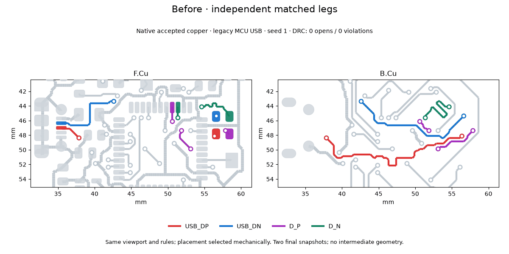

# Coupled USB routing and matching recovery

Differential pairs route as units before the independent maze. The regression
runner enables `--pair-access` by default; `--no-pair-access` (campaign
`pair_access = false`) retains the control behavior. A pair that cannot couple
counts as unresolved for placement selection. Saved copper must pass the coupling
and endpoint-path audit as well as native KiCad DRC.

The router tries shared surface channels, then jointly selects legal through-via
sites and a coupled trunk on a permitted layer. Endpoint via orientations are
independent choices with polarity preserved. Matching measures the entire route,
including access tracks and barrels; timing contracts use each layer's delay.
Copper, hole spacing, pad keepaways and layer restrictions remain constraints.
Search is bounded by `PNR_PAIR_ACCESS_SECONDS` (30 seconds per pair). Failure
reports distinguish unsupported topology, electrical limits, geometric rejection
and search timeout; a failed search does not prove unavoidable congestion.

Reorderable series lines can turn and reverse together, keeping pad-facing and
line order consistent. The regression runner enables `--line-reorder` and
`--tune-window-search` alongside paired access by default, as requested by the
designer after reviewing the combined 4/4 result. Use `--no-line-reorder` and
`--no-tune-window-search`, or the corresponding campaign options set to false,
for controls. `--tune-sequential` remains opt-in. Free-space native matching edits preserve
foreign copper and require a cold DRC improvement.

## Native before/after evidence



These are two accepted final states from campaign `20261007-ladder-7044e6`,
`09-mcu-usb-31-mc`, seed 1, legacy fabrication. Both states use line reordering
and window search; paired access is the changed option. The viewport, layers and
colors are identical. No intermediate geometry is invented. Both saved boards
have zero native DRC opens and violations. The control connector pair has about
28 mm uncoupled copper per leg; the coupled result has 1.504 mm against the
unchanged 2 mm limit. Placement is selected mechanically in each arm.

Across both USB cases and seeds 0 and 1, the control is 4/4 native-clean with only
2/8 pair segments coupled; the coupled arm is 4/4 native-clean with all 8/8
segments coupled. Maximum uncoupled copper is 1.522 mm. The independent matching
recovery campaign passed 2/4 baseline, 3/4 window search, 4/4 corrected line search
and 4/4 sequential recovery.

A separate paired-access-only A/B on the rebased engine, campaign
`20261007-ladder-294792`, leaves line reordering and window search disabled.
The control passes 2/4 boards; the paired-access-only arm passes 0/4. Three paired
boards have zero native opens/violations but fail the actual-copper coupling gate
(uncoupled MCU access or an unexpected branch). Header seed 0 also has an open
and a skew violation. This is why the runner now enables placement/matching recovery
together with coupling. The 4/4 evidence covers that combination; it predates
the CLI default change. Wider ladder coverage remains to be measured.

To reproduce the visualization from the accepted result directories, export
`routed.kicad_pcb` into `geometry.json` in each directory using the configured
headless KiCad Python, then render with the optional matplotlib/Pillow tools:

```sh
"$PNR_KICAD_PYTHON" tools/export_pair_geometry.py \
  --board work/control/routed.kicad_pcb --out work/control/geometry.json
"$PNR_KICAD_PYTHON" tools/export_pair_geometry.py \
  --board work/paired/routed.kicad_pcb --out work/paired/geometry.json
python tools/animate_pair_access.py \
  --before-dir work/control --after-dir work/paired --out pair-access.gif
```

Each directory must also contain its accepted regression `result.json`; the
renderer refuses failed or non-clean results.

## Scope

The initial joint-access implementation supports two terminals per polarity and
endpoint through-via accesses. Branched pairs, ambiguous cycles, arcs and arbitrary
mid-trunk transitions fail closed. This is a coupling and timing gate, not a full
signal-integrity field solver or a general pair push/shove router. Validation
beyond the two USB cases remains to be expanded.
