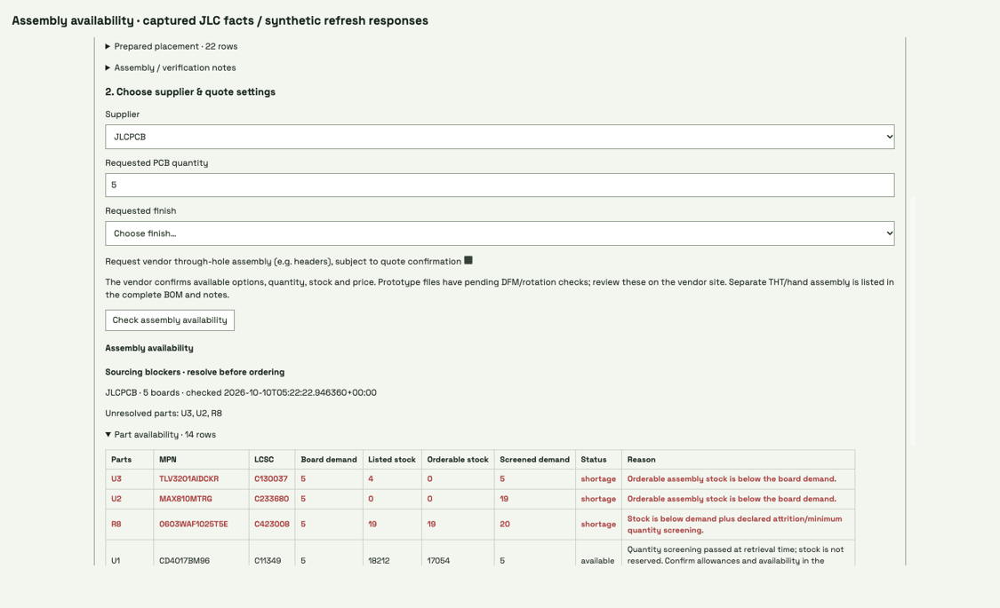

# Assembly-house availability and quantity evidence

The native Manufacturing surface shows exact part identities, aggregated board
quantity, listed and orderable stock, declared attrition/minimum screening and
per-part sourcing blockers. Changing board quantity invalidates the displayed
check. A check publishes immutable evidence with source package, board and
requirements hashes; the CLI can replay captured inventory without network access.
Preparing supplier files also checks inventory automatically. File review and
inventory screening do not reserve stock or approve an order.

These frames use an **isolated article copy** and actual, captured public JLCPCB
inventory facts. They show the three observed shortages first. Refresh/loading
responses are **synthetic**, replaying those facts; PCBWay deliberately reports
supplier confirmation required rather than reusing JLC stock. No vendor upload,
order, account access, article approval or paid model turn occurs. The screenshot
label distinguishes captured inventory from synthetic refresh responses.

Validation covers quantity aggregation, minimum/attrition screening, negative
available-to-order values, incomplete data, identity mismatch, network failures,
content-hashed offline replay, changed input handling and HTTP origin guards.
The browser checks shortage display, quantity invalidation, loading and supplier
separation. Public inventory is a changing external boundary: the final vendor
quote must confirm stock and actual assembly allowances.
