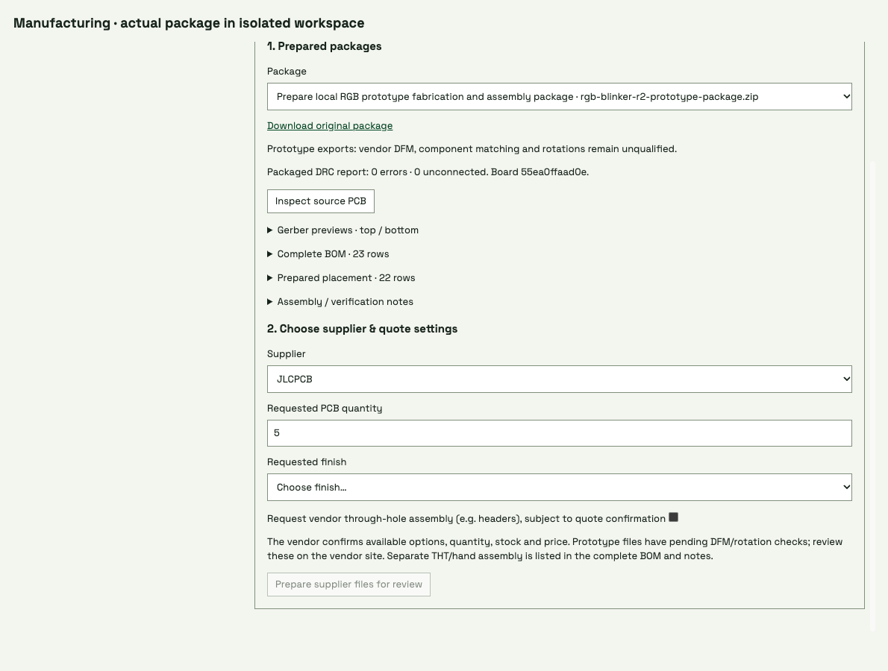

# Manufacturing package discovery and supplier review

The native Manufacturing view discovers published packages without requiring a
separate agent-created handoff record. It exposes supplier, quantity, finish and
optional through-hole service, local vendor-specific BOM/CPL preparation,
Gerber previews and immutable downloads. File review enables the human quote
link; outstanding feedback blocks approval and changed inputs invalidate it.

These frames use **actual prototype package bytes in an isolated workspace**,
with the same packaged browser surface, viewport and settings. Supplier files
were prepared through the local API. Approval applies only to this isolated
copy; no article approval, model turn, vendor access, upload or payment occurred.
Vendor DFM, component matching, rotations and physical validation remain open.
The original JLCPCB placement file matches the regenerated 22 SMT placements
exactly. Requesting through-hole service includes the header as a 23rd placement,
subject to the vendor's service and pricing confirmation. Unit tests additionally
cover native bundle discovery, archive corruption, stale board/requirements,
deterministic repeated preparation and feedback/approval binding.
