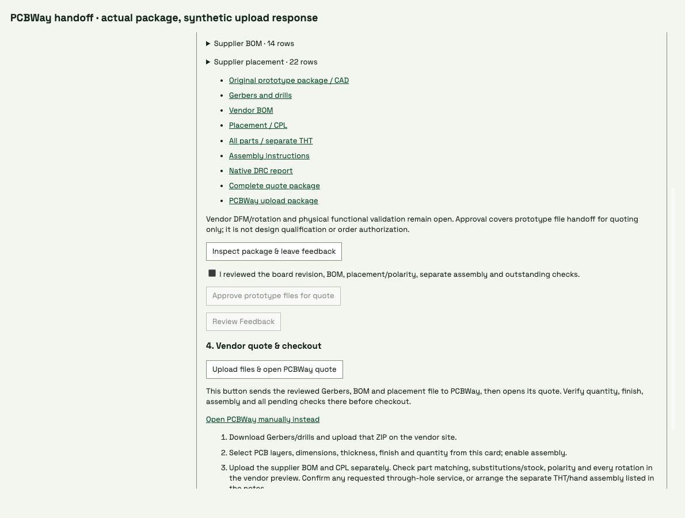

# Approved PCBWay file upload and quote handoff

The human-operated Manufacturing button uploads its reviewed PCBWay package
using the vendor's official KiCad plugin protocol, then opens the returned
quote. The archive includes original Gerber bytes and BOM/CPL columns matching
the plugin, with no CAD sources or workspace conversations. Approval and exact
input hashes gate transfer; concurrent uploads are guarded, confirmed receipts
are reused and errors never retry automatically. Other quote settings and
checkout remain on the vendor site. JLCPCB attachment awaits approved API access.

These frames use actual package bytes in an **isolated workspace**, but the
vendor upload and new window are **mocked**. They exercise approval gating,
loading, verified quote opening and explicit retry without vendor access, file
transfer, article approval or a paid model turn. The live vendor endpoint has
not been exercised by these tests; validation establishes adapter/protocol and
UI behavior, not vendor DFM, stock, rotations or successful production.
