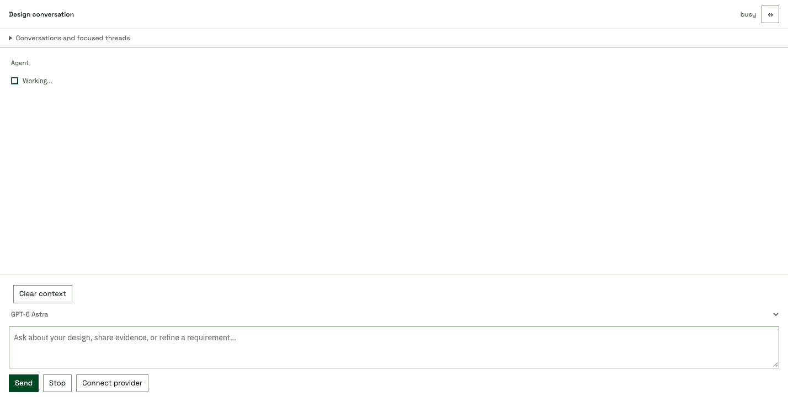

# Questions during active agent turns

Packaged browser UI with an isolated busy-status fixture and intercepted message
submission: Send stays enabled during the agent turn, then disables only while
delivery is pending. No paid model request is forwarded by this check. The browser
also verifies one request after repeated clicks and preservation of a newer draft.
The capture excludes the session identifier and real conversation content.
