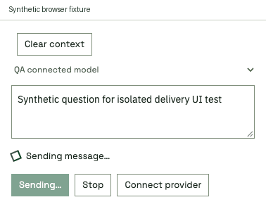

# Chat delivery and agent activity

The composer shows Sending immediately, confirms delivery only after the message
API accepts the request, and distinguishes waiting from reported agent activity.
The existing chiral loader respects reduced motion. Stable live-region text
avoids repeating announcements on every poll. A completed reply following the
submitted user message replaces the waiting cue; client/server clock alignment
is not required. Status polling runs independently of potentially slow history
requests. The Send button becomes available when delivery completes, including
while the agent is busy. In-flight duplicate submission remains blocked.

These cropped frames exercise the actual packaged chat in an isolated browser
with **synthetic** request/status/history responses. Tests cover sending,
confirmed delivery, working while history is blocked, reply receipt, duplicate
submission, a retained newer draft and unconfirmed delivery with the draft kept.
No paid turn or real message was sent. The failure cue requests checking the chat
before retrying because a failed request cannot always prove non-delivery.
