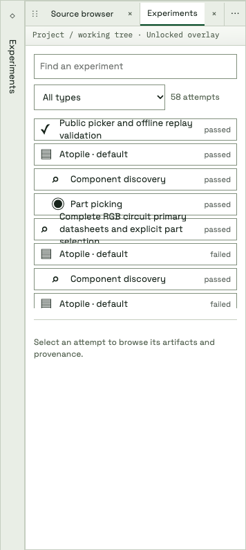

# Experiment tree progress

Actual browser captures restore missing campaign ancestors, sibling placement
candidates, and per-candidate phase progress. These are imported completed results
from one real routing campaign, not simulated live workers or intermediate solver
frames. Unknown progress remains indeterminate; group counts summarize child
states. Conversation content is excluded from the captures.

Regression coverage exercises two parallel candidate states and their distinct
fractions. Browser checks verify native progress, nested candidates, collapse and
expand, result selection, and progress containment within each row.
