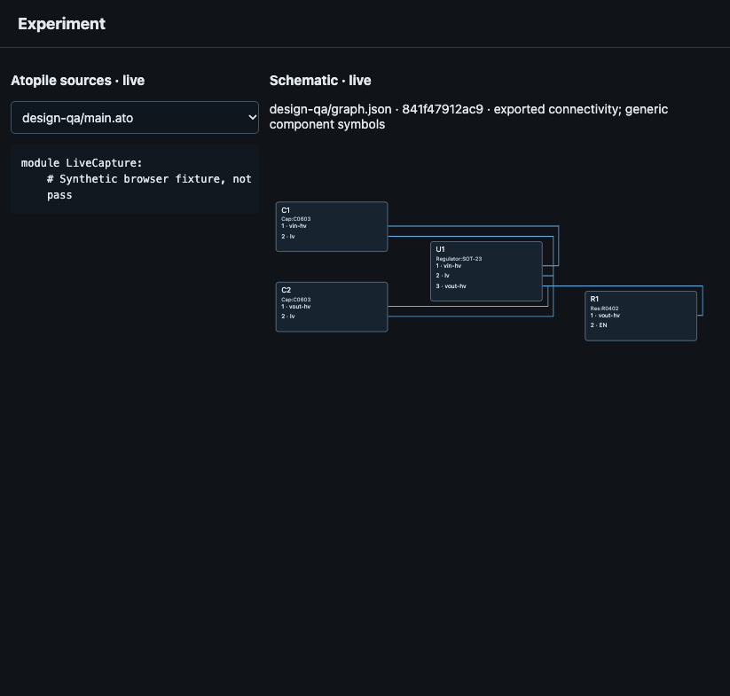

# Live source and schematic capture

Historical capture: the intermediate live-source/netlist page was replaced by
the [unified workbench](workspace-workbench.md). This page records the earlier
implementation and does not describe the current interface.

Entering schematic capture opens the source and engineering view together. The
selected atopile source updates without navigation. A new complete exported
netlist refreshes the schematic; a partial export retains the last valid drawing.
The fallback draws generic component/pin symbols with actual net connectivity,
using the bundled, pinned ELK layout engine. An attached viewer retains its full
schematic/PCB surface alongside the live sources.

These frames show synthetic source and exported-netlist browser fixtures, not a
compiled or validated circuit. No model turns were launched by this UI test.
