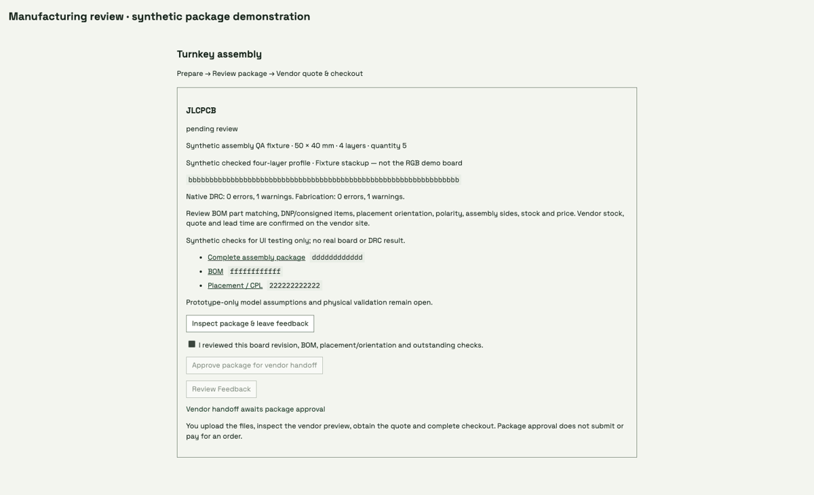

# Native manufacturing package review

The native Manufacturing tab connects existing JLCPCB/PCBWay fabrication
bundles to immutable artifact downloads and package review. The user confirms
board/BOM/placement review before approval enables the vendor handoff link.
Unresolved feedback disables approval and enables Review Feedback; changed board
or accepted requirement inputs invalidate the handoff.

These frames exercise the actual packaged native display with an isolated,
labeled **synthetic** four-layer package response. The approval callback is
mocked in the browser: no real artifact was approved, no agent turn was sent and
no vendor page was opened. This animation does not represent the two-layer RGB
board, vendor stock, a quote or native DRC verification. Backend lifecycle tests
cover both vendors, package corruption, manifest binding and stale inputs.
The active workspace was also checked with its genuine empty package state.

Preparation uses `yapnr workspace assembly --bundle DIR --board BOARD` after
`yapnr fab build --assembly`; see [the engineering guide](../agent-workflow.md).
Upload, vendor placement/part matching review, quoting and payment remain human
steps on the vendor site. No uploading or ordering API was added.
