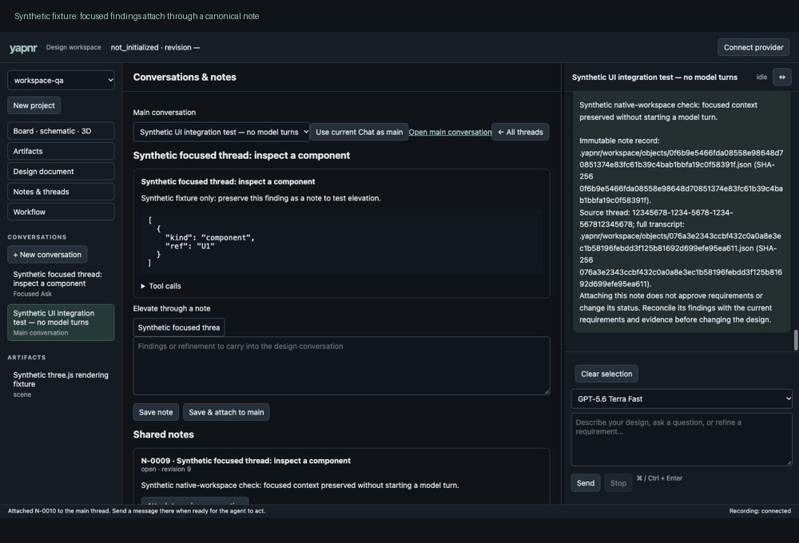

# Workspace-native conversation and review

Recorded browser states at the same viewport: inspect a focused conversation and
attach its canonical note to the main thread; capture a pinned three.js scene for
markup; explore that scene inside a review question beside the conversation.
The scene, questions, tool output and findings are **synthetic UI fixtures**.
They are not a generated board, a real model response or engineering validation.
No paid model turns were started during these checks.

The application owns its layout and talks to the pinned OpenCode runtime API.
Project/thread/artifact navigation, the engineering view and the resizable chat
pane share one page. The real-board browser check separately verifies that the
attached viewer and conversation occupy adjacent, non-overlapping panels and
that selected components become chat context. Generated artifacts remain indexed
in the article workspace; annotations retain original content hashes and views.
