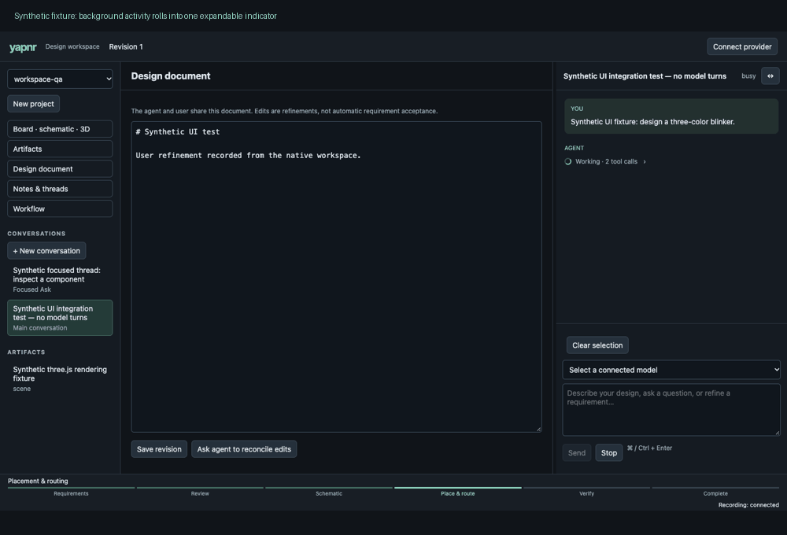

# Compact activity and controller progress

Background tools and reasoning share one expandable activity indicator per agent
turn. The spinner follows runtime activity. Inputs, outputs and errors remain
available inside the collapsed details. The bottom bar follows the workflow
controller through requirements, review, schematic, placement/routing,
verification and completion. Review and rework are explicit; it never estimates
time or claims a percentage complete.

These are synthetic browser fixtures; no paid model turn was used for UI checks.
The separate live rgb-blinker session exercised an authorized continuation and
stopped at requirements review without recording acceptance. Its private design,
conversation, provider metadata and artifact contents are absent from this demo.
