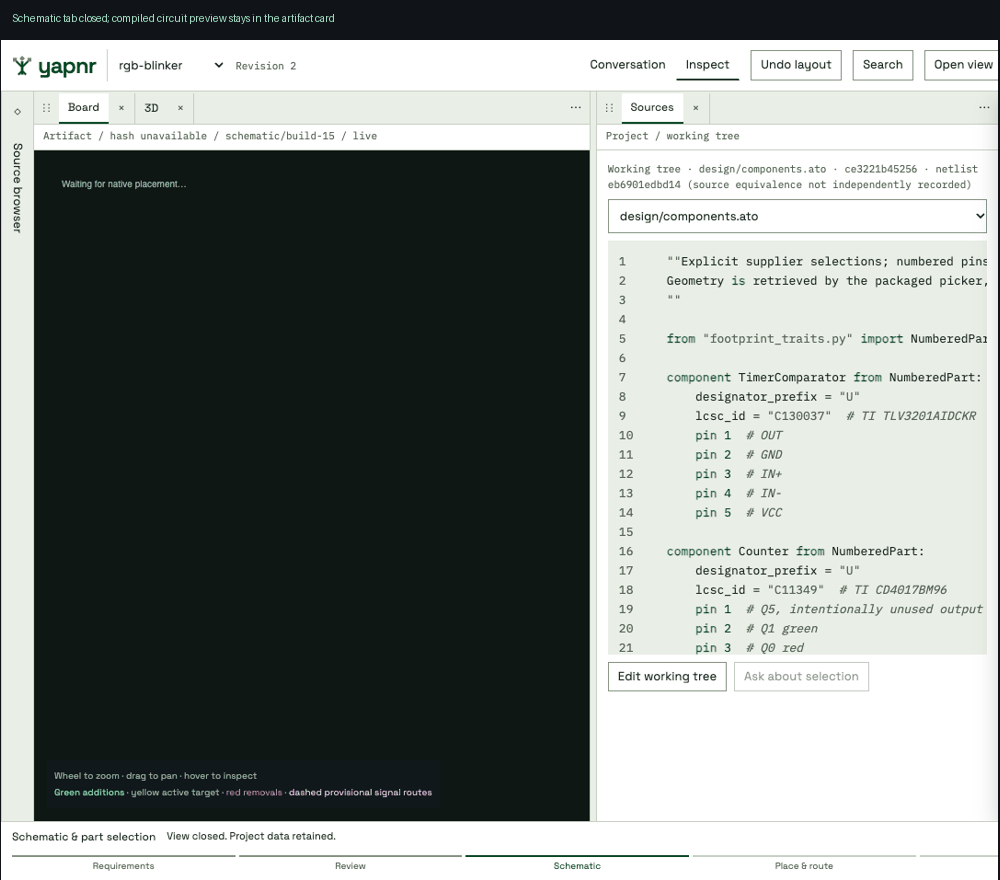

# Inline schematic previews

Recorded browser states at one viewport: close the Schematic tab, then reopen it
through the inline artifact's tab link. The circuit is an actual compiled RGB
sequencer, mechanically laid out by the existing schematic viewer with selected
KiCad symbols. It is an unrouted schematic preview, not verification evidence or
a finished board. Conversation content is excluded from these captures.

The browser check also verifies the screenshot loads and a workspace URL with
`?view=schematic` selects the Schematic tab. The artifact records its input graph
hash and `workspace_view` metadata; historical diagnostic images stay indexed.
