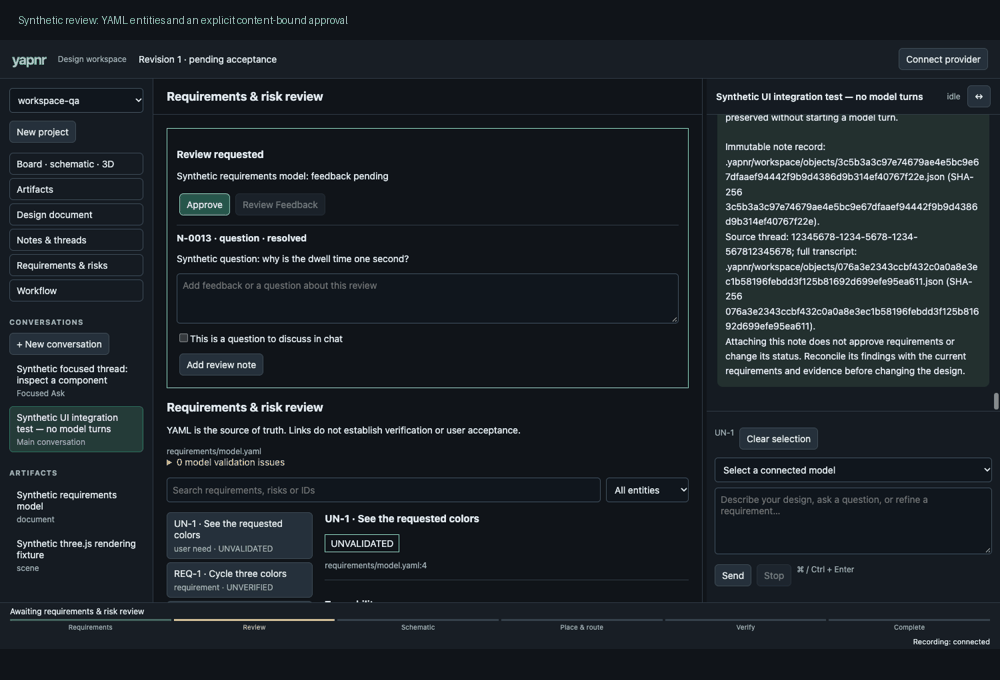

# Native traceability and artifact review

The browser reads the pinned rules_requirements model, evidence verdicts and trace
renderer. Need, requirement, mitigation and risk entities remain linked; source
locations, gaps and case evidence are inspectable. Report artifacts open from their
cases. The review panel shows explicit content-bound approval and a feedback cycle.
Open questions block acceptance and stay in canonical notes until the user marks
them addressed.

These are synthetic YAML models and browser interactions, with model sends and
continuation intercepted. No paid model turns or real engineering approvals were
used for this UI validation. Missing evidence remains unverified in the screenshots.
