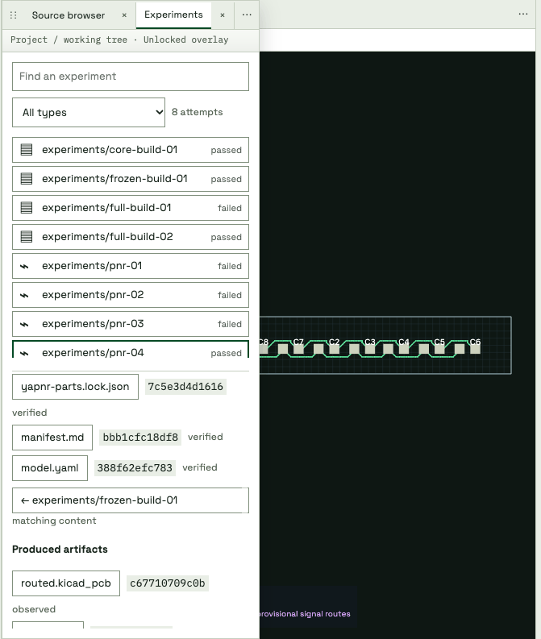
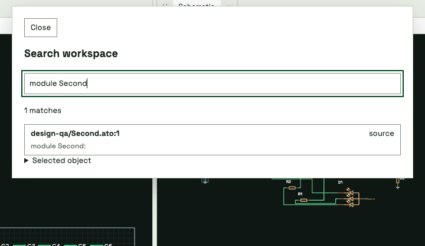

# Unified engineering workbench

The workbench uses the owner-provided brand kit: one project shell, persistent
engineering tabs, two tool drawers, bundled fonts, and shared light/dark tokens.
Conversation and Inspect arrange the same Ask session and views. Moving a tab
retains its renderer/editor instance; closing a view does not cancel a job.

This capture exercises the packaged UI against a synthetic conversation and
source fixture. Board and schematic views show an existing recorded LED-ring
experiment. The fixture sources are independent of that experiment; the UI
labels their hashes separately. No model turn, acceptance or electrical validation
was performed by this walkthrough. Images are UI evidence, not DRC evidence.

Checked behavior includes two source-file tabs, pointer merge across an iframe,
Escape rollback, dirty-close Cancel/discard, minimize/original-slot restore,
retained Ask draft and renderer load count, unsaved source recovery after reload,
unlocked drawer dismissal, Notes,
recorded timing and stable historical selection during refresh, light/dark and
opaque overlays. Viewports 360, 900, 1360 and 1600 have no page overflow; the
800-pixel layout projection was checked at twice the device scale.

The dock transaction tests cover four split directions, ordered group moves,
drawer reorder/migration, last-pane recovery, presets and invalid destinations.
Backend tests cover source concurrency, managed-file boundaries, lifecycle
idempotence, missing closes, overlapping sessions, late heartbeats and deduplicated
parallel tool spans. Native experiment statistics remain a separate Timing view.

Source-to-build equivalence and CPU measurements are unavailable where the
workspace did not record them. Linked highlights reject unknown or mismatched
artifact hashes. Touch hardware, screen-reader behavior and a sustained 60 fps
performance benchmark have not been certified by these checks.

## Drawer motion and source navigation

The synthetic fixture shows the actual 180 ms drawer transitions. Drawer contents
stay mounted while closing, rapid reopening cancels the prior motion, and reduced
motion uses immediate visibility changes. This capture is a UI demonstration,
not an electrical verification.

The source tree starts in the left drawer and preserves directory expansion while
files update. Non-Atopile text files are read-only; binary and oversized files are
rejected rather than decoded as source.

Source reads use syntax-colored Atopile text with line numbers. Resolved project
imports open source tabs; managed imports use the existing read-only native source
browser and its module index. Selecting text enables Ask about selection, which
attaches immutable file/line/text and working-tree/buffer hashes. Unsaved edits
are explicitly marked as drafts. No selection itself submits a model turn.

## Native experiments and artifact provenance

Experiments is a native workbench tree, without the legacy experiment-browser
iframe. Failed attempts remain visible, with icons and filters for discovery,
part picking, schematic builds, PCB placement/routing, simulation and validation.
Selecting an attempt exposes its captured inputs, produced artifacts, parameters
and seeds. Content hashes establish navigable upstream and downstream links;
missing historical input evidence stays explicitly unknown. Registered attempts
capture immutable inputs and outputs in the workspace artifact store.

The capture uses the existing LED-ring schematic build and PnR reports. The PnR
input hash matches the frozen schematic PCB output. This illustrates recorded
lineage, without claiming electrical qualification of the board. Opening the
drawer initializes Experiments immediately, without switching tabs. Selecting a
recorded routing lane updates the existing Board, Schematic and 3D surfaces.

## Floating workspace search and performance settings

Cmd-F or Ctrl-F opens workspace search, including from embedded renderer frames.
Reopening retains the query; repeating the shortcut while open clears it. Matching
source lines open their files, and components/nets reveal through the existing
artifact-hash checks. Selected-object metadata, pin tables and vendor/datasheet
links remain available in the dialog. Inspect is removed from saved tab layouts.
The capture combines synthetic source text with an existing recorded component,
without asserting source-to-board equivalence or electrical validation.

Performance has its own tab. Native routing controls retain their existing safe
boundary/restart choices. Google Cloud Batch settings use the engine's validated
configuration and save to the project, with optimistic concurrency. SDK profiles
and authentication status are read from the UI host; credentials and credential
lookup commands are not copied into workspace artifacts. The execution environment
must have the corresponding SDK credentials. Saving settings launches no jobs.
