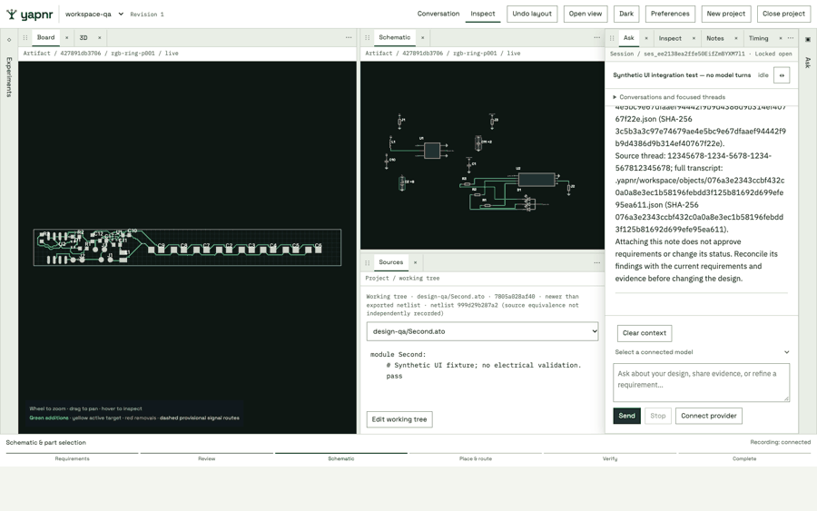
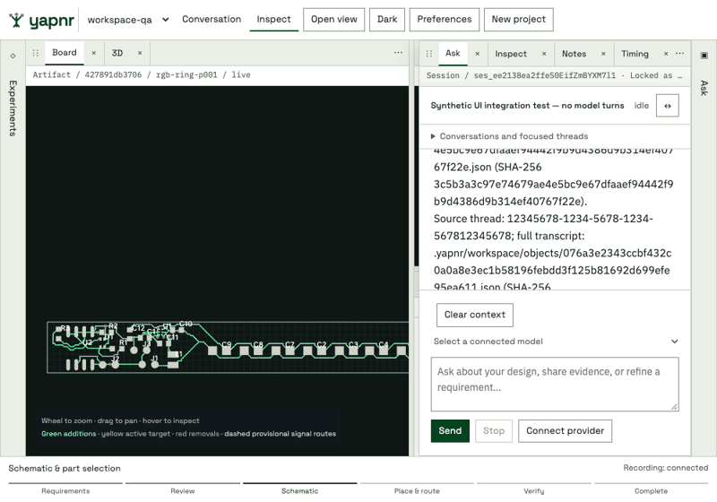
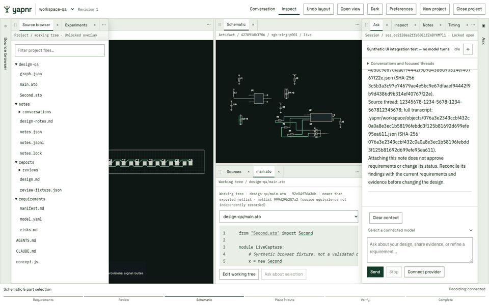
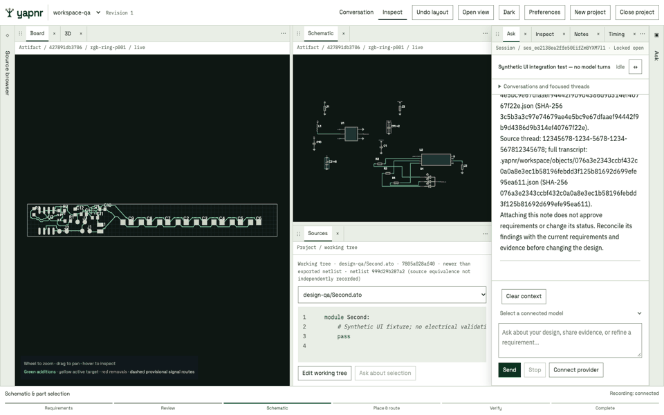

# Unified engineering workbench

The workbench uses the owner-provided brand kit: one project shell, persistent
engineering tabs, two tool drawers, bundled fonts, and shared light/dark tokens.
Conversation and Inspect arrange the same Ask session and views. Moving a tab
retains its renderer/editor instance; closing a view does not cancel a job.

This capture exercises the packaged UI against a synthetic conversation and
source fixture. Board and schematic views show an existing recorded LED-ring
experiment. The fixture sources are independent of that experiment; the UI
labels their hashes separately. No model turn, acceptance or electrical validation
was performed by this walkthrough. Images are UI evidence, not DRC evidence.

Checked behavior includes two source-file tabs, pointer merge across an iframe,
Escape rollback, dirty-close Cancel/discard, minimize/original-slot restore,
retained Ask draft and renderer load count, unsaved source recovery after reload,
unlocked drawer dismissal, Notes,
recorded timing and stable historical selection during refresh, light/dark and
opaque overlays. Viewports 360, 900, 1360 and 1600 have no page overflow; the
800-pixel layout projection was checked at twice the device scale.

The dock transaction tests cover four split directions, ordered group moves,
drawer reorder/migration, last-pane recovery, presets and invalid destinations.
Backend tests cover source concurrency, managed-file boundaries, lifecycle
idempotence, missing closes, overlapping sessions, late heartbeats and deduplicated
parallel tool spans. Native experiment statistics remain a separate Timing view.

Source-to-build equivalence and CPU measurements are unavailable where the
workspace did not record them. Linked highlights reject unknown or mismatched
artifact hashes. Touch hardware, screen-reader behavior and a sustained 60 fps
performance benchmark have not been certified by these checks.

## Drawer motion and source navigation

The synthetic fixture shows the actual 180 ms drawer transitions. Drawer contents
stay mounted while closing, rapid reopening cancels the prior motion, and reduced
motion uses immediate visibility changes. This capture is a UI demonstration,
not an electrical verification.

The source tree starts in the left drawer and preserves directory expansion while
files update. Non-Atopile text files are read-only; binary and oversized files are
rejected rather than decoded as source.

Source reads use syntax-colored Atopile text with line numbers. Resolved project
imports open source tabs; managed imports use the existing read-only native source
browser and its module index. Selecting text enables Ask about selection, which
attaches immutable file/line/text and working-tree/buffer hashes. Unsaved edits
are explicitly marked as drafts. No selection itself submits a model turn.

## Embedded experiment tree

The embedded tree retains the native hierarchy, filters and progress data. Its
visibility belongs to the workbench drawer; the standalone viewer's older panel
controller does not close it based on the embedded frame width. Selecting a new
lane updates the live Board, Schematic and 3D views, while pinned comparisons stay
independent. The capture uses the synthetic workspace and its existing recorded
LED-ring lane, without a model turn or an electrical validation claim.
