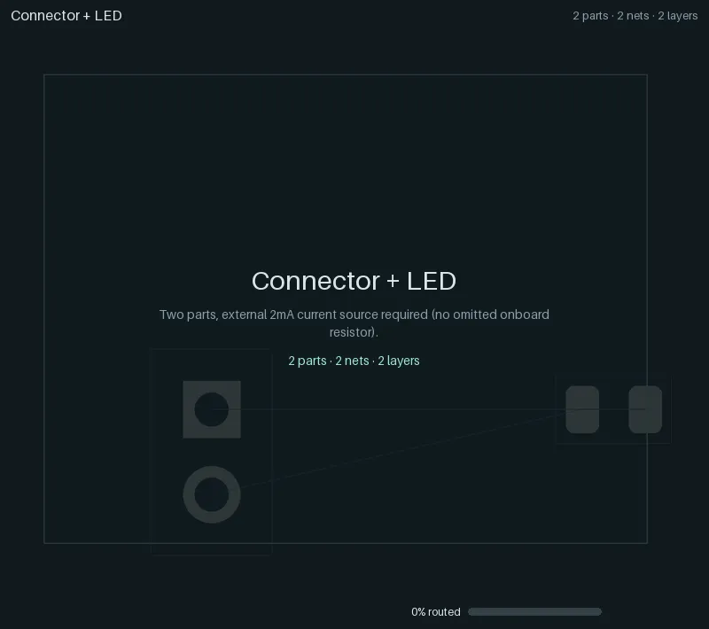
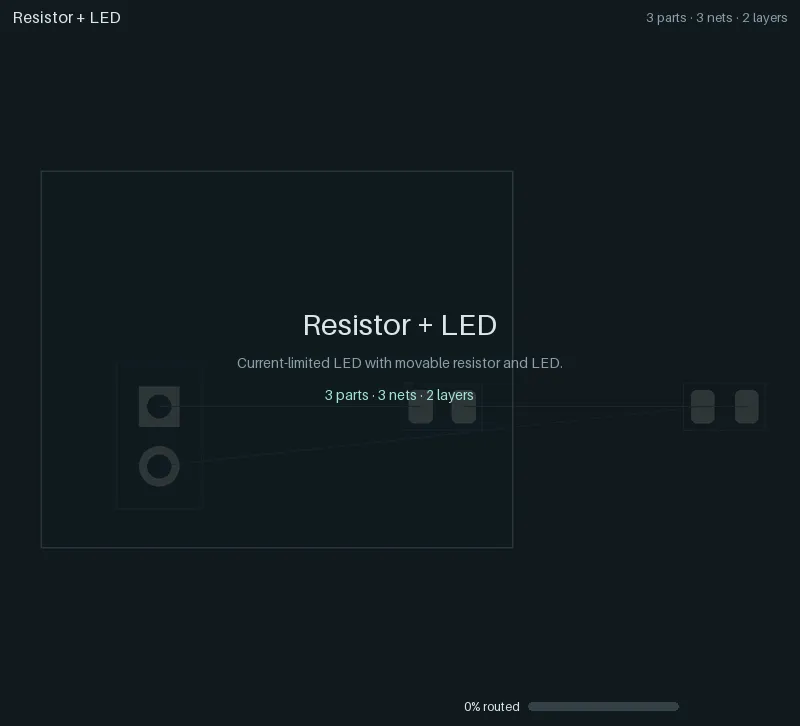
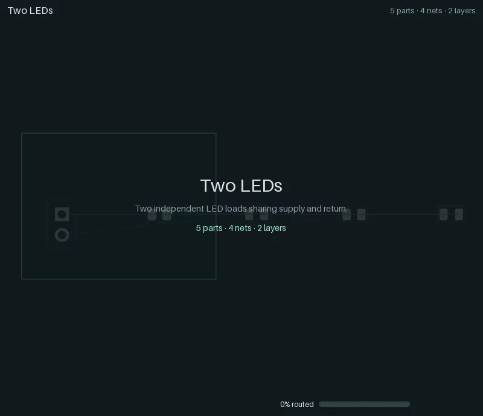
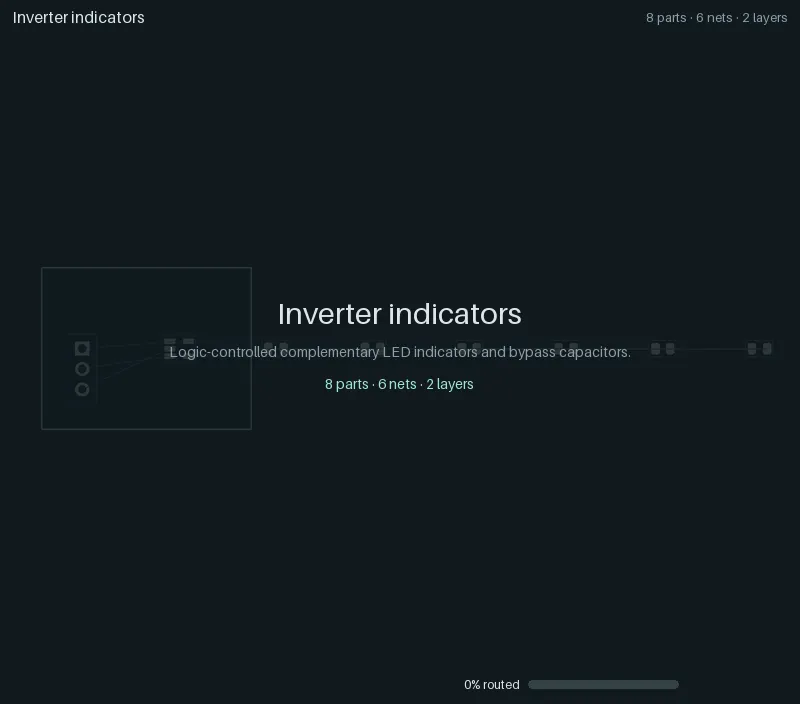
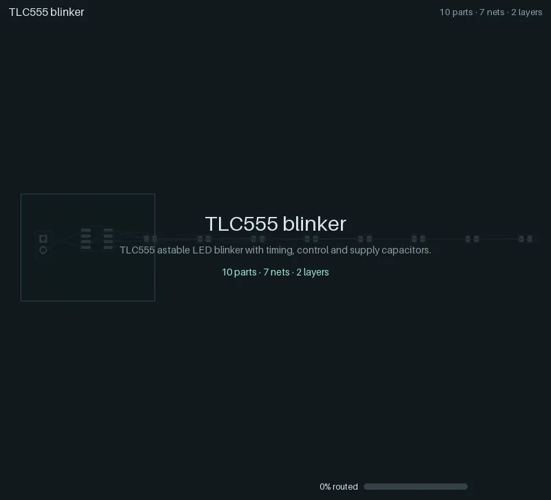
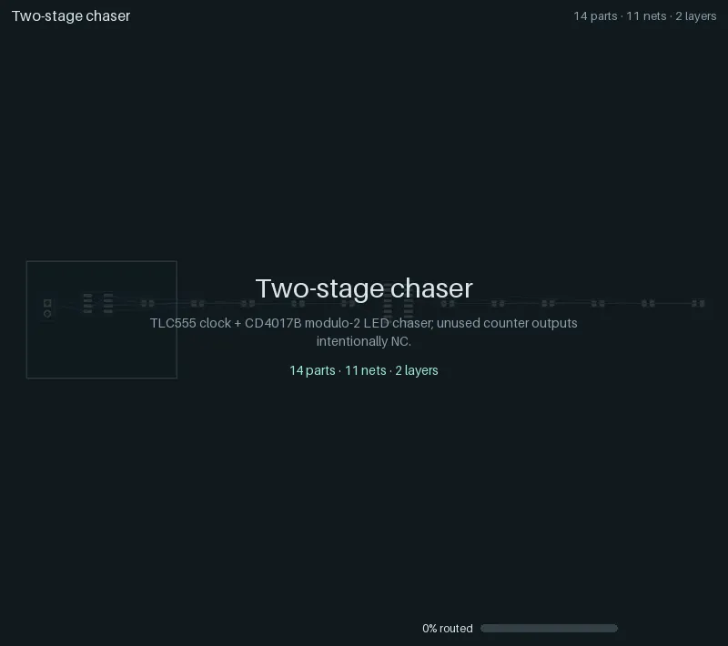
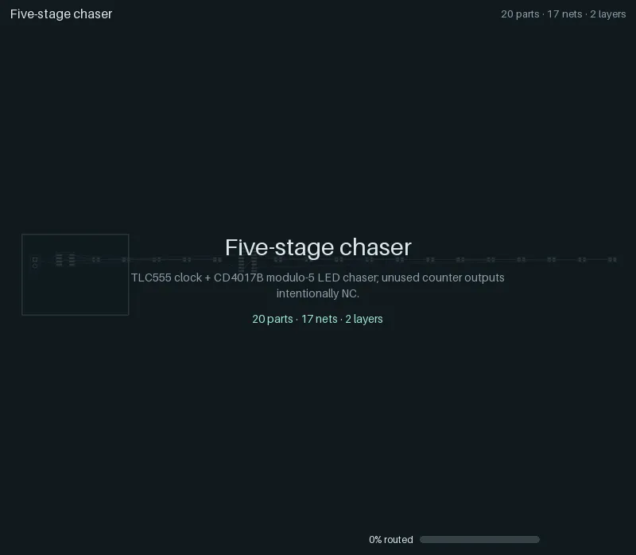
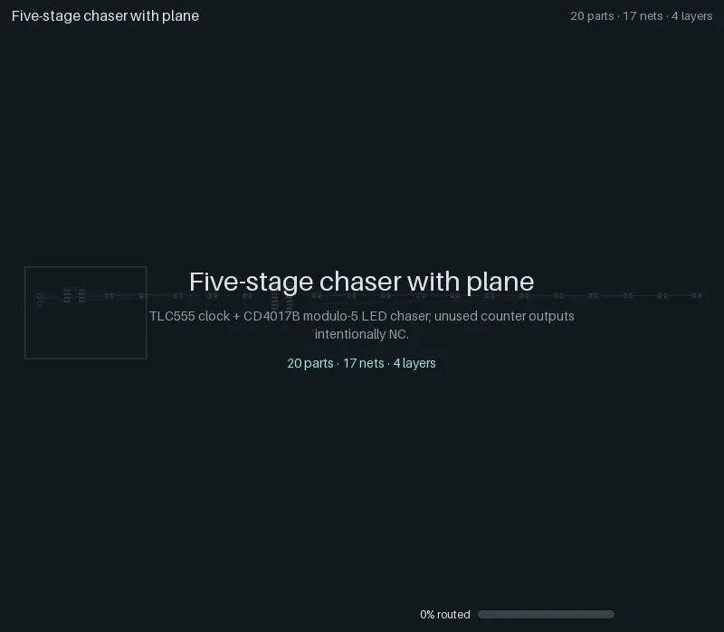

# Regression ladder

The regression ladder is yapnr's ramping-complexity test suite: eight small boards, from one LED on
a connector up to a TLC555 + CD4017B LED chaser on four copper layers. Each case starts from its
circuit alone (a netlist of real KiCad library footprints on an empty outline; only the supply
connector is fixed), runs the ordinary place-and-route pipeline, and is judged by KiCad's own
design-rule check (DRC) on the saved board. The fixtures, the runner and the frozen results of the
engine's last Splanc round live in [`hardware/pnr/regression/`][ladder-readme].

Every case below has an animation of its critical path: one straight line from the unplaced board
to the fully routed board and KiCad's verdict, including the experiments the final board descends
from and, at each selection, the candidates it was chosen from.

> **Status (2026-09-30):** all eight cases **pass** the gate: 100 % routed, no open connections
> and no findings in KiCad's DRC. The ladder routes and is judged under its fixtures' own
> fabrication rules (`--fab-profile legacy`, the runner's default; see below). Under the engine's
> default JLCPCB profile (`--fab-profile jlc-pofv`), where the router keeps vias 0.127 mm off SMD
> pads, every case passes too (other boards); which profile the ladder uses by default is an
> owner decision ([WORKLOG.md](../WORKLOG.md)).

## The cases

Seed 0, with the initial placement pool (8 starts, 3 routed finalists), the legacy fabrication
profile; KiCad 10.0.6. "Opens" and "findings" are KiCad's DRC counts on the saved board; the time
is the case's wall time on the development Mac (darwin-arm64), niced, next to other work.

| Case                                                                | Parts | Nets | Layers | Added difficulty                                       | Routed | Opens | Findings | Vias | Copper (mm) | Time (s) | Gate |
| ------------------------------------------------------------------- | ----: | ---: | -----: | ------------------------------------------------------ | :----: | ----: | -------: | ---: | ----------: | -------: | ---- |
| [01 Connector + LED](#01-connector--led)                            |     2 |    2 |      2 | Basic connection; externally current-limited supply    | 100 %  |     0 |        0 |    0 |        9.27 |      8.7 | pass |
| [02 Resistor + LED](#02-resistor--led)                              |     3 |    3 |      2 | Movable series current limiter                         | 100 %  |     0 |        0 |    0 |       12.80 |      8.0 | pass |
| [03 Two LEDs](#03-two-leds)                                         |     5 |    4 |      2 | Shared, branched supply and return                     | 100 %  |     0 |        0 |    0 |       31.13 |      8.7 | pass |
| [04 Inverter indicators](#04-inverter-indicators)                   |     8 |    6 |      2 | SOT-23-5 pin escapes, an unused pad, 3-pin connector   | 100 %  |     0 |        0 |    4 |       72.93 |     17.1 | pass |
| [05 TLC555 blinker](#05-tlc555-blinker)                             |    10 |    7 |      2 | 8-pin IC, RC timing and control, bypass and bulk caps  | 100 %  |     0 |        0 |    7 |      120.12 |     30.5 | pass |
| [06 Two-stage chaser](#06-two-stage-chaser)                         |    14 |   11 |      2 | TLC555 + CD4017B, cross-IC clock and reset, fanout     | 100 %  |     0 |        0 |   10 |      244.89 |     67.5 | pass |
| [07 Five-stage chaser](#07-five-stage-chaser)                       |    20 |   17 |      2 | Five LED/resistor outputs, shared rails, dense routes  | 100 %  |     0 |        0 |   19 |      310.75 |    125.8 | pass |
| [08 Five-stage chaser with plane](#08-five-stage-chaser-with-plane) |    20 |   17 |      4 | Four copper layers, ground plane attachment and refill | 100 %  |     0 |        0 |   26 |      274.30 |    202.4 | pass |

The baseline configuration (no pool), seeds 0 and 1, as the nightly CI lane runs it, passes all
sixteen runs as well. The machine-readable results are in
<a href="animations/ladder-results.json"><code>animations/ladder-results.json</code></a>, and
the provenance of the animations (the ladder run's engine commit, `sources_sha256` over its frozen
sources, fabrication profile, platform and KiCad; the render's Pillow version; each file's trace
and content hash) is in <a href="animations/manifest.json"><code>animations/manifest.json</code></a>.

The gate (see the [ladder README][ladder-readme]) requires a legal placement, complete routing with
no deferred nets, the original pin and net assignments, tracks at their source widths, qualified SMD
pad entries, and zero KiCad unconnected items and findings, warnings included. Signal tracks are
0.25 mm, supply and return at least 0.4 mm, clearance 0.2 mm, vias 0.6/0.3 mm: the fixtures' own
fabrication block, which the runner routes and judges under (`PNR_FAB_PROFILE=legacy` for every
stage). `--fab-profile jlc-pofv` routes and judges under the engine's default JLCPCB profile
instead (0.127 mm clearance, 0.45/0.30 mm vias, vias 0.127 mm off SMD pads).

### Showcases

Four more cases show what the engine does with placement constraints and with hierarchy: the
five-stage chaser with its LEDs held in a line group, a small board with its connector, button
and LED held on the south edge (each beside a twin without the constraint), and a twin-bank
chaser placed and routed as blocks. They run through the same runner and gate, but they are not
ladder cases: they are outside the gate and the pull-request lane (the nightly lane runs them for
information). Their animations and results are on
[Constraints and hierarchy](constraints-and-hierarchy.md).

## Reading an animation

- **Header:** the case, and its parts, connected nets and copper layers.
- **Footer:** the phase and the experiment it belongs to (`start-05` is the sixth start of the
  initial placement pool), the share of connections routed, and the step within the phase. The
  number and the mint bar count committed copper (or, after writeback, KiCad's own count); while
  the router still negotiates (provisional routes, overlaps allowed), a lighter violet bar fills
  behind it.
- **Board:** front copper orange, back copper blue, inner layers violet and yellow (planes as a
  light fill), vias as rings, unrouted connections as thin grey ratsnest lines. New copper flashes
  green; ripped-up copper flashes red. A red ring marks each KiCad DRC finding, if any.
- **Montages:** where the engine chose between experiments, the candidates appear side by side
  with their score; the chosen one is framed, and the view zooms back into it. A montage comes
  right after the winner's own replay has reached the state its tiles show, so the timeline never
  runs ahead of itself: the pool's shortlist (legal starts ranked by a capacity proxy) follows the
  chosen start's legalization, and the routed finalists follow its route.
- **The straight line:** title card, the unplaced board (footprints in the generator's row), the
  chosen start's global placement and legalization, the shortlist, detailed routing (negotiation,
  then commits), the finalists, KiCad's writeback, planes and zone refill, then the verdict. With
  feedback rounds, each round on the path follows with its congestion map.
- **End card:** KiCad's DRC on the saved board (mint when the gate passes, red with the rules it
  breaks when it fails), vias, copper length, seed and the number of rivals set aside.

## Animations

### 01 Connector + LED

<p></p>

Two parts, externally current limited (no onboard resistor). 2 nets, 0 vias, 9.3 mm of copper;
KiCad: 0 unconnected, 0 findings. **Passes.**

### 02 Resistor + LED

<p></p>

A movable series current limiter. 3 nets, 0 vias, 12.8 mm of copper; KiCad: 0 unconnected, 0
findings. **Passes.**

### 03 Two LEDs

<p></p>

Two independent LED loads sharing supply and return. 4 nets, 0 vias, 31.1 mm of copper; KiCad: 0
unconnected, 0 findings. **Passes.**

### 04 Inverter indicators

<p></p>

Complementary LED indicators driven by an SN74LVC1G04, with bypass capacitors and one unused pad.
6 nets, 4 vias, 72.9 mm of copper; KiCad: 0 unconnected, 0 findings. **Passes.**

### 05 TLC555 blinker

<p></p>

The 555 flasher: a TLC555 astable with timing, control and supply capacitors, and the README's
animation (also as a GIF,
<a href="animations/05-timer-led-10.gif"><code>05-timer-led-10.gif</code></a>). 7 nets, 7 vias,
120.1 mm of copper; KiCad: 0 unconnected, 0 findings. **Passes.**

### 06 Two-stage chaser

<p></p>

A TLC555 clocking a CD4017B Johnson counter, modulo 2, with cross-IC clock and reset. 11 nets, 10
vias, 244.9 mm of copper; KiCad: 0 unconnected, 0 findings. **Passes.**

### 07 Five-stage chaser

<p></p>

The same timer and counter driving five LED and resistor outputs on two layers: the densest
two-layer board. 17 nets, 19 vias, 310.8 mm of copper; KiCad: 0 unconnected, 0 findings.
**Passes.**

### 08 Five-stage chaser with plane

<p></p>

Case 07 on four copper layers, with the return on an inner ground plane (attachment and zone
refill). 17 nets, 26 vias, 274.3 mm of copper; KiCad: 0 unconnected, 0 findings. **Passes.**

## Regenerating

The ladder needs a numerical Python (torch, NumPy, PyYAML) and KiCad 10 with its Python module and
footprint library. On macOS, use the headless KiCad copy (see
[DEVELOPERS.md](../DEVELOPERS.md#kicad)), never the application bundle; run niced on a shared
machine. The committed animations were made in two steps, a traced ladder run and a render:

```sh
# 1. The traced ladder (about 8 minutes on the development Mac); the output must not exist.
#    The fabrication profile defaults to legacy (--fab-profile).
"$NUMERIC_PYTHON" hardware/pnr/regression/run.py --repo . --out .yapnr/ladder/RUN --seed 0 \
  --trace --initial-pool --initial-starts 8 --initial-finalists 3 \
  --python "$NUMERIC_PYTHON" --kicad-python "$PNR_KICAD_PYTHON" \
  --kicad-cli "$PNR_KICAD_CLI" --library "$PNR_KICAD_FOOTPRINTS"

# 2. Render every case into docs/animations/ (WebP, the README GIF, manifest.json and
#    ladder-results.json); no KiCad needed. --allow-failed also renders failed cases (their end
#    card names the broken rules in red).
bazel run //hardware/pnr:ladder_animations -- --render-only "$PWD/.yapnr/ladder/RUN"
```

`bazel run //hardware/pnr:ladder_animations` without `--render-only` does both (pass `--python`,
`--kicad-python`, `--kicad-cli` and `--library`); it reruns a case that fails in pool mode in the
baseline configuration. One case, or another trace, renders with
`bazel run //hardware/pnr:animate -- SOURCE --out FILE.webp` (`python -m pnr.animate`; `.gif`
and, with `ffmpeg`, `.mp4` work too). `.yapnr/` is git-ignored: only the rendered animations and
the two JSON files are committed.

`pnr.animate` also takes the output directory of a successive-halving search (`pnr.mc.halving`).
Such a run records no trace, so its animation is reconstructed from what it saved (the overlay
does not claim more): the winner's placement moving in from the source board, a montage per
promotion (the candidates' placements with their rung objective), the winning rung's native
phases (`phases/NN-name/diagnostic.kicad_pcb` with each phase's KiCad DRC) and a montage of that
rung's final boards, then the verdict. Blocks assembled from a synthesis library appear in place;
a library itself has no board to draw, and `--storyboard FILE` writes its critical path (the
chosen layout per template and its rivals) instead. The animator only reads its sources.

Rendering is deterministic: the same trace gives the same bytes. Budgets: the ladder's WebPs at
most 2.5 MB (800 px), its README GIF at most 5 MB (640 px), the folder at most 30 MB with the
showcases, whose own widths and budgets are on
[Constraints and hierarchy](constraints-and-hierarchy.md#regenerating)
(`tests/unit/repo/test_animations.py` checks them all). Refresh the committed animations
deliberately, after a notable engine change, not on every pull request: each refresh adds about
12 MB to the history.

## In CI

`.github/workflows/ladder.yaml` runs the ladder inside the published arm64 image: cases 01 to 06
with seed 0 on pull requests that change engine inputs, and nightly all eight cases with seeds 0 and
1, plus a traced pool run whose animations are uploaded as an artifact and whose trace hashes are
compared with <a href="animations/manifest.json"><code>animations/manifest.json</code></a> (a drift
is a notice). The lane is informational, not a required check yet; its aggregate check is named
`ladder`.

[ladder-readme]: https://github.com/Studio-Fug/yapnr/blob/main/hardware/pnr/regression/README.md
