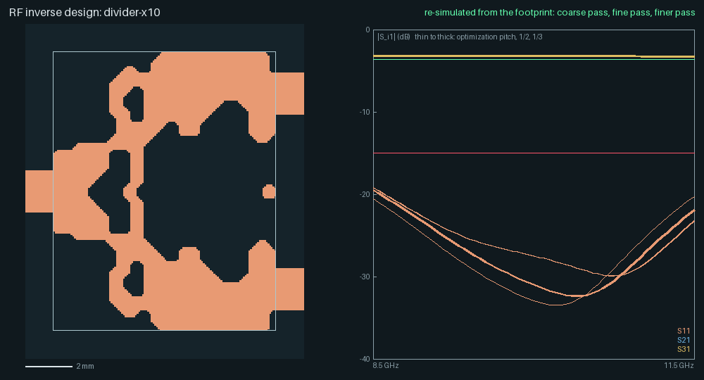
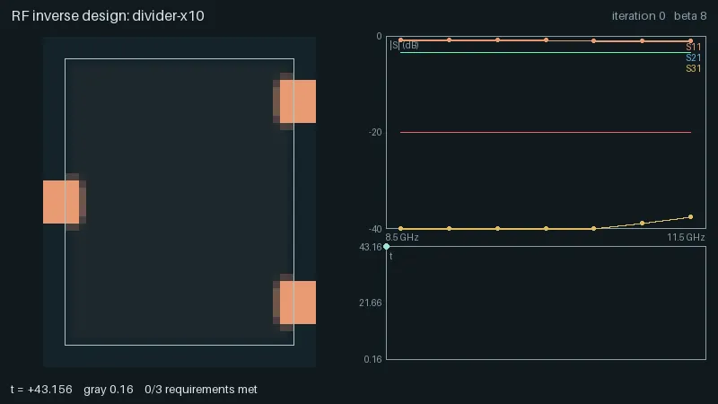
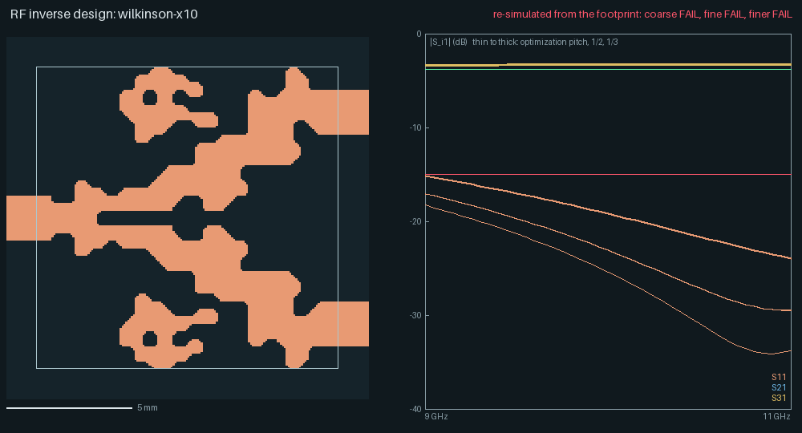
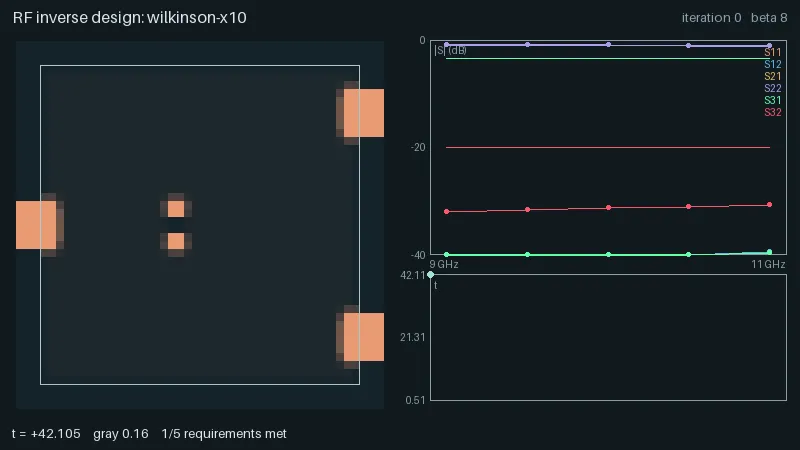
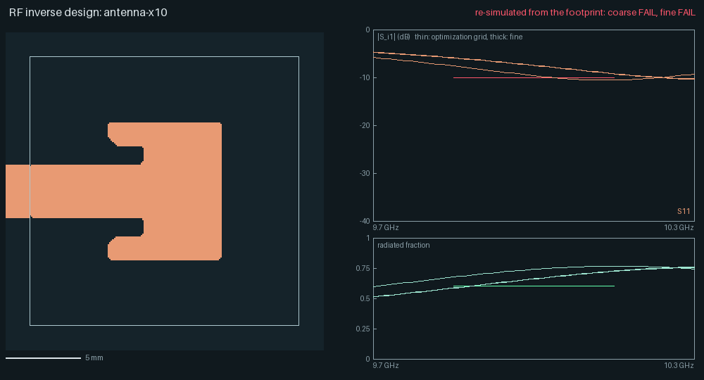
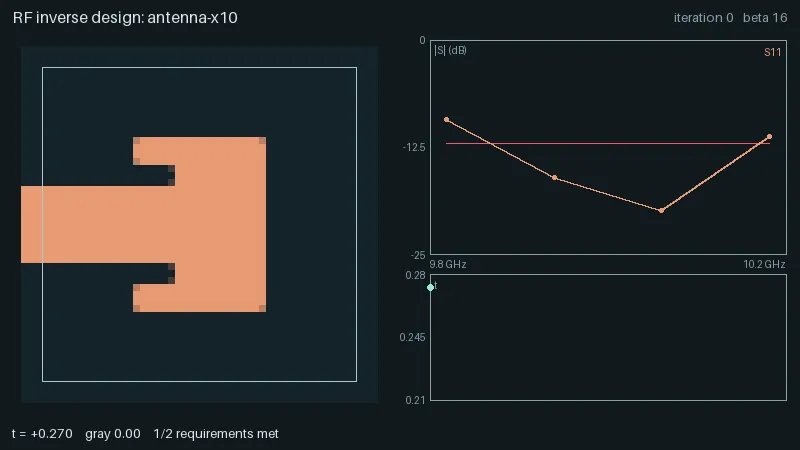
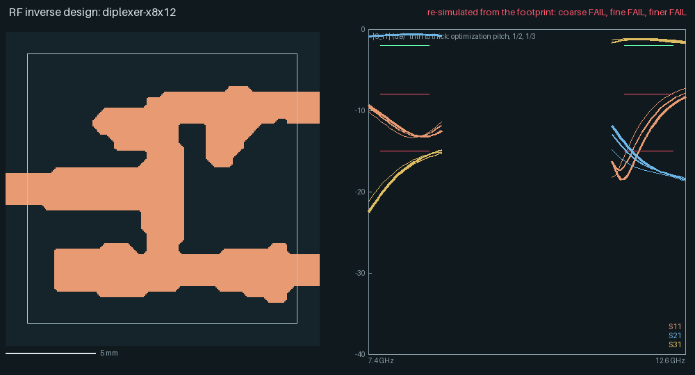
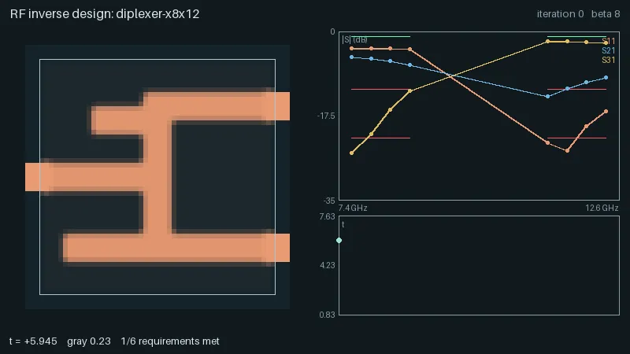
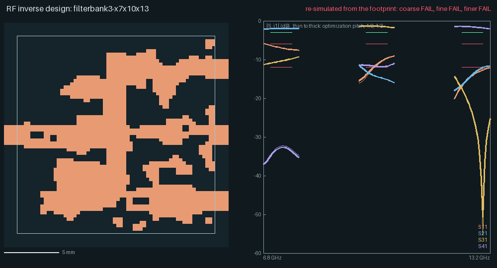
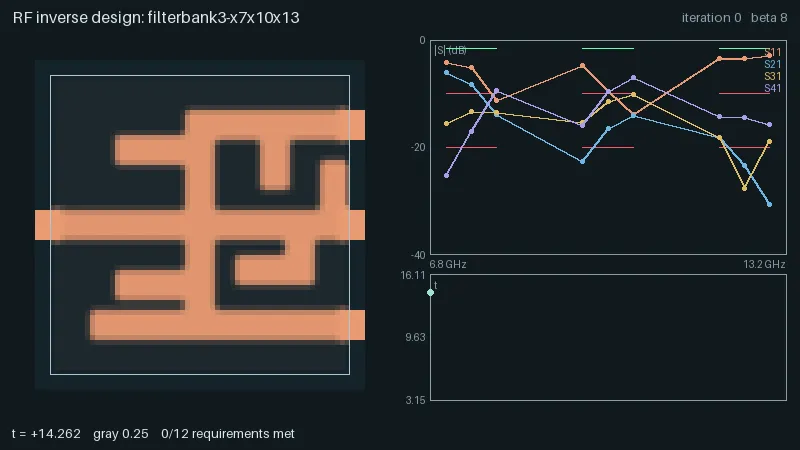

# RF inverse design

`yapnr.rf` designs the copper of a single-layer microstrip footprint so that it meets a list of
transfer-function targets: |S_ij| limits and masks over frequency bands, phases, and a radiated
fraction for antennas. It follows the density-based topology optimization of Hammond et al.
(Meep's adjoint method): an FDTD solver with exact frequency-domain adjoint gradients, a filtered
and projected density on the copper plane, and an epigraph minimax solved by MMA. The result is
a KiCad footprint, a Touchstone file and a JSON report. The method and its choices are in the
[design](design/rf-topology-optimization.md) (issue #29).

Status: the solver, the optimizer and five end-to-end cases are implemented. The power divider
meets its criteria on the optimization grid and on two finer grids; the diplexer comes close;
the Wilkinson-type combiner, the three-channel bank and the antenna do not, and the antenna's
copper is the closed-form patch it started from (the optimizer did not change it). The results
and the reasons are [below](#end-to-end-cases); what the numbers are worth is in
[accuracy](#accuracy).

## A spec

A spec is YAML or JSON (`yapnr-rf-spec/1`, lengths in mm, frequencies in GHz):

```yaml
schema: yapnr-rf-spec/1
name: divider-x10
stackup: { er: 3.55, tan_delta: 0.0027, h_mm: 0.813, f_ref_ghz: 10 }
grid: { pitch_mm: 0.3, substrate_cells: 4 }
design_region: { x_mm: [0, 9.6], y_mm: [-6.0, 6.0] }
symmetry: mirror_y
rules: { min_width_mm: 0.6, min_space_mm: 0.6 }
ports:
  - { n: 1, side: W, at_mm: 0.0, width_cells: auto }
  - { n: 2, side: E, at_mm: 4.2, width_cells: auto }
  - { n: 3, side: E, at_mm: -4.2, width_cells: auto }
bands:
  pass: { ghz: [8.5, 11.5], points: 7 }
requirements:
  - { s: [1, 1], max_db: -20, band: pass }
  - { s: [2, 1], min_db: -3.4, band: pass }
  - { s: [3, 1], min_db: -3.4, band: pass }
optimizer: { betas: [8, 16, 32, 64, 128], iterations_per_beta: 30, budget_min: 45 }
```

- **Ports** are line ports: a feed strip enters the design region on side `W`, `E`, `S` or `N`
  at `at_mm` (the transverse position of its centre) and runs into the absorbing boundary.
  `width_cells: auto` picks the whole number of cells whose calibrated impedance is closest to
  50 Ω.
- **Requirements:** `max_db`, `min_db`, `between_db: [lo, hi]`, piecewise-linear masks
  `mask_db: [[f, dB], ...]` (upper) and `min_mask_db` (lower), `phase_deg` with `tol_deg`
  (engineering e^{+jωt} convention), and `{radiated: j, min: η}` for the fraction of the power
  incident at port j that leaves through a box above the board. Every requirement names a band
  and may set its `scale` (the normalization of its violation).
- **Optional sections:** `fixed` (rectangles of fixed copper or keepout), `lumped` (resistors
  across a gap, such as a Wilkinson divider's isolation resistor: the body rectangle stays void
  and carries the resistance between two copper pads), `radiation` (the box's offset and
  height), `solver` (backend, precision, tolerances, `edge_correction` and `port_source:
mode`, [accuracy](#accuracy)) and `optimizer`: the β schedule, iteration caps, budget, move
  limits, `conservative` (CCSA steps that never raise t), `adaptive_move` (steps that raise t
  by more than `trust_slack` are refused and retried with half the move), `seed` (`star`,
  `stubs`, `patch`, `patch_edge`, or a uniform `init`), `binary_every` (how often the
  binarized design is evaluated, below), `eta_variants` (robust optimization over eroded and
  dilated designs, Hammond et al. §5.3) and `interpolation` (`resistive` or `reactive` gray
  copper, [below](#how-it-works)).

The Python API mirrors the file:

```python
from yapnr.rf.spec import S, RadiatedFraction, Spec

spec = Spec.load("divider.yaml")
extra = S(2, 1).phase_deg(-90, tol=10, band="pass")
antenna_target = RadiatedFraction(1).at_least(0.7, band="main")
```

## Running a design

```python
from yapnr.rf.driver import design
from yapnr.rf.spec import Spec

result = design(Spec.load("divider.yaml"), "runs/divider")
```

The run directory holds `spec.json`, `checkpoint.npz`, `history.json` (t, every objective, the
S-parameters, the radiated fraction and the gray level per iteration), `frames.npz` (ρ̄ per
iteration), `footprint.kicad_mod`, `coarse.sNp` (the binary design on the optimization grid,
every port excited, renormalized to 50 Ω) and `result.json` (`yapnr-rf-result/1`: solver
settings, optimizer summary, achieved values, the width and space check and provenance). A run
that stops resumes from its checkpoint and reproduces the uninterrupted run bit for bit. Runs use
at most 4 threads; on a shared machine start them with `nice -n 10`.

The exported design is the best binarized one of the run, not the last iterate: the loop
evaluates the binarized design (β = ∞ after the width and space repair; one forward run per
excitation) at the start, at every β change and every `binary_every` iterations (5), `finish`
evaluates the last one, and the lowest epigraph value wins; `result.json` records the iteration
it came from (`optimizer.export_iteration`). Plain MMA can raise t from one iteration to the next
and the value at finite β is not the binary design's, so the last iterate is not always the
best.

The density evolution renders as an animation (Pillow, like the place-and-route animations):

```sh
bazel run //yapnr/rf:animate -- runs/divider --out divider.webp
```

## End-to-end cases

Five cases exercise the whole method on the common tasks: a power divider and a Wilkinson-type
combiner, an antenna, and two filter banks (a diplexer and a three-channel bank). Each
optimizes its spec from its starting point ([below](#starting-points-and-repairs)), exports the
best binarized design of the run (width and space repaired on the pixel grid) as a footprint,
and is then re-validated from the exported `.kicad_mod` (not from the optimizer's arrays) on
three grids:

- **on the optimization grid ("coarse"):** the footprint must reproduce the exported design
  pixel for pixel and stay within 0.5 dB (transmissions) and 0.05 in |S| of the optimizer's
  evaluation of it;
- **at half the pitch ("fine") and at a third of it ("finer"):** with 1.5 and 2 times the
  substrate cells, the feeds recalibrated from the pad widths, every port excited, S = B A⁻¹,
  renormalized to 50 Ω. The fine criteria apply on both, and the report lists every check's
  trend over the three grids ([accuracy](#accuracy): resonant designs are not converged).

The criteria are judged on dense in-band sweeps and are slightly looser on the finer grids than
on the coarse one (design §11). The antenna also has a power balance check (the port's net
input power against the flux out of a box closed by the ground and the dissipation inside,
within 2 %), which validates the radiated fraction it is judged by. The presets, criteria and
the runner are in `yapnr.rf.cases` (`python -m yapnr.rf.cases criteria CASE` prints the
criteria); the validator is `yapnr.rf.validate`.

```sh
# optimize, export and re-validate (4 threads; start it niced on a shared machine)
python -m yapnr.rf.cases run divider --out runs/divider
python -m yapnr.rf.cases validate divider --out runs/divider   # re-validate only
python -m yapnr.rf.animate runs/divider --out divider.webp --figure divider.png

# the same as Bazel tests: the full cases are manual, the smoke variants run in CI
nice -n 10 bazel test --config=lowmem --local_test_jobs=1 //tests/e2e/rf:test_divider
bazel test //tests/e2e/rf:test_divider_smoke
```

`YAPNR_RF_RUN_DIR` (passed with `--test_env`) keeps a full test's run directory; a finished run
there is only exported and re-validated again. The smoke variants run the same topologies on
tiny grids for four iterations and check the pipeline, not the RF targets.

All cases use a substrate of εr 3.55 and tan δ 0.0027 (a Rogers 4003C-like laminate; S1 0.813 mm,
S2 1.524 mm) over a solid ground, copper as a sheet with the surface resistance of smooth copper
at 10 GHz, 50 Ω feeds (6 cells on S1, Z_c 49.5 Ω; 11 cells on S2), the V/I planes 6h from the
reference plane and the source, torch float32 on 4 threads. Times are wall times on the
development Mac (Apple silicon), niced, next to other work.

| Case                                                | Ports, substrate   | Optimization grid (cells, Δt)  | Fine, finer cells | Window (pixels)  | Start               | Iterations, wall time | Coarse | Fine | Finer |
| --------------------------------------------------- | ------------------ | ------------------------------ | ----------------- | ---------------- | ------------------- | --------------------- | ------ | ---- | ----- |
| [divider](#a-power-divider)                         | 3, S1 (h 0.813 mm) | 124 × 74 × 22 = 202k, 0.465 ps | 689k, 1.62M       | 32 × 40 @ 0.3 mm | uniform 0.3, robust | 137, 42 min           | pass   | pass | pass  |
| [Wilkinson](#a2-wilkinson-type-combiner)            | 3 + 100 Ω, S1      | 132 × 74 × 22 = 215k, 0.465 ps | 738k, 1.74M       | 40 × 40 @ 0.3 mm | uniform 0.3         | 150, 48 min           | fail   | fail | fail  |
| [antenna](#b-antenna)                               | 1, S2 (h 1.524 mm) | 121 × 81 × 27 = 265k, 0.599 ps | 957k, 2.13M       | 45 × 45 @ 0.4 mm | tuned patch         | 20, 11 min            | fail   | fail | fail  |
| [diplexer](#c-diplexer)                             | 3, S1              | 142 × 84 × 22 = 262k, 0.465 ps | 967k, 2.22M       | 50 × 50 @ 0.3 mm | stubs               | 91, 18 min            | fail   | fail | fail  |
| [three-channel bank](#c2-three-channel-filter-bank) | 4, S1              | 152 × 94 × 22 = 314k, 0.465 ps | 1.19M, 2.75M      | 60 × 60 @ 0.3 mm | stubs               | 96, 31 min            | fail   | fail | fail  |

The re-validation takes 2–3 minutes on the fine grid and 5–15 on the finer one per case (the
antenna also runs the power balance). The finer grids have 0.265 and 0.184 ps steps on S1,
0.344 and 0.24 ps on S2.

One iteration is one forward and one adjoint FDTD run per excitation (the divider's robust
variant doubles it; the antenna's conservative steps add forward runs), plus a forward run of
the binarized design every five iterations.

The artifacts of each case are in [`docs/rf/`](rf/): the footprints form one KiCad library,
[`yapnr-rf-examples.pretty`](rf/yapnr-rf-examples.pretty/); each case directory holds
`spec.json`, `result.json` (`yapnr-rf-result/1`), `validation.json` (the three
re-simulations with the criteria, the |S| tables, the trend and, for the antenna, the power
balance), `coarse.sNp` (the exported design on the optimization grid, 101 points over the source
band), `fine.sNp` and `finer.sNp` (the finer re-simulations at the validation frequencies), the
animation of the optimization and the figure.

### (a) Power divider



Three ports on S1 (h 0.813 mm), a 9.6 × 12 mm window (32 × 40 pixels at 0.3 mm, mirror
symmetric about y = 0), port 1 on the west edge and ports 2 and 3 on the east edge 8.4 mm apart.
Targets over 8.5–11.5 GHz (7 points): |S11| ≤ −20 dB and |S21|, |S31| ≥ −3.4 dB, robust: the
epigraph also holds the eroded design (projection threshold 0.55), because the finer grids see
the copper smaller. The exported design is iteration 80's (β = 32, robust t = 0.10); plain MMA
later lost it (the last binarized design was at t = 13.7: a broken arm).

| Check (dense sweep, 61 points) | Target  | Criterion (coarse; fine and finer) | Coarse 0.3 mm | Fine 0.15 mm | Finer 0.1 mm |
| ------------------------------ | ------- | ---------------------------------- | ------------- | ------------ | ------------ |
| \|S11\| max, 8.5–11.5 GHz      | −20 dB  | ≤ −17 dB; ≤ −15 dB                 | −19.6 dB      | −20.3 dB     | −17.7 dB     |
| \|S21\| = \|S31\| min          | −3.4 dB | ≥ −3.45 dB; ≥ −3.6 dB              | −3.33 dB      | −3.31 dB     | −3.34 dB     |
| \|\|S21\| − \|S31\|\| max      | —       | —; ≤ 0.25 dB                       | 0             | 0            | 0            |
| passivity, min eig(I − SᴴS)    | —       | ≥ −1e-3                            | 0.033         | 0.032        | 0.033        |

It meets every criterion on all three grids, but not its −20 dB target everywhere: |S11| reaches
−19.6 dB on the optimization grid and −17.7 dB at a third of the pitch. The design is a junction
with a slot on its axis, short stubs beside the input line and wide arms to the outputs, one
copper island joining all three pads (a net tie), manufacturable at 0.6 mm width and space
after the repair (4 pixels). The match's null moves from 9.55 (coarse) to 9.95 and 9.7 GHz. The
outputs are not matched or isolated (|S22| ≈ −6 dB, |S32| ≈ −6 dB), as for any lossless
reciprocal three-port: that is the Wilkinson case below. The imbalance is zero by construction
(mirror symmetry).

Without the robust variant (and with the design's −3.28 dB target, which the corrected port
extraction makes unreachable: the ideal split is −3.01 dB and transmissions read 0.1–0.2 dB
low) the run oscillated (t up to 13), its best design reached |S11| −17.5 dB and |S21| −3.45 dB
on the coarse grid, and |S11| fell by 1.8 dB per refinement (−17.5, −15.7, −13.9 dB): the
robust formulation is what keeps the margin on the finer grids.



### (a2) Wilkinson-type combiner



**This case does not meet its targets.** The divider's three ports on a 12 × 12 mm window
(40 × 40 pixels, mirror symmetric) with a 100 Ω isolation resistor across a 0.6 mm gap on the
symmetry line, 4.8–5.4 mm from port 1 (an 0402-sized body, `lumped`; its pads are copper, the
optimizer connects them). Targets over 9–11 GHz (5 points, excitations 1 and 2): |S11|,
|S22| = |S33| and |S32| ≤ −20 dB, |S21| = |S31| ≥ −3.4 dB. Criteria: −17, −3.6, −17, −17 dB
coarse; −15, −3.8, −15, −15 dB fine and finer.

| Check (dense sweep, 41 points) | Coarse 0.3 mm   | Fine 0.15 mm    | Finer 0.1 mm    |
| ------------------------------ | --------------- | --------------- | --------------- |
| \|S11\| max                    | −18.3 dB        | −17.0 dB        | −15.2 dB        |
| \|S21\| = \|S31\| min          | −3.30 dB        | −3.33 dB        | −3.38 dB        |
| \|S22\| = \|S33\| max          | −11.1 dB (fail) | −11.3 dB (fail) | −11.4 dB (fail) |
| \|S32\| max (isolation)        | −12.8 dB (fail) | −12.3 dB (fail) | −12.0 dB (fail) |
| passivity                      | 0.033           | 0.032           | 0.033           |

The input match and the split pass; the outputs reach −11 dB of match and −12 to −16 dB of
isolation over the band (−16 dB at the centre), a combiner that works but misses the −15 dB
criteria. The exported design is iteration 70's (t 0.90) of 150 (19 s each, 48 min; two
excitations per iteration); plain MMA oscillated from β = 16 on. Its footprint also fails the
width and space check: two 0.14 mm necks on the arms (a diagonal pinch the pixel repair did not
widen), so `export_ok` is false. A first run with the resistor at 7.2–7.8 mm (three eighths of a
wave from port 1) ended with |S22| −8 dB and |S32| −16 dB.



### (b) Antenna



**This case does not meet its targets, and its geometry is not the optimizer's.** One port on
S2 (h 1.524 mm), an 18 × 18 mm window (45 × 45 pixels at 0.4 mm, mirror symmetric), an 11-cell
feed (4.4 mm, Z_c 47.2 Ω), a radiated-power box 2.4 mm beyond the window and 8 mm high with
windows where the feed crosses it. Targets over 9.8–10.2 GHz (4 points): |S11| ≤ −12 dB and a
radiated fraction η ≥ 0.70.

The exported copper is the closed-form inset-fed patch (`seed: patch`: W 10.0 mm, L 7.2 mm,
inset 2.4 mm, then the best of its 27 whole-pixel neighbours, here one pixel longer), pixel for
pixel: 20 conservative MMA iterations lowered t at β = 16 and 64 from 0.270 to 0.212 through gray
boundary pixels, but the binarized design never changed (t 0.278 at every evaluation), so the
optimizer did not form or reshape the radiator. (An earlier version of this guide said the
optimizer made the slots shallower; it had changed two corner pixels of the slots' mouths.)

| Check (dense sweep)            | Target | Criterion (coarse; fine and finer) | Coarse 0.4 mm  | Fine 0.2 mm    | Finer 0.133 mm |
| ------------------------------ | ------ | ---------------------------------- | -------------- | -------------- | -------------- |
| \|S11\| max                    | −12 dB | ≤ −10 dB (9.8–10.2; 9.85–10.15)    | −9.1 dB (fail) | −6.1 dB (fail) | −5.1 dB (fail) |
| η min at the check frequencies | 0.70   | ≥ 0.65; ≥ 0.60                     | 0.735          | 0.653          | 0.592 (fail)   |
| power balance error            | —      | ≤ 2 %                              | 11 % (fail)    | 6.7 % (fail)   | 6.0 % (fail)   |
| passivity                      | —      | ≥ −1e-3                            | 0.77           | 0.62           | 0.56           |

On the optimization grid the patch's match is best at 10.02 GHz (−25 dB) with a −10 dB band of
9.83–10.22 GHz (4 %) and η up to 0.84; the band is the band of the spec, so the edges miss by
0.9 dB. The finer grids move the resonance up by 1.9 % (10.21 GHz) and 2.4 % (10.26 GHz), the
copper-edge effect of the [accuracy](#accuracy) section. A single patch on this substrate has
about 4 % of bandwidth: no centring passes the coarse criterion and the finer ones together.
The power balance closes to −5 to −11 %: the field accounting finds that much less power than
the port reports, because the feed window of the box leaves out the radiation leaving near the
feed and the excited port's incident wave reads about 3 % high in power; the radiated fraction
is uncertain by that much (on the low side).

What was tried to let the optimizer form the radiator (none met the targets):

- uniform starts with the resistive sheet (0.3, 0.5, 0.7, also from β = 32): the bare feed or a
  plate (η 0.15–0.4); gray copper absorbs before it radiates;
- uniform 0.5 with the reactive (inductive) sheet, with and without a fixed feed stub: an
  unfed or barely fed plate (η 0.1–0.4, |S11| about −1 to −5 dB after 12 iterations); the gray
  inductive sheet guides surface waves and its damping still dissipates;
- the untuned closed-form rectangle fed at its edge (`seed: patch_edge`, |S11| −2.3 dB): the
  conservative steps moved it by a few hundredths in 3 iterations of a minute each.

Passing this case needs one of: a broader-band topology the local search can reach (two coupled
resonators), a thicker or lower-εr substrate (a patch on 1.575 mm of εr 2.2 measured 4.5 %, so
roughly twice the thickness), a band (or criteria) that allows the 2 % coarse-to-fine shift, or
a copper-edge correction in the solver that removes the shift. These change the case and are
the owner's call.



### (c) Diplexer



**This case does not meet its targets, but comes close.** Three ports on S1, a 15 × 15 mm window
(50 × 50 pixels, no symmetry), the common port 1 on the west edge, channel A (7.6–8.4 GHz) to
port 2 and channel B (11.6–12.4 GHz) to port 3 on the east edge 9 mm apart. Targets at 7.4–8.6
and 11.4–12.6 GHz (4 points each, the channels widened by 0.2 GHz): in-channel |S| ≥ −1 dB, the
other port ≤ −22 dB, |S11| ≤ −12 dB. It starts from the stub seed: the junction of the ports
with a 12 GHz quarter-wave stub on the channel-A arm and an 8 GHz one on the channel-B arm
(t 5.95). The optimizer reshaped it to t 0.79 within 20 iterations (β = 8), the exported design;
from β = 16 on plain MMA lost it (t 1.84 at the end; 91 iterations, 11.5 s each, 18 min).

| Check (0.05 GHz steps)     | Target | Criterion (coarse; fine and finer) | Coarse 0.3 mm   | Fine 0.15 mm    | Finer 0.1 mm    |
| -------------------------- | ------ | ---------------------------------- | --------------- | --------------- | --------------- |
| A: \|S21\| min (7.6–8.4)   | −1 dB  | ≥ −1.5 dB; ≥ −2 dB                 | −0.74 dB        | −0.76 dB        | −0.79 dB        |
| B: \|S31\| min (11.6–12.4) | −1 dB  | ≥ −1.5 dB; ≥ −2 dB                 | −1.63 dB (fail) | −1.51 dB        | −1.42 dB        |
| A: \|S31\| max (rejection) | −22 dB | ≤ −18 dB; ≤ −15 dB                 | −15.4 dB (fail) | −15.7 dB        | −15.4 dB        |
| B: \|S21\| max (rejection) | −22 dB | ≤ −18 dB; ≤ −15 dB                 | −16.2 dB (fail) | −14.8 dB (fail) | −13.9 dB (fail) |
| A: \|S11\| max             | −12 dB | ≤ −10 dB; ≤ −8 dB                  | −11.3 dB        | −10.7 dB        | −10.4 dB        |
| B: \|S11\| max             | −12 dB | ≤ −10 dB; ≤ −8 dB                  | −7.9 dB (fail)  | −8.6 dB         | −9.3 dB         |
| passivity                  | —      | ≥ −1e-3                            | 0.043           | 0.044           | 0.045           |

Channel A is good (−0.7 dB in band, 15 dB of rejection of A at port 3); channel B passes at
−1.4 to −1.6 dB with 14–16 dB of rejection at port 2, and the common port's match in B is the
weak point. On the fine grid every check but B's rejection (0.2 dB short) passes. The
channel-B arm keeps the seed's collinear 8 GHz stub; on the channel-A arm the seed's stub
merged into a wider section and a new open stub grew further along the arm (the pendant in the
figure). A second run with smaller moves (0.15/0.05) did worse (best t 1.84). From the plain
junction (`seed: star`) the branches only rolled off (rejection 5–12 dB, t 1.8–2.4).



### (c2) Three-channel filter bank



**This case does not meet its targets.** Four ports on S1, an 18 × 18 mm window (60 × 60
pixels), channels A 7.0–7.6, B 9.7–10.3 and C 12.4–13.0 GHz from port 1 to ports 2, 3 and 4 (the
objectives at 6.8–7.8, 9.5–10.5 and 12.2–13.2 GHz, 3 points each): in-channel ≥ −1.5 dB, the
other ports ≤ −20 dB, |S11| ≤ −10 dB; criteria in-channel ≥ −2.5 dB, rejection ≤ −15 dB, |S11|
≤ −8 dB (coarse; −3, −12, −6 dB fine). From the stub seed (six stubs) the best binarized design
came at iteration 5 (t 2.72) and the run stayed near t 3.2 for 96 iterations (19 s each,
31 min): in-channel −2.9 to −3.6 dB, rejection −6.5 to −19 dB, |S11| −3.5 to −9.4 dB; the finer
grids agree within 1 dB. Six interacting stubs and a four-way junction in 18 × 18 mm under a
0.6 mm width and space rule are beyond what the local search found.



### Starting points and repairs

The paper starts from a uniform ρ = 0.5. With copper that is a 377 Ω/sq absorber over the whole
window, and adding or removing conductance anywhere first changes how much it absorbs. The cases
therefore start differently (`optimizer.init`, `optimizer.seed`), each choice computed from the
spec alone:

| Case                         | Start                                                                                                        | Uniform starts tried                                                                                                                                                                                                                             |
| ---------------------------- | ------------------------------------------------------------------------------------------------------------ | ------------------------------------------------------------------------------------------------------------------------------------------------------------------------------------------------------------------------------------------------ |
| divider, Wilkinson           | uniform x = 0.3 (ρ̄ ≈ 0.04 at β = 8: an almost transparent 3.3 kΩ/sq sheet)                                   | 0.5 grew into one radiating copper plate with holes: at β = 32 \|S21\| fell to −5.5 dB at 11.5 GHz and t rose from 1.1 to 2.5                                                                                                                    |
| diplexer, three-channel bank | `seed: stubs`, the junction of the ports plus a quarter-wave open stub per other channel on every output arm | 0.3: the transmissions stayed below −30 dB for 15 iterations (the window absorbed); at iteration 30 a radiating copper mass, t = 8.5. From the plain junction (`seed: star`) the branches only learned to roll off: rejection 5–12 dB, t 1.8–2.4 |
| antenna                      | `seed: patch`, the closed-form inset-fed patch, tuned by whole pixels (below)                                | 0.3 and 0.5 fell back to the bare open-ended feed (η ≈ 0.15, \|S11\| ≈ −0.8 dB); 0.7 (a near-copper plate, also from β = 32) stayed a plate (η ≈ 0.4); the reactive sheet, [above](#b-antenna)                                                   |

For a radiated-power target the uniform starts are local optima: gray copper absorbs before it
radiates. The seeds are textbook starting points (a junction with stubs, Balanis' patch); every
pixel of the window stays a design variable, and the optimizer reshaped the stub seeds heavily
(the diplexer's t fell from 6.0 to 0.79) but left the patch as it was.

The stub seed (`yapnr.rf.seeds.stub_mask`) takes the channels from the spec (each output port's
pass band, from its S(k, 1) ≥ requirement) and, longest first, places on the arm of each
output port an open stub λ_g/4 long at every other channel's centre (Kirschning–Jansen ε_eff,
Hammerstad's open-end extension subtracted): along the arm where its path from the junction is
closest to λ_g/4 or 3λ_g/4 (where the stub's short circuit appears at the junction as an open),
perpendicular to the arm, straight or with one bend, at least the minimum space from all other
copper.

The patch seed is W, L and the inset depth from the transmission-line model at the band
centre, then the best of its 27 whole-pixel neighbours (length ±1, width ±2, inset ±1) by the
spec's epigraph value on the grid, 27 forward runs (`yapnr.rf.seeds.tuned_patch`): one pixel of
length moves the resonance by about 5 %, so the closed form lands between pixels. Its copper
and void start at x = 0.9 and 0.1 with slots 1.5 times the minimum space, and its β schedule
starts at 16: at x 0.7/0.3, two-pixel slots and β = 8 the slots blurred into a lossy 32 Ω/sq and
the first step closed them, and at β = 32 every pixel saturated and nothing moved. The design's
band was 9.7–10.3 GHz (6 %); refining the patch for it froze at t = 1.40, so the case asks for
9.8–10.2 GHz (4 %) at the same levels, which is still the patch's whole bandwidth
([above](#b-antenna)).

**Minimum width and space:** with the rules' two-pixel filter radius the Zhou constraints read as
met while the binary divider kept two one-pixel holes and two diagonal one-pixel nubs. The
export opens the copper and the void with a square of the minimum width (space) and bridges
corner contacts on the pixel grid (`yapnr.rf.export.repair`); for the divider that changed 10 of
1280 pixels and |S11| by at most 0.04 in magnitude. A four-pixel filter instead (with the
constraint thresholds derived from the filter radius) gave smoother shapes but stalled at
t ≈ 0.7 at iteration 70, where the two-pixel run was at −0.002.

## How it works

1. **Parameterization:** the design variables are the free pixels of the design window (half or
   a quarter of them with mirror symmetry); port pads and `fixed` regions are fixed; a ring
   around the window holds the feeds. A conic filter of radius R (from the minimum width and
   space) and a tanh projection with β growing 8 → 128 give the density ρ̄.
2. **Physics:** each pixel's sheet conductance is G_min (G_max/G_min)^ρ̄, from transparent to
   copper, averaged onto the solver's grid edges. With `interpolation: reactive` a gray pixel
   is instead an inductive sheet R_s + ω_d L − iωL(ρ̄) (the RF analog of the paper's
   interpolation of dispersive metals, Eq. 7–12: a branch current per pixel and edge, advanced
   with the E field by the trapezoidal rule; the damping ω_d keeps the gray sheets' current
   loops from ringing for 10⁴ periods), lossless where the resistive sheet is a 377 Ω/sq
   absorber; copper and void are the same. It is tested (the discrete frequency-domain identity
   and the pipeline gradient) but not used by the cases: on the antenna from a uniform start it
   fell back to an unfed plate, and on the diplexer its gray lines broke the junction.
3. **Objectives:** each requirement becomes a normalized violation φ ≤ 0 per frequency; the
   requirements of one excitation combine per frequency in a smooth maximum f, and the optimizer
   minimizes t subject to f ≤ t for every (excitation, frequency). One forward and one adjoint
   FDTD run per excitation give every f and its gradient.
4. **Optimizer:** MMA in its native min-max form (written from Svanberg's publications); in the
   last β epoch the minimum width and space enter as Zhou's indicator constraints. The
   conservative variant accepts a step only when its approximation was conservative at the new
   point, so t never rises; a step that does not get there within `max_inner` subproblems is
   rejected (x stays) and the next iteration continues from the raised curvature. The
   adaptive move (`adaptive_move`) tests only the new point's epigraph value: a step that
   raises t by more than `trust_slack` · max(1, |t|) is refused and the move halves (one forward
   run per refusal; an accepted point's forward runs are the next iteration's), and improving
   steps grow the move back to the schedule's. Robust
   variants (`eta_variants`) add the objectives of eroded and dilated designs (projection
   thresholds above and below ½) to the epigraph.
5. **Export:** the design is binarized (β = ∞), traced into polygons by marching squares (pixel
   edges, half-pixel chamfers, holes joined by zero-width keyhole cuts), checked for minimum
   width and space on a raster at Δ/8, and written as a net-tie footprint: one SMD pad per port,
   the copper as `fp_poly` on F.Cu with `net_tie_pad_groups`, two pads per lumped part, and rule
   areas (keepouts) for the environment the design was simulated in: no copper pour, vias or
   other footprints within the simulated margin around the window, and no tracks there except in
   a corridor along each feed (checked with KiCad 10: a pour stops at the keepout, a track of
   another net across it is flagged, the feed track and the footprint's own copper are not). The
   footprint's description names the stackup it assumes (εr, tan δ, h, a solid ground on the
   next layer).

## Measured

Solver (unit tests; design Δ = 0.3 mm on εr 3.55, h 0.813 mm):

| Check                                                   | Measured                                                                             |
| ------------------------------------------------------- | ------------------------------------------------------------------------------------ |
| adjoint gradient against finite differences             | 2.4e-9 to 1.5e-8 relative                                                            |
| CPML reflection, 10 cells                               | −66.6 dB (substrate), −79.6 dB (air)                                                 |
| Z_c against Hammerstad–Jensen, 6 cells/width            | −6.4 % (2 GHz) to −5.8 % (4 GHz); −3.3 % at 12                                       |
| ε_eff against Kirschning–Jansen, 2–12 GHz               | within 0.5 %                                                                         |
| matched line through a 9.6 mm region                    | \|S11\| ≤ −42 dB, \|S21\| −0.07 (2 GHz) to −0.30 dB (12 GHz) ([accuracy](#accuracy)) |
| inductive sheet: discrete frequency-domain identity     | residual < 1e-10                                                                     |
| power balance of the tiny two-port                      | line within 0.2 %, a lossy gray sheet within 2.6 %                                   |
| throughput, torch float32, 4 threads                    | 263 M cell-updates/s (157k cells)                                                    |
| divider iteration (forward + adjoint, 7 freq, 6h feeds) | 9.4 s (18.6 s with the robust variant)                                               |

Optimizer (unit tests):

| Check                                                                          | Measured                                    |
| ------------------------------------------------------------------------------ | ------------------------------------------- |
| whole-pipeline gradient (x → ρ̄ → FDTD → objectives) against finite differences | 1e-10 relative (resistive), 1e-6 (reactive) |
| conservative MMA with one subproblem per call (non-convex functions)           | rejected steps keep x; t never rises        |
| best binarized design exported after a bad last iterate                        | the tracked iteration is exported           |
| MMA on Svanberg's toy problem                                                  | KKT residual < 1e-6, x within 1e-5          |
| tiny two-port (6 × 6 pixels): t from the uniform start                         | 0.31 → −0.28 (the matched straight line)    |
| contour → polygons → pixels, 200 random masks                                  | exact                                       |
| KiCad 10 (`kicad-cli fp upgrade`, `fp export svg`)                             | loads and plots, every polygon kept         |

On the tiny problem the conservative MMA variant (`optimizer.conservative: true`, NLopt's
CCSA as used by Hammond et al.) never lets t rise, but it needed 96 forward runs against 18 for
plain MMA and ended at t = −0.10 against −0.28, so plain MMA is the default.

## Accuracy

What the reported numbers mean, measured on the S1 line (6 cells at 0.3 mm) and on the
divider's footprint:

- **Line loss.** The Poynting flux along a long matched line decays by 0.7–0.9 Np/m over
  2–12 GHz, close to the textbook 0.42 Np/m (dielectric) plus R_s/(Z0 w) = 0.29 Np/m
  (conductor): about 0.03 dB per centimetre of line. An earlier version of this guide said the
  sheet's loss rose with frequency to several times a thick strip's; that came from the
  calibration's Im k, which is not a loss measurement (next item).
- **De-embedding uses Re k only.** The two-plane calibration resolves β to about 1 % but not α:
  its Im k ranged from +4 to −1 Np/m with the planes' distance from the source. De-embedding
  the magnitude with it inflated every |S| by up to 0.15 dB and produced non-passive S-matrices
  (the earlier −0.01 passivity tolerance). The feed between the measurement and the reference
  plane (6h, about 5 mm on S1) is now de-embedded in phase only; its true loss (about 0.01 dB)
  makes the reported |S| that much low.
- **The excited port's incident wave (`solver.port_source`).** The default source, J = n̂ × H
  of the strip's static field in air, also launches the substrate's TM0 surface wave, which
  reaches the V/I samples: the excited port's incident wave reads up to 1.5–2 % off at 8–12 GHz
  (0 at 2–4 GHz) and every |S_ij| of that column about 0.1–0.2 dB low (a matched line through a
  9.6 mm window reads |S21| = −0.21 dB where the line's own loss is −0.12 dB, and |S11| =
  −40 dB). `port_source: mode` shapes the source like the line's mode, solved for the solver's
  own discretization of the feed's cross-section and fitted over the pulse's band
  (`yapnr.rf.modes`): the same line then reads |S21| within 0.001 dB of its loss and |S11|
  −63 to −68 dB, and the incident wave along a long line stays within 0.3 % of its far value.
  The radiated fraction uses the calibration's power factor at the ports' own distance from the
  source with either source.
- **Reciprocity.** The discrete system is exactly reciprocal; the port-wave extraction is not.
  With the V/I plane 6h from the discontinuity and from the source (the default) and S = B A⁻¹
  from all excitations, |S21 − S12| on the old divider footprint at 8.5, 10 and 11.5 GHz is
  0.003–0.007 (it was 0.009–0.013 at 3h); the largest over a whole re-validation sweep is about
  0.01. The passivity margin min eig(I − SᴴS) of the divider is +0.03 (the criteria require
  −1e-3). Taken together, transmissions are uncertain by about ±0.1 dB plus the low bias above.
- **Copper edges and resolution (`solver.edge_correction`).** A zero-thickness sheet's edge
  field is singular (r^(−½)) and under-resolved: without a correction a 6-cell line's impedance
  is 6 % below Hammerstad–Jensen, the copper acts about 0.45 cell larger per edge, and a design
  exported pixel for pixel resonates higher on finer grids and in hardware than on the
  optimization grid (an open stub 1.5 % and the closed-form patch 1.6 % from the optimization
  grid to a third of its pitch; round 1's antenna 2.4 %, the divider's match null up to 4 %).
  `edge_correction: true` builds the static edge field into the update coefficients of the cells
  next to every copper edge and corner (the method of Shorthouse and Railton: factors on ε and
  μ from the knife-edge field, the next ring of cells, and the field of a flat corner; design
  §21.1), differentiably in the pixels, so the gradient stays exact. Measured between the
  optimization grid and a third of its pitch: the line's ε_eff +0.06 to +0.21 % and impedance
  within ±0.13 % (was +0.6 to +0.8 % and −3.8 to −4.0 %), the stub's notch +0.13 % (was +1.5 %)
  and the patch's match +0.13 % (was +1.6 %). It costs about a quarter more time per iteration
  (a smaller time step and the extra field probes). Diagonal staircases keep a resolution
  effect of their own, and the validator still re-simulates every case on the optimization
  grid, at half the pitch and at a third of it and reports the trend of every check
  (`validation.json`, `convergence`).

## Limitations

- One copper layer over a solid ground; no vias, no finite board or ground edges.
- The copper is a zero-thickness sheet: without `solver.edge_correction` the strip impedance
  on coarse grids is a few per cent low and edges act about half a cell larger than their
  pixels; with it lines and resonators agree with a grid three times finer to about 0.2 %
  ([accuracy](#accuracy)). Copper thickness is not modelled.
- Minimum width and space are enforced in the last β epoch, repaired on the pixel grid at
  export and checked on the polygons; tiny nubs under about 0.6 pixel are not reported by the
  check.
- Gray copper is lossy (the log-interpolated sheet passes through 377 Ω/sq), so uniform starts
  can be local optima and boundary moves through gray first add loss. Resonant designs (the
  antenna, the diplexer's stubs) stalled in the local search; at the cases' pitch one pixel
  moves a resonance by about 5 %, and the fine grid shifts it by about 1 %.
- Lumped elements are resistors across a gap (`lumped`); no capacitors, inductors or vias. No
  external solver cross-check.
- The footprint's rule areas keep other copper out of the simulated margin (no pour, vias or
  other footprints within the margin; no tracks there except along the feeds); a solid ground
  on the next layer is assumed and named in the footprint, not enforced.
