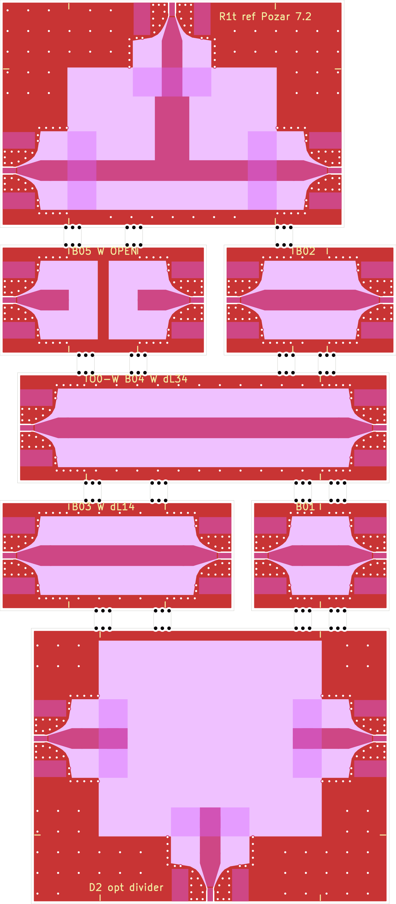

# Order 0: OSH Park 4-layer RF demo and fab-model coupons

**Status: pre-registration in preparation.** Nothing has been uploaded, ordered or measured.
The boards, predictions and criteria on these pages are drafts until the pre-registration release
(below) is published; after that, predictions and criteria are never edited, and results are added
as new commits next to them, misses included.

Order 0 is a small OSH Park 4-layer order that carries two things on one lot:

1. **Fab-model coupons** that measure what OSH Park actually builds (dielectric constant and loss
   of the prepreg and core, heights, copper, etch, solder mask) with a two-port VNA and multiline
   TRL, using yapnr's coupon extraction ([user guide](../../rf-fab-coupons.md)).
2. **Microstrip designs made by yapnr's RF optimizer** (a 3-port power divider on each of two
   cross-sections), measured against their own pre-registered simulations and against a textbook
   design built the way a designer would, with the same launches and the same pass/fail table.

The QR code on the boards' tag stick points here.

## The three uploads

All three are OSH Park standard 4-layer, FR408HR (the EM528 alternate is covered by the same
models), 1.6 mm, ENIG, purple mask, 3 copies each, one frameless outline per upload: the sticks
are separated by 2.54 mm milled slots and held by OSH Park's suggested mouse-bite tabs, at least
two per stick, only on edges that carry no connector (a 2-port stick's long sides, a 3-port
demo's fourth edge), so every launch edge is a clean milled edge. Every port is a Cinch
142-0701-851 edge-launch SMA. Costs are OSH Park's standard 4-layer price, $10 per square inch of
the bounding rectangle, for 3 copies.

| Upload   | Contents                                                                                                                          | Size                         | Cost   | SMAs per copy |
| -------- | --------------------------------------------------------------------------------------------------------------------------------- | ---------------------------- | ------ | ------------- |
| **O0-M** | the thin-microstrip (region M) coupons, R1, A16, A04R, the tag                                                                    | 120.1 × 144.3 mm, 26.9 sq in | $269   | 33            |
| **O0-W** | the thick-microstrip (region W) calibration set, R1t, D2 (`d2-star-sched`), QR B15                                                | 54.0 × 158.7 mm, 13.3 sq in  | $133   | 16            |
| **O0-D** | the D1 window (`d1-star`, re-optimized under the fixed corner-gap DRC), an R1 copy, a thru, a 9 mm and a 30 mm line, QR stick A15 | 118.2 × 50.0 mm, 9.16 sq in  | $91.57 | 12            |

O0-W carries D2's nearest miss, `d2-star-sched` (label `03b7d938`), as a pre-registered design
that misses its spec, by the owner default recorded in the
[pre-registration](preregistration.md) (the owner confirms or overrides it before the release),
and the small QR stick B15 to [predictions/D2](predictions/D2/README.md). Its Gerber zip's sha256
is in [fab/O0-W.sha256](fab/O0-W.sha256).

D1 passed (`d1-star`, label `O0 D1 divider-osh-m 7e070ca8`, superseding part 2's `ad20e643`):
the part 2 export reproduced two 0.100 mm corner-gap violations against OSH Park's 0.127 mm rule
under PR #53's fixed exact-corner-gap DRC, so D1 was re-optimized from the same four
formulations under that fixed checker ([predictions/D1-d1c](predictions/D1-d1c/README.md));
`d1-star` is again the only formulation that passes coarse/fine/finer, now with a DRC-clean
export (134 repaired pixels, 24 floating islands, vs 30/14 under the old checker). O0-D is
regenerated with `YAPNR_KICAD_CLI=<headless kicad-cli> python -m yapnr.rf.coupons generate
--stackup OSHPARK-4L-FR408HR --upload D --out examples/rf-coupons/order0/O0-D`: KiCad DRC 0
violations, 0 unconnected (10.0.6); `yapnr fab build` 0 errors (2 pre-existing informational
warnings: merged non-plated drill file, stackup thickness, the same pattern O0-W's build has).
Its Gerber zip's sha256 is in [fab/O0-D.sha256](fab/O0-D.sha256).

Three solvers now carry a prediction for this D1: yapnr.rf's own FDTD (pass, −20.77 dB finer
\|S11\|, 0.282 dB margin), an independent openEMS 0.37 run (43 µm nominal FR408HR copper, 0.05 mm
mesh; predicts a 2.6-3.1 dB **miss** of the −20 dB \|S11\| spec, essentially unchanged from part
2's finding on the old export), and Palace (FEM), **not run** for D1 or R1 this round — this
workflow's separate $8 GCP cap left too little margin after the resubmission and validation
campaigns, and Palace also needs a new divider-shaped planar adapter; open item for a follow-up.
Details, campaign ids and the three-solver table are in
[predictions/D1-d1c/README.md](predictions/D1-d1c/README.md).

The KiCad projects, catalogues and DRC results are in
[examples/rf-coupons/order0/](../../../examples/rf-coupons/order0/README.md).





### Cross-sections

| Region | Signal over                   | Dielectric               | 50 Ω line                                          | L1 ground kept away | Stick width |
| ------ | ----------------------------- | ------------------------ | -------------------------------------------------- | ------------------- | ----------- |
| **M**  | L1 over In1.Cu                | 0.200 mm FR408HR prepreg | 0.40 mm (4 pixels of the optimizer's 0.10 mm grid) | 1.0 mm (5 h)        | 12 mm       |
| **W**  | L1 over B.Cu, In1/In2 removed | 0.200 + 0.991 + 0.200 mm | 3.0 mm (6 pixels of 0.50 mm)                       | 4.2 mm (3 h)        | 16 mm       |

The solder mask is open over all RF copper and its keep-away (the optimizer has no mask model),
with 0.2 mm mask dams at the connector pads; one coupon (A10) keeps the mask on.

### O0-M sticks

| Stick    | Structure                                                                                      | Size (mm)    | What it determines                                        |
| -------- | ---------------------------------------------------------------------------------------------- | ------------ | --------------------------------------------------------- |
| A01      | thru: two launch halves (also the launch-only 2x-thru)                                         | 20 × 12      | mTRL thru; launch quality and repeatability               |
| A02-A05  | M lines, ΔL 4.5, 13, 30, 70 mm                                                                 | 24.5-90 × 12 | γ(f): εeff and loss                                       |
| A06      | reflect: the line open at both reference planes                                                | 30 × 12      | mTRL reflect                                              |
| A07      | verification line, ΔL 21 mm                                                                    | 41 × 12      | residual calibration error                                |
| A08, A09 | width set: 0.28 and 0.56 mm over 30 mm                                                         | 50 × 12      | Z0(w), α(w): etch, height, εr, the copper-thickness bias  |
| A10      | the 0.40 mm line under mask over 30 mm                                                         | 50 × 12      | mask Dk × thickness: OSH Park's default against mask-open |
| A11      | ring, fed directly, the feeds a quarter turn apart (notches at n = 1 and 3: 1.92 and 5.79 GHz) | 56 × 36      | held out: εeff                                            |
| A12      | open λ/4 stub, notch at 5.5 GHz, on a 15 mm line                                               | 35 × 19      | held out: the open-end and T-junction models              |
| A14      | 30 mm line with a shunt 0402 100 Ω 5 mm from RP1                                               | 50 × 12      | switch terms (both orientations)                          |
| A15      | 4-wire meanders on L1 (0.20 × 200 mm, 0.50 × 250 mm), microsection lines, QR and tag           | 68 × 24      | w·t and etch; microsection; this page                     |
| A16      | 6 mm and 12 mm square pads, each at the reference plane of a launch                            | 50 × 16      | h (and so the absolute Z0) from C at 0.1-1 GHz            |
| A04R     | A04 turned 90°                                                                                 | 12 × 50      | glass-weave direction                                     |
| R1       | textbook divider: T-junction + λ/4 35.36 Ω transformer [Pozar §7.2, §5.5]                      | 30 × 38      | the reference for D1                                      |

### O0-W sticks

| Stick   | Structure                                                                           | Size (mm)  | What it determines                                    |
| ------- | ----------------------------------------------------------------------------------- | ---------- | ----------------------------------------------------- |
| B01-B04 | W thru and lines, ΔL 5, 14, 34 mm                                                   | 20-54 × 16 | γ(f) of W: the core's Dk, which region M cannot see   |
| B05     | reflect, open at both reference planes                                              | 30 × 16    | mTRL reflect                                          |
| R1t     | the textbook divider on W                                                           | 33 × 50    | the reference for D2                                  |
| D2      | the optimizer's thick divider `d2-star-sched` (20 × 24 mm window), feeds, keep-away | 40 × 52    | D2: a pre-registered miss of its spec (owner default) |
| B15     | QR to predictions/D2 and the tag text                                               | 25 × 25    | this page                                             |

### O0-D sticks

| Stick         | Structure                                                                                   | Size (mm)       | What it determines                                                   |
| ------------- | ------------------------------------------------------------------------------------------- | --------------- | -------------------------------------------------------------------- |
| D1            | the optimizer's thin divider (12 × 15 mm, `d1-star`, label `7e070ca8`), feeds and keep-away | 29 × 41         | the headline demo (passes yapnr.rf, misses openEMS)                  |
| A15           | small QR label stick to [predictions/D1-d1c](predictions/D1-d1c/README.md)                  | 25 × 25         | this page                                                            |
| R1            | a copy of O0-M's R1                                                                         | 30 × 38         | D1 and a reference on one lot                                        |
| A01, A20, A04 | thru and lines ΔL 9 and 30 mm                                                               | 20, 29, 50 × 12 | this lot's εeff, loss and relative Z0 (the 9 mm line covers 5-6 GHz) |

### The demos and their references

| Demo      | Specification                                                                     | Window                                | Reference                                             |
| --------- | --------------------------------------------------------------------------------- | ------------------------------------- | ----------------------------------------------------- |
| D1 (O0-D) | 4.25-5.75 GHz: \|S11\| ≤ −20 dB, \|S21\|, \|S31\| ≥ −3.4 dB (confirmed by run 0b) | region M, 12 × 15 mm, ports W / N / S | R1: arm 0.70 × 9.0 mm (9.2 mm to the junction centre) |
| D2 (O0-W) | the same                                                                          | region W, 20 × 24 mm, ports W / N / S | R1t: arm 5.0 × 9.25 mm (10.75 mm to the centre)       |

Each demo port has exactly the coupons' launch (10 mm from the milled edge to its reference plane)
and a straight feed (3 mm on M, 4 mm on W) to the window, so the comparison plane is the
optimizer's own port plane. No other L1 copper lies within 1.0 mm (M) or 4.2 mm (W) of a window.

R1 and R1t are drawn as a designer would: the arm is the 2D-solved width nearest the ideal
transformer impedance, a quarter wave long at 5.0 GHz counted from the T-junction's reference
plane, which lies 0.37 mm (M) and 2.18 mm (W) beyond the output line's centre line (Hammerstad's
T-junction model). Counted to the centre line instead, R1 would sit 4 % and R1t 25 % high in
frequency. Every edge lies on the grid the optimizer's FDTD predicts them on: 0.05 mm (M) and
0.25 mm (W), its second refinement (R1's 0.70 mm arm cannot be centred on the 0.10 mm grid).

## Pages

- [Pre-registration](preregistration.md): what is frozen before upload, the draft criteria and
  the analysis order.
- [Measurement procedure](measurement.md): the LibreVNA set-up, the two-tier calibration and the
  sequence per copy.
- [Predictions](predictions/README.md): the coupons' expected S-parameters on FR408HR and EM528,
  and the places for D1 and D2.
- [Demos](demos.md): D1's and D2's specs, substrates (thickness-equivalent) and formulations,
  the references' forward runs, and run 0b (the solver's loss correction and the \|S21\|
  criterion).

## Regenerating

```sh
YAPNR_KICAD_CLI=<headless kicad-cli> python -m yapnr.rf.coupons generate \
    --stackup OSHPARK-4L-FR408HR --upload M --out examples/rf-coupons/order0/O0-M
python -m yapnr.rf.coupons expected --stackup OSHPARK-4L-FR408HR --upload M \
    --out docs/rf/order0/predictions/coupons/O0-M
yapnr fab check examples/rf-coupons/order0/O0-M/O0-M.kicad_pcb --vendor oshpark \
    --profile oshpark-4l --stackup oshpark-4l-fr408hr
```

(and `--upload W`, `--upload D`).
